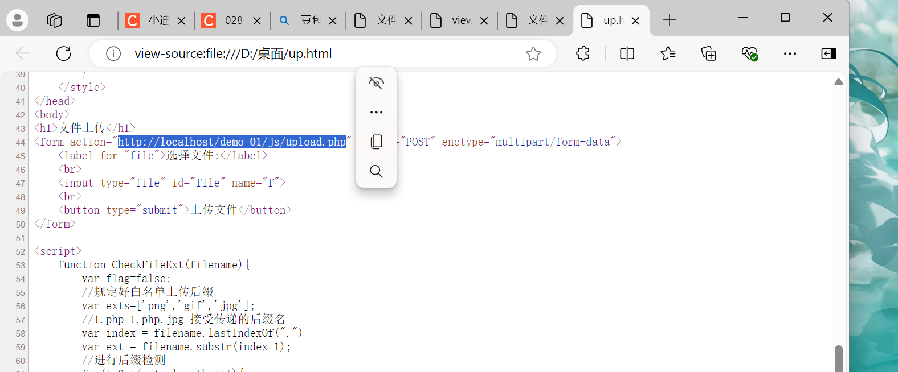

- # 028-安全开发-JS应用&原生开发&JQuery库&Ajax技术&前端后端&安全验证处理

  ## 目录
  1. [JS原生开发-文件上传-变量&对象&函数&事件](#1-js原生开发-文件上传-变量对象函数事件)
  2. [JS导入库开发-登录验证-JQuery库&Ajax技术](#2-js导入库开发-登录验证-jquery库ajax技术)
  3. [JS导入库开发-逻辑购买-JQuery库&Ajax技术](#3-js导入库开发-逻辑购买-jquery库ajax技术)
  4. [实例测试-某违规APP-密码找回&JS验证逻辑安全](#4-实例测试-某违规app-密码找回js验证逻辑安全)

  **参考**

  1. 原生JS教程 https://www.w3school.com.cn/js/index.asp 
  2. jQuery库教程 https://www.w3school.com.cn/jquery/index.asp

  ---

  <a id="1-js原生开发-文件上传-变量对象函数事件"></a>
  ## #JS原生开发-文件上传-变量&对象&函数&事件

  这一行代码是一个HTML中的JavaScript事件处理器，用于在文件选择框内容发生变化（用户选择文件）时触发相应的检查函数。具体来说：

  ```html
  <input type="file" id="file" name="f" onchange="CheckFileExt(this.value)">
  ```

  - `onchange`: 这是一个HTML事件属性，表示在元素内容变化时触发。
  - `CheckFileExt(this.value)`: 这是一个JavaScript函数调用，当文件选择框内容变化时，会调用名为 CheckFileExt 的函数，并将选择的文件路径（this.value 表示当前元素的值，即文件路径）作为参数传递给该函数。

  这段 JavaScript 代码用于获取文件名中最后一个点（.）后面的部分，即文件的扩展名。具体来说：

  ```javascript
  var index = filename.lastIndexOf(".")
  ```
  - `lastIndexOf(".")`: 这是 JavaScript 字符串对象的方法，用于返回字符串中最后一个出现的点的索引位置。

  ```javascript
  var ext = filename.substr(index+1);
  ```
  - `substr(index+1)`: 这是 JavaScript 字符串对象的方法，用于从字符串的指定位置（在这里是 index+1，即点的后一个位置）开始提取子字符串。这里的 ext 变量将包含文件的扩展名。

  这是一个 JavaScript 代码片段，用于重新加载当前页面。具体来说：

  ```javascript
  location.reload(true);
  ```
  - **`location.reload(true)`**: 这是 JavaScript 的 location 对象的 reload 方法。reload 方法用于重新加载当前文档。传递 true 参数表示强制从服务器重新加载页面，而不使用缓存。如果省略参数或传递 false，则可能使用缓存进行重新加载。

  这行代码的作用是强制刷新当前页面，确保获取最新的内容，而不使用浏览器缓存。

  使用js实现文件上传

  ```html
  <!-- 表单用于文件上传，指定了上传的目标地址为 "upload.php"，使用 POST 方法提交，并设置 enctype 为 "multipart/form-data" -->
  <form action="upload.php" method="POST" enctype="multipart/form-data">
      <!-- 为文件上传输入框添加标签 -->
      <label for="file">选择文件:</label>
      <br>
      <!-- 这是一个包含文件上传输入框的 HTML 代码，并且在用户选择文件时触发 CheckFileExt 函数 -->
      <input type="file" id="file" name="f" onchange="CheckFileExt(this.value)">
      <br>
      <!-- 提交按钮 -->
      <button type="submit">上传文件</button>
  </form>
  ```

  1、布置前端页面，创建js目录，帮在js目录下创建upload.html  
  2、JS获取提交数据  
  3、JS对上传格式判断  
  4、后端对上传数据处理，创建upload文件目录保存上传文件，创建upload.php处理数据。  

  前端JS进行后缀过滤，后端PHP进行上传处理  
  架构：html js php - upload.php  

  ```javascript
  <script>
      // JavaScript 函数 CheckFileExt 用于检查文件后缀名
      function CheckFileExt(filename){
          var flag = false;
          // 允许的文件后缀名数组
          var exts = ['png', 'gif', 'jpg'];
          // 获取文件名中最后一个点后面的部分，即文件的后缀名
          var index = filename.lastIndexOf('.');
          var ext = filename.substr(index + 1);
  
          // 遍历允许的文件后缀名数组
          for (var i = 0; i < exts.length; i++) {
              // 检查是否匹配允许的后缀名
              if (ext === exts[i]) {
                  // 文件后缀名正确，设置 flag 为 true，显示提示信息，并跳出循环
                  flag = true;
                  alert('文件后缀名正确');
                  break;
              }
          }
  
          // 如果 flag 为 false，表示文件后缀名错误，显示错误提示，并强制刷新页面
          if (!flag) {
              alert('文件后缀错误！')
              location.reload(true);
          }
      }
  </script>
  ```

  前端验证演示：  

  

  

  后端upload.php 上传处理（再建一个upload文件夹存储上传文件）  

  

  上传演示  

  

  

  #### 安全问题：

  ##### 1、过滤代码能看到，可分析绕过

  

  2、禁用JS或删除过滤代码绕过  
  将页面源代码复制下来，在本地创建，并删除检验代码的函数调用`onchange="CheckFileExt(this.value)"`  
  将调用的文件上传地址，切换为使用网址路由的样式**http://localhost/demo_01/js/upload.php**  
  成功绕过文件检验，上传成功blog5.md  

  

  

  

  

  

  

  ---

  <a id="2-js导入库开发-登录验证-jquery库ajax技术"></a>
  ## #JS导入库开发-登录验证-JQuery库&Ajax技术

  `**$.ajax()**`是一个用于执行异步HTTP请求的jQuery函数。它允许您通过JavaScript代码向服务器发送请求，并在不刷新整个页面的情况下接收和处理响应。

  - 下面是一个基本的`$.ajax()`用法示例：

  ```javascript
  $.ajax({
    url: "example.com/data",  // 请求的URL
    method: "GET",            // HTTP请求方法（GET、POST等）
    data: {                   // 发送到服务器的数据（可选）
      param1: "value1",
      param2: "value2"
    },
    success: function(response) {  // 请求成功时的回调函数
      console.log("请求成功！");
      console.log(response);       // 服务器响应的数据
    },
    error: function(xhr, status, error) {  // 请求失败时的回调函数
      console.log("请求失败！");
      console.log(error);                    // 错误信息
    }
  });
  ```

  在这个示例中，我们通过url参数指定了服务器的URL，通过method参数指定了HTTP请求方法（这里是GET请求）。data参数是可选的，用于发送到服务器的数据。success回调函数在请求成功并且服务器返回响应时被调用，error回调函数在请求失败时被调用。

  您可以根据需要在$.ajax()函数中使用其他参数，例如dataType指定服务器响应的数据类型，headers指定请求头，以及其他高级选项。

  通过使用$.ajax()函数，您可以在JavaScript中方便地执行异步HTTP请求，并根据服务器的响应进行相应处理。

  **$("button").click(function () { ... })**选择所有的 <button> 元素，并为它们绑定一个点击事件处理函数。当用户点击任何一个按钮时，绑定的函数将被执行。

  我们使用console.log()在控制台输出一条消息，表示按钮已被点击。您还可以执行其他操作，例如修改页面的内容、发送AJAX请求或执行其他JavaScript逻辑。

  ```javascript
  $("button").click(function () {
    // 在这里编写点击事件的处理代码
    console.log("按钮被点击了！");
    // 可以在这里执行其他操作，例如修改页面内容或发送AJAX请求等
  });
  ```

  $('.user').val()和$('.pass').val()用于获取具有user类和pass类的元素的值。

  **$('.user')**：这里使用了jQuery的选择器$('.user')来选择所有具有user类的元素。这可以是一个输入框、文本框或其他表单元素。
  **.val()**：这是一个jQuery函数，用于获取选定元素的值。在这个场景中，它被调用以获取具有user类的元素的值。
  myuser：这是一个变量（或属性名），用于存储所选择元素的值。您可以根据需要更改变量名。

  ```javascript
  myuser: $('.user').val(),
  mypass: $('.pass').val()
  ```

  $success 是一个关联数组变量，通过使用 'msg' 作为键，将 'ok' 作为值存储在其中

  ```javascript
  $success = array('msg' => 'ok');
  ```

  使用js实现登录验证

  ```html
  <div class="login">
      <!-- 登录标题 -->
      <h2>后台登录</h2>
      <!-- 用户名标签和输入框 -->
      <label for="username">用户名:</label>
      <input type="text" name="username" id="username" class="user">
      <!-- 密码标签和输入框 -->
      <label for="password">密码:</label>
      <input type="password" name="password" id="password" class="pass">
      <!-- 登录按钮 -->
      <button>登录</button>
  </div>
  
  <!-- 引入 jQuery 库 -->
  <script src="js/jquery-1.12.4.js"></script>**
  
  <!-- JavaScript 代码 -->
  <script>
      // 当按钮被点击时执行以下函数
      $("button").click(function (){
          // 使用 AJAX 发送 POST 请求到 'logincheck.php'
          $.ajax({
              type: 'POST',
              url: 'logincheck.php',
              // 发送的数据包括用户名和密码
              data: {
                  myuser: $('.user').val(),
                  mypass: $('.pass').val()
              },
              // 请求成功时执行的函数
              success: function (res){
                  console.log(res);
                  // 如果返回的信息代码为1，表示登录成功，弹出提示并执行相应的处理
                  if(res['infoCode'] == 1){
                      alert('登录成功');
                      // 登录成功处理事件（注释部分为示例，可根据需要进行处理）
                      // location.href='index.php';
                  } else {
                      // 如果信息代码不为1，表示登录失败，弹出失败提示
                      alert('登录失败');
                  }
              },**
              // 指定返回的数据类型为 JSON
              dataType: 'json',
          });
      });
  </script>
  ```

  0、布置前端页面在js目录下创建login.html,并引入JQuery库在js目录下创建js目录引入。  
  1、获取登录事件  
  2、配置Ajax请求  
  3、后端代码验证  
  4、成功回调判断  

  

  ```php
  <?php
  // 从 POST 请求中获取用户提交的用户名和密码
  $user = $_POST['myuser'];
  $pass = $_POST['mypass'];
  
  // 真实情况下，应该在数据库中进行验证获取用户信息
  
  // 假设用户名是 'xiaodi'，密码是 '123456'
  //$success 是一个关联数组变量，通过使用 'msg' 作为键，将 'ok' 作为值存储在其中。
  $success = array('msg' => 'ok');
  
  // 检查用户名和密码是否匹配
  if ($user == 'xiaodi' && $pass == '123456') {
      // 如果匹配，设置信息代码为1表示登录成功，并进行相应的处理
      $success['infoCode'] = 1;
  } else {
      // 如果不匹配，设置信息代码为0表示登录失败
      $success['infoCode'] = 0;
  }
  
  // 将结果以 JSON 格式输出
  //必须要回调输出，不然前端无法获取infocode的值
  echo json_encode($success);
  
  ?>
  ```

  

  

  

  

  **后端PHP进行帐号判断，前端JS进行登录处理**  
  架构：html js login.html - logincheck.php  

  #### 安全问题：

  ##### 当成功后的操作（如跳转到其他页面）**写在js中，不安全**

  

  将抓到的包，设置其返回包也抓取，并将访问失败返回包的改为1发送，后登录成功

  

  

  

  

  

  当成功后的操作如跳转到其他页面写**在PHP中，相对安全**

  前端js只起到判断作用，无法执行跳转等逻辑

  

  ---

  <a id="3-js导入库开发-逻辑购买-jquery库ajax技术"></a>
  ## #JS导入库开发-逻辑购买-JQuery库&Ajax技术

  #### 使用js实现商品购买：

  ```html
  <!DOCTYPE html>
  <html lang="en">
  <head>
      <!-- 设置文档的字符集为UTF-8 -->
      <meta charset="UTF-8">
      <!-- 设置页面标题 -->
      <title>商品购买</title>
  </head>
  <body>
  <!-- 商品图片 -->
  <br>
  <!-- 当前拥有的金钱 -->
  金钱：10000<br>
  <!-- 商品价格 -->
  商品价格：8888<br>
  <!-- 输入购买数量的文本框 -->
  数量：<input type="text" name="number" class="number">
  <!-- 购买按钮 -->
  <button>购买</button>
  </body>
  </html>
  
  <!-- 引入 jQuery 库 -->
  <script src="js/jquery-1.12.4.js"></script>
  <!-- JavaScript 代码 -->
  <script>
      // 当购买按钮被点击时执行以下函数
      $("button").click(function (){
          // 使用 AJAX 发送 POST 请求到 'shop.php'
          $.ajax({
              type: 'POST',
              url: 'shop.php',
              // 发送的数据，包括购买数量
              data: {
                  num: $('.number').val(),
              },
              // 请求成功时执行的函数
              success: function (res){
                  // 在控制台输出返回的数据
                  console.log(res);
                  // 如果返回的信息代码为1，表示购买成功
                  if(res['infoCode'] == 1){
                      // 弹出成功提示
                      alert('购买成功');
                      // 购买成功的流程（你可以在这里添加额外的处理）
                  } else {
                      // 如果信息代码不为1，表示购买失败
                      // 弹出失败提示
                      alert('购买失败');
                  }
              },
              // 指定返回的数据类型为 JSON
              dataType: 'json',
          });
      });
  </script>
  ```

  1、布置前端页面，在js目录下创建shop.html  
  2、获取登录事件  
  3、配置Ajax请求  
  4、后端代码验证 ,在js目录下创建shopcheck.php  
  5、成功回调判断  

  架构：html js shop.html - shopcheck.php  

  ```php
  <?php
  // 从 POST 请求中获取购买数量
  $num = $_POST['num'];
  
  // 假设购物车中已有的金钱数为10000，商品价格为8888
  // 真实情况下，应该在数据库中获取用户的金钱数等信息
  
  // 初始化一个关联数组变量，通过使用 'msg' 作为键，将 'ok' 作为值存储在其中。
  $success = array('msg' => 'ok');
  
  // 检查购买是否合法（金钱是否足够支付）
  if (10000 >= ($num * 8888)) {
      // 如果购买合法，设置信息代码为1表示购买成功
      $success['infoCode'] = 1;
  } else {
      // 如果购买不合法，设置信息代码为0表示购买失败
      $success['infoCode'] = 0;
  }
  
  // 将结果以 JSON 格式输出
  echo json_encode($success);
  ?>
  ```

  

  

  #### 安全性：将抓到的包，设置其返回包也抓取，并将访问失败返回包的改为1发送，后购买成功。

  当成功后的操作,如购买成功后的逻辑跳转->其他页面 **写在js中，不安全**                                                                                                                                                               

  

  

  

  ---

  <a id="4-实例测试-某违规app-密码找回js验证逻辑安全"></a>
  ## #实例测试-某违规APP-密码找回&JS验证逻辑安全

  #### 1.使用福利期货为实验对象，先开启抓包获取到正确的验证嘛回显结果

  

  

  

  #### 2.再次点击忘记密码，验证码可以乱输，将返回的错误验证码回显数据，修改为刚刚记录的正确值→验证成功，成功进入修改密码页面

  

  

  

  

**前端验证本质缺陷**：  
1. 所有验证逻辑暴露在客户端  
2. 可通过浏览器开发者工具修改  
3. 网络请求可被中间人篡改  
4. 解决方案：关键操作需服务端二次验证