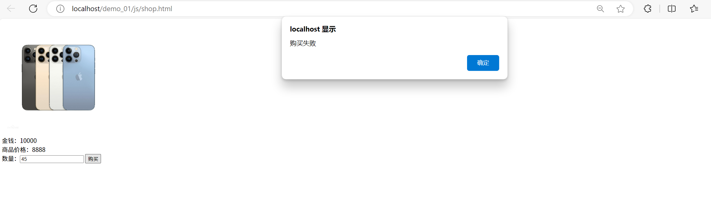

### 028-安全开发-JS应用&原生开发&JQuery库&Ajax技术&前端后端&安全验证处理

#### 目录
1. JS原生开发-文件上传-变量&对象&函数&事件  
2. JS导入库开发-登录验证-JQuery库&Ajax技术  
3. JS导入库开发-逻辑购买-JQuery库&Ajax技术  
4. 实例测试-某违规APP-密码找回&JS验证逻辑安全  

**参考**

1. 原生JS教程 https://www.w3school.com.cn/js/index.asp 
2. jQuery库教程 https://www.w3school.com.cn/jquery/index.asp

---

### 1. JS原生开发-文件上传-变量&对象&函数&事件

```html
<input type="file" id="file" name="f" onchange="CheckFileExt(this.value)">
```

**代码解析**：  
- `onchange`：HTML事件属性，元素内容变化时触发  
- `CheckFileExt(this.value)`：调用JS函数并传递文件路径  

```javascript
var index = filename.lastIndexOf(".")
var ext = filename.substr(index+1);
location.reload(true);
```

**函数详解**：  
- `lastIndexOf()`：返回字符串中最后一个点的索引位置  
- `substr()`：从指定位置提取子字符串  
- `location.reload(true)`：强制从服务器刷新页面（绕过缓存）  

**完整实现**：  
```html
<form action="upload.php" method="POST" enctype="multipart/form-data">
    <label for="file">选择文件:</label>
    <input type="file" id="file" name="f" onchange="CheckFileExt(this.value)">
    <button type="submit">上传文件</button>
</form>

<script>
function CheckFileExt(filename){
    var flag = false;
    var exts = ['png', 'gif', 'jpg'];
    var index = filename.lastIndexOf('.');
    var ext = filename.substr(index + 1);

    for (var i = 0; i < exts.length; i++) {
        if (ext === exts[i]) {
            flag = true;
            alert('文件后缀名正确');
            break;
        }
    }

    if (!flag) {
        alert('文件后缀错误！')
        location.reload(true);
    }
}
</script>
```

**执行流程**：  
1. 用户选择文件触发`onchange`事件  
2. 调用`CheckFileExt`函数验证后缀  
3. 合法后缀：提示正确  
4. 非法后缀：刷新页面  

**后端处理(upload.php)**：  
```php
<?php
$target_dir = "upload/";
$target_file = $target_dir . basename($_FILES["f"]["name"]);

if (move_uploaded_file($_FILES["f"]["tmp_name"], $target_file)) {
    echo "文件上传成功";
} else {
    echo "文件上传失败";
}
?>
```

**演示效果**：  
  
  

#### 安全问题：  
1. **过滤代码可被分析绕过**  
     
   
2. **禁用JS绕过验证**  
   - 删除`onchange`事件调用  
   ```html
   <input type="file" id="file" name="f">
   ```
   - 修改form action为绝对路径  
   ```html
   <form action="http://localhost/demo_01/js/upload.php" method="POST">
   ```
     
     

---

### 2. JS导入库开发-登录验证-JQuery库&Ajax技术

**核心函数**：  
`$.ajax()`：执行异步HTTP请求  
```javascript
$.ajax({
  url: "example.com/data",
  method: "GET",
  data: {param1: "value1"},
  success: function(response){},
  error: function(xhr, status, error){}
});
```

**登录实现**：  
```html
<div class="login">
    <h2>后台登录</h2>
    <label>用户名:</label>
    <input type="text" class="user">
    <label>密码:</label>
    <input type="password" class="pass">
    <button>登录</button>
</div>

<script src="js/jquery-1.12.4.js"></script>
<script>
$("button").click(function(){
    $.ajax({
        type: 'POST',
        url: 'logincheck.php',
        data: {
            myuser: $('.user').val(),
            mypass: $('.pass').val()
        },
        success: function(res){
            if(res['infoCode'] == 1){
                alert('登录成功');
                // location.href='index.php';
            } else {
                alert('登录失败');
            }
        },
        dataType: 'json'
    });
});
</script>
```

**后端验证(logincheck.php)**：  
```php
<?php
$user = $_POST['myuser'];
$pass = $_POST['mypass'];
$success = array('msg' => 'ok');

if ($user == 'xiaodi' && $pass == '123456') {
    $success['infoCode'] = 1;
} else {
    $success['infoCode'] = 0;
}

echo json_encode($success);
?>
```

**演示效果**：  
  
  

#### 安全问题：
**前端跳转风险**：  
```javascript
if(res['infoCode'] == 1){
    location.href='index.php'; // 不安全的前端跳转
}
```

**响应篡改攻击**：  
1. 拦截登录请求  
     
2. 修改响应信息  
   ```json
   原始响应：{"msg":"ok","infoCode":0}
   修改后：{"msg":"ok","infoCode":1}
   ```
3. 绕过登录验证  
     

---

### 3. JS导入库开发-逻辑购买-JQuery库&Ajax技术

**购买功能实现**：  
```html
<br>
金钱：10000<br>
商品价格：8888<br>
数量：<input type="text" class="number">
<button>购买</button>

<script src="js/jquery-1.12.4.js"></script>
<script>
$("button").click(function(){
    $.ajax({
        type: 'POST',
        url: 'shopcheck.php',
        data: { num: $('.number').val() },
        success: function(res){
            if(res['infoCode'] == 1){
                alert('购买成功');
            } else {
                alert('购买失败');
            }
        },
        dataType: 'json'
    });
});
</script>
```

**后端验证(shopcheck.php)**：  
```php
<?php
$num = $_POST['num'];
$success = array('msg' => 'ok');

if (10000 >= ($num * 8888)) {
    $success['infoCode'] = 1;
} else {
    $success['infoCode'] = 0;
}

echo json_encode($success);
?>
```

**演示效果**：  
  

#### 安全问题：
**响应篡改攻击**：  
1. 拦截购买请求  
     
2. 修改响应信息  
   ```json
   原始响应：{"msg":"ok","infoCode":0}
   修改后：{"msg":"ok","infoCode":1}
   ```
3. 绕过购买限制  
     

---

### 4. 实例测试-某违规APP-密码找回&JS验证逻辑安全

#### 漏洞复现步骤：
1. **获取正确验证码**  
     
     

2. **发起恶意请求**  
   - 输入任意验证码  
     
   - 修改响应数据  
   ```json
   原始响应：{"status":0}
   修改后：{"status":1}
   ```

3. **成功绕过验证**  
     
     
     

#### 漏洞原理：
- 前端完全依赖Ajax响应决定验证结果  
- 未在服务端二次验证验证码有效性  
- 关键操作（密码重置）无二次认证机制  

#### 补充知识点：
**Ajax技术原理**：
```javascript
// 原生XHR实现
var xhr = new XMLHttpRequest();
xhr.open('POST', 'verify.php');
xhr.setRequestHeader('Content-Type', 'application/json');
xhr.onload = function() {
    if (xhr.status === 200) {
        var res = JSON.parse(xhr.responseText);
        if(res.status == 1) {
            // 执行敏感操作
        }
    }
};
xhr.send(JSON.stringify({code: "1234"}));
```

**JSONP安全风险**：  
```html
<!-- 跨域请求示例 -->
<script>
function handleResponse(res) {
    if(res.status == 1) {
        // 敏感操作
    }
}
</script>
<script src="https://api.example.com/verify?callback=handleResponse"></script>
```
- 完全信任第三方返回的数据  
- 易遭受XSS攻击  

**前端验证本质缺陷**：  
1. 所有验证逻辑暴露在客户端  
2. 可通过浏览器开发者工具修改  
3. 网络请求可被中间人篡改  
4. 解决方案：关键操作需服务端二次验证