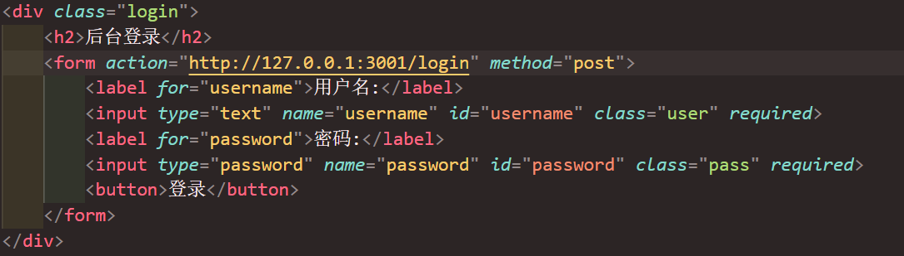
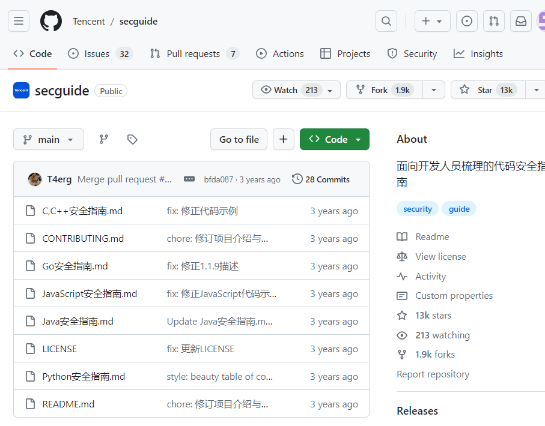

# 030-安全开发-JS应用&NodeJS指南&原型链污染&Express框架&功能实现&审计

## 知识点

  1. NodeJS-开发环境&功能实现
  2. NodeJS-安全漏洞&案例分析
  3. NodeJS-开发指南&特有漏洞

## 目录

  * [环境搭建 - NodeJS-解析安装&库安装](#huan-jing-da-jian-nodejs-jie-xi-an-zhuang-ku-an-zhuang)
  * [功能实现 - NodeJS-数据库&文件&执行](#gong-neng-shi-xian-nodejs-shu-ju-ku-wen-jian-zhi-xing)
  * [安全问题 - NodeJS-注入&RCE&原型链](#an-quan-wen-ti-nodejs-zhu-rce-yuan-xing-lian)
  * [案例分析 - NodeJS-CTF题目&源码审计](#an-li-fen-xi-nodejs-ctf-ti-mu-yuan-ma-shen-ji)
  * [开发指南 - NodeJS-安全 SecGuide 项目](#kai-fa-zhi-nan-nodejs-an-quan-secguide-xiang-mu)

## 环境搭建 - NodeJS-解析安装&库安装

  1. **文档参考** ：<https://www.w3cschool.cn/nodejs/>
  2. **Nodejs 安装** ：<https://nodejs.org/en>

### Node.js 与传统 JavaScript 的区别

| 方面         | 传统 JavaScript                                              | Node.js                                                      |
| ------------ | ------------------------------------------------------------ | ------------------------------------------------------------ |
| **运行环境** | 仅能在浏览器中运行，受浏览器安全策略限制（如跨域限制、文件系统访问限制） | 基于 V8 引擎独立运行于操作系统，不受浏览器安全限制           |
| **核心用途** | 主要用于前端开发，负责网页交互逻辑（如事件处理、DOM 操作、表单验证）等，是浏览器与用户交互的桥梁 | 主要用于后端开发，可搭建服务器、处理 HTTP 请求、操作数据库、读写本地文件、执行命令行工具等，实现服务器端的业务逻辑 |
| **内置 API** | 核心 API 围绕浏览器环境，如 window、document、navigator、XMLHttpRequest/fetch 等，无法直接操作本地文件、系统资源 | 核心 API 围绕服务器场景，如 fs（文件系统操作）、http（搭建 HTTP 服务器）、path（路径处理）、os（操作系统信息）、child_process（执行系统命令）等，没有 window、document 等浏览器对象，也不能直接操作 DOM（除非使用特殊库） |
| **模块系统** | 早期无官方模块系统，依赖 script 标签引入文件，存在全局变量污染问题；后来引入 ES6 模块（import/export），但在浏览器中需通过 script type="module" 启用，兼容性和使用场景有限 | 采用 CommonJS 模块规范（require/module.exports）作为默认模块系统，支持模块化开发，避免全局变量污染；从 v13.2.0 开始也支持 ES6 模块（需通过 .mjs 扩展名或 package.json 配置） |
| **执行模型** | 运行在浏览器单线程中，与 UI 渲染共用一个线程，执行耗时操作会导致页面卡顿；依赖浏览器的事件循环处理异步操作（如 setTimeout、fetch） | 同样是单线程，但采用 “非阻塞 I/O + 事件循环” 模型，适合处理高并发请求（如同时处理多个 HTTP 请求或文件读写）；可通过 worker_threads 模块创建多线程处理 CPU 密集型任务 |
| **包管理**   | 依赖手动引入第三方库（如通过 script 标签引入 jQuery），或使用构建工具（如 Webpack）管理依赖 | 内置强大的包管理工具 npm（或 yarn、pnpm），可通过命令行快速安装、管理第三方模块（如 express、mysql 等后端库），生态极其丰富 |

### 总结

传统 JavaScript 是 “浏览器的脚本语言”，专注于前端交互；Node.js 是 “服务器端的 JavaScript 运行时”，让 JavaScript 具备了后端开发能力。两者共享 JavaScript 语法，但因运行环境和用途不同，形成了两个独立的技术体系。

### 三方库安装

  1. express：简洁而灵活的 node.js Web 应用框架，安装命令：`npm i express`
  2. body-parser：node.js 中间件，用于处理 JSON、Raw、Text 和 URL 编码的数据，安装命令：`npm i body-parser`
  3. cookie-parser：解析 Cookie 的工具，通过 req.cookies 取传过来的 cookie 并转成对象，安装命令：`npm i cookie-parser`
  4. multer：node.js 中间件，用于处理 enctype="multipart/form-data" 的表单数据，安装命令：`npm i multer`
  5. mysql：Node.js 连接 MySQL 专用库，对数据库进行操作，安装命令：`npm i mysql`

创建 sql.js 文件并粘贴实例代码：

```javascript
// 引入 Express 框架
var express = require('express');
// 创建 Express 应用程序实例
var app = express();

// 处理根路径的 GET 请求，返回 'Hello World'
app.get('/', function (req, res) {
    res.send('Hello World');
});

// 启动服务器，监听端口 3000
var server = app.listen(3000, function () {
    // 获取服务器地址和端口
    var host = server.address().address;
    var port = server.address().port;

    // 输出服务器访问地址信息到控制台
    console.log("应用实例，访问地址为 http://%s:%s", host, port);
});
```

效果展示：


访问页面显示 “Hello World”：


## 功能实现 - NodeJS-数据库&文件&执行

### 1. 实现用户登录

  * **设置不同页面渲染（sql.js）**

```javascript
// 引入 Express 框架
const express = require('express');
// 创建 Express 应用程序实例
const app = express();

// 处理 '/login' 路径的 GET 请求，返回简单的登录页面
app.get('/login', function(req, res) {
    res.send('<hr>登录页面</hr>');
});

// 处理根路径的 GET 请求，发送名为 'sql.html' 的文件
app.get('/', function(req, res) {
    res.sendFile(__dirname + '/' + 'sql.html');
});

// 启动服务器，监听端口 3001
const server = app.listen(3001, function() {
    console.log('Web 服务器已经启动，监听端口 3001！');
});
```

效果展示：


  * **编写表单提交（sql.html 登录界面）**

表单 method 需与 sql.js 中对应，此处 post 对应后面 “req.body 用于处理 POST 请求中的表单数据。” 以做对比，后续两种方法都实现。




  * **修改 sql.js 接收登录传入信息**

req.query 用于处理 GET 请求 URL 查询字符串参数，req.body 用于处理 POST 请求中的表单数据。需下载 `const bodyParser = require('body-parser');` 相关库（`npm i body-parser`），且 post 请求需创建解析 URL 编码的 bodyParser 中间件实例。

```javascript
// 引入 Express 框架
const express = require('express');
const bodyParser = require('body-parser');

// 创建 Express 应用程序实例
const app = express();
//// 创建一个用于解析 URL 编码的 bodyParser 中间件实例
const urlencodedParser = bodyParser.urlencoded({ extended: false });

// 处理 '/login' 路径的 GET 请求，返回简单的登录页面
app.get('/login', function(req, res) {
    // 从请求中获取用户名和密码
    const u = req.query.username;
    const p = req.query.password;

    console.log(u);
    console.log(p);

    // 检查用户名和密码是否为 admin 和 123456
    if (u === 'admin' && p === '123456') {
        res.send('欢迎进入后台管理页面');
    } else {
        res.send('登录用户或密码错误');
    }
});

// 处理 '/login' 路径的 POST 请求，使用 bodyParser 解析表单数据
app.post('/login', urlencodedParser, function(req, res) {
    // 从请求中获取表单提交的用户名和密码
    const u = req.body.username;
    const p = req.body.password;

    console.log(u);
    console.log(p);

    // 检查用户名和密码是否为 admin 和 123456
    if (u === 'admin' && p === '123456') {
        res.send('欢迎进入后台管理页面');
    } else {
        res.send('登录用户或密码错误');
    }
});

// 处理根路径的 GET 请求，发送名为 'sql.html' 的文件
app.get('/', function(req, res) {
    res.sendFile(__dirname + '/' + 'sql.html');
});

// 启动服务器，监听端口 3001
const server = app.listen(3001, function() {
    console.log('Web 服务器已经启动，监听端口 3001！');
});
```

以 GET 提交效果：


以 POST 提交效果：


### 2. 加入数据库操作

  1. **导入 mysql** ：`npm i mysql` 下载相关依赖，代码中加入 `const mysql = require('mysql');`
  2. **建立数据库连接**

```javascript
var connection = mysql.createConnection({
host     : 'localhost',
user     : 'root',
password : 'password',
database : 'demo01'
});
```

  3. **执行查询语句**

```javascript
// 建立与 MySQL 数据库的连接
connection.connect();

// 定义从 'admin' 表中选择所有列的 SQL 查询
const sql = 'select * from admin';

// 执行 SQL 查询
connection.query(sql, function (error, data) {
    // 检查查询执行中是否存在错误
    if(error){
        console.log('数据库连接失败！');
    }

    // 记录从查询中检索到的全部数据
    console.log(data);

    // 记录结果集中第一行的用户名
    console.log(data[0]['username']);

    // 记录结果集中第一行的密码
    console.log(data[0]['password']);
});
```

效果展示：


  4. **将 mysql 内容添加至登录验证中**

```javascript
// 处理 '/login' 路径的 POST 请求，使用 bodyParser 解析表单数据
app.post('/login', urlencodedParser, function(req, res) {
    // 从请求中获取表单提交的用户名和密码
    const u = req.body.username;
    const p = req.body.password;

    // 输出获取到的用户名和密码，用于调试
    console.log(u);
    console.log(p);

    // 创建与 MySQL 数据库的连接
    var connection = mysql.createConnection({
        host     : 'localhost',
        user     : 'root',
        password : 'password',
        database : 'demo01'
    });

    // 建立数据库连接
    connection.connect();

    // 构建 SQL 查询，检查数据库中是否存在匹配的用户名和密码
    const sql = 'select * from admin where username="'+u+'" and password="'+p+'"';
    console.log(sql);

    // 执行 SQL 查询
    connection.query(sql, function(error, data){
    // 检查查询执行中是否存在错误
    if(error){
        console.log('数据库连接失败！');
    }

    try {
        // 检查用户名和密码是否匹配数据库中的数据
        if(u == data[0]['username'] && p == data[0]['password']){
            // 如果匹配，发送欢迎消息到前端
            res.send('欢迎进入后台管理页面');
        }
    } catch {
        // 捕获异常，如果没有匹配的数据或其他错误，发送错误消息到前端
        res.send('错误');
    };
    })
})
```

效果展示：


### 3. 文件操作

  1. **导入 fs** ：`npm i fs` 下载相关依赖，代码中加入 `const fs = require('fs');`
  2. **实现目录读取功能**

```javascript
const fs = require('fs');
const express = require('express');
const app = express();

// 处理 '/file' 路径的 GET 请求
app.get('/file', function (req, res) {
    // 从请求中获取目录参数
    const dir = req.query.dir;
    console.log(dir);

    // 调用文件管理函数，传递目录参数
    filemanage(dir);
});

// 启动 Express 应用监听在 3000 端口
var server = app.listen(3000, function () {
    console.log('Web 应用已启动在 3000 端口！');
});

// 文件管理函数，接收一个目录参数
function filemanage(dir) {
    // 使用 fs.readdir 读取目录下的文件
    fs.readdir(dir, function (error, files) {
        // 打印目录中的文件列表
        console.log(files);
    });
}
```

访问示例：

  * <http://127.0.0.1:3000/file?dir=./>
  * [http://127.0.0.1:3000/file?dir=…/](http://127.0.0.1:3000/file?dir=…/)

效果展示：


### 4. 命令执行（RCE）

  1. **导入 child_process** ：`npm i child_process` 下载相关依赖，代码中加入 `const rce=require('child_process');`
  2. **调用系统命令**

```javascript
// 引入 child_process 模块
const rce = require('child_process');

// 使用 exec 方法调用系统命令 'notepad'，打开记事本
rce.exec('notepad');

// 使用 spawnSync 方法调用系统命令 'calc'，打开计算器
rce.spawnSync('calc');

// 使用 eval 调用代码命令执行，将字符串当做代码解析
// 请注意：避免在生产环境中使用 eval，可能存在安全风险
eval('require("child_process").exec("calc");');
```

效果展示：


## 安全问题 - NodeJS-注入&RCE&原型链

### 1. SQL 注入 & 文件操作

SQL 注入示例图：


文件操作示例图：


### 2. RCE 执行 & 原型链污染

  * **黑盒测试和白盒测试区别**
    * **黑盒测试** ：基于功能需求和规格说明的外部测试方法，测试人员对系统内部实现细节未知，只关注输入和输出以及功能行为，将系统视为黑盒子，主要关注功能、界面、性能、安全性等，测试方法包括等价类划分、边界值分析、场景测试、错误推测等。
    * **白盒测试** ：基于系统内部实现、代码结构和逻辑的测试方法，测试人员了解系统内部结构和代码，可直接检查、分析和测试内部组成部分，主要关注代码覆盖率、逻辑路径、错误处理、性能优化等，测试方法包括语句覆盖、分支覆盖、路径覆盖、条件覆盖、代码审查等。

  * **Payload 定义** ： Payload 是攻击中传递的恶意代码、数据或命令。安全专家会设计和使用各种 Payload 来验证目标系统的安全性，确定系统是否容易受到攻击或存在潜在漏洞。

  * **实战测试 NodeJS 安全**
    * **黑盒测试** ：通过输入字段尝试注入攻击（如 SQL 注入、XSS 等）；测试文件上传功能，确保上传文件受适当限制和验证；构造恶意请求测试是否存在 DoS 漏洞；尝试绕过身份验证和授权，确保访问控制有效性。
    * **白盒测试** ：对代码审计，查找潜在安全问题；检查是否存在明文密码、硬编码敏感信息；确保对用户输入进行适当验证和转义，防止注入攻击；避免使用不安全函数和方法（如 eval、exec 等）；确保文件上传下载等操作受适当安全限制；检查是否启用适当安全头（如 CSP、X-Frame-Options、X-Content-Type-Options 等）。
    * **依赖项安全** ：定期审查依赖项更新和安全漏洞；使用安全审计工具（如 npm audit）检查依赖项安全性；仅允许信任依赖项，避免使用已弃用或存在漏洞的依赖项。

### 3. 原型链污染

  * **原理** ：如果攻击者控制并修改一个对象的原型（_ proto_），则可以影响所有和这个对象来自同一个类、父祖类的对象。
  * **示例代码**

```javascript
// foo 是一个包含属性 bar 的对象，bar 设置为 1
let foo = {bar: 1};
console.log(foo.bar); // 输出为 1

// 修改 foo 的原型（即 Object）上的 bar 属性，设置为 '2'
foo.__proto__.bar = '2';

// 由于查找顺序原因，foo.bar 仍为 1
console.log(foo.bar); // 输出为 1

// 创建一个空对象 zoo
let zoo = {};

// 查看 zoo.bar，此时 bar 为 2
console.log(zoo.bar); // 输出为 2
```

示例图：


  * **利用原型链污染调用系统计算器示例**

```javascript
// 创建一个包含属性 bar 的对象 foo，bar 设置为 1
let foo = {bar: 1};
console.log(foo.bar); // 输出: 1

// 修改 foo 对象的原型链上的 bar 属性，设置为执行命令 'require(\'child_process\').execSync(\'calc\');'
foo.__proto__.bar = 'require(\'child_process\').execSync(\'calc\');';

// 输出 foo 对象的 bar 属性，仍为 1，因为直接属性优先于原型链属性
console.log(foo.bar); // 输出: 1

// 创建一个空对象 zoo
let zoo = {};

// 使用 eval 执行 zoo 对象的 bar 属性，调用计算器
console.log(eval(zoo.bar));
```

示例图：


## 案例分析 - NodeJS-CTF 题目&源码审计

  1. **CTFSHOW 题目**
     * 题目链接：<https://ctf.show/Web334-344>
     * 相关知识参考：<https://f1veseven.github.io/2022/04/03/ctf-nodejs-zhi-yi-xie-xiao-zhi-shi/>

  2. **YApi 管理平台漏洞**
     * 文章链接：<https://blog.csdn.net/weixin_42353842/article/details/127960229>

## 开发指南 - NodeJS-安全 SecGuide 项目

安全指南链接：<https://github.com/Tencent/secguide>

示例图：

