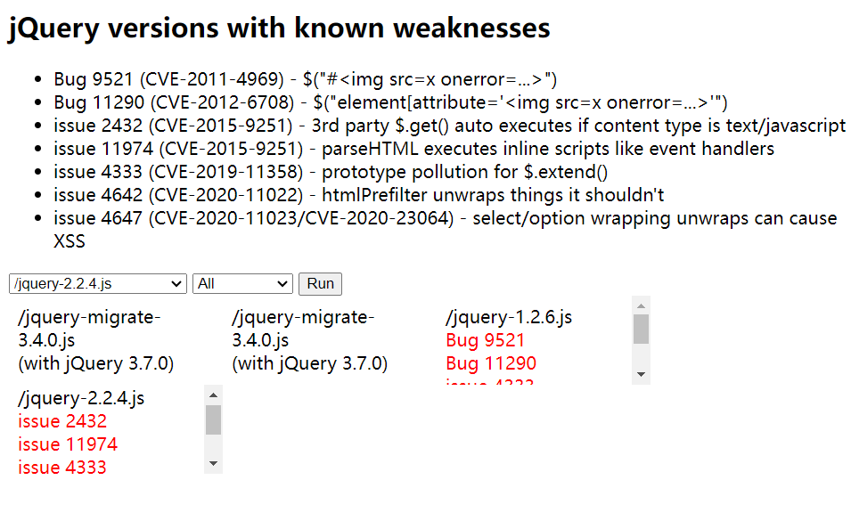

## 031-安全开发-JS应用&WebPack打包器&第三方库JQuery&安装使用&安全检测


# 目录
- [知识点](#知识点)
- [演示案例](#演示案例)
- [为什么使用WebPack](#为什么使用webpack)
- [打包器-WebPack-使用&安全](#打包器-webpack-使用安全)
  - [WebPack核心概念](#webpack核心概念)
  - [WebPack使用步骤](#webpack使用步骤)
  - [WebPack安全风险及防护](#webpack安全风险及防护)
- [第三方库-JQuery-使用&安全](#第三方库-jquery-使用安全)
  - [JQuery简介](#jquery简介)
  - [JQuery使用方法](#jquery使用方法)
  - [JQuery安全风险及防护](#jquery安全风险及防护)


# 知识点：
1. 第三方库-JQuery的使用与安全问题
2. 打包器-WebPack的使用与安全问题


# 演示案例：
- 打包器-WebPack-使用&安全
- 第三方库-JQuery-使用&安全


## 为什么使用WebPack
在传统前端开发中，若JS文件存在依赖关系且引入顺序不当，会导致代码无法正常执行。例如：

创建目录`src`，并在其中创建`1.js`和`2.js`：

`1.js`
```js
function test(){
    console.log('test');
}
```

`2.js`
```js
test(); // 依赖1.js中的test函数
```

创建`index.html`并引入上述JS文件：
```html
<!DOCTYPE html>
<html lang="en">
<head>
    <meta charset="UTF-8">
    <meta http-equiv="X-UA-Compatible" content="IE=edge">
    <meta name="viewport" content="width=device-width, initial-scale=1.0">
    <title>Document</title>
</head>
<body>
    <script src="src/2.js"></script> <!-- 先引入2.js，此时test函数未定义 -->
    <script src="src/1.js"></script>
</body>
</html>
```
上述代码中，由于`2.js`先于`1.js`引入，执行`test()`时会报错，这体现了传统开发中依赖管理的痛点。

使用WebPack的核心优势：
1. **模块化支持**：将代码拆分为独立模块，通过`import/export`管理依赖，解决顺序依赖问题。
2. **资源打包**：将JS、CSS、图片等资源统一打包，减少网络请求次数。
3. **代码分割**：支持按需加载代码块，提升初始加载速度。
4. **资源优化**：通过插件实现代码压缩、图片优化等，减小文件体积。
5. **开发效率提升**：提供热模块替换、源码映射等功能，简化开发流程。


## 打包器-WebPack-使用&安全

WebPack是一个静态模块打包器，它会递归分析项目中所有模块的依赖关系，最终打包生成浏览器可直接运行的静态资源。

### WebPack核心概念
1. **入口（entry）**：WebPack构建依赖图的起点，通常是一个JS文件（如`src/main.js`）。
2. **输出（output）**：指定打包后文件的输出路径（如`dist`目录）和文件名（如`bundle.js`）。
3. **Loader**：用于处理非JS文件（如CSS、图片），将其转换为WebPack可识别的模块。
4. **插件（plugins）**：扩展WebPack功能，如代码压缩（`TerserPlugin`）、HTML生成（`HtmlWebpackPlugin`）等。
5. **模式（mode）**：
   - `development`：开发模式，保留源码注释和映射，便于调试。
   - `production`：生产模式，自动启用代码压缩和优化，文件体积更小。


### WebPack使用步骤
#### 1. 准备项目文件
- 创建目录结构：
  ```
  project/
  ├─ src/
  │  ├─ js/
  │  │  ├─ sum.js
  │  │  └─ count.js
  │  └─ main.js  // 入口文件
  └─ index.html
  ```

- 编写模块代码：
  `sum.js`
  ```js
  export default function sum(x, y) {
      return x + y;
  }
  ```

  `count.js`
  ```js
  export default function count(x, y) {
      return x - y;
  }
  ```

  `main.js`（入口文件，导入其他模块）
  ```js
  import sum from "./js/sum";
  import count from "./js/count";
  
  console.log("1 + 2 =", sum(1, 2)); // 输出3
  console.log("1 - 2 =", count(1, 2)); // 输出-1
  ```

#### 2. 安装WebPack
```bash
# 全局安装WebPack和命令行工具
npm install webpack webpack-cli -g
```

#### 3. 创建配置文件
在项目根目录创建`webpack.config.js`（文件名固定）：
```js
const path = require('path');

module.exports = {
    entry: './src/main.js', // 入口文件
    output: {
        path: path.resolve(__dirname, 'dist'), // 输出目录
        filename: 'bundle.js', // 输出文件名
        clean: true // 每次打包前清空dist目录
    },
    mode: "development" // 开发模式（可选production）
};
```

#### 4. 执行打包命令
```bash
npx webpack
```
打包成功后，会在`dist`目录生成`bundle.js`。

#### 5. 引用打包文件
修改`index.html`，引用打包后的`bundle.js`：
```html
<!DOCTYPE html>
<html lang="en">
<head>
    <meta charset="UTF-8">
    <meta name="viewport" content="width=device-width, initial-scale=1.0">
    <title>WebPack Demo</title>
</head>
<body>
    <script src="./dist/bundle.js"></script>
</body>
</html>
```
在浏览器中打开`index.html`，控制台会输出计算结果。


### WebPack安全风险及防护
#### 1. 源码泄露风险
- **风险场景**：`development`模式下，WebPack会生成源码映射（`source map`），攻击者可通过映射文件还原原始代码，获取敏感信息（如API密钥、逻辑漏洞）。
- **防护措施**：生产环境强制使用`production`模式，禁用源码映射：
  ```js
  // webpack.config.js
  module.exports = {
      mode: "production",
      devtool: false // 禁用source map
  };
  ```

#### 2. 第三方依赖风险
- **风险场景**：项目依赖的第三方库可能存在漏洞（如XSS、代码执行），被打包后引入项目。
- **防护措施**：
  - 使用`npm audit`检测依赖漏洞。
  - 定期更新依赖至安全版本。
  - 采用`webpack-bundle-analyzer`分析打包内容，移除冗余依赖。

#### 3. 自动化安全检测工具

**模糊提取安全检查**

- **Packer Fuzzer**：一款针对WebPack等打包器的安全工具，可自动提取API及参数，检测未授权访问、SQL注入等漏洞。
  - 项目地址：https://github.com/rtcatc/Packer-Fuzzer
  - 功能：支持生成HTML、PDF等格式的扫描报告，简化漏洞分析流程。


## 第三方库-JQuery-使用&安全

### JQuery简介
JQuery是一个轻量级JavaScript库，封装了DOM操作、事件处理、Ajax等功能，核心特点是“写得少，做得多”。例如，通过`$("div")`可快速选取所有`div`元素，大幅简化代码。


### JQuery使用方法
#### 1. 引入JQuery
- **CDN引入**（推荐，减少服务器压力）：
  ```html
  <script src="https://code.jquery.com/jquery-3.6.0.min.js"></script>
  ```
- **本地引入**：下载JQuery文件（官网：https://jquery.com/，其他：https://www.jq22.com/jquery-info122  https://www.w3ccoo.com/jquery/jquery_download.html）放入项目目录后引用：
  ```html
  <script src="./jquery-3.6.0.min.js"></script>
  ```

#### 2. 基础使用示例
```html
<!DOCTYPE html>
<html lang="en">
<head>
    <meta charset="UTF-8">
    <title>JQuery Demo</title>
    <script src="https://code.jquery.com/jquery-3.6.0.min.js"></script>
</head>
<body>
    <div id="demo">Hello</div>
    <script>
        // 选取元素并修改内容
        $("#demo").text("Hello JQuery");
        // 绑定点击事件
        $("#demo").click(function() {
            alert("Clicked!");
        });
    </script>
</body>
</html>
```


### JQuery安全风险及防护
#### 1. XSS漏洞（CVE-2020-11022/CVE-2020-11023）
- **风险场景**：JQuery 3.5.0及以下版本中，`$(html)`等方法在解析HTML时存在漏洞，攻击者可注入恶意代码。例如：
  ```js
  // 漏洞版本中，以下代码会执行恶意脚本
  $("");
  ```
- **防护措施**：
  - 升级至JQuery 3.5.1及以上版本（修复了该漏洞）。
  - 避免使用`$(html)`直接解析不可信内容，改用`text()`方法。

#### 2. 版本检测与漏洞扫描
- **在线检测工具**：http://research.insecurelabs.org/jquery/test/（输入JQuery版本，检测已知漏洞）。
- **依赖管理**：使用`npm`管理JQuery时，通过`npm audit`检查版本安全性。
- **参考：**https://blog.csdn.net/weixin_44309905/article/details/120902867

#### 3. 其他安全实践
- 避免在JQuery中硬编码敏感信息（如API密钥）。
- 对用户输入进行严格过滤，尤其是在使用`append()`、`html()`等方法时。


