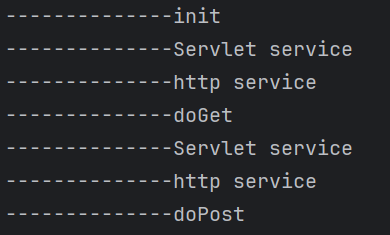

## 目录
- [032-安全开发-JavaEE应用&Servlet路由技术&JDBC&Mybatis数据库&生命周期](#032-安全开发-javaee应用servlet路由技术jdbcmybatis数据库生命周期)
- [知识点](#知识点)
- [演示案例](#演示案例)
- [idea配置](#idea配置)
- [JavaEE-HTTP-Servlet&路由&周期](#javaee-http-servlet路由周期)
  - [Servlet解释](#1解释)
  - [Servlet的创建和使用](#2创建和使用servlet)
  - [Servlet生命周期](#3servlet生命周期)
  - [处理接受和回显](#4处理接受和回显)
- [JavaEE-数据库-JDBC&Mybatis&库](#javaee-数据库-jdbcmakefilemybatis库)
  - [JDBC介绍](#原生态数据库开发jdbc)
  - [JDBC操作步骤](#1下载jar)
  - [SQL注入防护-预编译](#安全修复sql注入预编译)
  - [预编译补充知识](#预编译补充知识)


## 032-安全开发-JavaEE应用&Servlet路由技术&JDBC&Mybatis数据库&生命周期

### 知识点：

> 1、JavaEE-HTTP-Servlet技术
> 2、JavaEE-数据库-JDBC&Mybatis

#### 演示案例：

> ➢JavaEE-HTTP-Servlet&路由&周期
> ➢JavaEE-数据库-JDBC&Mybatis&库


### idea配置

> #### 1.打开idea
>
> #### 2.创建javaEE项目
>
> #### 3.项目模板选用Web程序，创建Tomcat服务器
>
> #### 4.下载JDK1.8稳定版
>
> #### 5.选择javaEE 8创建项目即可
>
> #### 6.点击运行，即可看到网页页面


## JavaEE-HTTP-Servlet&路由&周期

参考：https://blog.csdn.net/qq_52173163/article/details/121110753

### 1、解释

Servlet是运行在Web服务器或应用服务器上的程序，它是作为来自Web浏览器或其他HTTP客户端的请求和HTTP服务器上的数据库或应用程序之间的中间层。使用Servlet可以收集来自网页表单的用户输入，呈现来自数据库或者其他源的记录，还可以动态创建网页。本章内容详细讲解了web开发的相关内容以及servlet相关内容的配置使用，是JAVAEE开发的重中之重。

### 2、创建和使用Servlet

1. 创建一个类继承HttpServlet

   

   声明与导入（创建项目时自带）

   ```java
   package com.example.demo;  // 声明该类所在的包
   
   import jakarta.servlet.http.HttpServletRequest;  // 导入处理HTTP请求的类
   import jakarta.servlet.http.HttpServletResponse; // 导入处理HTTP响应的类
   
   import java.io.IOException;        // 导入IO异常类
   import java.io.PrintWriter;        // 导入用于输出字符的类
   ```

   doGet与doPost

   ```java
   /**
    * 创建IndexServlet类，继承自HttpServlet
    * 用于处理HTTP GET/POST请求并返回包含特定信息的HTML响应
    */
   public class IndexServlet extends HelloServlet {
       
       /**
        * doGet方法，处理GET请求
        * @param request  HTTP请求对象，包含客户端发送的请求信息
        * @param response HTTP响应对象，用于向客户端发送响应
        * @throws IOException 如果发生输入输出错误时抛出
        */
       @Override
       public void doGet(HttpServletRequest request, HttpServletResponse response) throws IOException {
           // 从请求参数中获取名为"name"的参数值
           String name = request.getParameter("name");
           
           // 获取响应的输出流，用于向客户端写入响应内容
           PrintWriter out = response.getWriter();
           
           // 通过输出流写入HTML内容，显示"Hello: [name参数值]"
           out.println("<h1>Hello: "+name+"</h1>");
           
           // 输出标识信息，表明这是通过doGET方法处理的请求
           out.println("<h1>-----处理方式：doGET-----</h1>");
       }
       
       /**
        * doPost方法，处理POST请求
        * @param request  HTTP请求对象，包含客户端发送的请求信息
        * @param response HTTP响应对象，用于向客户端发送响应
        * @throws IOException 如果发生输入输出错误时抛出
        */
       @Override
       public void doPost(HttpServletRequest request, HttpServletResponse response) throws IOException {
           // 从请求参数中获取名为"name"的参数值，若不存在则为null
           String name = request.getParameter("name");
           
           // 获取响应的输出流，用于向客户端写入响应内容
           PrintWriter out = response.getWriter();
           
           // 通过输出流写入HTML内容，显示"Hello: [name参数值]"
           out.println("<h1>Hello: " + name + "</h1>");
           // 输出标识信息，表明这是通过doPOST方法处理的请求
           out.println("<h1>-----处理方式：doPOST-----</h1>");
       }
   }
   ```

   利用HackBar传参

   

   

2. web.xml配置Servlet路由

   ```xml
   <?xml version="1.0" encoding="UTF-8"?>
   <web-app xmlns="https://jakarta.ee/xml/ns/jakartaee"
            xmlns:xsi="http://www.w3.org/2001/XMLSchema-instance"
            xsi:schemaLocation="https://jakarta.ee/xml/ns/jakartaee https://jakarta.ee/xml/ns/jakartaee/web-app_6_0.xsd"
            version="6.0">
   
       <!--定义Servlet-->
       <servlet>
           <servlet-name>index</servlet-name>
           <!-- 指定Servlet类的完整路径 -->
           <servlet-class>com.example.demo.IndexServlet</servlet-class>
       </servlet>
   
   
       <!-- 配置Servlet映射 -->
       <servlet-mapping>
           <servlet-name>index</servlet-name>
           <!-- 指定Servlet的URL映射 -->
           <url-pattern>/index</url-pattern>
       </servlet-mapping>
   </web-app>
   ```

3. WebServlet配置Servlet路由

   

   

4. 写入内置方法(init service destroy doget dopost)

```java
package com.example.demo;  // 声明该类所在的包

import jakarta.servlet.ServletConfig;
import jakarta.servlet.ServletException;
import jakarta.servlet.ServletRequest;
import jakarta.servlet.ServletResponse;
import jakarta.servlet.annotation.WebServlet;
import jakarta.servlet.http.HttpServlet;
import jakarta.servlet.http.HttpServletRequest;  // 导入处理HTTP请求的类
import jakarta.servlet.http.HttpServletResponse; // 导入处理HTTP响应的类
import java.io.IOException;        // 导入IO异常类
import java.io.PrintWriter;        // 导入用于输出字符的类

// 使用@WebServlet注解将Servlet映射到特定的URL
@WebServlet("/a")
public class IndexServlet extends HttpServlet {

    // 处理GET请求的方法
    @Override
    protected void doGet(HttpServletRequest req, HttpServletResponse resp) throws ServletException, IOException {
        System.out.println("--------------doGet");

        // 从请求中获取参数"id"
        String id = req.getParameter("id");

        // 设置响应的内容类型
        resp.setContentType("text/html; charset=GBK");

        // 获取PrintWriter以将HTML响应发送给客户端
        PrintWriter out = resp.getWriter();

        // 输出从GET请求中收到的数据
        out.println("这是GET请求的数据:");
        out.println("id：" + id + "<br>");
        out.flush();
        out.close();
    }

    // 处理POST请求的方法
    @Override
    protected void doPost(HttpServletRequest req, HttpServletResponse resp) throws ServletException, IOException {
        // 从请求中获取参数"name"
        String name = req.getParameter("name");

        // 设置响应的内容类型
        resp.setContentType("text/html; charset=GBK");

        // 获取PrintWriter以将HTML响应发送给客户端
        PrintWriter out = resp.getWriter();

        // 输出从POST请求中收到的数据
        out.println("这是post提交的数据");
        out.println(name);
        out.flush();
        out.close();

        System.out.println("--------------doPost");
    }

    // 当Servlet首次创建时调用的初始化方法
    @Override
    public void init(ServletConfig config) throws ServletException {
        System.out.println("--------------init");

        // 可以在这里添加任何初始化任务的代码
    }

    // 当Servlet被销毁时调用的方法
    @Override
    public void destroy() {
        System.out.println("--------------destroy");
        super.destroy();
    }

    // 处理GET和POST请求的服务方法
    @Override
    protected void service(HttpServletRequest req, HttpServletResponse resp) throws ServletException, IOException {
        System.out.println("--------------http service");
        super.service(req, resp);
    }

    // 覆盖的用于ServletRequest和ServletResponse的服务方法
    @Override
    public void service(ServletRequest req, ServletResponse res) throws ServletException, IOException {
        System.out.println("--------------Servlet service");
        super.service(req, res);
    }
}
```

简单使用：
doget


接着dopost


### 3、Servlet生命周期

见图




### 4、处理接受和回显

**HttpServletRequest（HTTP请求的信息）**

Servlet是运行在Web服务器上的Java程序，用于处理客户端的HTTP请求并生成响应。HttpServletRequest对象封装了客户端发送的HTTP请求信息，通过它可以获取请求参数、请求头、请求方法等内容。

- ServletRequest的子接口：**HttpServletRequest是ServletRequest**接口的子接口，提供了用于处理HTTP请求的额外功能。
- getParameter(name)：通过参数名获取请求中的值。返回一个**String**，表示与给定参数名相对应的单个值。
- getParameterValues(name)：通过参数名获取请求中的多个值。返回一个**String[]**，表示与给定参数名相对应的多个值。

**HttpServletResponse（HTTP响应的信息）**

HttpServletResponse对象用于向客户端发送HTTP响应，它可以设置响应头、响应状态码、响应内容等。

- ServletResponse的子接口：**HttpServletResponse是ServletResponse**接口的子接口，提供了用于处理HTTP响应的额外功能。
- setCharacterEncoding()：设置响应的字符编码格式。通常用于确保正确的文本输出。
- setContentType()：设置响应内容的类型和编码。常用于指定输出的数据类型，如HTML、JSON等。
- getWriter()：获取一个**PrintWriter**字符输出流，用于向客户端发送文本数据。
- PrintWriter：**PrintWriter**是用于向客户端输出字符数据的类，可以接受各种数据类型，然后将其转换为文本并发送到客户端。

## JavaEE-数据库-JDBC&Mybatis&库

### 原生态数据库开发：JDBC
参考：https://www.jianshu.com/p/ed1a59750127
JDBC(Java Database connectivity)：**由java提供，**用于访问数据库的统一API接口规范。数据库驱动：由各个数据库厂商提供，用于访问数据库的jar包(JDBC的具体实现)，遵循JDBC接口，以便java程序员使用！

### 1、下载jar


https://mvnrepository.com/

### 2、引用封装jar

创建lib目录，复制导入后，添加为库


### 3、注册数据库驱动

“com.mysql.jdbc.Driver”：这是MySQL JDBC驱动程序的类名。JDBC（Java Database Connectivity）是Java用于与数据库交互的API，而不同的数据库供应商提供了各自的JDBC驱动程序。在这里，"com.mysql.jdbc.Driver"是MySQL JDBC驱动程序的类名。

加载和初始化：当调用Class.forName("com.mysql.jdbc.Driver");时，它会尝试查找、加载并初始化指定的类。在这个过程中，MySQL JDBC驱动程序的静态代码块（static {...}）会被执行，这通常用于注册驱动程序。

在旧版本的MySQL驱动中，com.mysql.jdbc.Driver是驱动类的完整路径。
在新版本中，com.mysql.cj.jdbc.Driver是MySQL Connector/J的驱动类。

```java
Class.forName("com.mysql.jdbc.Driver");
```

### 4、建立数据库连接


```java
// 定义数据库连接的URL，格式为：jdbc:mysql://host:port/database
        String url = "jdbc:mysql://localhost:3306/demo01";

        // 使用DriverManager获取数据库连接
        Connection connection = DriverManager.getConnection(url, "root", "password");

        // 打印数据库连接信息
        System.out.println(connection);
```

### 5、创建Statement执行SQL

connection.createStatement();：在**Connection对象上调用createStatement方法，创建一个Statement对象。Statement对象用于执行SQL语句，它可以执行静态的SQL查询、更新、删除等操作。createStatement方法返回一个新的Statement**对象。
创建一个**Statement对象，然后使用该对象执行给定的SQL查询语句，将查询结果存储在一个ResultSet对象中。这样，您可以通过遍历ResultSet**来检索和处理查询的结果集中的数据。

```java
// 创建Statement对象
Statement statement= connection.createStatement();
String sql="select * from news";
// 执行查询，获取结果集
ResultSet resultSet = statement.executeQuery(sql);
```

### 6、结果ResultSet进行提取

```java
// 遍历结果集
while (resultSet.next()) {
    // 从结果集中获取每一行的数据

    // 获取整型列 "id"
    int id = resultSet.getInt("id");

    // 获取字符串列 "page_title"
    String page_title = resultSet.getString("page_title");

    // 获取字符串列 "heading"
    String heading = resultSet.getString("heading");

    // 获取字符串列 "subheading"
    String subheading = resultSet.getString("subheading");

    // 获取字符串列 "content"
    String content = resultSet.getString("content");

    // 获取字符串列 "img"
    String img = resultSet.getString("img");

    // 输出每一行的数据，以便查看结果
    System.out.println(id + "|" + page_title + "|" + heading + "|" + subheading + "|" + content + "|" + img);
}
```


### 安全修复SQL注入：预编译

原理：提前编译好执行逻辑，注入的语句不会改变原有逻辑！


- 预编译写法：safesql是一个预编译的SQL查询语句，其中?是一个占位符，表示将在执行时动态替换。
- 使用PreparedStatement：PreparedStatement是Statement的子接口，用于执行预编译的SQL语句。通过调用connection.prepareStatement(safesql)创建一个PreparedStatement对象。
- 设置参数：使用setXXX方法设置占位符的值。在这里，使用setInt(1, id)将id的值设置到第一个占位符上。这种方式防止了SQL注入攻击，因为参数值是通过预编译的方式传递的，而不是通过直接拼接字符串。
- 执行查询：调用executeQuery()执行查询，得到ResultSet对象。
- 处理结果集：根据业务需要，处理查询结果集的数据。

```java
// 预编译写法
String safesql = "SELECT * FROM news WHERE id=?";

// 使用PreparedStatement
try (PreparedStatement preparedStatement = connection.prepareStatement(safesql)) {
    // 设置参数，防止SQL注入攻击
    preparedStatement.setInt(1, id);

    // 执行查询
    ResultSet resultSet = preparedStatement.executeQuery();

    // 处理结果集...
} catch (SQLException e) {
    e.printStackTrace();
}
```

相比较于直接拼接SQL语句的方式，预编译语句提供了更好的安全性，可以防止SQL注入攻击。在使用预编译语句时，务必通过参数设置的方式传递值，而不要直接拼接值到SQL语句中。

### 预编译补充知识

#### 1. 预编译的核心原理

预编译（PreparedStatement）是数据库交互中的安全机制，其核心流程如下：

- **SQL 模板解析**：数据库会提前解析 SQL 语句的结构（如`SELECT * FROM users WHERE id=?`），确定执行计划（如索引选择、查询优化）
- **参数隔离**：用户输入的参数作为数据而非 SQL 指令处理，通过占位符`?`与 SQL 模板分离
- **重复利用**：相同结构的 SQL 语句可复用预编译结果，减少数据库解析开销

#### 2. 与 Statement 的本质区别

| 特性             | Statement            | PreparedStatement                |
| ---------------- | -------------------- | -------------------------------- |
| SQL 注入风险     | 高（直接拼接字符串） | 低（参数与 SQL 分离）            |
| 编译时机         | 每次执行都编译       | 首次执行编译，后续复用           |
| 性能（重复执行） | 较低                 | 较高                             |
| 适用场景         | 静态 SQL（无参数）   | 动态参数 SQL（如查询、登录验证） |

#### 3. 预编译的局限性

- 不能用于 DDL 语句（如`CREATE TABLE`），仅支持 DML（`SELECT/INSERT/UPDATE/DELETE`）
- 占位符`?`只能替换值，不能替换表名、列名等 SQL 结构（如`SELECT ? FROM users`无效）
- 部分数据库对预编译语句有缓存上限，超量会导致旧语句被淘汰