## 033-安全开发-JavaEE应用&SQL预编译&Filter过滤器&Listener监听器&访问控制

### 目录
- [网安相关知识基础](#网安相关知识基础)
- [JavaEE-预编译-SQL](#javaee-预编译-sql)
- [JavaEE-过滤器-Filter](#javaee-过滤器-filter)
- [JavaEE-监听器-Listen](#javaee-监听器-listen)

> #知识点：
>
> 1、JavaEE-JDBC-SQL预编译
> 2、JavaEE-HTTP-Filter过滤器
> 3、JavaEE-对象域-Listen监听器
>
> 演示案例：
>
> ➢JavaEE-预编译-SQL
> ➢JavaEE-过滤器-Filter
> ➢JavaEE-监听器-Listen

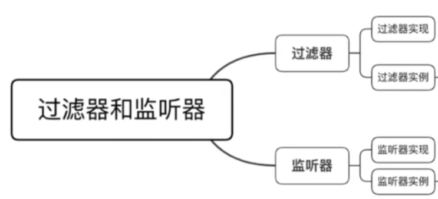

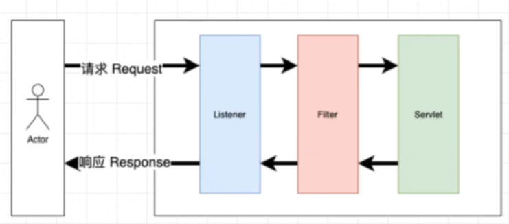

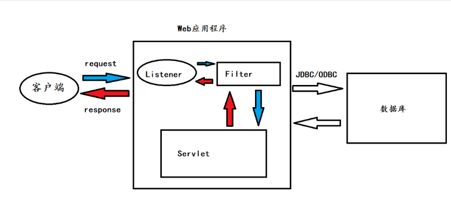


### 网安相关知识基础
在Web应用安全领域，常见的安全威胁包括SQL注入、XSS（跨站脚本）攻击、会话劫持等。这些攻击利用应用程序开发中的漏洞，窃取敏感数据、篡改信息或劫持用户身份。为应对这些威胁，安全开发实践至关重要，如采用SQL预编译防止注入、使用过滤器拦截恶意请求、通过监听器监控应用状态等，从开发源头降低安全风险。


### JavaEE-预编译-SQL
**提前编译好执行逻辑，你注入的语句不会改变原有逻辑！**

预编译是防止SQL注入的重要手段。SQL注入攻击原理是攻击者将恶意SQL代码插入到输入参数中，当服务器直接拼接参数执行SQL时，恶意代码会被解析执行，导致数据泄露、权限提升等危害（如获取数据库版本、用户信息，甚至删除数据）。

预编译的核心机制是：
- 预编译写法：`safesql` 是一个预编译的SQL查询语句，其中 `?` 是占位符，表示将在执行时动态替换。
- 使用 `PreparedStatement`：`PreparedStatement` 是 `Statement` 的子接口，用于执行预编译的SQL语句。通过 `connection.prepareStatement(safesql)` 创建对象。
- 设置参数：用 `setXXX` 方法设置占位符的值（如 `setString(1, s)` 将字符串 `s` 设到第一个占位符）。参数值通过预编译方式传递，而非直接拼接，避免SQL注入。
- 执行查询：调用 `executeQuery()` 执行查询，得到 `ResultSet` 对象。
- 处理结果集：根据业务需要处理查询结果。
- 调试打印：`System.out.println(safesql)` 打印预编译SQL，方便调试。

```java
// 预编译写法
String safesql = "SELECT * FROM news WHERE id=?";
// 使用PreparedStatement
try (PreparedStatement preparedStatement = connection.prepareStatement(safesql)) {
    // 设置参数，防止SQL注入攻击
    preparedStatement.setString(1, s);
    // 执行查询
    ResultSet resultSet = preparedStatement.executeQuery();

    // 处理结果集...

    // 打印最终的预编译 SQL 语句（用于调试）
    System.out.println(safesql);
} catch (SQLException e) {
    e.printStackTrace();
}
```

**使用不安全写法，可以进行sql注入**

```java
//不安全写发
String sql="select * from news where id="+id1;
System.out.println(sql);
// 创建Statement对象
Statement statement= connection.createStatement();
// 执行查询，获取结果集
ResultSet resultSet = statement.executeQuery(sql);
```

- `select * from news where id=1`：正常查询，从`news`表选ID为1的记录。
- `union`：SQL关键字，用于合并两个查询结果集。
- `select 1,2,3,version(),user(),database()`：注入的查询，返回固定值及数据库版本、当前用户、当前数据库信息，属于联合查询注入。

通过注入 `1 or 1=1`，可使查询条件恒为真，返回所有记录：

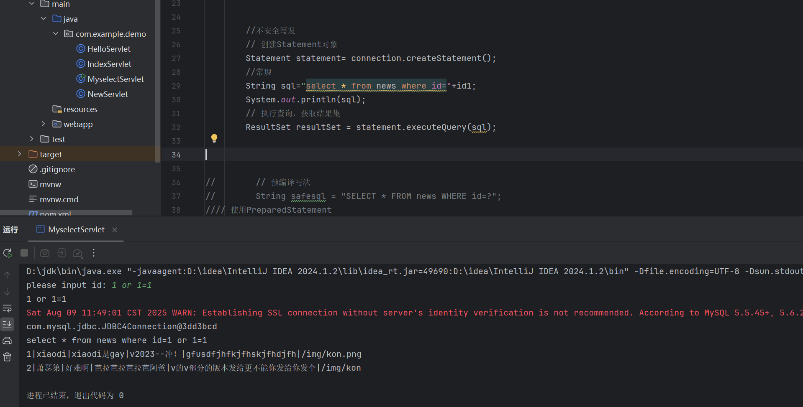

注入 `1 union select 1,2,3,version(),user(),database()` 可获取数据库敏感信息：

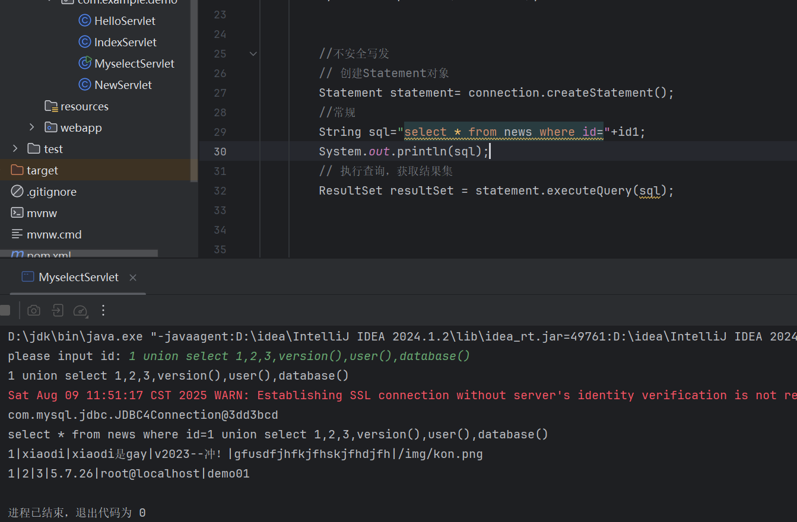

**使用预编译写法，固定sql语句的逻辑，防止进行sql注入**

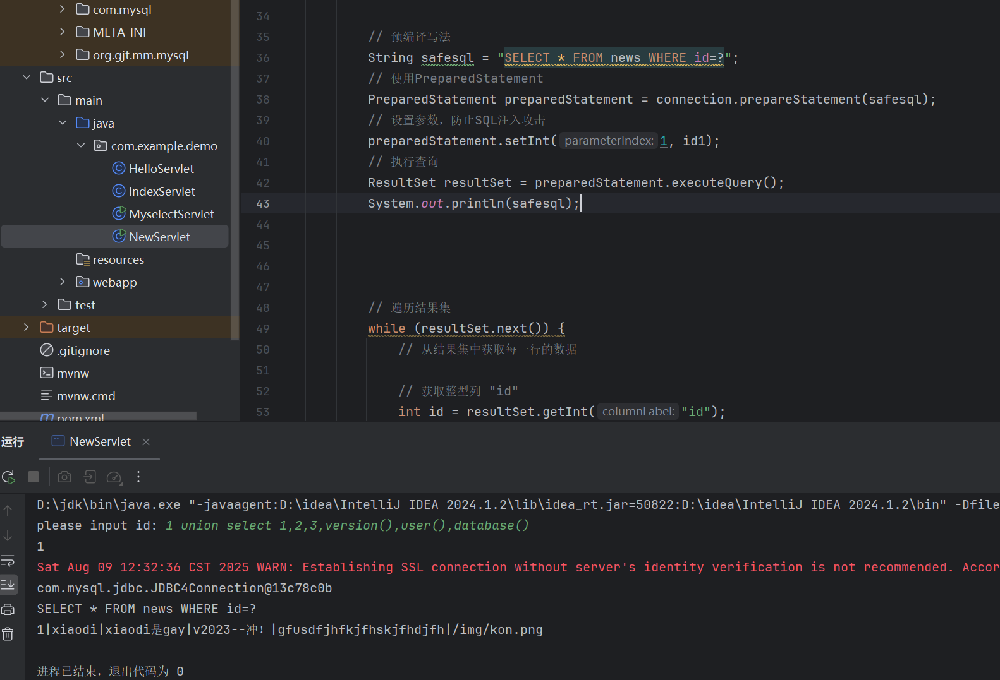


### JavaEE-过滤器-Filter


Filter（过滤器）用于拦截Web资源，处理后交给下一个过滤器或Servlet，可拦截`request`和`response`。在安全领域，过滤器常用于防御XSS攻击（攻击者注入恶意脚本，在用户浏览器执行，窃取Cookie、篡改页面等）、实现权限控制、过滤敏感词等。

#### 1、创建过滤器之前的准备
> - 创建新的项目FilterDemo1
> - 在对应的包名上，创建分类包filter与servlet
> - 在servlet下创建`TestServlet` ，并进行检测
> - 启动服务器，尝试进行Xss攻击，发现可以

```java
@Override
protected void doGet(HttpServletRequest req, HttpServletResponse resp) throws ServletException, IOException {
    // 从请求中获取名为 "code" 的参数值
    String code = req.getParameter("code");

    // 获取用于将输出发送回客户端的 PrintWriter 对象
    PrintWriter out = resp.getWriter();

    // 将 "code" 参数的值打印到客户端
    out.println(code);

    // 刷新 PrintWriter，确保立即发送任何缓冲的内容
    out.flush();

    // 关闭 PrintWriter 以释放资源
    out.close();
}
```

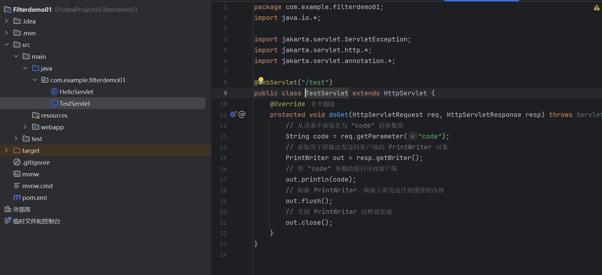

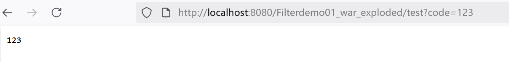

尝试`?code=<script>alert('1')</script>`结果成功执行XSS脚本：

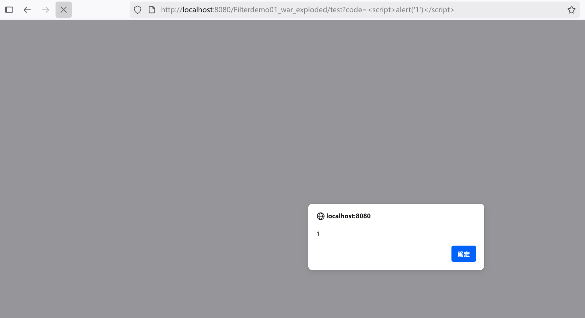


#### 2、创建过滤器
#### 3、过滤器内置方法
在对应的filter下创建XssFilter，并实现Filter接口中的所有方法：`init`、`doFilter`、`destroy`。

- `init(FilterConfig filterConfig)`：过滤器初始化时调用（仅一次），用于初始化操作（如获取配置）。
- `doFilter(ServletRequest request, ServletResponse response, FilterChain filterChain)`：核心方法，每次请求被过滤时调用。`filterChain.doFilter(request, response)` 表示继续执行过滤器链，否则请求被拦截。
- `destroy()`：过滤器销毁时调用（仅一次），用于清理资源。

```java
@WebFilter("/test")
public class XssFilter implements Filter {
    @Override
    // 中间件启动后就自动运行
    public void init(FilterConfig filterConfig) throws ServletException {
        System.out.println("xss开启过滤");
    }

    @Override
    // 中间件关闭后就自动运行
    public void destroy() {
        System.out.println("xss销毁过滤");
    }

    @Override
    // doFilter 访问路由触发的方法
    public void doFilter(ServletRequest servletRequest, ServletResponse servletResponse, FilterChain filterChain) throws IOException, ServletException {
        System.out.println("xss正在过滤");

        // 过滤代码就应该在放行前
        // 如果符合就放行，不符合就过滤（拦截）

        // XSS过滤 接受参数值 如果有攻击payload 就进行拦截
        // 接受参数值 如果没有攻击payload 就进行放行
        HttpServletRequest request = (HttpServletRequest) servletRequest;
        String code = request.getParameter("code");

        if (!code.contains("<script>")) { // 没有攻击payload
            // 放行
            filterChain.doFilter(servletRequest, servletResponse);
        } else {
            System.out.println("存在XSS攻击");
            // 继续拦截
            // 这里可以根据需要添加拦截后的处理逻辑，例如记录日志、返回错误信息等
        }
    }
}
```

#### 4、流程
还没访问test就自动运行init：

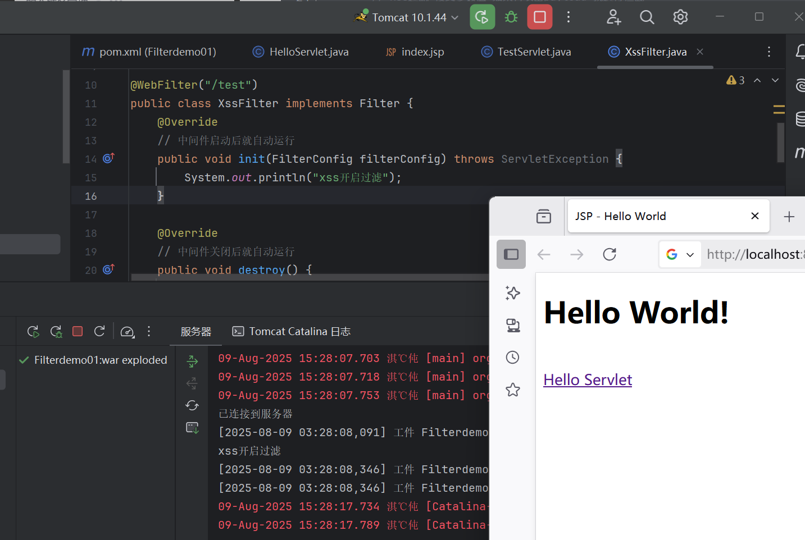

访问test时触发doFilter：

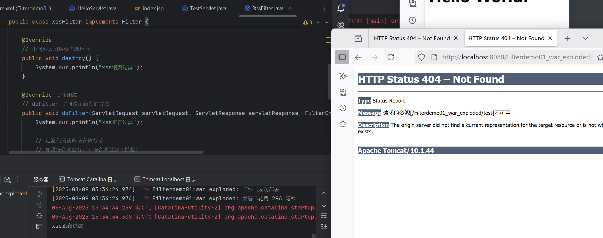

中间件关闭后执行destroy：

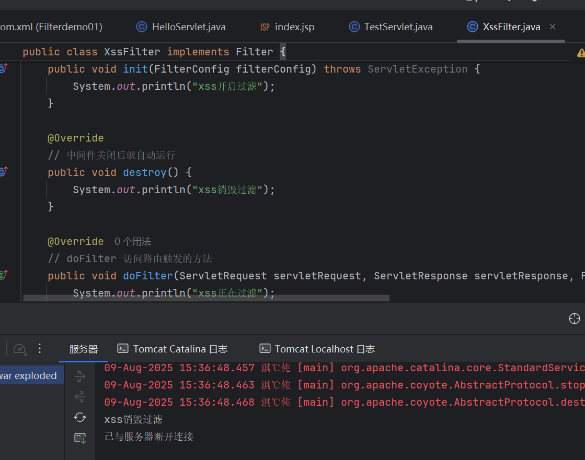

#### 5、简单过滤演示（参考第3点源码）

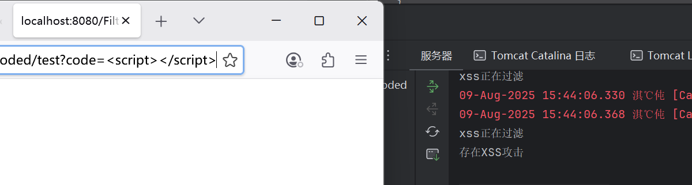

#### 6、过滤器安全场景
利用过滤器简单实现：cookie身份验证

- 在servlet下创建AdminServlet：

  ```java
  @WebServlet("/admin")
  public class AdminServlet extends HttpServlet {
      @Override
      protected void doGet(HttpServletRequest req, HttpServletResponse resp) throws ServletException, IOException {
          System.out.println("欢迎进入管理员页面");
      }
  }
  ```

  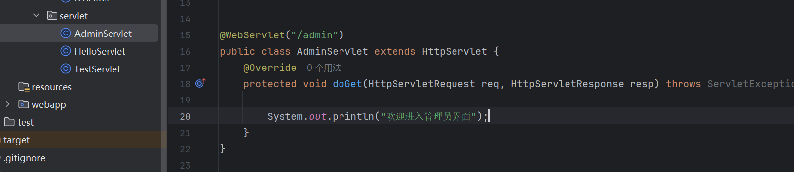

  在filter下创建AdminFileter，先获取浏览器cookie值：

  ```java
  @WebFilter("/admin")
  public class AdminFileter implements Filter{
      @Override
      // 过滤器初始化方法，在应用启动时执行
      public void init(FilterConfig filterConfig) throws ServletException {
          System.out.println("admin身份检测开启");
      }
  
      @Override
      // 过滤器销毁方法，在应用关闭时执行
      public void destroy() {
          System.out.println("admin身份检测销毁");
      }
  
      @Override
      // 过滤器核心逻辑，处理请求和响应
      public void doFilter(ServletRequest servletRequest, ServletResponse servletResponse, FilterChain filterChain) throws IOException, ServletException {
  
          System.out.println("admin身份检测进行");
  
          // 检测Cookie过滤
          HttpServletRequest request = (HttpServletRequest) servletRequest;
          Cookie[] cookies = request.getCookies();
  
          // 对Cookie进行遍历获取
          for (Cookie c : cookies) {
              String cName = c.getName();    // 获取cookie名
              String cValue = c.getValue();  // 获取cookie值
              System.out.println(cName);
              System.out.println(cValue);
  
              filterChain.doFilter(servletRequest, servletResponse);
  		}
  	}
  }
  ```

  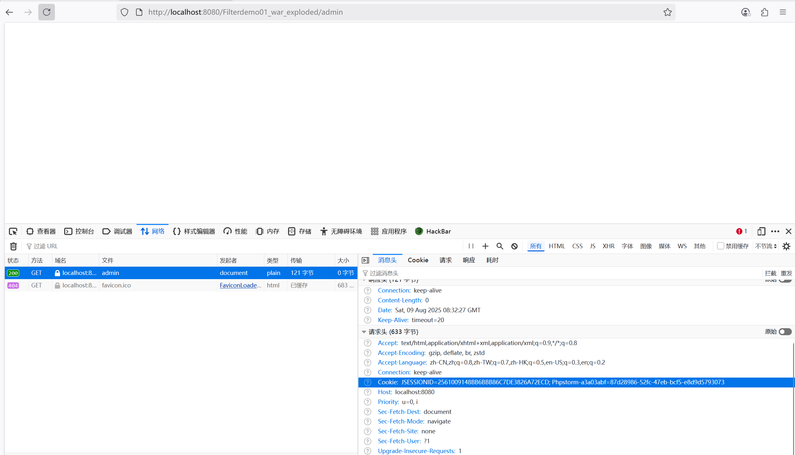

  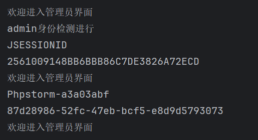

检查请求中是否包含**名为 “user” 且值为 “admin”** 的Cookie。如果符合条件，则放行请求；否则，输出 “非管理员访问”。

相应进入管理员页面，必须先在浏览器中添加对应判断的cookie值。如果对应不上则是非管理员访问，不予通过：

```java
@Override
    // 过滤器核心逻辑，处理请求和响应
    public void doFilter(ServletRequest servletRequest, ServletResponse servletResponse, FilterChain filterChain) throws IOException, ServletException {

        System.out.println("admin身份检测进行");

        // 检测Cookie过滤
        HttpServletRequest request = (HttpServletRequest) servletRequest;
        Cookie[] cookies = request.getCookies();

        // 对Cookie进行遍历获取
        for (Cookie c : cookies) {
            String cName = c.getName();    // 获取cookie名
            String cValue = c.getValue();  // 获取cookie值
            System.out.println(cName);
            System.out.println(cValue);

            // 检查是否包含名为 "user" 且值为 "admin" 的Cookie
            if (cName.contains("user") && cValue.contains("admin")) {
                // 是管理员，放行请求
			   filterChain.doFilter(servletRequest, servletResponse);

            } else {
                System.out.println("非管理员访问");
                // 非管理员，可以根据需求添加相应的处理逻辑，例如重定向到登录页等
            }

        }
    }
```

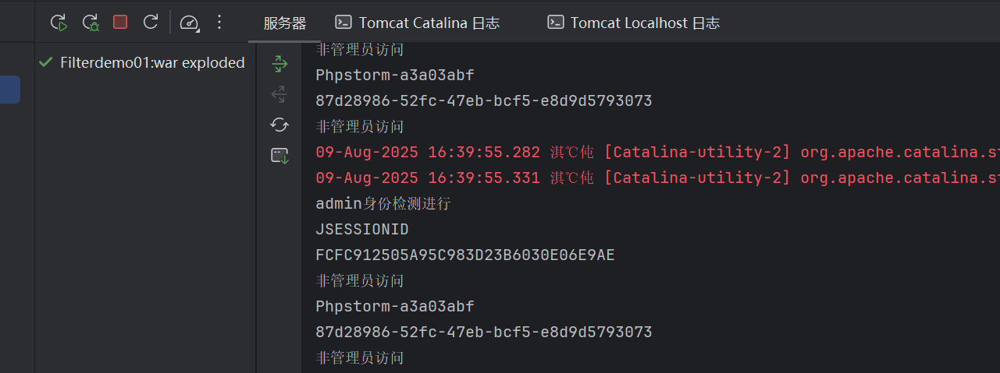

加上条件cookie并刷新：

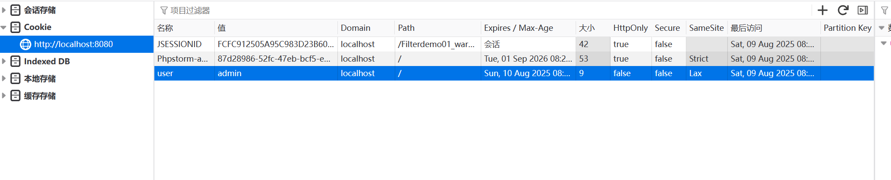

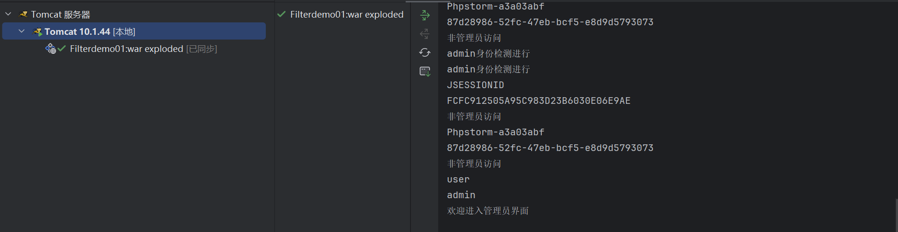

Payload检测，权限访问控制，红队内存马植入，蓝队清理内存马等

内存马参考：https://mp.weixin.qq.com/s/hev4G1FivLtqKjt0VhHKmw


### JavaEE-监听器-Listen


参考：https://blog.csdn.net/qq_52797170/article/details/124023760

监听器用于监控Web应用中特定事件（如域对象创建/销毁、属性修改等），并在事件发生前后执行处理逻辑。在安全领域，可用于监控会话（Session）状态（防止会话劫持、固定攻击）、记录访问日志、检测异常操作等。

- 监听`ServletContext`、`HttpSession`、`ServletRequest`等域对象创建和销毁事件
- 监听域对象的属性发生修改的事件
- 监听在事件发生前、发生后做一些必要的处理


#### 1、创建监听器
创建新的项目ListenDemo1

在对应的包名上，创建分类包listenerr与servlet

在servlet下创建CSession、DSession，并进行检测

DSession：简单Servlet，映射`/ds`，收到GET请求时销毁当前`HttpSession`。

```java
@WebServlet("/ds")
public class DSession extends HttpServlet {
    @Override
    protected void doGet(HttpServletRequest req, HttpServletResponse resp) throws ServletException, IOException {
        System.out.println("Servlet里面销毁Session");

        // 销毁Session
        req.getSession().invalidate();
    }
}
```

`@WebServlet("/ds")`：指定URL映射为`/ds`。  
`System.out.println("Servlet里面销毁Session");`：打印日志。  
`req.getSession().invalidate();`：销毁当前`HttpSession`，用户会话状态丢失。

CSession：简单Servlet，映射`/cs`，收到GET请求时创建`HttpSession`。

```java
@WebServlet("/cs")
public class CSession extends HttpServlet {
    @Override
    protected void doGet(HttpServletRequest req, HttpServletResponse resp) throws ServletException, IOException {
        System.out.println("Servlet里面创建Session");

        // 创建Session
        req.getSession();
    }
}
```

`@WebServlet("/cs")`：指定URL映射为`/cs`。  
`System.out.println("Servlet里面创建Session");`：打印日志。  
`req.getSession();`：获取当前`HttpSession`，不存在则创建，用于跟踪用户状态。

#### 2、监听器内置方法
实现`HttpSessionListener`接口的监听器类`ListenSession`，监听`HttpSession`的创建和销毁事件。

```java
@WebListener
public class ListenSession implements HttpSessionListener {

    @Override
    public void sessionCreated(HttpSessionEvent se) {
        // 监听检测有Session创建就会执行这里
        System.out.println("监听器监听到了session创建");
    }

    @Override
    public void sessionDestroyed(HttpSessionEvent se) {
        // 监听检测有Session销毁就会执行这里
        System.out.println("监听器监听到了session销毁");
    }
}
```

`@WebListener`：标记为监听器类。  
`sessionCreated(HttpSessionEvent se)`：`HttpSession`创建时调用，输出日志。  
`sessionDestroyed(HttpSessionEvent se)`：`HttpSession`销毁时调用，输出日志。

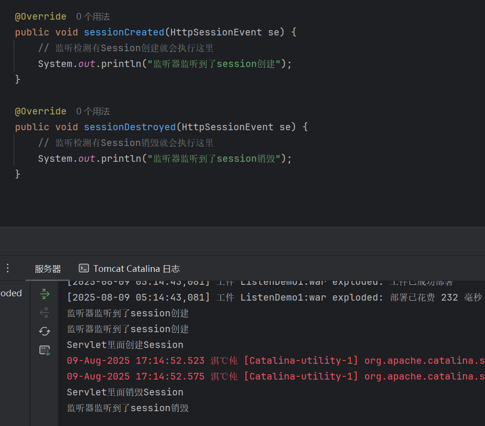

#### 3、监听器触发流程
在Java Web应用中，监听器用于监控和响应特定的事件。对于监听器的触发流程，以下是一般的步骤：

```java
@WebListener
<listener>
.......
</listener>
```

1. 注册监听器：
   - 在Web应用中，你需要将监听器注册到相应的组件上。例如，在`web.xml`文件中配置监听器，或者使用注解（如`@WebListener`）标记监听器类。
2. 事件发生：
   - 当与监听器关联的特定事件在Web应用中发生时，监听器会被触发。
3. 调用监听器方法：
   - 监听器类中实现的相应方法（如`sessionCreated`、`sessionDestroyed`等）将被调用。这些方法包含与事件相关的信息，允许监听器执行特定的逻辑。
4. 执行自定义逻辑：
   - 在监听器方法中，你可以编写自定义的逻辑以响应事件。这可能包括记录日志、修改数据、发送通知等。

举例来说，对于`HttpSessionListener`：

- 当一个新的`HttpSession`被创建时，`sessionCreated`方法将被调用。
- 当一个`HttpSession`被销毁时，`sessionDestroyed`方法将被调用。

总的来说，监听器提供了一种在Web应用中对特定事件进行响应的机制，使开发者能够以声明性的方式处理应用的生命周期事件。

#### 4、监听器安全场景
代码审计中分析执行逻辑触发操作，红队内存马植入，蓝队清理内存马等