# 034-安全开发-JavaEE应用&反射机制&攻击链&类对象&成员变量方法&构造方法  


## 目录
- [摘要](#摘要)
- [核心内容概览](#核心内容概览)
- [知识点](#知识点)
- [演示案例](#演示案例)
- [反射核心类信息](#反射核心类信息)
- [Java-反射-概念](#java-反射-概念)
- [Java-反射-Class对象类获取](#java-反射-class对象类获取)
- [Java-反射-Field成员变量类获取](#java-反射-field成员变量类获取)
- [Java-反射-Constructor构造方法类获取](#java-反射-constructor构造方法类获取)
- [Java-反射-Method成员方法类获取](#java-反射-method成员方法类获取)
- [Java-反射-不安全命令执行&反序列化链构造](#java-反射-不安全命令执行&反序列化链构造)
- [反射安全防御补充](#反射安全防御补充)


## 摘要  
本文详细介绍了JavaEE中的反射机制，包括Class对象的获取、成员变量和方法的操作，以及构造方法的使用。特别关注了反射在安全场景中的潜在风险，如不安全命令执行和反序列化链的构造。通过实例演示展示了如何通过反射进行动态编程和潜在的攻击利用。  
摘要生成于C知道 ，由 DeepSeek-R1 满血版支持，前往体验 >  


## 核心内容概览  
- Class对象类  
- Field成员变量类 类反射调用  
- Method成员方法类  
- 原生类 反射机制  
- Constructor构造方法  
- 安全问题  
- 反序列化利用链  


## 知识点：  
1. JavaEE-反射机制-开发和安全应用场景  
2. JavaEE-反射机制-类&成员变量&方法&构造方法操作  
3. JavaEE-反射机制-安全应用&反射执行&反序列化链相关  


## 演示案例：  
- Java-反射-Class对象类获取  
- Java-反射-Field成员变量类获取  
- Java-反射-Method成员方法类获取  
- Java-反射-Constructor构造方法类获取  
- Java-反射-不安全命令执行&反序列化链  


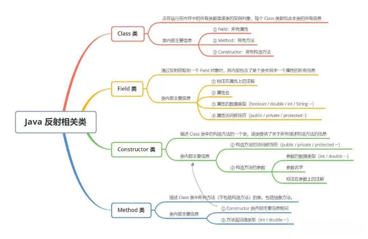  

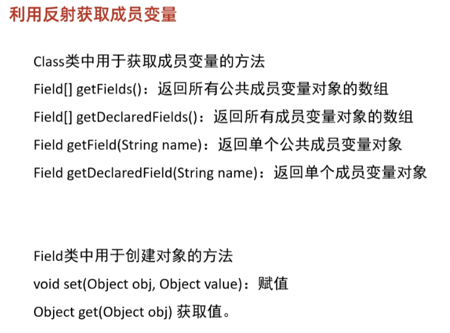  

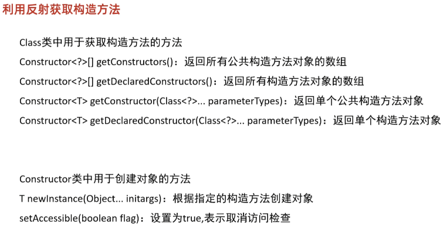  

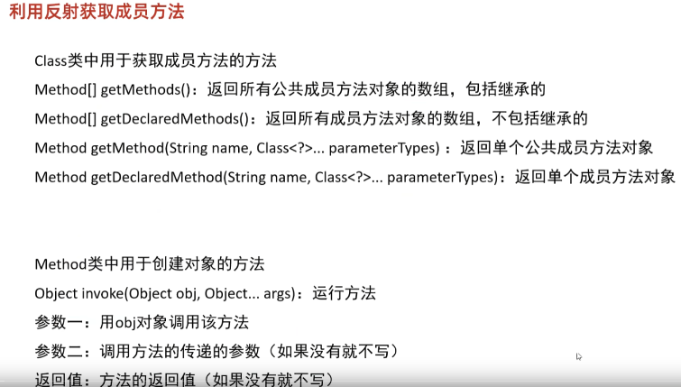  


## 反射核心类信息  
正在运行在内存中的所有类都是该类的实例对象，每个Class类都包含本类的所有信息：  
- **Class 类** 内部主要信息：① Field:所有属性 ② Method:所有方法 ③ Constructor:所有构造方法  


通过反射获取到一个 Field 对象时，其内部包含了某个类中其中一个属性的所有信息：  
- **Field类** 内部主要信息：①标注在属性上的注解 ②属性名 ③属性的数据类型(boolean / double /int /String等) ④ 属性访问修饰符(public /private /protected等)  


描述Class类中的构造方法的一个类，该类提供了关于所有描述构造方法的信息：  
- **Constructor 类** 内部主要信息：①构造方法的访问修饰符(public /private / protected等) ②构造方法的参数（参数名字、参数的数据类型(int / double等)） ③标注在参数上的注解  


描述Class类中所有方法(不包括构造方法) 的类，包括抽象方法：  
- **Method 类** 内部主要信息：① 与Constructor 类内部主要信息相同 ②方法返回值类型(int / double等)  


## Java-反射-概念  
### 1、什么是Java反射  
参考：https://xz.aliyun.com/t/9117  
Java提供了一套反射API，该API由Class类与java.lang.reflect类库组成。该类库包含了Field、Method、Constructor等类。对成员变量、成员方法和构造方法的信息进行的编程操作可以理解为反射机制。  


### 2、为什么要用到反射  
参考：https://xz.aliyun.com/t/9117  
其实从官方定义中就能找到其存在的价值，在运行时获得程序或程序集中每一个类型的成员和成员的信息，从而动态的创建、修改、调用、获取其属性，而不需要事先知道运行的对象是谁。划重点：**在运行时而不是编译时**。（不改变原有代码逻辑，自行运行的时候动态创建和编译即可）  


### 3、反射机制应用  
#### 开发应用场景：  
- Spring框架的IOC基于反射创建对象和设置依赖属性。  
- SpringMVC的请求调用对应方法，也是通过反射。  
- JDBC的Class#forName(String className)方法，也是使用反射。  


#### 安全应用场景：  
- 构造利用链，触发命令执行  
- 反序列化中的利用链构造  
- 动态获取或执行任意类中的属性或方法  
- 动态代理的底层原理是反射技术  
- rmi反序列化也涉及到反射操作  
- 权限绕过：通过反射调用私有方法/属性，绕过代码中显式的访问控制逻辑  
- 敏感信息泄露：反射可获取类的私有成员变量（如密码、密钥等），导致敏感信息泄露  


## Java-反射-Class对象类获取  
创建一个User类，包含成员变量和成员方法，构造方法，便于获取反射所对应需要：  
```java
public class User {
    //成员变量
    public String name="xiaodi";
    public int age = 31;
    private String gender="man";
    protected String job="sec";

    //构造方法
    public User(){
        //System.out.println("无参数");
    }

    public User(String name){
        System.out.println("我的名字"+name);
    }

    private User(String name,int age){
        System.out.println(name);
        System.out.println(age);
    }

    //成员方法
    public void userinfo(String name,int age,String gender,String job){
        this.job=job;
        this.age=age;
        this.name = name;
        this.gender=gender;
    }

    protected void users(String name,String gender){
        this.name = name;
        this.gender=gender;
        System.out.println("users成员方法："+name);
        System.out.println("users成员方法："+gender);
    }

}
```


获取Class对象的4种方式：  
1. 根据全限定类名：`Class.forName(“全路径类名”)`  
2. 根据类名：`类名.class`  
3. 根据对象：`对象.getClass()`  
4. 通过类加载器获得Class对象：`ClassLoader.getSystemClassLoader().loadClass(“全路径类名”)`  


示例代码：  
```java
//1、根据全限定类名：Class.forName("全路径类名")
Class aClass = Class.forName("com.example.reflectdemo1.User");
System.out.println(aClass);

//2、根据类名：类名.class
Class userClass = User.class;
System.out.println(userClass);

//3、根据对象：对象.getClass()
User user= new User();
Class aClass1 = user.getClass();
System.out.println(aClass1);

//4、通过类加载器获得Class对象：
ClassLoader clsload=ClassLoader.getSystemClassLoader();
Class aClass2 = clsload.loadClass("com.example.reflectdemo1.User");
System.out.println(aClass2);
```


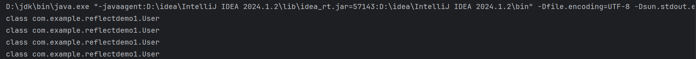  


## Java-反射-Field成员变量类获取  
### 利用反射获取成员变量  
Class类中用于获取成员变量的方法：  
- `Field[] getFields()`：返回所有公共成员变量对象的数组  
- `Field[] getDeclaredFields()`： 返回所有成员变量对象的数组  
- `Field getField(String name)`：返回单个公共成员变量对象  
- `Field getDeclaredField(String name)`：返回单个成员变量对象  


Field类中用于操作的方法：  
- `void set(Object obj, Object value)`： 赋值  
- `Object get(Object obj)`：获取值  


示例代码：  
```java
public static void main(String[] args) throws ClassNotFoundException, NoSuchFieldException, IllegalAccessException {
    Class aClass = Class.forName("com.example.reflectdemo1.User");

    //1.获取公共的成员变量
    Field[] fields1 = aClass.getFields();
    for(Field fd:fields1){
        System.out.println(fd);
    }

    //2.获取所有的成员变量
    Field[] fields = aClass.getDeclaredFields();
    for(Field fd:fields){
        System.out.println(fd);
    }

    //3.获取单个的公共成员变量
    Field name = aClass.getField("name");
    System.out.println(name);

    //4.获取单个的成员变量
    Field gender = aClass.getDeclaredField("gender");
    System.out.println(gender);

    //5.获取公共的成员变量age的值并修改
    User u = new User();
    Field field=aClass.getField("age");

    //取值
    Object a=field.get(u);
    System.out.println(a);

    //赋值
    field.set(u,32);
    Object aa=field.get(u);
    System.out.println(aa);
}
```


对应操作效果：  
1. 获取公共的成员变量：  
   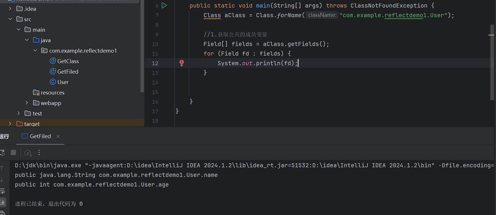  

2. 获取所有的成员变量：  
   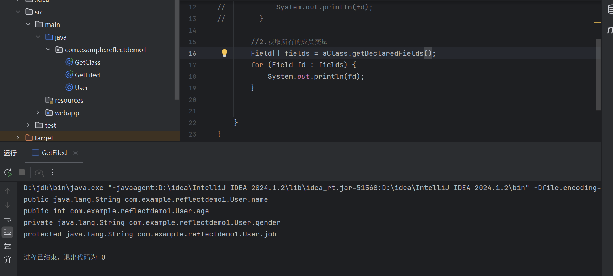  

3. 获取单个的公共成员变量：  
   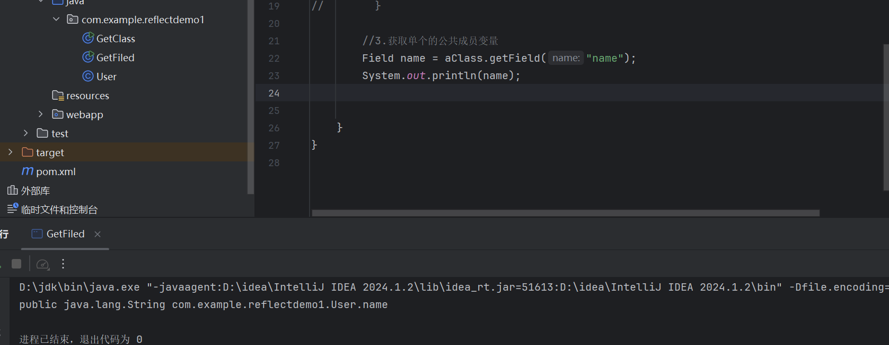  

4. 获取单个的成员变量：  
   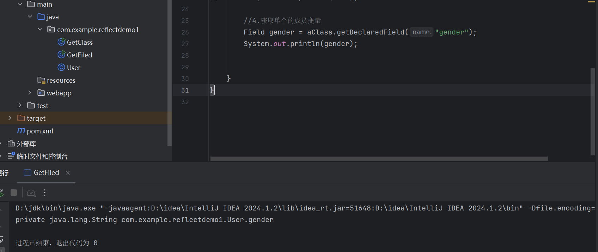  

5. 对成员变量取值和赋值：  
   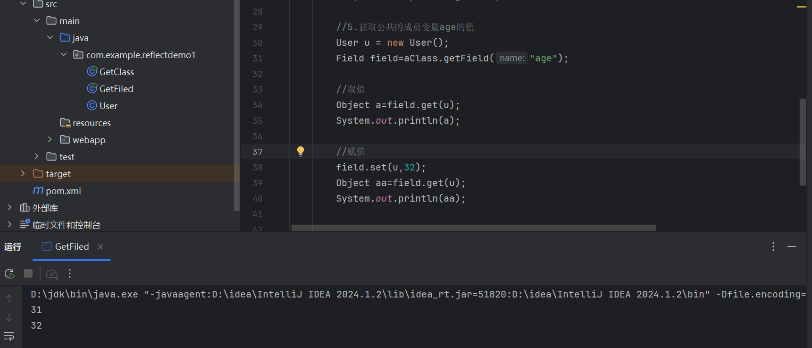  


## Java-反射-Constructor构造方法类获取  
### 利用反射获取构造方法  
Class类中用于获取构造方法的方法：  
- `Constructor<?>[] getConstructors()`： 返回所有公共构造方法对象的数组  
- `Constructor<?>[] getDeclaredConstructors()`： 返回所有构造方法对象的数组  
- `Constructor<T> getConstructor(Class<?>... parameterTypes)`：返回单个公共构造方法对象  
- `Constructor<T> getDeclaredConstructor(Class<?>... parameterTypes)`： 返回单个构造方法对象  


Constructor类中用于操作的方法：  
- `T newInstance(Object... initargs)`：根据指定的构造方法创建对象  
- `setAccessible(boolean flag)`： 设置为true，表示取消访问检查（可访问私有构造方法）  


示例代码：  
```java
public class GetConstructor {
    public static void main(String[] args) throws ClassNotFoundException, NoSuchMethodException, InvocationTargetException, InstantiationException, IllegalAccessException {
        Class aClass = Class.forName("com.example.reflectdemo1.User");

        //1.获取公共的构造方法
        Constructor[] constructors = aClass.getConstructors();
        for (Constructor con1 : constructors) {
            System.out.println(con1);
        }

        //2.获取所有的构造方法
        Constructor[] constructors2 = aClass.getDeclaredConstructors();
        for (Constructor con2 : constructors2) {
            System.out.println(con2);
        }

        //3.获取单个的公共的构造方法
        Constructor constructor = aClass.getConstructor(String.class);
        System.out.println(constructor);

        //4.获取单个的构造方法
        Constructor con3 = aClass.getDeclaredConstructor(String.class, int.class);
        System.out.println(con3);

        //5.对私有构造方法进行操作
        Constructor con4 = aClass.getDeclaredConstructor(String.class, int.class);
        con4.setAccessible(true); // 临时开启访问权限
        User uu = (User) con4.newInstance("xiaodigaygay", 40); // 创建对象
        System.out.println(uu);

        //6.对公共构造方法进行操作(一个参数String)
        Constructor con5 = aClass.getConstructor(String.class);
        con5.newInstance("xiaodigaygay");
    }
}
```


对应操作效果：  
1. 获取公共的构造方法：  
   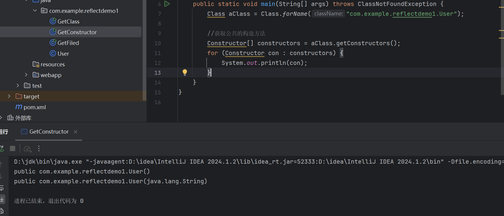  

2. 获取所有的构造方法：  
   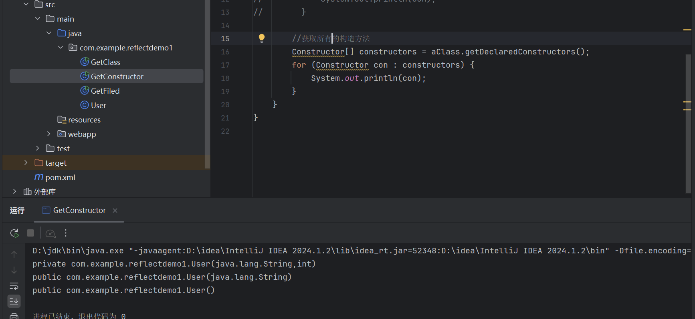  

3. 获取单个的公共的构造方法：  
   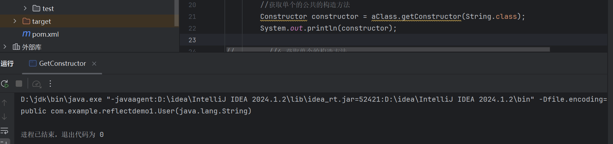  

4. 获取单个的构造方法：  
   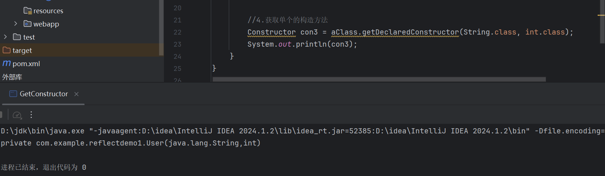  

5. 调用私有构造方法创建对象：对构造方法进行操作(两个参数string，int)，**`setAccessible(true)`临时开启对私有的访问，`newInstance`** 使用构造方法创建对象，传递参数；

   `newInstance` 方法：

   ​    `newInstance` 方法是 `java.lang.reflect.Constructor` 类的一个方法，用于创建新的类实例。
   ​    它通过调用类的构造方法来实例化对象。
   ​    `newInstance` 方法通常用于动态创建对象，尤其是在反射时，允许在运行时通过 `Constructor` 对象调用类的构造方法。

   `setAccessible(true)` 方法：

   ​    `setAccessible` 方法是 `java.lang.reflect.AccessibleObject` 类的一个方法，用于启用或禁用 Java 语言访问检查。
   ​    当 `setAccessible(true)` 被调用时，表示反射对象在使用时取消了访问权限检查，可以访问类的私有成员。
   ​    这通常用于访问那些受到访问控制限制的类的私有成员（字段、方法、构造方法等）。  
   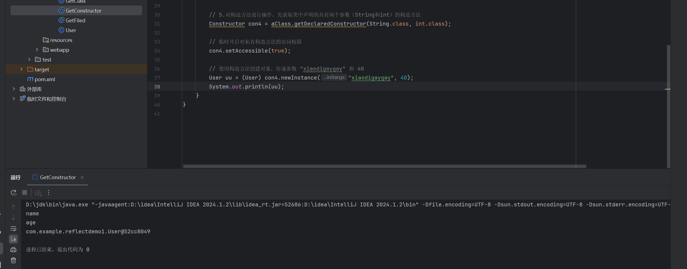  
   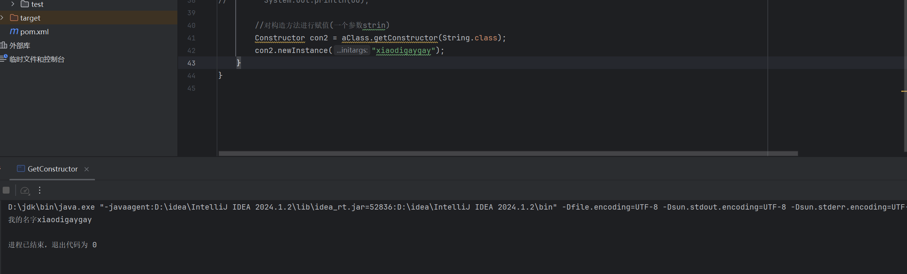  


## Java-反射-Method成员方法类获取  
### 利用反射获取成员方法  
Class类中用于获取成员方法的方法：  
- `Method[] getMethods()`：返回所有公共成员方法对象的数组，包括继承的  
- `Method[] getDeclaredMethods()`： 返回所有成员方法对象的数组，不包括继承的  
- `Method getMethod(String name, Class<?>... parameterTypes)`：返回单个公共成员方法对象  
- `Method getDeclaredMethod(String name, Class<?>... parameterTypes)`： 返回单个成员方法对象  


Method类中用于操作的方法：  
- `Object invoke(Object obj, Object... args)`：运行方法  
  - 参数一：用obj对象调用该方法  
  - 参数二：调用方法的传递的参数 (如果没有就不写)  
  - 返回值：方法的返回值(如果没有就不写)  


示例代码：  
```java
public static void main(String[] args) throws ClassNotFoundException, NoSuchMethodException, InvocationTargetException, IllegalAccessException {
    Class aClass = Class.forName("com.example.reflectdemo1.User");
    
    //1.获取包括继承的公共成员方法
    Method[] methods = aClass.getMethods();
    for(Method me:methods){
        System.out.println(me);
    }

    //2.获取不包括继承的所有成员方法
    Method[] methods1 = aClass.getDeclaredMethods();
    for(Method me:methods1){
        System.out.println(me);
    }

    //3.获取单个的成员方法
    Method users = aClass.getDeclaredMethod("users", String.class,String.class);
    System.out.println(users);

    //4.调用成员方法
    User u = new User();
    Method users1 = aClass.getDeclaredMethod("users", String.class, String.class);
    users1.invoke(u, "xiaodigay", "gay1"); // 等价于 u.users("xiaodigay", "gay1")
}
```


对应操作效果：  
1. 获取包括继承的公共成员方法：  
   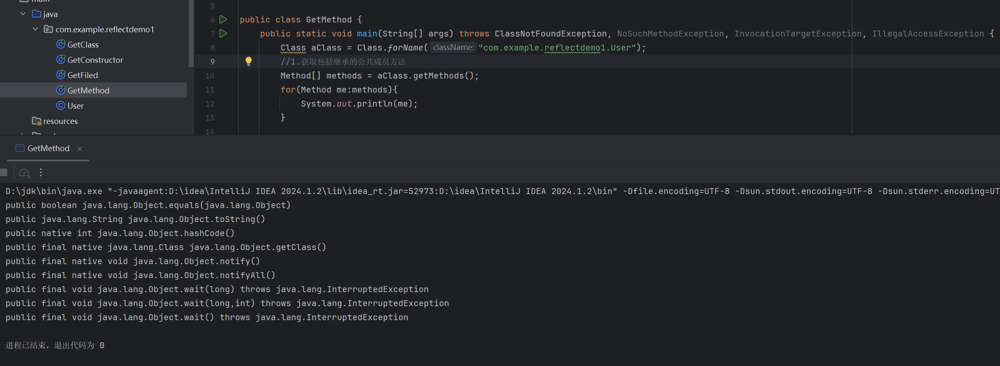  

2. 获取不包括继承的所有成员方法：  
   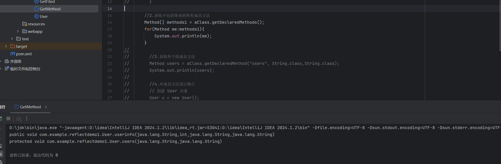  

3. 获取单个的成员方法：  
   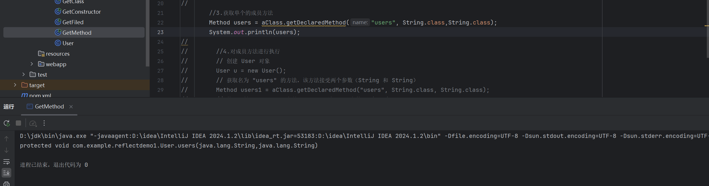  

4. 调用成员方法：

   `User u = new User();`: 创建一个 User 对象，即实例化 User 类。
   `Method users = aClass.getDeclaredMethod("users", String.class, String.class);`: 通过反射获取 User 类中名为 “users” 的方法，该方法接受两个参数，类型分别为 String 和 String。
   `users.invoke(u, "xiaodigay", "gay1");`: 使用 `invoke` 方法调用 `User` 对象的` users` 方法，传递参数 “xiaodigay” 和 “gay1”。这行代码相当于调用 `u.users("xiaodigay", "gay1")`。  
   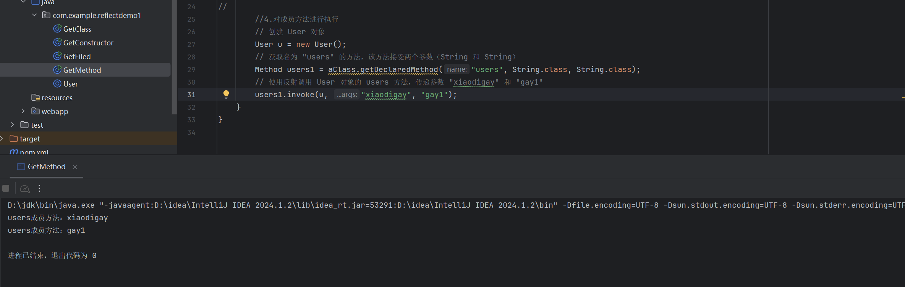  


## Java-反射-不安全命令执行&反序列化链构造  
### 1、反射实现-命令执行  
原型：Java自带的`java.lang.Runtime`类可调用本机控制台命令，如：  
`Runtime.getRuntime().exec("calc");`  


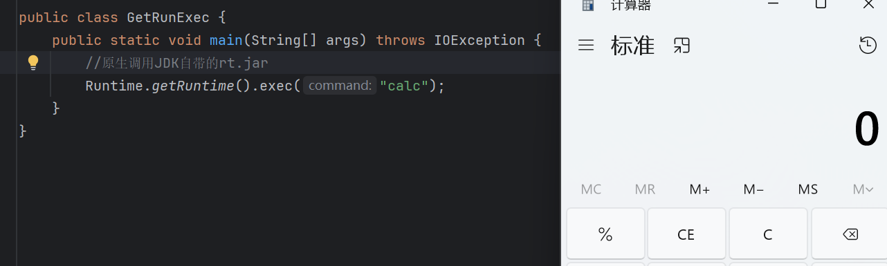  


#### 反射调用Runtime执行命令（模拟第三方jar包调用）  
步骤：  
1. 通过`Class.forName`获取`java.lang.Runtime`类  
2. 反射获取`getRuntime`方法（用于获取Runtime实例）  
3. 反射获取`exec`方法（用于执行命令）  
4. 调用方法执行系统命令  


示例代码1：  
```java
// 获取 Runtime 类
Class aClass = Class.forName("java.lang.Runtime");

// 获取 exec 方法（接受String参数）
Method exec = aClass.getMethod("exec", String.class);

// 获取 getRuntime 方法（无参数）
Method getRuntimeMethod = aClass.getMethod("getRuntime");

// 调用 getRuntime 获取 Runtime 实例
Object runtime = getRuntimeMethod.invoke(aClass);

// 调用 exec 执行命令（打开计算器）
exec.invoke(runtime, "calc.exe");
```


示例代码2（通过私有构造方法创建实例）：  
```java
// 获取 Runtime 类
Class c1 = Class.forName("java.lang.Runtime");

// 获取默认构造方法（私有）
Constructor m = c1.getDeclaredConstructor();

// 开启访问权限
m.setAccessible(true);

// 创建实例并执行命令
c1.getMethod("exec", String.class).invoke(m.newInstance(), "calc");
```


执行效果：  
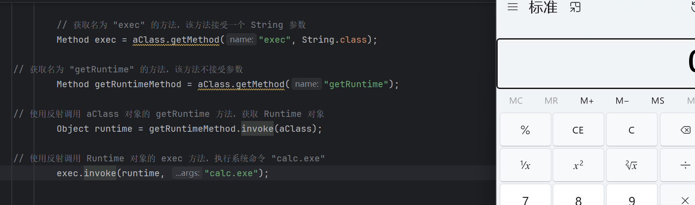  


### 2、不安全的反射对象  
指应用程序使用具有反射功能的外部输入来选择要使用的类或代码，可能被攻击者利用而输入或选择不正确的类，绕过身份验证或访问控制检查。  


参考分析：https://zhuanlan.zhihu.com/p/165273855  
利用结合：https://xz.aliyun.com/t/7031?time__1311=n4%2BxnD0GDti%3DLxQTq05%2BbDyGD9lBQKDReOYD  


## 反射安全防御补充  
1. **输入验证**：对反射操作中涉及的类名、方法名、参数等进行严格校验，只允许白名单内的类/方法被调用。  
2. **最小权限原则**：运行程序的账号应使用最低权限，避免反射调用危险方法（如`exec`）时获得系统级权限。  
3. **禁用危险类反射**：通过安全管理器（SecurityManager）限制对`java.lang.Runtime`、`java.lang.ProcessBuilder`等危险类的反射访问。  
4. **避免暴露反射接口**：不在外部接口中直接接收反射相关参数（如类名、方法名），减少攻击面。  
5. **代码审计**：重点检查`getDeclaredMethod`、`setAccessible(true)`等敏感反射调用，确认其参数来源是否安全。  
6. **反序列化防护**：使用安全的反序列化库（如Apache Commons Lang3的`SerializationUtils`），并限制反序列化的类范围，避免反射触发恶意代码。