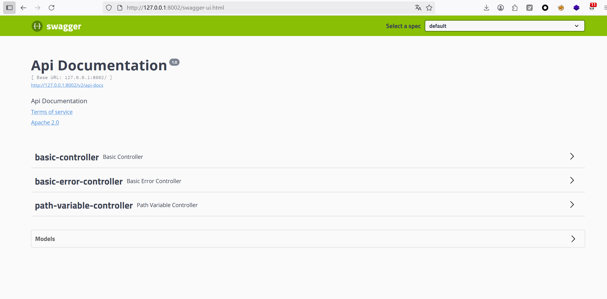

# 039-安全开发-JavaEE应用&SpringBoot框架&Actuator监控泄漏&Swagger自动化


## 目录
- [知识点](#知识点)
- [SpringBoot-监控系统-Actuator](#springboot-监控系统-actuator)
  - [开发使用](#1-开发使用)
  - [安全问题](#2-安全问题)
- [SpringBoot-接口系统-Swagger](#springboot-接口系统-swagger)
  - [创建项目引入依赖](#1-创建项目引入依赖)
  - [配置访问](#2-配置访问)
  - [安全问题](#3-安全问题)
- [难点总结](#难点总结)


## 知识点：

1. JavaEE-SpringBoot-监控系统-Actuator  
2. JavaEE-SpringBoot-接口系统-Swagger  
3. JavaEE-SpringBoot-监控&接口&安全问题  

演示案例：  
- SpringBoot-监控系统-Actuator  
- SpringBoot-接口系统-Swagger  
- 安全案例-JVM泄漏&接口自动化  


## SpringBoot-监控系统-Actuator

SpringBoot Actuator模块提供了生产级别的功能，比如健康检查、审计、指标收集、HTTP跟踪等，帮助监控和管理Spring Boot应用。但如果配置不当，可能导致敏感信息泄露，成为网络攻击的突破口。


### 1. 开发使用：

#### （1）引入依赖
在`pom.xml`中添加Actuator依赖，即可启用监控功能：
```xml
<dependency>
  <groupId>org.springframework.boot</groupId>
  <artifactId>spring-boot-starter-actuator</artifactId>
</dependency>
```
**关键说明**：引入依赖后，Actuator默认会暴露`/health`（健康检查）和`/info`（应用信息）两个端点，其他端点需手动配置暴露。

  


#### （2）配置监控
通过配置文件控制端点暴露范围和细节，常见配置如下：

- **暴露配置（application.properties）**：
```properties
# 设置应用端口
server.port=7777

# 数据库连接配置（示例）
spring.datasource.url=jdbc:mysql://localhost:3306/demo01
spring.datasource.name=root
spring.datasource.password=password
spring.datasource.driver-class-name=com.mysql.jdbc.Driver

# 暴露所有Actuator端点（危险！生产环境禁止）
management.endpoints.web.exposure.include=*

# 健康检查显示详细信息（可能包含敏感信息）
management.endpoint.health.show-details=always
```

- **暴露配置（application.yml）**：
```yml
management:
  endpoints:
    web:
      # 允许HTTP访问所有端点（风险配置）
      exposure:
        include: '*'
```

- **安全配置：关闭高风险端点（推荐）**  
  部分端点（如`/env`、`/heapdump`）会泄露敏感信息，需禁用：
  - application.properties：
  ```properties
  # 禁用Env端点（存储环境变量、配置信息）
  management.endpoint.env.enabled=false
  
  # 禁用Heap Dump端点（可获取JVM内存快照）
  management.endpoint.heapdump.enabled=false
  ```

  - application.yml：
  ```yml
  management:
    endpoint:
      # 禁用Heap Dump端点
      heapdump:
        enabled: false 
      # 禁用Env端点
      env:
        enabled: false 
  ```

**关键说明**：  
- `management.endpoints.web.exposure.include=*`会暴露所有端点（如`/env`、`/heapdump`、`/mappings`等），攻击者可通过这些端点获取数据库密码、接口路径等敏感信息。  
- 生产环境应遵循“最小权限原则”，仅暴露必要端点（如`health`、`info`）。

禁用后访问`/heapdump`的效果：  


#### （3）图像化Server&Client端界面
通过Spring Boot Admin可实现Actuator的可视化监控，分为Server（监控端）和Client（被监控端）：

- **Server端配置**：  
  引入Server依赖并开启`@EnableAdminServer`注解：  
    
    
  

- **Client端配置**：  
  引入Client依赖，配置连接Server端地址：  
    
  

- **启动效果**：  
  分别启动Server和Client后，Server端可可视化监控Client状态：  
    
  

**关键说明**：  
- 可视化界面需注意权限控制，避免未授权用户访问（如添加登录验证）。  
-  Server与Client之间的通信建议加密（如HTTPS），防止监控数据被拦截。


### 2. 安全问题

#### heapdump泄漏
`/heapdump`端点会生成JVM内存快照文件（`.hprof`），攻击者获取后可通过工具分析出敏感信息（如数据库密码、API密钥、配置参数等）。

- **攻击流程**：  
  1. 访问`http://ip:port/actuator/heapdump`下载内存快照；  
  2. 使用工具分析快照提取敏感信息。

- **分析工具**：  
  - **JDumpSpider**：自动化提取敏感信息的工具  
    下载地址：https://github.com/whwlsfb/JDumpSpider/releases  
    使用命令：
    ```bash
    # 分析heapdump文件
    java -jar JDumpSpider-1.1-SNAPSHOT-full.jar heapdump
    ```
    效果：  
    

  - **jvisualvm**：JDK自带工具，可手动分析内存快照  
    路径：`JDK安装目录/bin/jvisualvm.exe`（如`D:\jdk1.8.0_112\bin\jvisualvm.exe`）  
    效果：  
    

- **其他风险**：  
  除了敏感信息，还可能分析出应用使用的组件版本（如存在漏洞的log4j），为后续攻击提供线索（参考：https://blog.csdn.net/drnrrwfs/article/details/125242990）。


## SpringBoot-接口系统-Swagger

Swagger是实时接口文档生成工具，方便前后端协作，但生产环境若未妥善配置，会泄露接口细节，被攻击者利用进行自动化测试和攻击。


### 1. 创建项目引入依赖
在`pom.xml`中添加Swagger依赖，不同版本配置略有差异：

- **2.9.2版本**：
```xml
<dependency>
  <groupId>io.springfox</groupId>
  <artifactId>springfox-swagger2</artifactId>
  <version>2.9.2</version>
</dependency>
<dependency>
  <groupId>io.springfox</groupId>
  <artifactId>springfox-swagger-ui</artifactId>
  <version>2.9.2</version>
</dependency>
```

- **3.0.0版本（推荐）**：
```xml
<dependency>
  <groupId>io.springfox</groupId>
  <artifactId>springfox-boot-starter</artifactId>
  <version>3.0.0</version>
</dependency>
```

**关键说明**：  
- 3.0.0版本简化了配置，整合了starter，无需手动引入多个依赖。  
- 版本差异会影响注解和访问路径，需特别注意。


### 2. 配置访问
通过配置文件设置路径匹配策略，并注意版本对应的访问路径：

- **application.properties**：
```properties
# 设置路径匹配策略为Ant路径匹配器（Swagger兼容需求）
spring.mvc.pathmatch.matching-strategy=ant-path-matcher
```

- **application.yml**：
```yml
spring:
  mvc:
    pathmatch:
      # 路径匹配策略（Swagger需Ant风格）
      matching-strategy: ant_path_matcher
```

**注意事项**：  
- **注解差异**：2.X版本需在启动类添加`@EnableSwagger2`；3.X版本无需额外注解（或使用`@EnableOpenApi`）。  
- **访问路径**：  
  - 2.X版本：`http://ip:port/swagger-ui.html`  
  - 3.X版本：`http://ip:port/swagger-ui/index.html`  

示例效果：  


**接口示例（TestController.java）**：
```java
package cn.xiaodi.testswaggerdemo.demos.web;

import org.springframework.web.bind.annotation.GetMapping;
import org.springframework.web.bind.annotation.PostMapping;
import org.springframework.web.bind.annotation.RequestParam;
import org.springframework.web.bind.annotation.ResponseBody;

public class TestController {

    // GET接口示例，接收name参数
    @GetMapping("/getdata")
    @ResponseBody
    public String getdata(@RequestParam String name){
        return "get have date" + name;
    }

    // POST接口示例，接收name参数
    @PostMapping("/postdata")
    @ResponseBody
    public String postdata(@RequestParam String name){
        return "post have date" + name;
    }

}
```

接口文档展示：  
  


### 3. 安全问题
Swagger文档会暴露接口的路径、参数、请求方式等细节，攻击者可利用这些信息进行自动化测试，探测未授权访问、信息泄露、文件上传等漏洞。

- **自动化测试流程（以Postman为例）**：  
  1. 从Swagger文档获取API描述文件（如`http://127.0.0.1:8080/v3/api-docs`）；  
  2. 在Postman中导入API描述：  
       
  3. 批量执行接口测试，探测漏洞：  
       
     

**关键风险**：  
- 未授权访问：攻击者通过接口文档直接调用敏感接口（如用户信息查询、订单操作）。  
- 接口滥用：利用文档中的参数格式，构造恶意请求（如SQL注入、文件上传漏洞测试）。  


## 难点总结

1. **Actuator端点的精细化控制**  
   - 难点：如何平衡监控需求与安全性，避免过度暴露端点。  
   - 解决：生产环境仅暴露`health`、`info`等必要端点，通过`management.endpoints.web.exposure.include=health,info`配置；对敏感端点（`env`、`heapdump`）强制禁用。

2. **Swagger的环境隔离**  
   - 难点：开发/测试环境需要Swagger文档，生产环境需关闭以避免泄露。  
   - 解决：通过Spring Profiles区分环境，仅在非生产环境启用Swagger（如`@Profile({"dev", "test"})`）。

3. **heapdump分析工具的使用**  
   - 难点：手动分析`.hprof`文件复杂，难以快速定位敏感信息。  
   - 解决：使用自动化工具（如JDumpSpider）批量提取敏感信息；结合jvisualvm的“OQL查询”精准搜索关键字（如`password`、`secret`）。

4. **权限控制补充**  
   - 难点：Actuator和Swagger默认无权限验证，易被未授权访问。  
   - 解决：集成Spring Security，为监控端点和Swagger文档添加登录验证，限制访问来源IP。