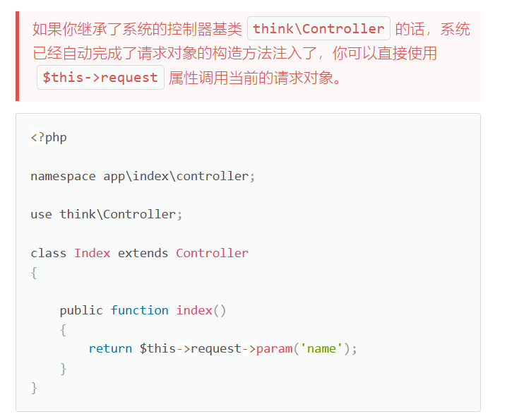
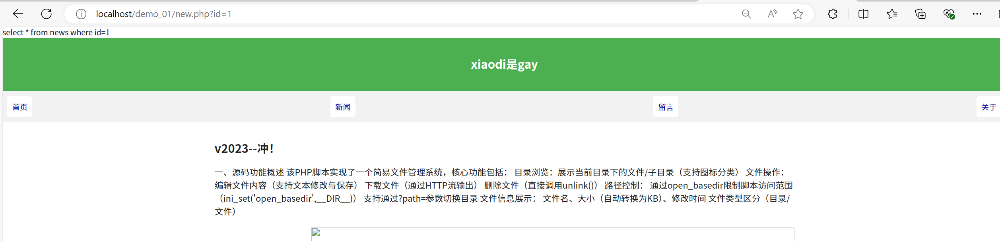

# 027-安全开发-PHP应用&TP框架&路由访问&对象操作&内置过滤绕过&核心漏洞


# 目录导航
1. [知识点](#知识点)  
2. [演示案例](#演示案例)  
3. [TP框架-开发-配置架构&路由&MVC模型](#tp框架-开发-配置架构路由mvc模型)  
   - 3.1 [配置架构-导入使用](#31-配置架构-导入使用)  
   - 3.2 [路由访问-URL访问](#32-路由访问-url访问)  
   - 3.3 [数据库操作-应用对象](#33-数据库操作-应用对象)  
   - 3.4 [文件上传操作-应用对象](#34-文件上传操作-应用对象)  
   - 3.5 [前端页面渲染-MVC模型](#35-前端页面渲染-mvc模型)  
4. [TP框架-安全-不安全写法&版本过滤绕过](#tp框架-安全-不安全写法版本过滤绕过)  
   - 4.1 [内置代码写法](#41-内置代码写法)  
     - 4.1.1 [安全写法](#411-安全写法)  
     - 4.1.2 [用一半安全写法](#412-用一半安全写法)  
     - 4.1.3 [纯原生写法](#413-纯原生写法)  
   - 4.2 [框架版本安全](#42-框架版本安全)  
     - 4.2.1 [复现举例1](#421-复现举例1)  
     - 4.2.2 [复现举例2](#422-复现举例2)  
5. [补充知识点：ThinkPHP安全开发实践](#补充知识点thinkphp安全开发实践)  
   - 5.1 [输入过滤最佳实践](#51-输入过滤最佳实践)  
   - 5.2 [安全上传增强方案](#52-安全上传增强方案)  
   - 5.3 [SQL注入防护进阶](#53-sql注入防护进阶)  
   - 5.4 [常见ThinkPHP安全漏洞](#54-常见thinkphp安全漏洞)  
   - 5.5 [安全配置建议](#55-安全配置建议)  
6. [相关资源](#相关资源)


## 知识点
1. TP框架-开发-路由访问&数据库&文件上传&MVC模型
2. TP框架-安全-不合规写法&内置过滤绕过&版本安全漏洞

## 演示案例
➢ TP框架-开发-配置架构&路由&MVC模型  
➢ TP框架-安全-不安全写法&版本过滤绕过

---

## TP框架-开发-配置架构&路由&MVC模型
参考：[ThinkPHP5.1完全开发手册](https://www.kancloud.cn/manual/thinkphp5_1)

### 1. 配置架构-导入使用
- 修改小皮网址目录：`D:/phpstudy_pro/WWW/demo_01/thinkphp/public`


- 访问成功


### 2. 路由访问-URL访问
访问方式需要按照特定的访问方式才能访问到

例如：需要访问初始页面：  
`127.0.0.1/index.php/Index/index/`  
需要访问初始页面中新定义的函数：  
`127.0.0.1/index.php/Index/index/xiaodi`


如果想返回域名或表单中输入的参数中的内容

首先需要导入**think\Controller**类，Controller类是ThinkPHP框架提供的基础控制器类，你的Index类继承了这个控制器类。通过继承Controller，你可以使用框架提供的一些基础控制器功能，比如处理请求和响应。

其次完成代码回写：

```php
<?php
namespace app\index\controller;
use think\Controller;

class Index extends Controller
{
    // index方法用于处理首页请求
    public function index()
    {
        // 返回一个包含样式和内容的字符串
        return '<style type="text/css">*{ padding: 0; margin: 0; } .think_default_text{ padding: 4px 48px;} a{color:#2E5CD5;cursor: pointer;text-decoration: none} a:hover{text-decoration:underline; } body{ background: #fff; font-family: "Century Gothic","Microsoft yahei"; color: #333;font-size:18px} h1{ font-size: 100px; font-weight: normal; margin-bottom: 12px; } p{ line-height: 1.6em; font-size: 42px }</style><div style="padding: 24px 48px;"> <h1>:)</h1><p> ThinkPHP V5<br/><span style="font-size:30px">十年磨一剑 - 为API开发设计的高性能框架</span></p><span style="font-size:22px;">[ V5.0 版本由 <a href="http://www.qiniu.com" target="qiniu">七牛云</a> 独家赞助发布 ]</span></div><script type="text/javascript" src="http://tajs.qq.com/stats?sId=9347272" charset="UTF-8"></script><script type="text/javascript" src="http://ad.topthink.com/Public/static/client.js"></script><thinkad id="ad_bd568ce7058a1091"></thinkad>';
    }

    // xiaodi方法用于处理名为xiaodi的请求，返回请求参数中的'name'
    public function xiaodi()
    {
        // 返回请求参数中的'name'
        return $this->request->param('name');
    }
}
```



访问有两种方式：
- `127.0.0.1/index.php/Index/index/xiaodi?name=1`
- `127.0.0.1/index.php/Index/index/xiaodi/name/1`


**注意：**
- 如果是使用`$_GET`的请求方式访问则：只支持一种方式回写数据
- `127.0.0.1/index.php/Index/index/xiaodi?x=123456`

如果创建新的目录，例如application→text→controller→Test.php等

> - 修改namespace中的路径
> - 修改class类名Test
> - `127.0.0.1/index.php/test/test/index`
> - `127.0.0.1/index.php/test/test/xiaodi/x/123`


### 3. 数据库操作-应用对象
- 找到数据库配置文件（database.php），配置好相应数据
- 引用数据的的类`use think\Db;`，使用数据库的查询语句
- 打开调试（访问testsql时页面错误），文件在config.php


```php
use think\Db;
public function testsql()
{
   //SELECT * FROM `think_user` WHERE  `id` = 1 LIMIT 1
    // table方法必须指定完整的数据表名
    $data = Db::table('news')->where('id', 1)->find();
    return json($data);//使用json打印数组
}
```


**thinkphp的安全过滤：**

如果是原生态php的话，数据库操作没有过滤就会受到SQL注入攻击

ThinkPHP框架提供了一些内置的数据库操作方法，使得对数据库的访问更加便捷和安全。使用ThinkPHP框架操作数据库默认是受到**框架内置的过滤保护**

new.php原生态如下：




ThinkPHP框架：

```php
public function testsql()
{
    //使用tp框架操作mysql数据
    //SELECT * FROM `think_user` WHERE  `id` = 1 LIMIT 1

    //1、使用TP框架操作数据库 默认是受到框架内置过滤保护
    // 安全写法=推荐写法 不安全写法=原生写法（不会受到保护）
    // 1、安全写法 2、用一半安全写法 3、纯原生写法(完全不是用TP语法)
    //2、原生态的数据库操作如果没有过滤就会受到SQL注入攻击

    //规矩写法：不是绝对安全 看两点
    //看版本的内置绕过漏洞 同样也有漏洞
    $id=request()->param('x');
    $data=Db::table('news')->where('id',$id)->find();

    //用一半安全写法 有安全隐患
//        $id=request()->param('x');
//        $data=Db::query("select * from news where id=$id");

    //纯原生写法 有安全隐患
//        $id=$_GET['id'] ?? '1';
//        $sql="select * from news where id=$id";
//        $data=mysqli_query($con,$sql);
//        while ($row=mysqli_fetch_row($data)) {

//        $username = request()->get('username/a');
//        db('admin')->where("id")->update(['username' => $username]);

    return json($data);
}
```


无论输入什么都没有反应

### 4. 文件上传操作-应用对象
在配置好的网址根目录public下创建upload.html

在upload.html中写入以下代码，并修改action的地址

```html
<form action="/index.php/test/test/upload" enctype="multipart/form-data" method="post">
 <input type="file" name="image" /> <br>
 <input type="submit" value="上传" />
</form>
```

在Test.php中输入以下代码（此代码对于上传文件，进行了诸多过滤，保证了安全性）

```php
public function upload(){
    // 获取表单上传文件 例如上传了001.jpg
    $file = request()->file('image');
    // 移动到框架应用根目录/uploads/ 目录下
    $info = $file->validate(['ext'=>'jpg,png,gif'])->move( '../uploads');
    if($info){
        // 成功上传后 获取上传信息
        // 输出 jpg
        echo $info->getExtension();
        // 输出 20160820/42a79759f284b767dfcb2a0197904287.jpg
        echo $info->getSaveName();
        // 输出 42a79759f284b767dfcb2a0197904287.jpg
        echo $info->getFilename();
    }else{
        // 上传失败获取错误信息
        echo $file->getError();
    }
}
```


### 5. 前端页面渲染-MVC模型
> - 在例如index（需要渲染的文件当前并行目录下）→view→index→index.html等
> - `http://127.0.0.1/index.php/Index/index/index` 输入对应的路由访问即可看到已经渲染的页面


也可以指定内容可以指定模板


---

## TP框架-安全-不安全写法&版本过滤绕过
判断漏洞的方式：首先判断代码写法如果是不安全写法直接通过代码回写使用sql注入，如果是安全写法则判断中间框架版本号，依据版本号去寻找存在的漏洞

### 1. 内置代码写法
例子：不合规的代码写法-TP5-自写

1. 使用TP框架操作数据库默认是受到框架内置过滤保护
2. 原生态的数据库操作如果没有过滤就会受到SQL注入攻击

**安全写法=推荐写法 不安全写法=原生写法（不会受到保护）**

#### 1.1 安全写法
规矩写法：不是绝对安全 看两点  
看版本的内置绕过漏洞 同样也有漏洞

```php
$id=request()->param('x');
$data=Db::table('news')->where('id',$id)->find();
```

#### 1.2 用一半安全写法
**有安全隐患**

```php
//用一半安全写法 有安全隐患
$id=request()->param('x');
$data=Db::query("select * from news where id=$id");
```

#### 1.3 纯原生写法(完全不使用TP语法)
**有安全隐患**

```php
// 从GET请求中获取id参数，如果不存在则默认为1
$id = $_GET['id'] ?? '1';

// 构建SQL查询语句
$sql = "select * from news where id=$id";
echo $sql;

// 执行查询并获取结果集
$data = mysqli_query($con, $sql);

// 使用mysqli_fetch_row遍历结果集的每一行
while ($row = mysqli_fetch_row($data)) {
    // 从结果集中获取每一列的值，并存储到相应的变量中
    $page_title = $row[1];
    $heading = $row[2];
    $subheading = $row[3];
    $content = $row[4];
    $item = $row[5];
}
```

### 2. 框架版本安全（不存在绝对的安全）
- 首先查看中间框架的版本是什么，如ThinkPHP的版本在**thinkphp→thinkphp→base.php**中查看


- 查询不同版本漏洞


#### 2.1 复现举例1：


#### 2.2 复现举例2：


SQL注入：  
`http://yoursite/index/index/index?username[0]=inc&username[1]=updatexml(1,concat(0x7,user(),0x7e),1)&username[2]=1`


---

## 补充知识点：ThinkPHP安全开发实践

### 1. 输入过滤最佳实践
```php
// 安全的输入过滤方式
$id = input('param.id/d'); // 强制转换为整型
$name = input('param.name/s', '', 'htmlspecialchars'); // 字符串过滤
$email = input('param.email/s', '', 'filter_email'); // 自定义过滤
```

### 2. 安全上传增强方案
```php
public function upload(){
    $file = request()->file('image');
    // 增强验证：限制大小、类型、防止覆盖
    $info = $file->validate([
        'size' => 1024*1024*2, // 2MB
        'ext'  => 'jpg,png,gif',
        'type' => 'image/jpeg,image/png,image/gif'
    ])->rule('uniqid')->move('../uploads');
    
    // ...后续处理
}
```

### 3. SQL注入防护进阶
- **永远不要信任用户输入**
- 使用参数绑定：
  ```php
  Db::query('SELECT * FROM news WHERE id = :id', ['id' => $id]);
  ```
- 避免直接拼接SQL语句
- 使用TP内置的查询构造器方法

### 4. 常见ThinkPHP安全漏洞
| 漏洞类型     | 影响版本       | 利用方式                     | 修复方案                 |
| ------------ | -------------- | ---------------------------- | ------------------------ |
| SQL注入      | TP5.0.5-5.1    | 数组参数传递时过滤不严       | 升级至5.1.24+            |
| 反序列化漏洞 | TP5.0.x        | 恶意构造序列化数据           | 禁止反序列化用户输入     |
| 路径穿越     | TP5.0.0-5.0.23 | 控制器名过滤不严导致文件包含 | 升级至5.0.24             |
| XSS漏洞      | 全版本         | 未正确过滤输出               | 使用htmlspecialchars过滤 |

### 5. 安全配置建议
1. 生产环境关闭调试模式：`config.php`中设置`'app_debug' => false`
2. 设置默认过滤方法：`config.php`中配置`'default_filter' => 'htmlspecialchars'`
3. 启用路由强制模式：`route.php`中设置`'url_route_must' => true`
4. 定期更新框架版本

---

## 相关资源
1. [ThinkPHP5.1完全开发手册](https://www.kancloud.cn/manual/thinkphp5_1) - 官方开发文档 
2. [OWASP Top 10](https://owasp.org/www-project-top-ten/) - Web应用安全风险Top 10榜单 
3. [PHP 安全编码实践](https://phpsecurity.readthedocs.io/) - PHP语言安全开发最佳实践
4. [ThinkPHP 漏洞库](https://www.seebug.org/vuldb/ssvid-97777) - 常见ThinkPHP漏洞收录平台 
5. [安全客 - ThinkPHP 专题](https://www.anquanke.com/tag/ThinkPHP) - 包含最新ThinkPHP安全动态与分析 
6. [PHP 官方安全手册](https://www.php.net/manual/zh/security.php) - PHP语言官方安全指南 
