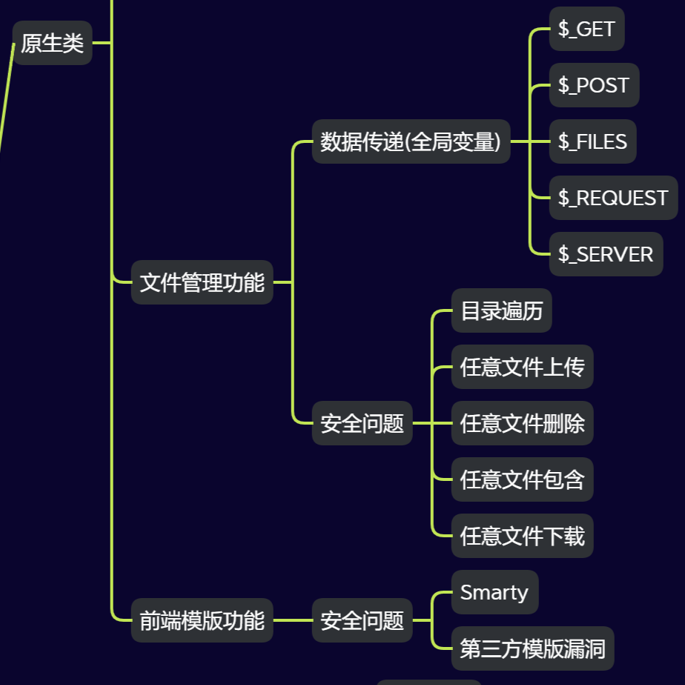
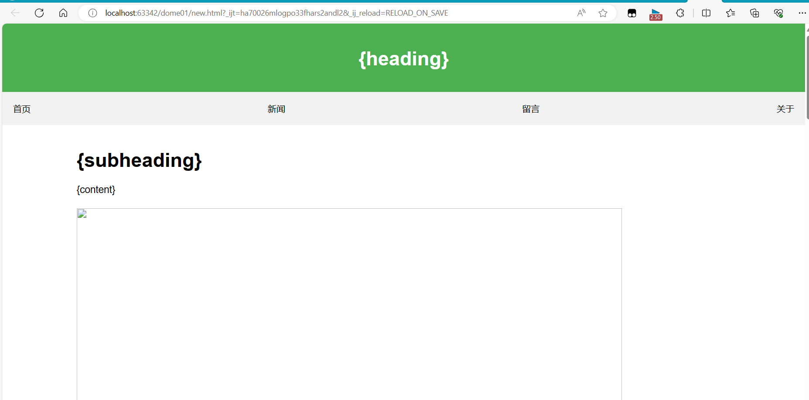
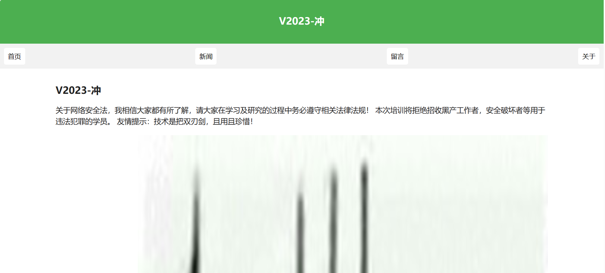
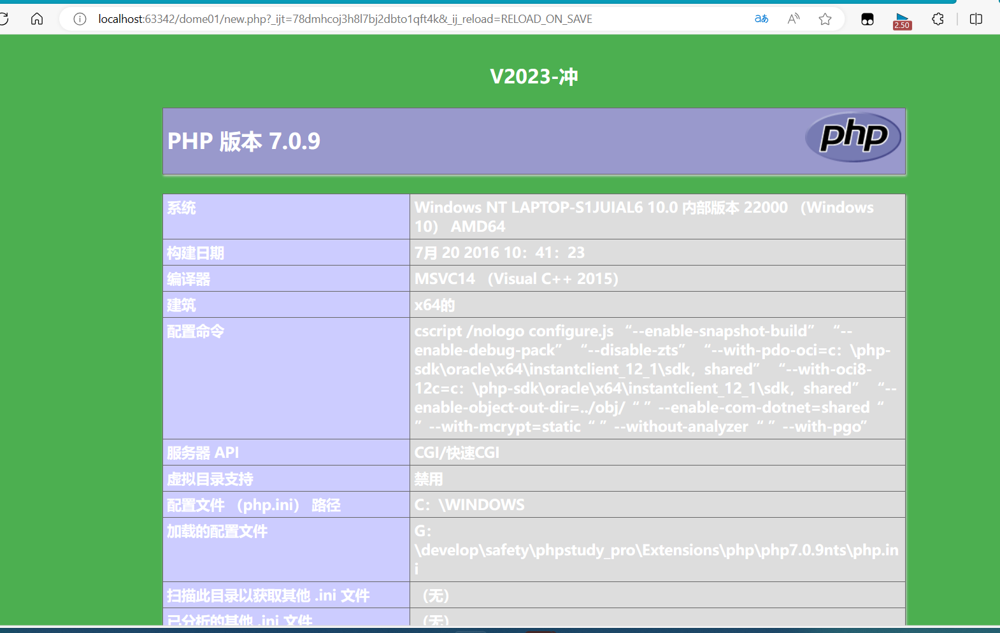
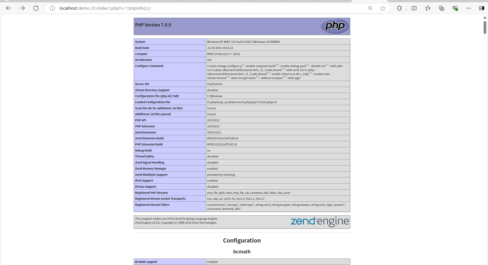

# 第26天：安全开发-PHP应用&模版引用&Smarty渲染&MVC模型&数据联动&RCE安全深度解析

## 目录  
- [一、核心功能架构与实现逻辑](#一核心功能架构与实现逻辑)  
- [二、模板渲染技术全解析](#二模板渲染技术全解析)  
- [三、高危漏洞深度剖析](#三高危漏洞深度剖析)  
- [四、漏洞利用实战案例](#四漏洞利用实战案例)  
- [五、总结与安全开发启示](#五总结与安全开发启示)  

---

<a id="一核心功能架构与实现逻辑"></a>



## 一、核心功能架构与实现逻辑  
本次课程聚焦PHP动态内容展示系统的安全开发，核心功能围绕**数据存储-模板渲染-内容展示**的全流程展开，具体包含三大模块：

### 1. 新闻数据管理系统
通过数据库实现新闻内容的存储与读取，核心架构如下：
- **数据库设计**：创建`new`表存储新闻数据，字段包括`id`（int）、`title`（varchar）、`author`（varchar）、`content`（text）、`image`（varchar），其中`image`字段存储图片路径用于前端展示。
- **数据读取逻辑**：通过PHP连接数据库，使用`mysqli_query`执行SQL查询，`mysqli_fetch_row`遍历结果集并提取数据，最终通过HTML输出新闻标题、作者、内容及图片。

核心代码示例：
```php
<?php
include 'config.php';
$id = $_GET['id'] ?? '1';
$sql = "select * from new where id=$id"; // 直接拼接用户输入，存在SQL注入风险
$data = mysqli_query($con, $sql);
while ($row = mysqli_fetch_row($data)) {
    echo "标题: <title>" . $row[1] . "</title><br>";
    echo $row[2] . "<br>"; // 作者
    echo $row[3] . "<br>"; // 内容
    echo "</img><br>"; // 图片
}
mysqli_close($con);
?>
```

### 2. 数据联动机制
实现数据库数据与前端页面的动态绑定，流程为：
1. 从数据库读取`page_title`、`heading`、`content`等字段数据；
2. 将数据替换到HTML模板的占位符（如`{page_title}`、`{content}`）中；
3. 通过模板引擎渲染最终页面，完成"数据库数据→模板变量→前端展示"的联动。

### 3. 模板引擎集成
支持自写模板与第三方Smarty模板两种方案：
- **自写模板**：通过`file_get_contents`读取HTML模板，`str_replace`替换占位符，`eval`执行动态内容；
- **Smarty模板**：通过配置模板目录（`template_dir`）、编译目录（`compile_dir`）等属性，使用`assign`赋值变量，`display`渲染模板。

---

<a id="二模板渲染技术全解析"></a>
## 二、模板渲染技术全解析

### 1. 自写模板技术原理
自写模板通过纯PHP代码实现动态内容渲染，核心步骤包括：
1. **模板文件创建**：编写`new.html`作为前端模板，定义`{page_title}`、`{heading}`、`{content}`等占位符用于数据替换。

2. **数据提取与替换**：从数据库读取字段值，通过`str_replace`将数据写入模板占位符，形成完整的动态模板内容。

3. **模板执行**：使用`eval('?>' . $template)`执行处理后的模板内容，实现PHP代码解析与页面渲染。

   

   

代码示例：
```php
// 读取模板文件
$template = file_get_contents('new.html');
// 提取数据库数据
while ($row = mysqli_fetch_row($data)) {
    $page_title = $row[1];
    $heading = $row[2];
    $content = $row[4];
}
// 替换占位符
$template = str_replace('{page_title}', $page_title, $template);
$template = str_replace('{content}', $content, $template);
// 执行模板（高危操作）
eval('?>' . $template);
```

### 2. Smarty模板技术原理
Smarty作为成熟的PHP模板引擎，通过目录隔离与编译机制实现安全渲染，核心特性包括：
- **目录配置**：通过`template_dir`指定模板文件位置，`compile_dir`存储编译后的模板文件，实现模板与业务逻辑分离。
- **变量传递**：使用`$smarty->assign('title', '欢迎使用 Smarty')`将变量传递到模板，通过`{$title}`占位符在模板中调用。
- **默认安全机制**：对模板中的PHP代码块（`<?php ... ?>`）进行转义，避免直接执行恶意代码。

Smarty基础使用代码：
```php
<?php
require('smarty/libs/Smarty.class.php');
$smarty = new Smarty;
$smarty->template_dir = 'smarty/templates/';
$smarty->compile_dir = 'smarty/templates_c/';
$smarty->assign('title', '欢迎使用 Smarty');
$smarty->display('index.tpl'); // 渲染模板
?>
```

模板文件（`index.tpl`）：
```html
<!DOCTYPE html>
<html>
<head><title>{$title}</title></head>
<body>
<h1>{$title}</h1>
<p>这是一个使用 Smarty 的例子。</p>
</body>
</html>
```

---

<a id="三高危漏洞深度剖析"></a>
## 三、高危漏洞深度剖析

### 1. 自写模板远程代码执行（RCE）漏洞
**漏洞原理**：自写模板依赖`eval('?>' . $template)`执行动态内容，若`$template`包含用户可控的PHP代码，会被直接解析执行。

**触发条件**：
- **数据库注入**：向数据库`content`、`subheading`等字段插入`<?php phpinfo();?>`，模板渲染时`eval`会执行该代码。例如在数据库中插入记录：

  

  | subheading                                                   | content  |
  | ------------------------------------------------------------ | -------- |
  | V2023-冲<?php phpinfo();?>                                   | 测试内容 |
  | 访问页面时，`subheading`字段的恶意代码会被`eval`执行，输出PHP配置信息。 |          |

- **模板文件篡改**：直接修改`new.html`模板，添加`<?php system('whoami');?>`，模板渲染时触发系统命令执行。

**漏洞本质**：未过滤模板内容中的PHP代码块，且使用`eval`等危险函数执行动态内容，导致"用户输入→数据库存储→模板渲染→代码执行"的完整攻击链。

### 2. Smarty模板历史漏洞（CVE-2017-1000480）
**漏洞背景**：Smarty 3.1.32及以下版本存在PHP代码注入漏洞，源于自定义资源模板名未过滤，攻击者可构造特殊参数注入恶意代码。

**漏洞原理**：
- 当应用注册自定义资源（如`test`资源）并通过`$smarty->display('test:' . $_GET['eval'])`接收用户输入时，攻击者可通过`eval`参数注入代码注释符（`*/`）闭合原有代码块。
- 编译后的模板文件会包含恶意代码，通过`include`函数执行，最终导致远程代码执行。

**漏洞利用代码**：
```php
<?php
define('SMARTY_ROOT_DIR', str_replace('\\', '/', __DIR__));
include_once(SMARTY_ROOT_DIR . '/smarty3/libs/Smarty.class.php');

class testSmarty extends Smarty_Resource_Custom {
    protected function fetch($name, &$source, &$mtime) {
        $source = "CVE-2017-1000480 smarty PHP code injection";
        $mtime = time();
    }
}

$smarty = new Smarty();
$smarty->registerResource('test', new testSmarty);
$smarty->display('test:' . $_GET['eval']); // 危险：用户输入直接拼接
?>
```

通过访问`http://localhost/index1.php?eval=*/phpinfo();//`即可触发漏洞，执行`phpinfo()`函数。



### 3. 数据联动中的次生漏洞
**XSS跨站脚本漏洞**：数据库数据或模板变量未经过滤直接输出到HTML页面，若内容包含`<script>`标签，会触发XSS攻击。例如：
- 数据库`content`字段插入`<script>alert(document.cookie)</script>`，模板渲染时会执行该脚本窃取Cookie。
- 图片路径`$row[4]`被篡改为`javascript:alert(1)`，导致``触发JS执行。

---

<a id="四漏洞利用实战案例"></a>
## 四、漏洞利用实战案例

### 1. 自写模板RCE漏洞利用步骤
1. **注入恶意数据**：通过数据库管理工具或前端表单，向`new`表的`subheading`字段插入`<?php system($_GET['cmd']);?>`。
2. **触发模板渲染**：访问新闻页面`http://localhost/new.php?id=1`，模板通过`eval`执行恶意代码。
3. **执行系统命令**：构造URL`http://localhost/new.php?id=1&cmd=ipconfig`，服务器会返回网络配置信息，实现远程命令执行。

### 2. Smarty CVE-2017-1000480漏洞利用步骤
1. **搭建漏洞环境**：部署Smarty 3.1.32版本，配置自定义`test`资源并接收`eval`参数。
2. **构造恶意请求**：访问`http://localhost/index1.php?eval=*/system('dir');//`，通过`*/`闭合模板原有代码块，注入`system('dir')`命令。
3. **查看执行结果**：页面会输出服务器目录列表，证明命令执行成功。

### 3. 漏洞影响范围
- **自写模板漏洞**：影响所有使用`eval`执行动态模板内容的PHP应用，可导致服务器完全受控。
- **Smarty历史漏洞**：影响Smarty ≤3.1.32版本的应用，根据CNVD-2018-02508漏洞公告，该漏洞危害级别为"高"，可实现远程代码执行。

---

<a id="五总结与安全开发启示"></a>
## 五、总结与安全开发启示

### 核心结论
1. **自写模板风险**：使用`eval`执行用户可控内容是RCE漏洞的高危来源，必须杜绝此类写法。
2. **第三方组件风险**：即使使用成熟模板引擎（如Smarty），也需关注版本安全，及时修复历史漏洞（如升级Smarty至≥3.1.33版本）。
3. **数据全流程防护**：从用户输入、数据库存储到模板渲染，每个环节都需进行过滤与验证，避免恶意代码注入。

### 安全开发建议
| 风险类型           | 加固措施     | 实现代码示例                                                 |
| ------------------ | ------------ | ------------------------------------------------------------ |
| **自写模板RCE**    | 禁止使用eval | 使用`htmlspecialchars`过滤输出：<br>`echo htmlspecialchars($content, ENT_QUOTES);` |
| **SQL注入**        | 参数化查询   | `$stmt = $con->prepare("SELECT * FROM new WHERE id=?");`<br>`$stmt->bind_param("i", $id);` |
| **XSS攻击**        | 输出编码     | `echo htmlspecialchars($row['content'], ENT_QUOTES, 'UTF-8');` |
| **模板文件篡改**   | 文件权限控制 | `chmod('templates/', 0755);`<br>`chmod('templates/*.tpl', 0444);` |
| **Smarty安全配置** | 启用安全模式 | `$smarty->enableSecurity();`<br>`$smarty->php_handling = Smarty::PHP_REMOVE;` |

### 国内安全资源推荐
1. [国家信息安全漏洞共享平台（CNVD）](https://www.cnvd.org.cn/)：查询Smarty等组件漏洞详情（如CNVD-2018-02508）
2. [PHP官方中文文档](https://www.php.net/manual/zh/)：了解`eval`、`mysqli_query`等函数的安全风险
3. [OWASP中国](https://owasp.org/www-project-top-ten/)：参考代码注入攻击防御指南
4. [博客园 - Smarty漏洞分析](https://www.cnblogs.com/magic-zero/p/10184262.html)：深入解析CVE-2017-1000480漏洞原理

> **安全警示**：模板渲染是PHP应用的高危风险点，开发时应采用"禁止动态执行代码+第三方引擎安全版本+全流程数据过滤"的三重防护策略，避免因一行危险代码导致服务器被入侵。