***\*网安-\*******\*2025 年计算机网络原理复习提纲\****

# 1. **概述及通信基础**

## 1.1. **TCP/IP 和 OSI 参考模型**

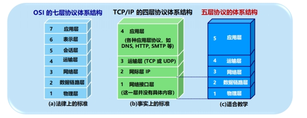 

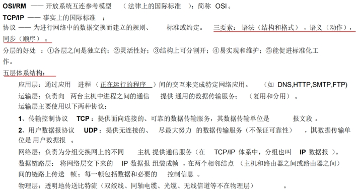 

  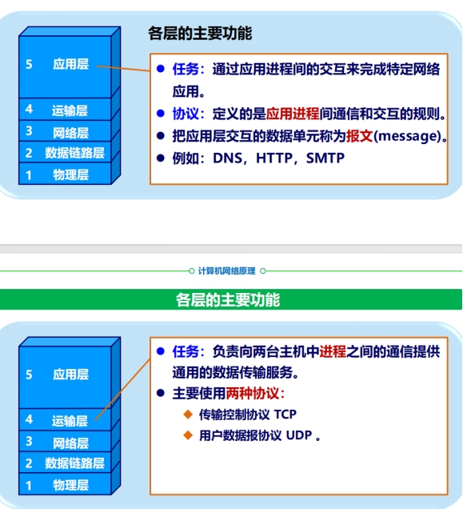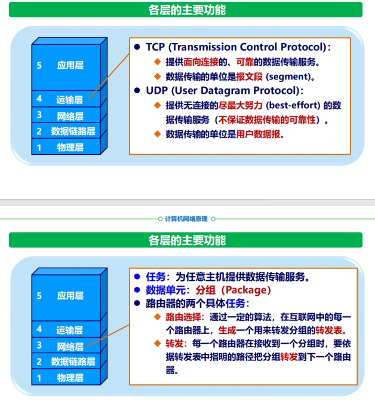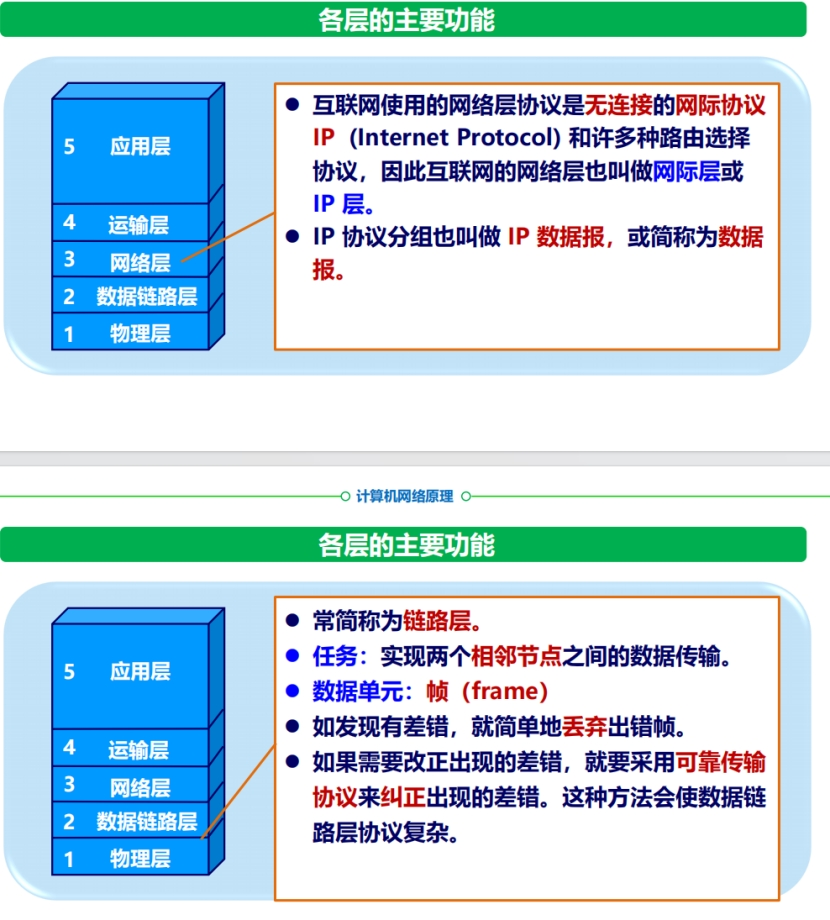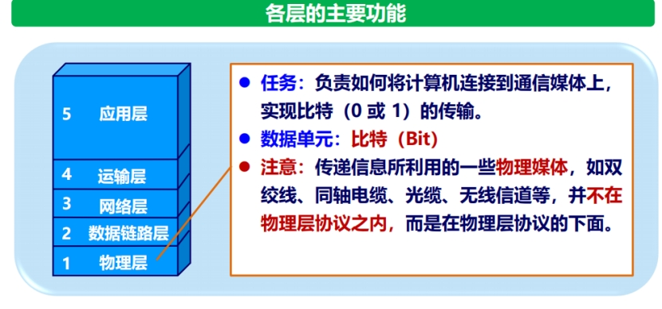

## 1.2. **交换技术** 

***\*电路交换\**** 的三个阶段：建立连接——通话——释放连接

在通话时，两用户之间占用端到端的资源，而由于绝大部分时间线路都是空闲的，所以线路的传输速率往往很低。

 

***\*分组交换\**** 的组成：报文、首部、分组。采用存储转发技术，即收到分组——存储分组——查询路由（路由选择协议）——转发分组。优点：高效、灵活、迅速、可靠。缺点：时延、开销。关键构件：路由器。

 

***\*报文交换\**** 整个报文传送到相邻结点，全部存储下来之后查询转发表，转发到下一个结点

 

# 2. **物理层**

## 2.1. **信道划分方式**

### 2.1.1. **通信方式** 

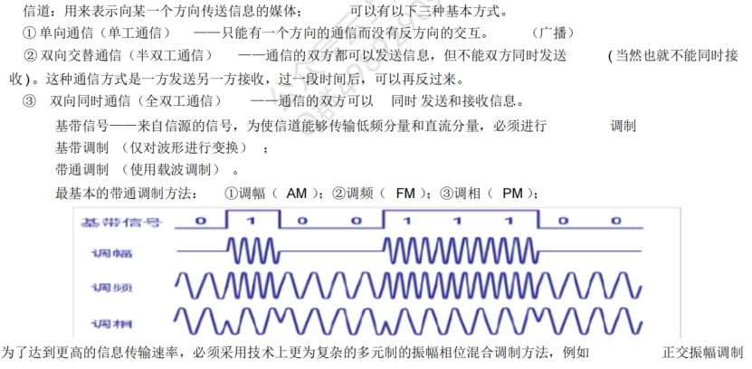 

### 2.1.2. **信道复用技术**

频分复用FDM (Frequency Division Multiplexing)：所有用户在同样的时间占用不同的频率带宽资源。

时分复用TDM(Time Division Multiplexing)则是将时间划分为一段段等长的时分复用帧（TDM 帧）。

统计时分复用 STDM(Statistic TDM)是改进的时分复用，明显地提高信道的利用率。

波分复用 WDM (Wavelength Division Multiplexing)：光的频分复用

码分复用 CDM (Code Division Multiplexing)常用的名词是码分多址 CDMA：有很强的抗干扰能力。

码分多址的计算靠一个例题就基本会了：

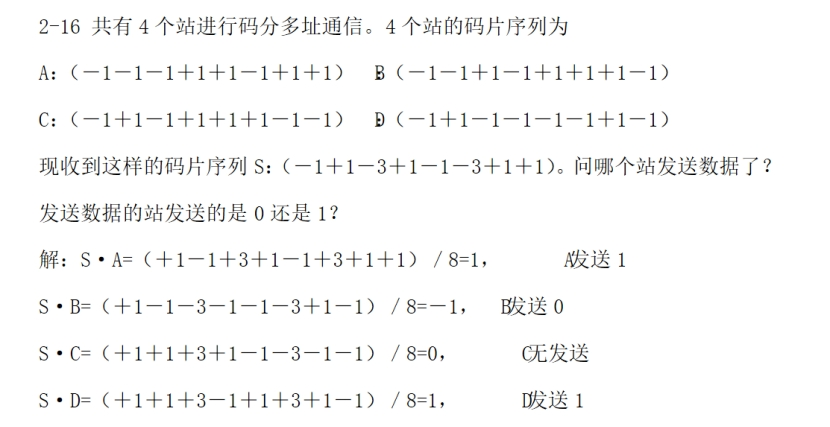

 

## 2.2. **奈氏准则**   

码元，码元极限传输速率，信息极限传输速率

 

 

## 2.3. **香农公式**

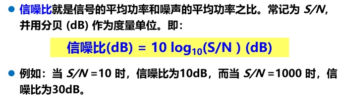 

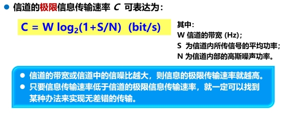 

 

## 2.4. **传输媒介**  

 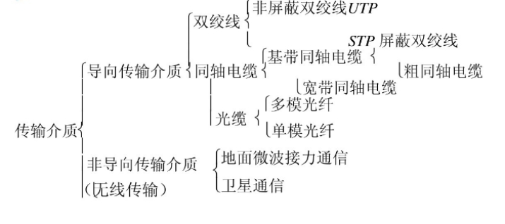

### 2.4.1. **导向传输媒体**

***\*双绞线\****

双绞线已成为局域网中的主流传输媒体

屏蔽双绞线 STP (Shielded Twisted Pair)

无屏蔽双绞线 UTP (Unshielded Twisted Pair)

 

***\*同轴电缆\****

细缆（适合短距离，安装容易，造价低）

粗缆（适合较大局域网，布线距离长，可靠性好）

 

***\*光纤\****

光纤有很好的抗电磁干扰特性和很宽的频带，主要用在环形网中

 

多模光纤（用发光二极管，便宜，定向性较差）

单模光纤（注入激光二极管，定向性好）

 

### 2.4.2. **非导向传输媒体**

微波、红外线、激光、卫星通信

# 3. **链路层**

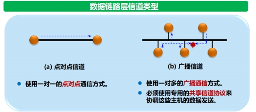 

## 3.1. **分帧与组帧**

### 3.1.1. **三个基本问题：**

***\*封装成帧\****

就是在一段数据的前后分别添加首部（帧开始符SOH 01）和尾部（帧结束符EOT 04），然后就构成了一个帧。（数据部分<=长度限制MTU）首部和尾部的一个重要作用就是进行***\*帧定界。\****

帧定界是分组交换的必然要求

***\*透明传输\****

为了达到透明传输（即传输的数据部分不会因为包含SOH和EOT而出错），在数据中出现控制字符“SOH”或“EOT”的前面插入一个转义字符“ESC”(十六进制1B)

透明传输避免消息符号与帧定界符号相混淆

***\*差错检测\****

现实通信链路中比特在传输中会产生差错，传输错误的比特占比称为误码率BER，为了保证可靠性，通常通过***\*循环冗余检验CRC\****来做差错检测。

差错检测防止无效数据帧浪费后续路由上的传输和处理资源

## 3.2. **PPP协议** **（****点对点****）**

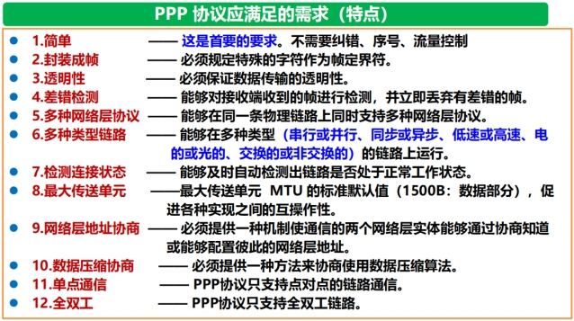 

### 3.2.1. **PPP协议的组成部分**

1.一个将 IP 数据报封装到串行链路的方法

2.链路控制协议 LCP (Link Control Protocol)

3.网络控制协议 NCP (Network Control Protocol)

### 3.2.2. **PPP协议的帧格式**

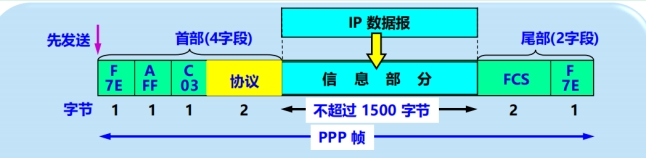 

***\*首部：\****

首部中的标志字段F(Flag)，规定为0x7E(符号0x表示它后面的字符是用十六进制表示的。十六进制的7E的二进制表示是01111110)，标志字段表示一个帧的开始。

首部中的地址字段A规定为0xFF(即11111111)。

首部中的控制字段C规定为0x03(即00000011)。

首部中的2字节的协议字段：

(1)当协议字段为0x0021时，PPP帧的信息字段就是IP数据报。

(2)当协议字段为0xC021时，PPP帧的信息字段就是PPP链路控制协议LCP的数据。

(3)当协议字段为0x8021时，PPP帧的信息字段就是网络层的控制数据。

 

***\*尾部：\****

尾部中的第一个字段(2个字节)是使用CRC的帧检验序列FCS。

尾部中的标志字段F(Flag)，规定为0x7E(符号0x表示它后面的字符是用十六进制表示的。十六进制的7E的二进制表示是01111110)，标志字段表示一个帧的结束。

 

### 3.2.3. **透明传输的实现方法**

当信息字段中出现和标志字段一样的比特(0x7E)组合时，就必须采取一些措施使这种形式上和标志字段一样的比特组合不出现在信息字段中。

 

***\*字节填充\****——PPP使用异步传输

当 PPP 用在异步传输时，就使用一种特殊的字符填充法：将每一个 0x7E字节变为(0x7D, 0x5E)，0x7D转变成为(0x7D, 0x5D)。ASCII 码的控制字符（即数值小于 0x20 的字符），则在前面要加入0x7D，同时将该字符的编码加以改变。

 

***\*零比特填充\****——PPP使用同步传输

只要发现有5个连续的1，则立即填入一个0

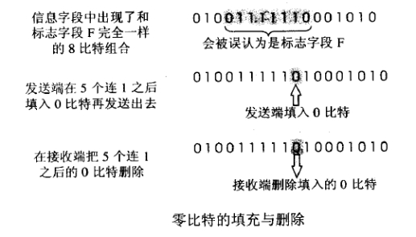

## 3.3. **CSMA/CD协议**  

 

以太网采用CSMA/CD协议的方式来协调总线上各计算机的工作。在使用CSMA/CD协议的时候，一个站不可能同时进行发送和接收，因此使用CSMA/CD协议的以太网不可能进行全双工通信而只能进行双向交替通信（半双工）。

 

CSMA/CD是***\*载波监听多点接入/碰撞检测\****（Carrier Sense Multiple Access with Collision Detection）的缩写，下面是CSMA/CD协议的要点：

 

***\*“\*******\*多点接入\*******\*”\****就是计算机以多点接入（动态媒体接入控制）的方式连接在一根总线上。

 

***\*“\*******\*载波监听\*******\*”\****就是***\*“\*******\*发送前先监听”\****，即每一个站在发送数据前先要检测一下总线是否有其他站在发送数据，如有则暂时不要发送数据，要等到信道为空闲。

 

***\*“碰撞检测\*******\*”\****就是***\*“边发送边监听”\****，即适配器边发送数据边检测信道上的信号电压的变化情况。当一个站检测到的信号电压摆动值超过一定的门限值时，就认为总线上至少有两个站同时在发送数据，表明产生了碰撞，就要立即停止发送，免得继续浪费网络资源，然后等待一段随机时间后再次发送。

 

把总线上的单程端到端传播时延记为τ，A 发送数据后，最迟要经过***\*2τ\****才能知道自己发送的数据和其他站发送的数据有没有发生碰撞。

 

争用期（2τ）：51.2μs（10Mbps以太网）

最小帧长：64字节（防止发完前未检测到碰撞）
最小帧长=带宽×往返时延=107 bps×51.2×10−6 s=512 bit=64 字节最小帧长=带宽×往返时延=107bps×51.2×10−6s=512bit=64字节

 

## 3.4. **CSMA/CA协议**  

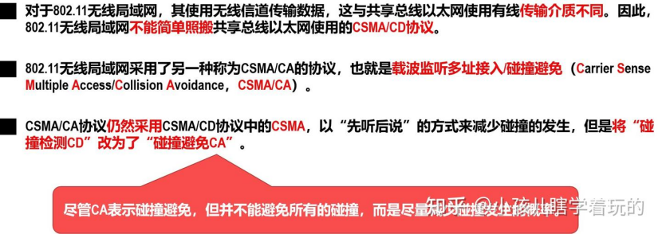

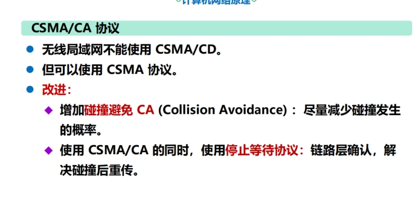 

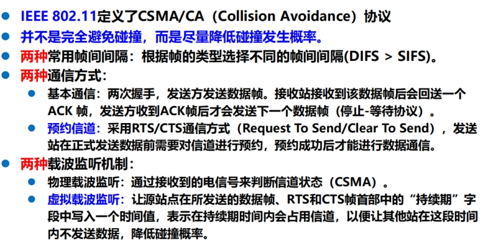 

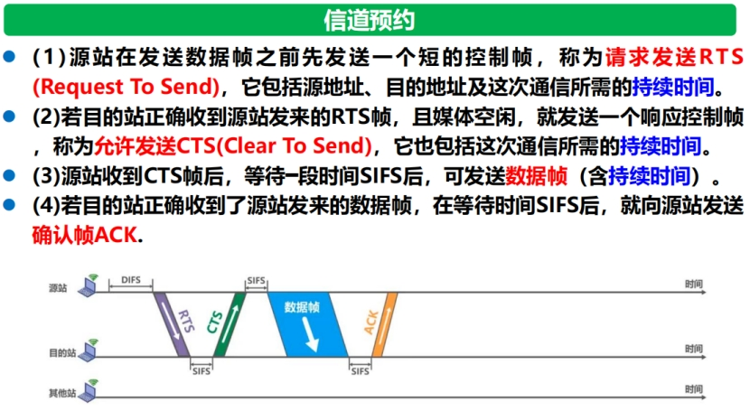 

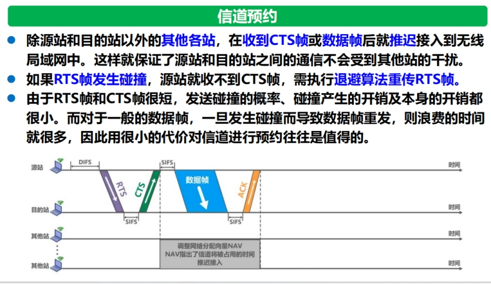 

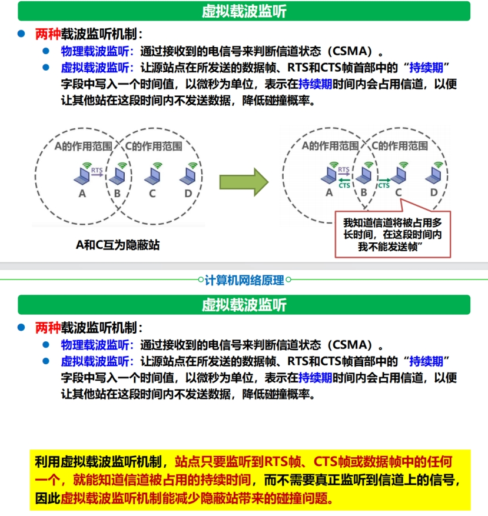 

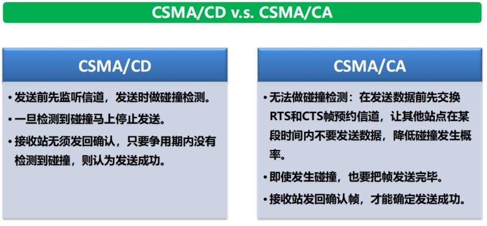 

## 3.5. **MAC地址**  

“MAC地址”又叫做硬件地址或物理地址，实际上就是适配器地址或适配器标识符EUI-48。高位24位：厂家，低位24位由厂家自行指派

## 3.6. **MAC帧格式**  

常用的以太网MAC帧格式有两种标准 ： DIX Ethernet V2 标准IEEE 的 802.3 标准。V2使用较多，如图：

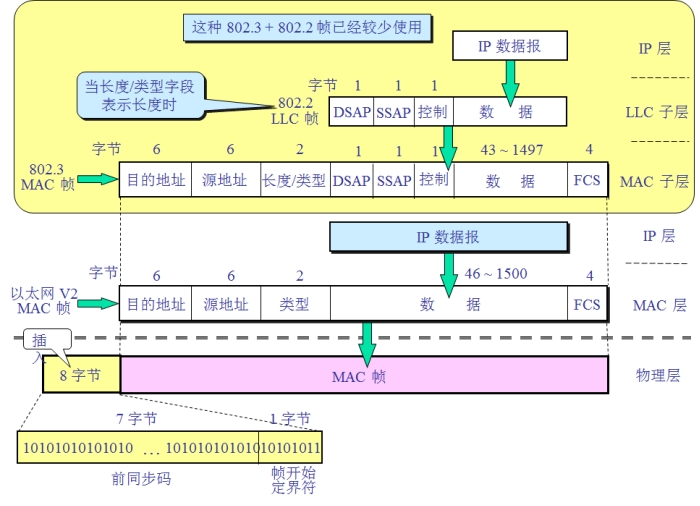

以太网V2的MAC帧较为简单，有五个字段组成。
前两个字段分别为6字长的目标地址和源地址字段。第三个字段是2字节的类型字段，用来标志上一层使用的是什么协议，以便把收到的MAC帧的数据上交给上一层的这个协议。后面数据字段46~1500字节，FCS字段4个字节。

## 3.7. **CRC校验**  

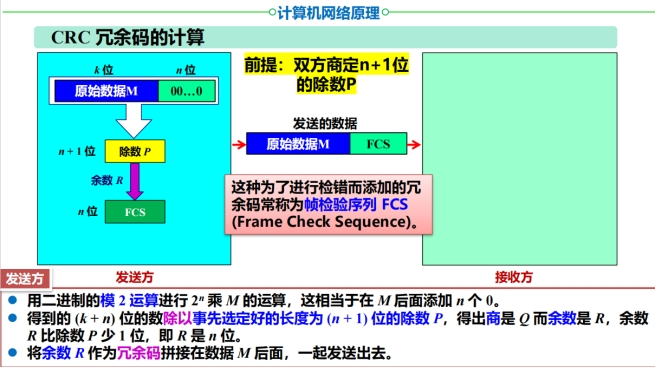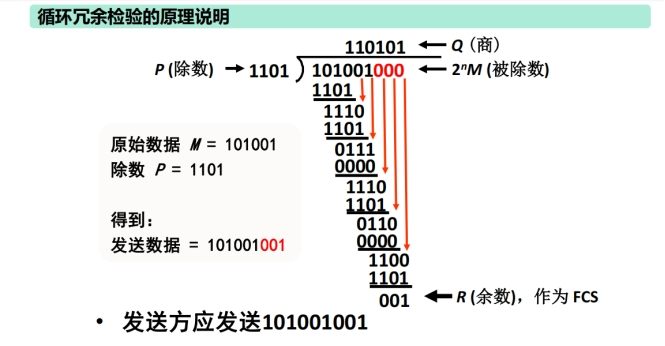 

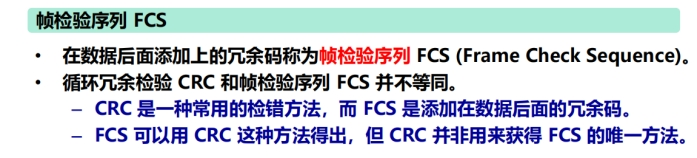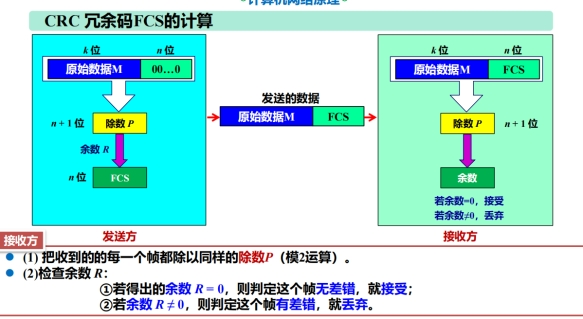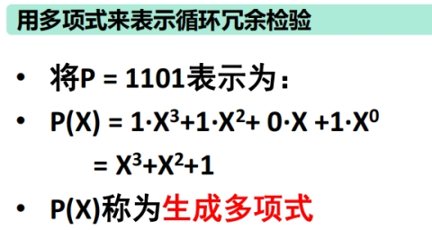 

# 4. **网络层**

## 4.1. **I****P协议**

### 4.1.1. **原理**  

网际协议IP是TCP/IP体系中两个最重要的协议之一，也是最重要的因特网标准协议之一。

## 4.2. **IP****地址**

### 4.2.1. **IP地址表示方法**

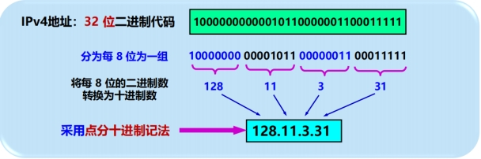 

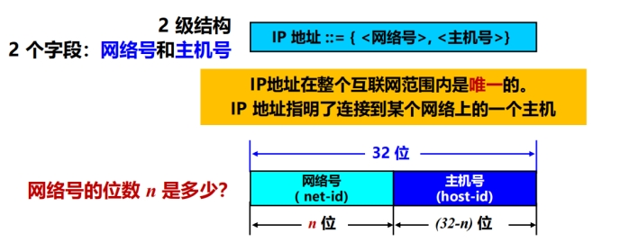 

### 4.2.2. **分类的IP地址**

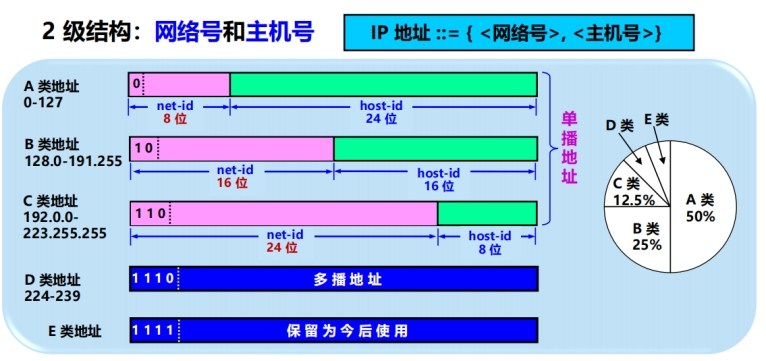 

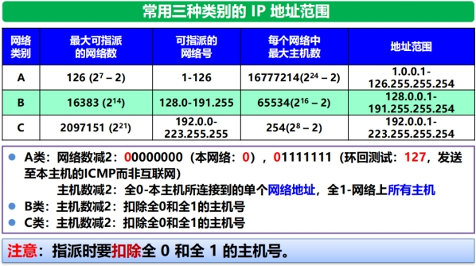 

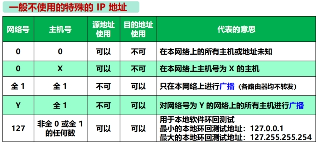 

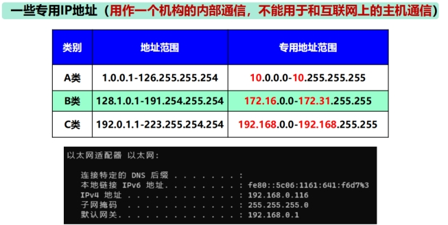 

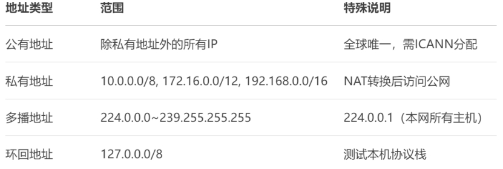 

***\*A类\****

由1字节的网络地址和3字节主机地址组成

网络地址的最高位必须是“0“，可指派的网络数为128-2，减2的原因是0.0.0.0对应“本网络”，另外一个是127.0.0.1是本地软件的回环地址，用于测试自己电脑IP地址是否可用。

地址范围1.0.0.0到126.255.255.255

最大主机数为2563-2=16777214台，减2的原因是全0的主机号字段代表该IP地址是"本主机“，全1表示”所有的“，表示该网络上的所有主机

 

***\*B类\****

由2字节的网络地址和2字节主机地址组成

网络地址的最高位必须是“10”，可指派的网络数为 214 -1，因为最高位为10，所以不存在全0全1的情况，但是B类网络地址128.0.0.0是不指派的，可指派最小网络地址是128.1.0.0

地址范围128.0.0.0-191.255.255.255

最大主机数为2562-2=65534台，减2同样是全0全1情况。

 

***\*C类\****

由3字节的网络地址和1字节主机地址组成

网络地址的最高位必须是“110”，可指派的网络数为221-1，192.0.0.0不指派，最小可指派网络地址是192.0.1.0

地址范围192.0.0.0-223.255.255.255

最大主机数为256-2=254台，减2同样是全0全1情况。

 

***\*D类\****是多播地址，“lll0”开始

 

***\*E类\****地址保留为今后使用，“llll0”开头

### 4.2.3. **无分类编址****CIDR**  

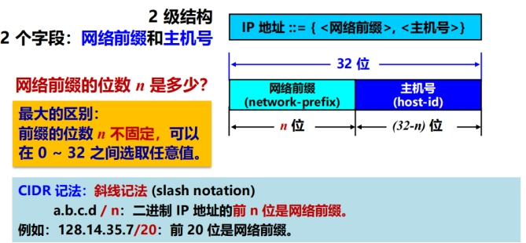 

***\*1.CIDR（无分类域间路由选择）的主要特点：\****

CIDR消除了传统的A、B、C类地址以及划分子网的概念，用网络前缀代替网络号和子网号，后面的部分指明主机。因此，CIDR使IP地址从三级编址(使用子网掩码)，又回到了两级编址，但这已是无分类的两级编址。

CIDR把网络前缀相同的连续的IP地址组成一个“CIDR地址块”只要知道CIDR地址块中的任何一个地址，就可以知道这地址块的起始地址(即最小地址)和最大地址，以及地址块中的地址数。

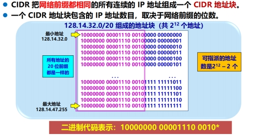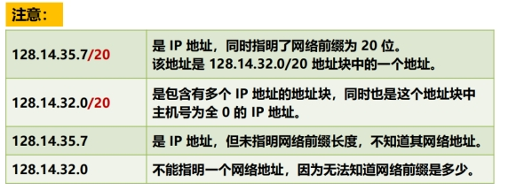 

 

***\*2.地址掩码：\****是一连串的1和0组成，而1的个数救赎网络前缀长度。在***\*斜线记法\****中。斜线后面的数字就是地址掩码中1的个数。

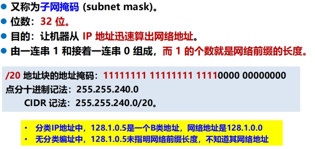 

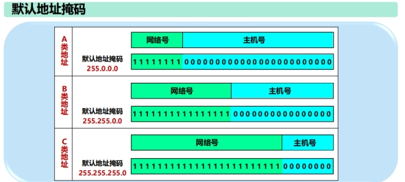 

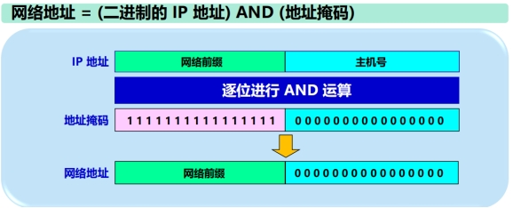 

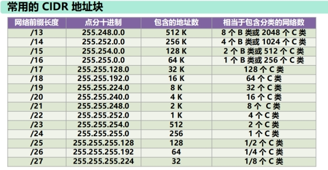 

***\*3.构成超网：\****由于一个CIDR地址块中含有很多地址，所以在路由表中就利用CIDR地址块来查找目标网络，这种地址的聚合常称为路由聚合，也称构成超网。

 

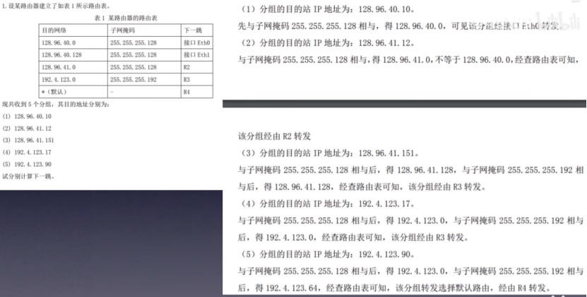 

### 4.2.4. **配套协议作用（ARP/ICMP等）**  

***\*1.地址解析协议ARP：\****是解决同一个局域网上的主机或路由器的IP地址和硬件地址的映射问题。

***\*2.逆地址解析协议RARP：\****是解决同一个局域网上的主机或路由器的硬件地址和IP地址的映射问题。

***\*3.网际控制报文协议ICMP：\****提供差错报告和询问报文，以提高IP数据交付成功的机会

***\*4.网际组管理协议IGMP：：\****用于探寻、转发本局域网内的组成员关系。

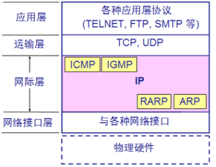

### 4.2.5. **IP数据报格式**  

一个IP数据报由首部（20 字节+可选字段）和数据两部分组成

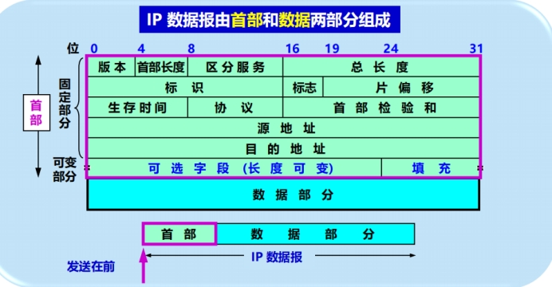 

 

***\*固定部分\****

***\*(1)版本\****　占4位，指IP协议的版本。通信双方使用的IP协议版本必须一致。广泛使用的IP协议版本号为4（即[IPv4](https://baike.baidu.com/item/IPv4/0?fromModule=lemma_inlink)）。关于[IPv6](https://baike.baidu.com/item/IPv6/0?fromModule=lemma_inlink)，还处于草案阶段。

***\*(2)首部长度\****　占4位，可表示的最大十进制数值是15。请注意，这个字段所表示数的单位是32位字长（1个32位字长是4字节），因此，当IP的首部长度为1111时（即十进制的15），首部长度就达到60字节。当IP分组的首部长度不是4字节的整数倍时，必须利用最后的填充字段加以填充。因此数据部分永远在4字节的整数倍开始，这样在实现IP协议时较为方便。首部长度限制为60字节的缺点是有时可能不够用。但这样做是希望用户尽量减少开销。最常用的首部长度就是20字节（即首部长度为0101），这时不使用任何选项。

***\*(3)区分服务\****　占8位，用来获得更好的服务。这个字段在旧标准中叫做***\*服务类型\****，但实际上一直没有被使用过。1998年IETF把这个字段改名为***\*区分服务DS(Differentiated Services)\****。只有在使用区分服务时，这个字段才起作用。

***\*(4)总长度\****　总长度指首部和数据之和的长度，单位为字节。总长度字段为16位，因此数据报的最大长度为2^16-1=65535字节。

在IP层下面的每一种[数据链路层](https://baike.baidu.com/item/数据链路层/4329290?fromModule=lemma_inlink)都有自己的帧格式，其中包括帧格式中的数***\*据字段的最大长度\****，这称为***\*最大传送单元MTU(Maximum Transfer Unit)\****。当一个数据报封装成链路层的帧时，此数据报的总长度（即首部加上数据部分）一定不能超过下面的数据链路层的MTU值。

***\*(5)标识(identification)\****　占16位。IP软件在存储器中维持一个计数器，每产生一个数据报，计数器就加1，并将此值赋给标识字段。但这个“标识”并不是序号，因为IP是无连接服务，数据报不存在按序接收的问题。当数据报由于长度超过网络的MTU而必须分片时，这个标识字段的值就被复制到所有的数据报的标识字段中。相同的标识字段的值使分片后的各数据报片最后能正确地重装成为原来的数据报。

***\*(6)标志(flag)\****　占3位，但只有2位有意义。

●　标志字段中的最低位记为***\*MF(More Fragment)\****。MF=1即表示后面“还有分片”的数据报。MF=0表示这已是若干数据报片中的最后一个。

●　标志字段中间的一位记为***\*DF(Don’t Fragment)\****，意思是“不能分片”。只有当DF=0时才允许分片。

***\*(7)片偏移\****　占13位。片偏移指出：较长的分组在分片后，某片在原分组中的相对位置。也就是说，相对用户数据字段的起点，该片从何处开始。片偏移以8个字节为偏移单位。这就是说，除了最后一个分片，每个分片的长度一定是8字节（64位）的整数倍。

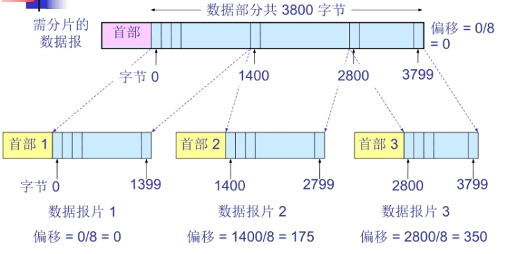

***\*(8)生存时间\****　占8位，生存时间字段常用的的英文缩写是TTL(Time To Live)，表明是数据报在网络中的寿命。由发出数据报的源点设置这个字段。其目的是防止无法交付的数据报无限制地在[因特网](https://baike.baidu.com/item/因特网/0?fromModule=lemma_inlink)中兜圈子，因而白白消耗网络资源。最初的设计是以秒作为TTL的单位。每经过一个[路由器](https://baike.baidu.com/item/路由器/0?fromModule=lemma_inlink)时，就把TTL减去数据报在路由器消耗掉的一段时间。若数据报在路由器消耗的时间小于1秒，就把TTL值减1。当TTL值为0时，就丢弃这个数据报。后来把TTL字段的功能改为***\*“跳数限制”（但名称不变）\****。路由器在转发数据报之前就把TTL值减1.若TTL值减少到零，就丢弃这个数据报，不再转发。因此，TTL的单位不再是秒，而是***\*跳数\****。TTL的意义是指明数据报在网络中至多可经过多少个路由器。显然，数据报在网络上经过的路由器的最大数值是255.若把TTL的初始值设为1，就表示这个数据报只能在本局域网中传送。

***\*(9)协议\****　占8位，协议字段指出此数据报携带的数据是使用何种协议，以便使目的主机的IP层知道应将数据部分上交给哪个处理过程。

***\*(10)首部检验和\****　占16位。这个字段***\*只检验数据报的首部，但不包括数据部分\****。这是因为数据报每经过一个路由器，路由器都要重新计算一下首部检验和（一些字段，如生存时间、标志、片偏移等都可能发生变化）。不检验数据部分可减少计算的工作量。

***\*(11)源地址\****　占32位。发送IP数据报的主机的IP地址。

***\*(12)目的地址\****　占32位。接收IP数据报的主机的IP地址。

 

***\*可变部分\****

IP首部的可变部分就是一个可选字段。选项字段用来支持排错、测量以及安全等措施，内容很丰富。此字段的长度可变，从1个字节到40个字节不等，取决于所选择的项目。某些选项项目只需要1个字节，它只包括1个字节的选项代码。但还有些选项需要多个字节，这些选项一个个拼接起来，中间不需要有分隔符，最后用全0的填充字段补齐成为4字节的整数倍。

 

## 4.3. **路由****选择****协议** 

### 4.3.1. **两大****分类（内部网关/外部网关）**  

***\*内部网关协议 IGP\*******\*：\****一个自治系统内部使用的路由选择协议。有多种协议，如 RIP 和OSPF 协议。

***\*外部网关协议EGP：\****一个自治系统的边界，将路由选择信息传递到另一个自治系统中。目前使用的就是BGP

 

### 4.3.2. **代表性协议（RIP/OSPF/BGP）**  

***\*RIP协议的优缺点：\****

RIP 存在的一个问题是当网络出现故障时，要经过比较长的时间才能将此信息传送到所有的路由器。

RIP 协议最大的优点就是实现简单，开销较小。

RIP 限制了网络的规模，它能使用的最大距离为 ***\*15（16 表示不可达）\****。

路由器之间交换的路由信息是路由器中的完整路由表，因而随着网络规模的扩大，开销也就增加。

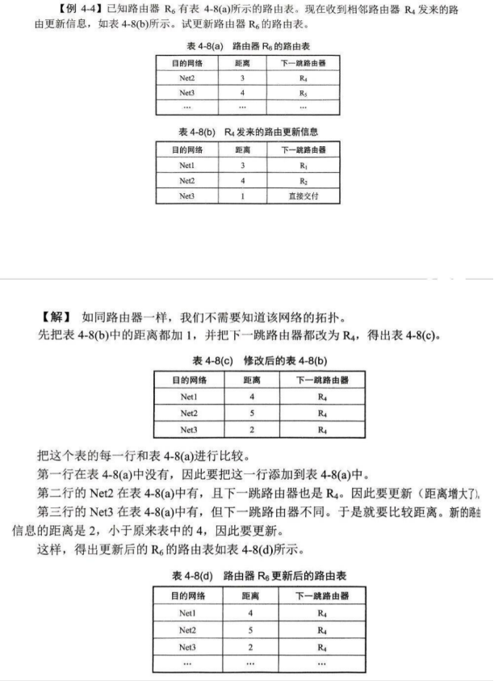

 

***\*RIP\*******\*（\*******\*内部网关\*******\*）\*******\*是一种分布式的基于距离向量的路由选择协议，其主要特点：\****

（1）仅和相邻路由器交换信息。

（3）按固定的时间间隔交换路由信息，例如，每隔30秒。

 

***\*OSPF\*******\*（\*******\*内部网关\*******\*）\*******\*最主要的特征就是使用分布式的链路状态协议，其主要特点：\****

（1）使用***\*洪泛法\****向本自治系统中所有路由器发送信息。

（2）发送的信息是与本路由器相邻的所有路由器的链路状态。

（3）只有当链路状态发生变化时，路由器才用洪泛法向所有路由器发送此信息。

 

***\*BGP\*******\*（\*******\*外部网关\*******\*）\*******\*是不同自治系统的路由器之间交换路由信息的协议，它采用路径向量路由选择协议，其主要特点：\****

（2）自治系统AS之间的路由选择必须考虑有关策略。

（3）BGP只能力求寻找一条能够到达目的网络且比较好的路由，而并非要寻找一条最佳路由。

# 5. **运输层**

## 5.1. **TCP vs UDP**  

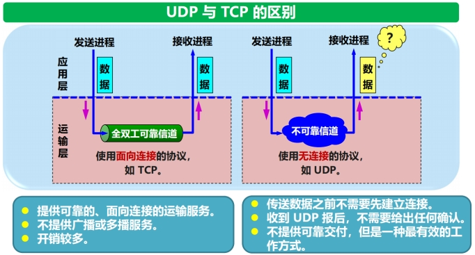 

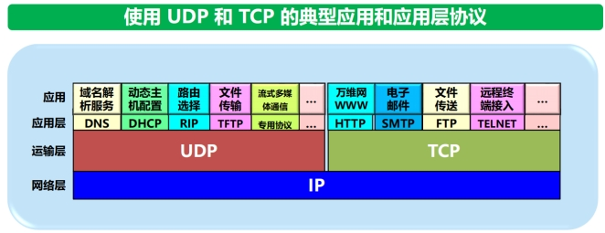 

### 5.1.1. **UDP的主要特点：**

UDP 是无连接的，即发送数据之前不需要建立连接。

UDP 使用尽最大努力交付，即不保证可靠交付，同时也不使用拥塞控制

UDP 是面向报文的

UDP 没有拥塞控制，很适合多媒体通信的要求。

UDP 支持一对一、一对多、多对一和多对多的交互通信

UDP 的首部开销小，只有 ***\*8 个字节\****

### 5.1.2. **TCP的主要特点：**

TCP 是面向连接的运输层协议

每一条 TCP 连接只能有两个端点(endpoint)，每一条 TCP 连接只能是点对点的（一对一）

TCP 提供可靠交付的服务

TCP 提供全双工通信

面向字节流

TCP首部20字节

 

## 5.2. **UDP首部**

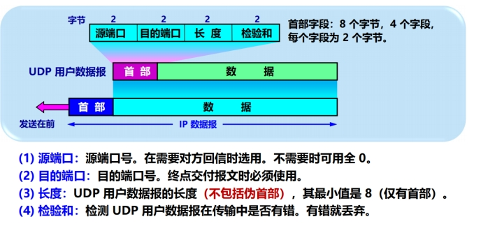 

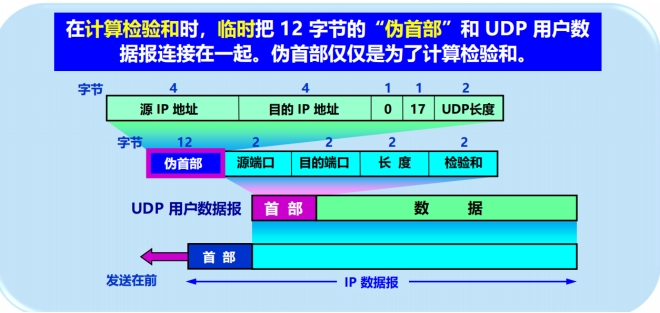 

## 5.3. **T****CP机制** 

### 5.3.1. **拥塞控制算法** 

***\*1.\*******\*慢启动（Slow Start）\****

慢启动算法在TCP连接开始时使用，其目的是逐渐增加发送窗口的大小，以探测网络的容量。

在慢启动阶段，每收到一个ACK（确认），拥塞窗口（cwnd）的大小就会加倍，呈指数增长，直到达到慢启动阈值（ssthresh）。

 

***\*2.\*******\*拥塞避免（Congestion Avoidance）\****

当拥塞窗口大小超过慢启动阈值后，TCP进入拥塞避免阶段。

在这个阶段，拥塞窗口的增长速度变慢，每经过一个往返时间（RTT），拥塞窗口增加1个MSS（最大报文段大小）。

***\*3.\*******\*快速重传（Fast Retransmit）\****

当发送方收到三个重复的ACK时，它会认为发生了拥塞，并立即重传丢失的数据包，而不必等待重传定时器超时。

快速重传可以减少数据包丢失后的恢复时间，提高网络的吞吐量。

 

***\*4.\*******\*快速恢复（Fast Recovery）\****

快速恢复与快速重传通常一起使用。在快速重传之后，TCP进入快速恢复阶段。

在这个阶段，ssthresh被设置为cwnd的一半，cwnd被设置为ssthresh加上3个MSS（为了处理可能的多个数据包丢失），然后进入拥塞避免阶段。

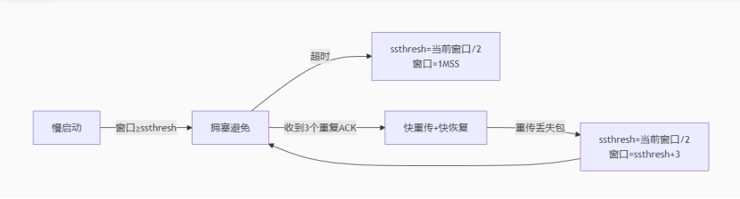 

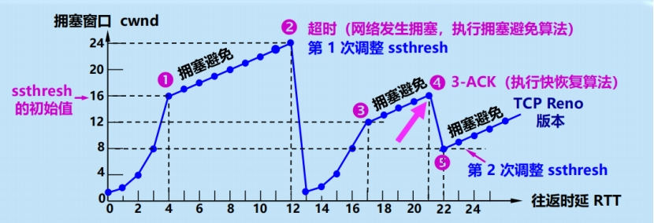 

 

ssthresh：慢启动阈值（初始一般为65535字节）

cwnd：拥塞窗口（单位：MSS，通常1460字节）

 

### 5.3.2. **TCP****首部字段**

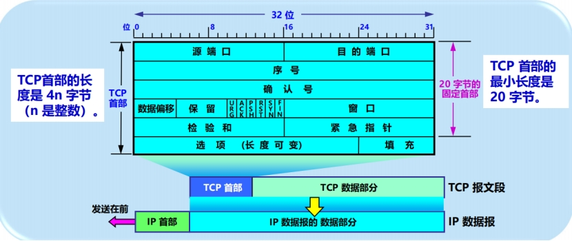 

***\*1.序号：\****占 4 字节。TCP 连接中传送的数据流中的每一个字节都有一个序号。 

序号字段的值则指的是本报文段所发送的数据的第一个字节的序号。

 

 

***\*2.\*******\*确认号\*******\*：\****是期望收到对方的下一个报文段的数据的第一个字节的序号。

 

 

***\*3.ACK控制位：\****只有当 ACK =1 时，确认号字段才有效。当 ACK =0 时，确认号无效。

 

***\*4.同步 SYN (SYNchronization) 控制位：\****

同步 SYN = 1 表示这是一个连接请求或连接接受报文。 

• 当 SYN = 1，ACK = 0 时，表明这是一个连接请求报文段。 

• 当 SYN = 1，ACK = 1 时，表明这是一个连接接受报文段。

 

***\*5.终止 FIN (FINish) 控制位：\****用来释放一个连接。 

FIN=1 表明此报文段的发送端的数据已发送完毕，并要求释放运输连接。

 

### 5.3.3. **连接建立（三次握手）**  

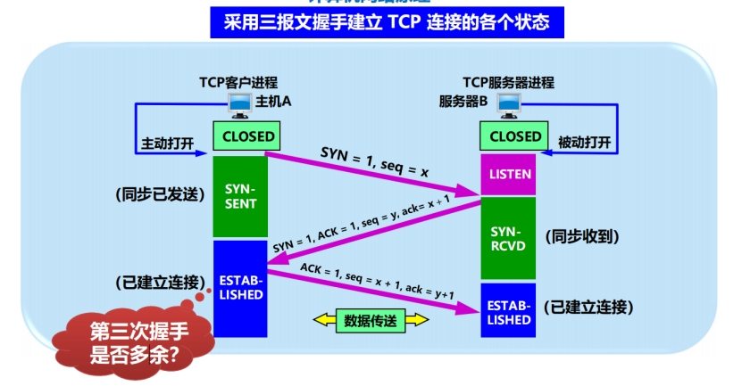 

 

 

***\*1.\*******\*第一次握手：客户端 → 服务器（SYN）\****

动作：客户端发送一个 SYN 报文（SYN=1，随机生成一个初始序列号 seq=x）。

 

目的：告诉服务器“我想和你建立连接，我的初始序列号是 x”。

 

状态变化：客户端进入 SYN_SENT（同步已发送）状态。服务器处于监听状态（LISTEN）。

 

***\*2. 第二次握手：服务器 → 客户端（SYN-ACK）\****

动作：服务器收到 SYN 后，回复一个 SYN-ACK 报文（SYN=1，ACK=1，确认号 ack=x+1，并生成自己的初始序列号 seq=y）。

 

目的：告诉客户端“我收到你的请求了，同意建立连接，我的初始序列号是 y”。

 

状态变化：服务器进入 SYN_RCVD（同步已接收）状态。

 

***\*3. 第三次握手：客户端 → 服务器（ACK）\****

动作：客户端收到 SYN-ACK 后，发送一个 ACK 报文（ACK=1，确认号 ack=y+1，序列号 seq=x+1）。

 

目的：告诉服务器“我确认你同意连接了，现在可以开始通信了”。

 

状态变化：客户端和服务器均进入 ESTABLISHED（已建立连接）状态。

 

### 5.3.4. 连接释放（四次挥手）  

类似，此处图解表示

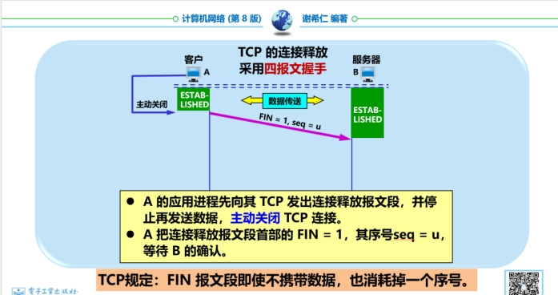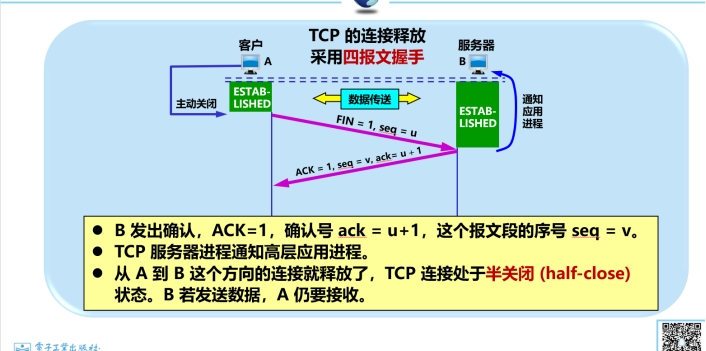 

 

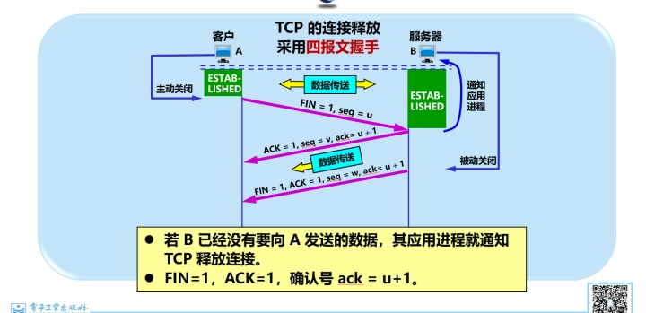 

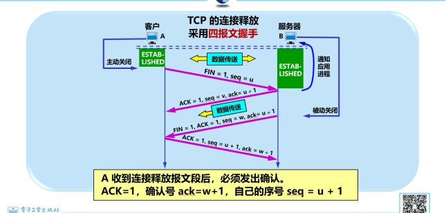 

 

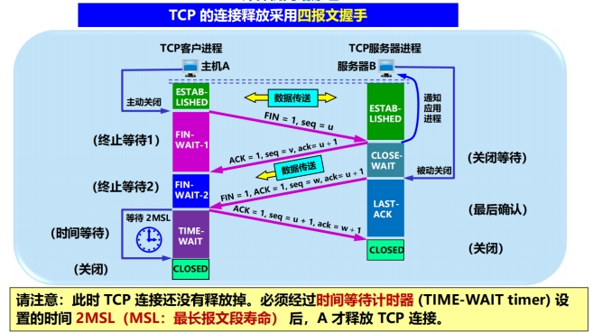 

## 5.4. **RTT的作用**

‌超时重传时间的选择‌：RTT是计算超时重传时间（RTO）的基础。RTO的值应该设置为略大于RTT的值，以确保数据包能够在合理的时间内被重传，避免不必要的重传和传输延迟‌1。

 

‌流量控制和拥塞避免‌：RTT是计算加权平均往返时间（RTTs）的关键参数。通过监测RTT的变化，运输层可以实施流量控制，防止网络拥塞，确保数据传输的稳定性和可靠性‌1。

 

‌连接管理‌：在TCP连接管理中，RTT也起着重要作用。例如，TCP的三次握手和四次挥手过程中，RTT的测量和计算对于连接的建立和释放至关重要‌1。

 

‌数据分段与重组‌：运输层将大块数据分成多个小段进行传输，每个数据段都需要一个RTT来确认是否成功到达接收端。通过测量RTT，运输层可以有效地进行数据分段与重组，确保数据的完整性和顺序性‌

1. 

 

# 6. **应用层**

## 6.1. **DNS****协议**

### 6.1.1. **域名系统概述：**

 

域名系统DNS：是互联网使用的命名系统，用来把便于人们使用的机器名字转换为IP地址

许多应用层软件经常使用域名系统DNS，但计算机的用户只是间接而不是直接使用DNS

互联网采用层次结构的命名树作为主机的名字，并使用分布式的域名系统DNS

DNS使大多数名字都在本地进行解析，仅少量解析需要互联网上通信

域名的解析过程：当需要把主机名解析成IP地址时，应用进程调用解析程序，并成为DNS的一个客户，把待解析的域名放在DNS请求报文中，以UDP用户数据报方式发给本地域名服务器，本地域名服务器查找域名后，把对应的IP地址放在回答报文中返回，应用进程获得目的主机的IP地址后即可进行通信

 

### 6.1.2. **互联网的域名结构：**

互联网采用了层次树状结构的命名方法

任何一个连接在互联网上的主机或路由器都有一个唯一的层次结构名字，即域名

域是名字空间中一个可被管理的划分，域还可以划分为子域，而子域还可继续划分

域名的组成：由标号序列组成，各标号之间用点隔开

标号的规定：域名中的标号由英文字母和数字组成，每一个标号不超过63个字符，也不区分大小写；级别低的域名写在左边，级别高的写在右边；由多个标号组成的完整域名总共不超过255个字符

域名是逻辑概念，并不代表计算机所在的物理地点

 

顶级域名的分类：

国家顶级域名：如cn、us

通用顶级域名：如com、net、org、edu

基础结构域名：只有arpa，用于反向域名解析，又称为反向域名

 

二级域名：

类别域名：ac、com、edu、gov

行政区域名：bj、js

 

互联网的域名空间：

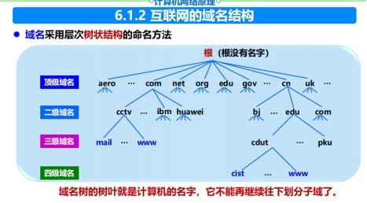 

 

​        

 

### 6.1.3. **域名服务器：**

 

目的：为每一级的域名都设置一个对应的域名服务器，数量太多，效率低下。因此DNS采用划分区的办法

区：一个服务器所负责的范围

权限域名服务器：每一个区都设有，用来保存区中所有主机的域名到IP地址的映射

互联网上的DNS域名服务器树状结构：

 

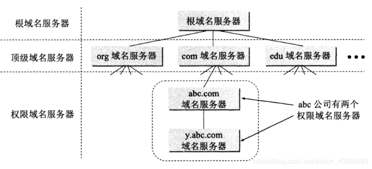

​        

 

域名服务器分类：

 

根域名服务器：是层次最高的域名服务器，也是最重要的。所有根域名服务器都知道所有顶级域名服务器的域名和IP地址。任何本地域名服务器只要自己无法解析，就首先求助于根域名服务器

 

顶级域名服务器：负责管理在该顶级域名服务器注册的所有二级域名。当收到DNS查询请求时，就给出相应的回答

 

权限域名服务器：负责一个区的域名服务器。当权限域名服务器还不能给出回答时，就会告诉发出查询请求的DNS客户，下一步应找哪一个权限域名服务器

 

本地域名服务器：并不属于域名服务器层次结构，但很重要。当主机发出DNS查询请求时，这个查询请求报文发给本地域名服务器

 

 

 

提高域名服务器可靠性：DNS域名服务器把数据复制到几个域名服务器来保存，其中一个是主域名服务器，其余是辅助域名服务器。当主域名服务器出现故障时，辅助域名服务器就可以保证DNS的查询工作不会中断

 

 

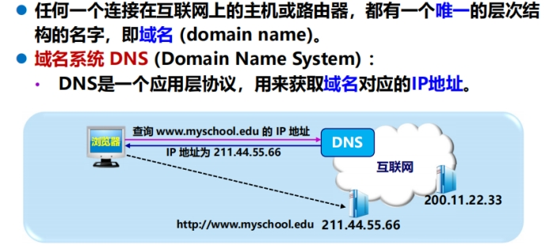 

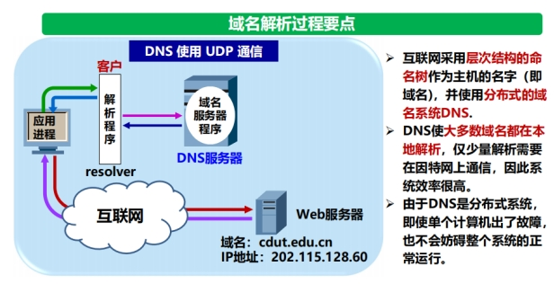 

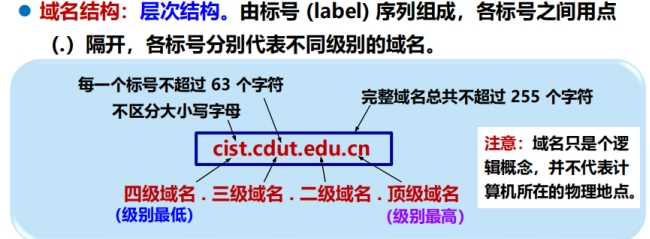 

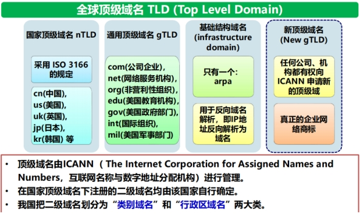 

## 6.2. **DHCP协议作用**  

  DHCP作用：提供一种机制，称为即插即用连网，允许一台计算机加入网络和获取IP而不用手工参与

 

  协议配置：在协议软件中给参数赋值的动作叫做协议配置

 

  需要配置的项目：

 

   IP地址

   子网掩码

   默认路由器的IP地址

   域名服务器的IP地址

# 7. **实验**

## 7.1. **`ipconfig /all` 命令**  

ipconfig 命令用于显示所有当前的 TCP/IP 网络配置值、刷新动态主机配置协议(DHCP)和域名系统(DNS)设置。使用 ipconfig /all 可以显示本机上所有适配器的详细配置信息，如本机 IP 地址、子网掩码、默认网关、DNS、硬件地址等。 

常用的选项还包括/release，/renew，它们适用于向 DHCP 服务器租用 IP 地址进 

行上网的计算机。 

ipconfig /release：所有接口的租用 IP 地址将归还给 DHCP 服务器，若不续租，该计算机将无法上网。 

ipconfig /renew：本地计算机与 DHCP 服务器取得联系，重新租用一个 IP 地址。 

查看更多选项，使用 ipconfig /?

 

## 7.2. **`ping` 命令**  

Ping 是个使用频率极高的 ICMP 实用程序，用于确定本地主机是否能与另一台主机交换（发送与接收）数据报。根据返回的信息，我们就可以推断 TCP/IP 参数是否设置得正确以及运行是否正常。简单的说，Ping 就是一个测试程序，如果 Ping 运行正确，我们大体上就可以排除网络访问层、网卡、Modem 的输入输出线路、电缆和路由器等存在的故障，从而减小了问题的范围。

按照缺省设置，Windows 上运行的 Ping 命令发送 4 个 ICMP（网际控制报文协议）回送请求，每个 32 字节数据，如果一切正常，应能得到 4 个回送应答。Ping 能够以毫秒为单位显示发送回送请求到返回回送应答之间的时间量。如果应答时间短，表示数据报不必通过太多的路由器或网络连接速度比较快。Ping 还能显示 TTL 值，可以通过 TTL 值推算数据包已经通过了多少个路由器。TTL 的初值是系统默认值，数据报每经过一个路由器就把其包头的 TTL 值减 1，当 TTL 减至 0 时，路由器丢弃该包，并发送一个 ICMP 报文给最初的发送者。

 

## 7.3. **`tracert` 命令**  

交叉验证：通过 tracert 命令可直接获取从本机到目的主机经过的跳数： 

tracert 命令追踪数据包时，其中某跳出现请求超时，但仍能继续追踪下一跳，是因为该路由器禁 ping，但能正常转发数据。